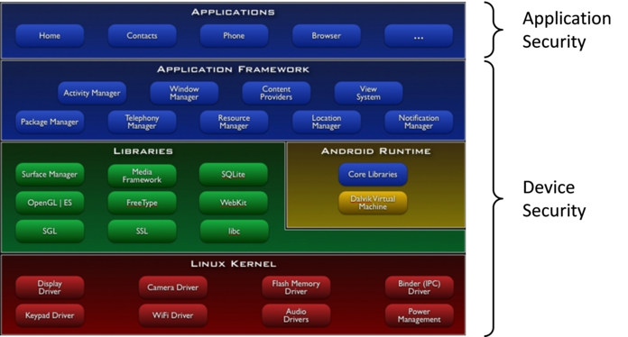
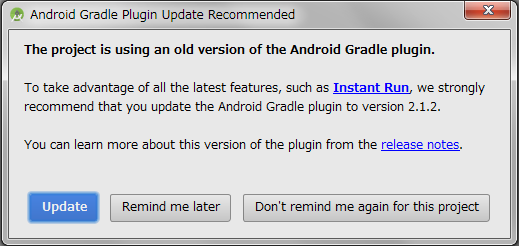

Composition of the Guidebook
============================

Developer's Context
--------------------

Many guidebooks that have been written on secure coding include
warnings about harmful coding practices and their suggested revisions.
Although this approach can be useful at the time of reviewing the
source code that has already been coded, it can be confusing for
developers that are about to start coding, as they do not know which
article to refer to.

The Guidebook has focused on the developer's context of "What is a
developer trying to do at this moment?" Equally, we have taken steps
to prepare articles that are aligned with the developer's context.
For example, we have divided articles into project units by presuming
that a developer will be involved in operations such as
[Creating/Using Activities], [Using SQLite], etc.

We believe that by publishing articles that support the developer's
context, developers will be able to easily locate necessary articles
that will be instantly useful in their projects.

Sample Code, Rule Book, Advanced Topics
---------------------------------------

Each article is comprised of three sections: Sample Code, Rule Book,
and Advanced Topics. If you are in a hurry, please look up the Sample
Code and Rule Book sections. The content is provided in a way where it
can be reused to a certain degree. For those who have issues that go
beyond these, please refer the Advanced Topics section. We have given
descriptions that will be helpful in finding solutions for individual
cases.

Unless it is specifically noted, our focus of development will be
targeted to platforms concerning Android 4.0.3 (API Level 15) and
later. Since we have not verified the operational capability of any
versions pertaining to Android versions under 4.0.3 (API Level 15),
the measures described may prove ineffective on these older systems.
In addition, even for versions that are covered under the scope of
focus, it is important to verify their operational capability by
testing them on your own environment before releasing them publically.

### Sample Code

Sample code that serves as the basic model within the developer\'s
context and functions as the theme of an article is published in the
Sample Code section. If there are multiple patterns, we have provided
source code for the different patterns and classified them
accordingly. We have strived to make our commentaries as simple as
possible. For example, when we want to direct the reader\'s attention
to a security issue that requires attention, a bullet-point number
will appear next to \"**Point**\" in the article. We will also comment
on the sample code that corresponds to the bullet-point number by
writing \"**\*\*\* Point (Number) \*\*\***.\" Please note that a
single point may correspond to multiple pieces of sample code. There
are sections throughout the entire source code, albeit very little
compared to the entire code, which requires our attention for
security. In order to be able to survey the sections that call for
scrutiny, we try to post the entire class unit of sample code.

Please note that only a portion of sample code is posted in the
Guidebook. A compressed file, which contains the entire sample code,
is made public in the URL listed below. It is made public by the
Apache License, Version 2.0; therefore, please feel free to copy and
paste it. Please note that we have minimized the code for error
processing in the sample code to prevent it from becoming too long.

-   [http://www.jssec.org/dl/android_securecoding_en.zip](http://www.jssec.org/dl/android_securecoding_en.zip)
    Sample Codes Archive

The projects/keystore file that is attached in the sample code is the
keystore file that contains the developer key for the signature of the
APK. The password is \"android.\" Please use it when singing the APK
in the In-house sample code.

We have provided the keystore file, debug.keystore, for debugging
purposes. When using Android Studio for development, it is convenient
for verifying the operational capability of the In-house sample code
if the keystore is set for each project. In addition, for sample code
that is comprised of multiple APKs, it is necessary to match the
android:debuggable setting contained inside each AndroidManifest.xml
in order to verify the cooperation between each APK. If the
android:debuggable setting is not explicit set when installing the APK
from Android Studio, it will automatically become android:debuggable=
\"true.\"

For embedding the sample code as well as keystore file into Android
Studio, please refer to \"2.5 Steps to Install Sample Codes into
Android Studio\"

### Rule Book

Rules and matters that need to be considered regarding security within
the developer\'s context will be published in the Rule Book section.
Rules to be handled in that section will be listed in a table format
at the beginning and will be divided into two levels: \"Required\" and
\"Recommended.\" The rules will consist of two types of affirmative
and negative statements. For example, an affirmative statement that
expresses that a rule is required will say \"Required.\" An
affirmative statement that expresses a recommendation will say
\"Recommended.\" For a negative statement that expresses the requisite
nature of the rule would say, \"Definitely not do.\" For a negative
sentence that expresses a recommendation would say, \"Not
recommended.\" Since these differentiations of levels are based on the
subjective viewpoint of the author, it should only be used as a point
of reference.

Sample code that is posted in the Sample Code section reflect these
rules and matters that need to be considered, and a detailed
explanation on them is available in the Rule Book section.
Furthermore, rules and matters that need to be considered that are not
dealt with in the Sample Code section are handled in the Rule Book
section.

### Advanced Topics

Items that require our attention, but that could not be covered in the
Sample Code and Rule Book sections within the developer\'s context
will be published in the Advanced Topics section. The Advanced Topics
section can be utilized to explore ways to solve separate issues that
could not be solved in the Sample Code or Rule Book sections. For
example, subject matters that contain personal opinions as well as
topics on the limitations of Android OS in relation the developer\'s
context will be covered in the Advanced Topics section.

Developers are always busy. Many developers are expected to have basic
knowledge of security and produce many Android applications as quickly
as possible in a somewhat safe manner rather than to really understand
the deep security matters. However, there are certain applications out
there that require a high level of security design and implementation
from the beginning. For developers of such applications, it is
necessary for them to have a deep understanding concerning the
security of Android OS.

In order to benefit both developers who emphasize development speed
and also those who emphasize security, all articles of the Guidebook
are divided into the three sections of Sample Code, Rule Book, and
Advanced Topics. The aim of the Sample Code and Rule Book sections is
to provide generalizations about security that anyone can benefit from
and source code that will work with a minimal amount of customization
and hopefully by just copying and pasting. In the Advanced Topics
section, we offer materials that will help developers think in a
certain way when they are facing specific problems. It is the aim of
the Advanced Topics section to help developers examine optimal secure
design and coding when they are involved in building individual
applications.

The Scope of the Guidebook
--------------------------

The purpose of the Guidebook is to collect security best practices
that are necessary for general Android application developers.
Consequently, our scope is focused mainly on security tips (The
\"Application Security\" section in figure below) for the development
of Android applications that are distributed primarily in a public
market.


```eval_rst
.. {width="6.889763779527559in" height="3.6992125984251967in"}
```

Figure 2.3‑1

Security regarding the implementation of components in the Device
Security of the above figure is outside the scope of this guidebook.
There are differences in the viewpoint of security between general
applications that are installed by users and pre-installed
applications by device manufacturers. The Guidebook only handles the
former and does not deal with the latter. In the current version, tips
only on the implementation by Java are posted, but in future versions,
we plan on posting tips on JNI implementations as well.

Also as of now we do not handle threats that results from an attacker
obtaining root privileges. We will assume the premise of a secure
Android device in which it is not possible to obtain root privileges
and base our security advice on utilizing the Android OS security
model. For handling of assets and threats, we have provided a detailed
description on \"3.1.3 Asset Classification and Protective
Countermeasures.\"

Literature on Android Secure Coding
-----------------------------------

Since we are not able to discuss all of Android\'s secure coding in
the Guidebook, we recommend that you read the literature mentioned
below in conjunction with the Guidebook.

-   Android Security: Anzenna Application Wo Sakusei Surutameni (Secured Programming in Android)<br/>
    Author: Tao Software Co., Ltd. ISBN: 978-4-8443-3134-6<br/>
    [http://www.amazon.co.jp/dp/4844331345/](http://www.amazon.co.jp/dp/4844331345/)

-   The CERT Oracle Secure Coding Standard for Java<br/>
    Authors: Fred Long, Dhruv Mohindra, Robert C. Seacord, Dean F.
    Sutherland, David Svoboda<br/>
    [http://www.amazon.com/dp/0321803957](http://www.amazon.com/dp/0321803957)

Steps to Install Sample Codes into Android Studio
-------------------------------------------------

This section explains how to install sample code into Android Studio.
Sample code is divided into multiple projects depending on the
purpose. Installing the sample code is described in, \"2.5.1
Installing the Sample Project.\" After the installation is completed,
please refer to \"2.5.2 Setup the debug.keystore\" and install the
debug.keystore file into Android Studio. We have verified the
following steps in the following environment:

-   OS
    -   Windows 7 Ultimate SP1
-   Android Studio
    -   2.1.2
-   Android SDK
    -   Android 6.0(API 23)
        -   Sample projects can be built through Android 6.0 (API 23)
            unless otherwise stated.

### Installing the Sample Project

#### Download the sample code.

Acquire the sample code from the URL shown in \"2.2.1 Sample Code\"

#### Extract the sample code.

Right click on the sample code that has been compressed into zip file,
and click on \"Extract All\" as shown below.


```eval_rst
.. {width="4.6875in" height="1.6666666666666667in"}
```

Figure 2.5‑1

#### Designate where to deploy.

Create a workspace under the name \"C:\\android\_securecoding\" by
designating \"C:\\\" and clicking on the \"Extract\" button.


```eval_rst
.. {width="3.8645833333333335in"
.. height="3.1354166666666665in"}
```

Figure 2.5‑2

After clicking on the \"Extract\" button, right underneath \"C:\\\" a
folder called \"android\_securecoding\" will be created.


```eval_rst
.. {width="5.458333333333333in"
.. height="3.0104166666666665in"}
```

Figure 2.5‑3

The sample code is contained in the "android\_securecoding\" folder.
For example, when you want to refer to the sample code within
\"4.1.1.3 Creating/Using Partner Activities\" of \"4.1 Creating/Using
Activities\" please look below.

    android_securecoding
        ┗ Create Use Activity
            ┗ Activity PartnerActivity

In this way, the sample code project will be located under the chapter
title in the \"android\_securecoding\" folder.

#### Designate workspace by starting up Android Studio

Launch Android Studio from the start menu or from a desktop icon.


```eval_rst
.. {width="4.1672484689413825in"
.. height="3.125436351706037in"}
```

Figure 2.5‑4

After launching, import project from the dialog that appears.


```eval_rst
.. {width="4.145574146981628in"
.. height="3.2916666666666665in"}
```

Figure 2.5‑5

If you have already opened a project, close the project window.


```eval_rst
.. {width="2.5416666666666665in"
.. height="3.888246937882765in"}
```

Figure 2.5‑6

#### Start importing

Click \"Import project (Eclipse ADT, Gradle, etc.)\" from the dialog
that is displayed.


```eval_rst
.. {width="3.9375in" height="3.1264501312335957in"}
```

Figure 2.5‑7 ***!!!!!REPLACE THIS PICTURE AND BELOW!!!!!***

#### Select the project

Expand the project folder you wish to import and select
\"gradle\\build.gradle\" within that folder.


```eval_rst
.. {width="3.15625in" height="3.6427154418197727in"}
```

Figure 2.5‑8

If the version of Gradle in the Android Studio you are using differs
from the version assumed by the sample code projects in this
guidebook, Gradle will be optimized.


```eval_rst
.. {width="4.46875in" height="0.859686132983377in"}
```

Figure 2.5‑9

Following the on-screen instructions, click \"Update\" to initiate the
update of the Android Gradle Plugin.


```eval_rst
.. {width="4.645833333333333in"
.. height="2.2020713035870516in"}
```

Figure 2.5‑10

The message shown below is displayed. Click \"Fix Gradle wrapper and
re-import project Gradle setting\" to update the Gradle wrapper.


```eval_rst
.. {width="6.1375in" height="1.4638888888888888in"}
```

Figure 2.5‑11

#### Finish importing

Automatically the project is imported.


```eval_rst
.. {width="4.928546587926509in"
.. height="2.9895833333333335in"}
```

Figure 2.5‑12

Android Studio, unlike Eclipse, will display a single project in a
window. If you want to open and import a different project, click
\"File -\> Import Project \...\".


```eval_rst
.. {width="2.1770833333333335in"
.. height="3.3672222222222223in"}
```

Figure 2.5‑13

### Setup the debug.keystore to run and test the Sample Code

A signature is needed in order to activate a sample-code-generated
application onto an Android device or emulator. Install the debugging
key file \"debug.keystore\" that will be used for the signature into
Android Studio.

#### Click on File -\>Project Structure\...


```eval_rst
.. {width="2.1875in" height="3.401966316710411in"}
```

Figure 2.5‑14

#### Add Signing

Select a project from Module list in left pane, selecting "Signing"
tab, and then click "+" button.


```eval_rst
.. {width="4.572916666666667in"
.. height="3.7520034995625546in"}
```

Figure 2.5‑15

#### Select \"debug.keystore\"

Debug.keystore is contained in the sample code (underneath the
android\_securecoding folder)


```eval_rst
.. {width="3.0132010061242345in"
.. height="3.4583333333333335in"}
```

Figure 2.5‑16

#### Type Signing name


```eval_rst
.. {width="5.177083333333333in"
.. height="4.247711067366579in"}
```

Figure 2.5‑17

#### Set Signing Config

Select the Build Types tab, select signing name typed in the previous
step, and then click "OK".


```eval_rst
.. {width="5.4375in" height="4.461379046369204in"}
```

Figure 2.5‑18

#### Confirm build.gradle file

The path of debug.keystore file you selected is displayed in
signingConfigs, signingConfig appears in debug section of buildTypes.


```eval_rst
.. {width="5.5in" height="4.7354538495188105in"}
```

Figure 2.5‑19
