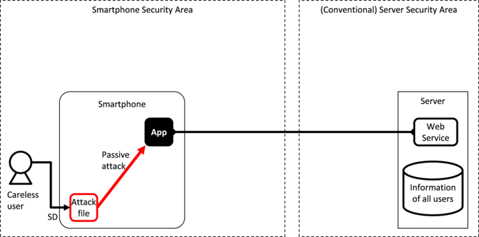

Basic Knowledge of Secure Design and Secure Coding
==================================================

Although the Guidebook is a collection of security advice concerning
Android application development, this chapter will deal with the basic
knowledge on general secure design and secure coding of Android
smartphones and tablets. Since we will be referring to secure design
and coding concepts in the later chapters we recommend that you
familiarize yourself with the content contained in this chapter first.

Android Application Security
----------------------------

There is a commonly accepted way of thinking when examining security
issues concerning systems or applications. First, we need to have a
grasp over the objects we want to protect. We will call these assets.
Next, we want to gain an understanding over the possible attacks that
can take place on an asset. We will call these threats. Finally, we
will examine and implement measures to protect assets from the various
threats. We will call these countermeasures.

What we mean by countermeasures here is secure design and secure
coding, and will deal with these subjects after Chapter 4. In this
section, we will focus on explaining assets and threats.

### Asset: Object of Protection

There are two types of objects of protection within a system or an
application: information and functions. We will call these information
assets and function assets. An information asset refers to the type of
information that can be referred to or changed only by people who have
permission. It is a type of information that cannot be referred to or
changed by anyone who does not have the permission. A function asset
refers to a function that can be used only by people who have
permission and no one else.

Below, we will introduce types of information assets and functional
assets that exist in Android smartphones and tablets. We would like
you to use the following as a point of reference to deliberate on
matters with regard to assets when developing a system that utilizes
Android applications or Android smartphones/tablets. For the sake of
simplicity, we will collectively call Android smartphones/tablets as
Android smartphones.

#### Information Asset of an Android Smartphone

Table 3.1‑1 and Table 3.1‑2 represent examples of information
contained on an Android smartphone. Appropriate protection is
necessary since this information is equivalent to personal
information, confidential information or information that belongs to
both.

Table 3.1‑1 Examples of Information Managed by an Android Smartphone

```eval_rst
=========================== =====================================================================
Information                 Remarks
=========================== =====================================================================
Phone number                Telephone number of the smartphone itself
Call history                Time and date of incoming and outgoing calls as well as phone numbers
IMEI                        Device ID of the smartphone
IMSI                        Subscriber ID
Sensor information          GPS, geomagnetic, rate of acceleration, etc.
Various setup information   Wi-Fi setting value, etc\...
Account information         Various account information, authentication information, etc.
Media data                  Pictures, videos, music, recording, etc...
...                        
=========================== =====================================================================
```

Table 3.1‑2 Examples of Information Managed by an Application
```eval_rst
====================== ==========================================================
Information            Remarks
====================== ==========================================================
Contacts               Contacts of acquaintances
E-mail address         User\'s e-mail address
E-mail mail box        Content of incoming and outgoing e-mail, attachments, etc.
Web bookmarks          Bookmarks
Web browsing history   Browsing history
Calendar               Plans, to-do list, events, etc.
Facebook               SNS content, etc.
Twitter                SNS content, etc.
...                   
====================== ==========================================================
```
The type of information seen in Table 3.1‑1 is mainly the type of
information that is stored on the Android smartphone itself or on an
SD card. Similarly, the type of information seen in Table 3.1‑2 is
primarily managed by an application. In particular, the type of
information seen in Table 3.1‑2 grows in proportion to the number of
applications installed on the device.
>
Table 3.1‑3 is the amount of information contained in one entry case
of contacts. The information here is not of the smartphone user\'s,
but of the smartphone user\'s friends. In other words, we must be
aware that a smartphone not only contains information on the user, but
of other people too.

Table 3.1‑3 Examples of Information Contained in One Contact Entry
```eval_rst
================== ========================================================================================
Information        Content
================== ========================================================================================
Phone number       Home phone number, mobile phone number, FAX, MMS, etc.
E-mail address     Home e-mail, work e-mail, mobile phone e-mail, etc.
Photo              Thumbnail image, large image, etc.
IM address         AIM, MSN, Yahoo, Skype, QQ, Google Talk, ICQ, Jabber, Net meeting, etc.
Nicknames          Acronyms, initials, maiden names, nicknames, etc.
Address            Country, postal code, region, area, town, street name, etc.
Group membership   Favorites, family, friends, coworkers, etc.
Website            Blogs, profile site, homepage, FTP server, home, office, etc.
Events             Birthdays, anniversaries, others, etc.
Relation           Spouse, children, father, mother, manager, assistants, domestic partner, partners, etc.
SIP address        Home, work, other, etc.
...                ...
================== ========================================================================================
```
Until now, we have primarily focused on information about smartphone
users, however, application possesses other important information as
well. Figure 3.1‑1 displays a typical view of the information inside
an application divided into the program portion and data portion. The
program portion mainly consists of information about the application
developer, and the data portion mostly pertains to user information.
Since there could be information that an application developer may not
want a user to have access to, it is important to provide protective
countermeasures to prohibit a user from referring to or making changes
to such information.


```eval_rst
.. {width="7.26875in" height="3.3047561242344705in"}
```
Figure 3.1‑1 Information Contained in an Application

When creating an Android application, it is important to employ
appropriate protective countermeasures for information that an
application manages itself, such as shown in Figure 3.1‑1. However, it
is equally important to have robust security measure in place for
information contained in the Android smartphone itself as well as for
information that has been gained from other applications such as shown
in Table 3.1‑1, Table 3.1‑2, and Table 3.1‑3.

#### Function Assets of an Android Smartphone

Table 3.1‑4 shows examples of features that an Android OS provides to
an application. When these features are exploited by a malware, etc.,
damages in the form of unexpected charges or loss of privacy may be
incurred by a user. Therefore, appropriate protective counter-measures
that are equal the one extended to information asset should be set in
place.

Table 3.1‑4 Examples of Features an Android OS Provides to an
Application

```eval_rst
======================================= =========================================================
Function                                Function
======================================= =========================================================
Sending and receiving SMS messages      Camera
Calling                                 Volume
Network communication                   Reading the Contract List and Status of the Mobile Phone
GPS                                     SD card
Bluetooth communication                 Change system setup
NFC communication                       Reading Log Data
Internet communication (SIP)            Obtaining Information of a Running Application
...                                     ...
======================================= =========================================================
```
In addition to the functions that the Android OS provides to an
application, the inter-application communication components of Android
applications are included as part of the function assets as well.
Android applications can allow other applications to utilize features
by accessing their internal components. We call this inter-application
communication. This is a convenient feature, however, there have been
instances where access to functions that should only be used inside a
particular application are mistakenly given to other applications due
the lack of knowledge regarding secure coding on the part of the
developer. There are functions provided by the application that could
be exploited by malware that resides locally on the device. Therefore,
it is necessary to have appropriate protective countermeasures to only
allow legitimate applications to access these functions.

### Threats: Attacks that Threaten Assets

In the previous section, we talked about the assets of an Android
smartphone. In this section, we will explain about attacks that can
threaten an asset. Put simply, a threat to an asset is when a third
party who should not have permission, accesses, changes, deletes or
creates an information asset or illicitly uses a function asset. The
act of directly or indirectly attacking such assets is called a
\"threat.\" Furthermore, the malicious person or applications that
commit these acts are referred to as the source of the threats.
Malicious attackers and malware are the sources of threats but are not
the threats themselves. The relationship between our definitions of
assets, threats, threat sources, vulnerabilities, and damage are shown
below in Figure 3.1‑2.


```eval_rst
.. {width="5.854166666666667in"
.. height="3.1041666666666665in"}
```

Figure 3.1‑2 Relation between Asset, Threat, Threat Source,
Vulnerability, and Damage

Figure 3.1‑3 shows a typical environment that an Android application
behaves in. From now on, in order to expand on the explanation
concerning the type of threats an Android application faces by using
this figure as a base, we will first learn how to view this figure.


```eval_rst
.. {width="7.020833333333333in" height="3.46875in"}
```

Figure 3.1‑3 Typical Environment an Android Application Behaves in

The figure above depicts the smartphone on the left and server on the
right. The smartphone and server communicate through the Internet over
3G/4G/Wi-Fi. Although multiple applications exist within a smartphone,
we are only showing a single application in the figure in order to
explain the threats clearly. Smartphone-based applications mainly
handle user information, but the server-based web services
collectively manage information of all of its users. Consequently,
there is no change the importance of server security as usual. We will
not touch upon issues relating to server security as it falls outside
of the scope of the Guidebook.

We will use the following figure to describe the type of threats that
exist towards Android applications.

#### Network-based Third-Party


```eval_rst
.. {width="7.020833333333333in" height="3.46875in"}
```

Figure 3.1‑4 Network-Based Malicious Third Party Attacking an
Application

Generally, a smartphone application manages user information on a
server so the information assets will move between the networks
connecting them. As indicated in Figure 3.1‑4, a network-based
malicious third party may access (sniff) any information during this
communication or try to change information (data manipulation). The
malicious attacker in the middle (also referred to as \"Man in The
Middle\") can also pretend to be the real server tricking the
application. Without saying, network-based malicious third parties
will usually try to attack the server as well.

####  Threat Due to User-Installed Malware


```eval_rst
.. {width="7.020833333333333in" height="3.46875in"}
```

Figure 3.1‑5 Malware Installed by a User Attacks an Application

The biggest selling point of a smartphone is in its ability to acquire
numerous applications from the market in order to expand on its
features. The downside to users being able to freely install many
applications is that they will sometimes mistakenly install malware.
As shown in Figure 3.1‑5, malware may exploit the inter-application
communication functions or a vulnerability in the application in order
to gain access to information or function assets.

#### Threat of an Malicious File that Exploits a Vulnerability in an Application


```eval_rst
.. {width="7.020833333333333in" height="3.46875in"}
```

Figure 3.1‑6 Attack from Malicious Files that Exploit a Vulnerability in
an Application

Various types of files such as music, images, videos and documents are
widely available on the Internet and typically users will download
many files to their SD card in order to use them on their smartphone.
Furthermore, it is also common to download attached files sent in an
e-mail. These files are later opened by a viewing or editing
application.

If there is any vulnerability in the function of an application that
processes these files, an attacker can use a malicious file to exploit
it and gain access to information or function assets of the
application. In particular, vulnerabilities are often present in
processing a file format with a complex data structure. The attacker
can fulfill many different goals when exploiting an application in
this way.

As shown in Figure 3.1‑6, an attack file stays dormant until it is
opened by a vulnerable application. Once it is opened, it will start
causing havoc by taking advantage of an application\'s vulnerability.
In comparison to an active attack, we call this attack method a
\"Passive Attack.\"

#### Threats from a Malicious Smartphone User


```eval_rst
.. {width="7.020833333333333in" height="3.46875in"}
```

Figure 3.1‑7 Attacks from a Malicious Smartphone User

With regard to application development for an Android smartphone, the
environment as well as features that help to develop and analyze an
application are openly provided to the general user. Among the
features that are provided, the useful ADB debugging feature can be
accessed by anyone without registration or screening. This feature
allows an Android smartphone user to easily perform OS or application
analysis.

As it is shown in Figure 3.1‑7, a smartphone user with malicious
intent can analyze an application by taking advantage of the debugging
feature of ADB and try to gain access to information or function
assets of an application. If the actual asset contained in the
application belongs to the user, it poses no problem, but if the asset
belongs to someone other than the user, such as the application
developer, then it will become a concern. Accordingly, we need to be
aware that the legitimate smartphone user can maliciously target the
assets within an application.

#### Threats from Third Party in the Proximity of a Smartphone


```eval_rst
.. {width="7.020833333333333in" height="3.46875in"}
```

Figure 3.1‑8 Attacks from a Malicious Third Party in the Proximity of a
Smartphone

Due to face that most smartphones possess a variety of near-field
communication mechanisms, such as NFC, Bluetooth and Wi-Fi, we must
not forget that attacks can occur from a malicious attacker who is in
physical proximity of a smartphone. An attacker can shoulder surf a
password while peeping over a user who is inputting it in. Or, as
indicated in Figure 3.1‑8, an attacker can be more sophisticated and
attack the Bluetooth functionality of an application from a remote
distance. There is also the threat that a malicious person could steal
the smartphone creating a risk of data leakage or even destroy the
smartphone causing a loss of critical information. Developers need to
take these risks into consideration as well as early as the design
stage.

#### Summary of Threats


```eval_rst
.. {width="7.020833333333333in" height="3.46875in"}
```

Figure 3.1‑9 Summary of the Various Attacks on Smartphone Applications

Figure 3.1‑9 summarizes the main types of threats explained in the
previous sections. Smartphones are surrounded by a wide variety of
threats and the figure above does not include all of them. Through our
daily information gathering, we need to spread the awareness
concerning the various threats that surround an Android application
and be aware of them during the application\'s secure design and
coding. The following literature that was created by Japan\'s
Smartphone Security Association (JSSEC) contains other valuable
information on the threats to smartphone security.

-   Security Guidebook for Using Smartphones and Tablets<br/>
    [http://www.jssec.org/dl/guidelines_v2.pdf [Version 2]](http://www.jssec.org/dl/guidelines_v2.pdf) (Japanese)<br/>
    [http://www.jssec.org/dl/guidelines2012Enew_v1.0.pdf [Version 1]](http://www.jssec.org/dl/guidelines2012Enew_v1.0.pdf) (English)

-   Implementation Guidebook for Smartphone Network Security [Version 1]<br/>
    [http://www.jssec.org/dl/NetworkSecurityGuide1.pdf](http://www.jssec.org/dl/NetworkSecurityGuide1.pdf) (Japanese)

-   Cloud Usage Guidebook for Business Purposes of Smartphones [Beta Version]<br/>
    [http://www.jssec.org/dl/cloudguide2012_beta.pdf](http://www.jssec.org/dl/cloudguide2012_beta.pdf) (Japanese)

-   Guidebook for Reviewing the Implementation/Operation of MDM [Version 1]<br/>
    [http://www.jssec.org/dl/MDMGuideV1.pdf](http://www.jssec.org/dl/MDMGuideV1.pdf) (Japanese)

### Asset Classification and Protective Countermeasures

As was discussed in the previous sections, Android smartphones are
surrounded by a variety of threats. Protecting every asset in an
application from such threats could prove to be very difficult given
the time it takes for development and due to technical limitations.
Consequently, Android application developers should examine feasible
countermeasures for their assets. This should be done according to
priority level based on the developer\'s judgement criteria. This is a
subjective matter that is based on how the importance of an asset is
viewed and what the accepted level of damage is.

In order to help decide on the protective countermeasures for each
asset, we will classify them and stipulate the level of protective
countermeasures for each group. This will be achieved by examining the
legal basis, pertaining to the level of importance regarding the
impact of any damages that can occur and the social responsibility of
the developer (or organization). These will prove to be the judgement
criteria when deciding on how to handle each asset and the
implementation of the type of countermeasures. Since this will become
a standard for application developers and organizations on determining
how to handle an asset and provide protective countermeasures, it is
necessary to specify the classification methods and pertaining
countermeasures in accordance the application developer\'s (or
organization\'s) circumstances.

Asset classification and protective countermeasure levels that are
adopted in the Guidebook are shown below for reference:

Table ‑5 Asset Classification and Protective Countermeasure Levels
```eval_rst
===================== ======================= =========================
Asset Classification  | Asset Level           | Level of Protective   
                      |                       | Counter-Measures      
===================== ======================= =========================
High                  | The amount of damage  | Provide protection
                      | the asset causes is   | against sophisticated
                      | fatal and             | attacks that break
                      | catastrophic to the   | through the Android OS
                      | organization or an    | security model and
                      | individual\'s         | prevent root privilege
                      | activity.             | compromises and attacks
                      |                       | that alter the dex
                      | i.e.) When an asset   | portion of an APK.
                      | at this level is      |          
                      | damaged, the          | Ensure security takes
                      | organization will not | priority over other
                      | be able to continue   | elements such as user
                      | its business.         | experience, etc.
Medium                | The amount of damage  | Utilize the Android OS
                      | the asset causes has  | security model. It will
                      | a substantial impact  | provide protection
                      | the organization or   | covered under its scope.
                      | an individual\'s      |
                      | activity.             | Ensure security takes
                      |                       | priority over other
                      | i.e.) When an asset   | elements such as user
                      | at this level is      | experience, etc.
                      | damaged, the          | 
                      | organization\'s       |         
                      | profit level          | 
                      | deteriorates,         | 
                      | adversely affecting   |               
                      | its business.         | 
Low                   | The amount of damage  | Utilize the Android OS
                      | the asset causes has  | security model. It will
                      | a limited impact on   | provide protection
                      | the organization or   | covered under its scope.
                      | an individual\'s      |         
                      | activity.             | Compare security
                      |                       | countermeasures with
                      | I.e.) When an asset   | other elements such as
                      | at this level is      | user experience, etc.
                      | damaged, the          | At this level, it is
                      | organization\'s       | possible for
                      | profit level will be  | non-security issues
                      | affected but is able  | to take precedence
                      | to compensate its     | over security issues.
                      | losses from other     |
                      | resources.            |
===================== ======================= =========================

Asset classification and protective countermeasures described in the
Guidebook are proposed under the premise of a secure Android device
where root privilege has not been compromised. Furthermore, it is
based on the security measures that utilize the security model of
Android OS. Specifically, we are hypothetically devising protective
countermeasures by utilizing the Android OS security model on the
premise of a functioning Android OS security model against assets that
are classified lower than or equal to the medium level asset. On the
other hand, we also believe in the necessity of protecting high level
assets from attacks that are caused due the breaching of the Android
OS security model. Such attacks include the compromise of root
privileges and attacks that analyze or alter the APK binary. To
protect these types of assets, we need to design sophisticated
defensive countermeasures against such threats through the combination
of multiple methods such as encryption, obfuscation, hardware support
and server support. As the collection of know-how regarding these
defenses cannot be easily written in this guidebook, and since
appropriate defensive design differ in accordance to individual
circumstances, we have deemed them to be outside of the Guidebook\'s
scope. We recommend that you consult with a security specialist who is
well versed in tamper resistant designs of Android if your device
requires protection from sophisticated attacks that include attacks
resulting from the compromise of root privileges or attacks caused by
the analysis or alteration of an APK file.
```

### Sensitive Information 

The term \"sensitive information\", instead of information asset, will
be used from now on in the Guidebook. As it has been aforementioned in
the previous section, we have to determine the asset level and the
level of protective countermeasures for each information asset that an
application handles.

Handling Input Data Carefully and Securely
------------------------------------------

Validating input data is the easiest and yet most effective secure
coding method. All data that is inputted into the application either
directly or indirectly by an outside source needs to be properly
validated. To illustrate best practices of input data validation, the
following is an example of an Activity as used in a program that
receives data from Intent.

It is possible that an Activity can receive data from an Intent that
was tampered by an attacker. By sending data with a format or a value
that a programmer is not expecting, the attacker can induce a
malfunction in the application that leads to some sort of security
incident. We must not forget that a user can become an attacker as
well.

Intents are configured by action, data and extras, and we must be
careful when accepting all forms of data that can be controlled by an
attacker. We always need to validate the following items in any code
that handles data from an untrusted source.

(a) Does the received data match the format that was expected by the
programmer and does the value fall in the expected scope?

(b) Even if you have received the expected format and value, can you
guarantee that the code which handles that data will not behave
unexpectedly?

The next example is a simple sample where HTML is acquired from a
remote web page in a designated URL and the code is displayed in
TextView. However, there is a bug.

Sample Code that Displays HTML of a Remote Web page in TextView
```java
TextView tv = (TextView) findViewById(R.id.textview);
InputStreamReader isr = null;
char[] text = new char[1024];
int read;
try {
    String urlstr = getIntent().getStringExtra("WEBPAGE_URL");
    URL url = new URL(urlstr);
    isr = new InputStreamReader(url.openConnection().getInputStream());
    while ((read=isr.read(text)) != -1) {
        tv.append(new String(text, 0, read));
    }
} catch (MalformedURLException e) { //...
```

From the viewpoint of (a), \"urlstr is the correct URL\", verified
through the non-occurrence of a MalformedURLException by a new URL().
However, this is not sufficient. Furthermore, when a \"file://\...\"
formatted URL is designated by urlstr, the file of the internal file
system is opened and is displayed in TextView rather than the remote
web page. This does not fulfill the viewpoint of (b), since it does
not guarantee the behavior which was expected by the programmer.

The next example shows a revision to fix the security bugs. Through
the viewpoint of (a), the input data is validated by checking that
\"urlstr is a legitimate URL and the protocol is limited to http or
https.\" As a result, even by the viewpoint of (b), the acquisition of
an Internet-routed InputStream is guaranteed through
url.openConnection().getInputStream().

Revised sample code that displays HTML of Internet-based Web page in
TextView
```java
TextView tv = (TextView) findViewById(R.id.textview);
InputStreamReader isr = null;
char[] text = new char[1024];
int read;
try {
    String urlstr = getIntent().getStringExtra("WEBPAGE_URL");
    URL url = new URL(urlstr);
    String prot = url.getProtocol();
    if (!"http".equals(prot) && !"https".equals(prot)) {
        throw new MalformedURLException("invalid protocol");
    }
    isr = new InputStreamReader(url.openConnection().getInputStream());
    while ((read=isr.read(text)) != -1) {
        tv.append(new String(text, 0, read));
    }
} catch (MalformedURLException e) { //...
```

Validating the safety of input data is called \"Input Validation\" and
it is a fundamental secure coding method. Surmising from the sense of
the word of Input Validation, it is quite often the case where the
viewpoint of (a) is heeded but the viewpoint of (b) is forgotten. It
is important to remember that damage does not take place when data
enters the program but when the program uses that data in an incorrect
way. We hope that you will refer the URLs listed below.

-   The CERT Oracle Secure Coding Standard for Java
    [https://www.securecoding.cert.org/confluence/x/Ux](https://www.securecoding.cert.org/confluence/x/Ux) (English)

-   Application of CERT Oracle Secure Coding Standard for Android
    Application Development
    [https://www.securecoding.cert.org/confluence/x/C4AiBw](https://www.securecoding.cert.org/confluence/x/C4AiBw) (English)

-   Rules Applicable Only to the Android Platform (DRD)
    [https://www.securecoding.cert.org/confluence/x/H4ClBg](https://www.securecoding.cert.org/confluence/x/H4ClBg) (English)

-   IPA \"Secure Programming Course\"
    [http://www.ipa.go.jp/security/awareness/vendor/programmingv2/clanguage.html](http://www.ipa.go.jp/security/awareness/vendor/programmingv2/clanguage.html) (Japanese)
