Using Technology in a Safe Way
==============================

In Android, there are many specific security related issues that
pertain only to certain technologies such as Activities or SQLite. If
a developer does not have enough knowledge about each of the different
security issues regarding each technology when designing and coding,
then unexpected vulnerabilities may arise. This chapter will explain
about the different scenarios that developers will need to know when
using their application components.

Creating/Using Activities
-------------------------

### Sample Code<!-- 6207eabf -->

The risks and countermeasures of using Activities differ depending on
how that Activity is being used. In this section, we have classified 4
types of Activities based on how the Activity is being used. You can
find out which type of activity you are supposed to create through the
following chart shown below. Since the secure coding best practice
varies according to how the activity is used, we will also explain
about the implementation of the Activity as well.

Table 4.1‑1 Definition of Activity Types
```eval_rst
=================== ===================================================================================================
Type                Definition
=================== ===================================================================================================
Private Activity    An activity that cannot be launched by another application, and therefore is the safest activity
Public Activity     An activity that is supposed to be used by an unspecified large number of applications.
Partner Activity    An activity that can only be used by specific applications made by a trusted partner company.
In-house Activity   An activity that can only be used by other in-house applications.
=================== ===================================================================================================
```


```eval_rst
.. {width="6.889763779527559in"
.. height="3.0074803149606297in"}
```

Figure 4.1‑1

#### Creating/Using Private Activities

Private Activities are Activities which cannot be launched by the
other applications and therefore it is the safest Activity.

When using Activities that are only used within the application
(Private Activity), as long as you use explicit Intents to the class
then you do not have to worry about accidently sending it to any other
application. However, there is a risk that a third party application
can read an Intent that is used to start the Activity. Therefore it is
necessary to make sure that if you are putting sensitive information
inside an Intent used to start an Activity that you take
countermeasures to make sure that it cannot be read by a malicious
third party.

Sample code of how to create a Private Activity is shown below.

Points (Creating an Activity):

1.  Do not specify taskAffinity.
2.  Do not specify launchMode.
3.  Explicitly set the exported attribute to false.
4.  Handle the received intent carefully and securely, even though the
    intent was sent from the same application.
5.  Sensitive information can be sent since it is sending and receiving
    all within the same application.

To make the Activity private, set the \"exported\" attribute of the
Activity element in the AndroidManifest.xml to false.

AndroidManifest.xml
```eval_rst
.. literalinclude:: CodeSamples/Activity PrivateActivity.app.src.main.AndroidManifest.xml
   :language: xml
   :encoding: shift-jis
```
PrivateActivity.java
```eval_rst
.. literalinclude:: CodeSamples/Activity PrivateActivity.PrivateActivity.java
   :language: java
   :encoding: shift-jis
```

Next, we show the sample code for how to use the Private Activity.

```eval_rst
Point (Using an Activity):

6.  Do not set the FLAG\_ACTIVITY\_NEW\_TASK flag for intents to start
    an activity.
7.  Use the explicit Intents with the class specified to call an
    activity in the same application.
8.  Sensitive information can be sent only by putExtra() since the
    destination activity is in the same application. [1]_
9.  Handle the received result data carefully and securely, even though
    the data comes from an activity within the same application.

.. [1] Caution: Unless points 1, 2 and 6 are abided by, there is a risk that Intents may be read by a third party. Please refer to sections 4.1.2.2 and 4.1.2.3 for more details.
```

PrivateUserActivity.java
```eval_rst
.. literalinclude:: CodeSamples/Activity PrivateActivity.PrivateUserActivity.java
   :language: java
   :encoding: shift-jis
```

#### Creating/Using Public Activities

Public Activities are Activities which are supposed to be used by an
unspecified large number of applications. It is necessary to be aware
that Public Activities may receive Intents sent from malware.

In addition, when using Public Activities, it is necessary to be aware
of the fact that malware can also receive or read the Intents sent to
them.

The sample code to create a Public Activity is shown below.

Points (Creating an Activity):

1. Explicitly set the exported attribute to true.
2. Handle the received intent carefully and securely.
3. When returning a result, do not include sensitive information.

AndroidManifest.xml
```eval_rst
.. literalinclude:: CodeSamples/Activity PublicActivity.app.src.main.AndroidManifest.xml
   :language: xml
   :encoding: shift-jis
```
PublicActivity.java
```eval_rst
.. literalinclude:: CodeSamples/Activity PublicActivity.PublicActivity.java
   :language: java
   :encoding: shift-jis
```

Next, Herein after sample code of Public Activity user side.

```eval_rst
Points (Using an Activity):

4. Do not send sensitive information.
5. When receiving a result, handle the data carefully and securely.
```

PublicUserActivity.java
```eval_rst
.. literalinclude:: CodeSamples/Activity PublicUser.PublicUserActivity.java
   :language: java
   :encoding: shift-jis
```

#### Creating/Using Partner Activities

Partner activities are Activities that can only be used by specific
applications. They are used between cooperating partner companies that
want to securely share information and functionality.

There is a risk that a third party application can read an Intent that
is used to start the Activity. Therefore it is necessary to make sure
that if you are putting sensitive information inside an Intent used to
start an Activity that you take countermeasures to make sure that it
cannot be read by a malicious third party

Sample code for creating a Partner Activity is shown below.

Points (Creating an Activity):

1. Do not specify taskAffinity.
2. Do not specify launchMode.
3. Do not define the intent filter and explicitly set the exported
   attribute to true.
4. Verify the requesting application\'s certificate through a
   predefined whitelist.
5. Handle the received intent carefully and securely, even though the
   intent was sent from a partner application.
6. Only return Information that is granted to be disclosed to a partner
   application.

Please refer to \"4.1.3.2 Validating the Requesting Application\" for
how to validate an application by a white list. Also, please refer to
\"5.2.1.3 How to Verify the Hash Value of an Application\'s
Certificate\" for how to verify the certificate hash value of a
destination application which is specified in the whitelist.

AndroidManifest.xml
```eval_rst
.. literalinclude:: CodeSamples/Activity PartnerActivity.activityPartnerActivity.src.main.AndroidManifest.xml
   :language: xml
   :encoding: shift-jis
```

PartnerActivity.java
```eval_rst
.. literalinclude:: CodeSamples/Activity PartnerActivity.PartnerActivity.java
   :language: java
   :encoding: shift-jis
```

PkgCertWhitelists.java
```eval_rst
.. literalinclude:: CodeSamples/JSSEC Shared.PkgCertWhitelists.java
   :language: java
   :encoding: shift-jis
```

PkgCert.java
```eval_rst
.. literalinclude:: CodeSamples/JSSEC Shared.PkgCert.java
   :language: java
   :encoding: shift-jis
```

Sample code for using a Partner Activity is described below.

```eval_rst
Points (Using an Activity):

7. Verify if the certificate of the target application has been registered in a whitelist.
8. Do not set the FLAG\_ACTIVITY\_NEW\_TASK flag for the intent that start an activity.
9. Only send information that is granted to be disclosed to a Partner Activity only by putExtra().
10. Use explicit intent to call a Partner Activity.
11. Use startActivityForResult() to call a Partner Activity.
12. Handle the received result data carefully and securely, even though the data comes from a partner application.
```

Refer to \"4.1.3.2 Validating the Requesting Application\" for how to
validate applications by white list. Also please refer to \"5.2.1.3
How to Verify the Hash Value of an Application\'s Certificate\" for
how to verify the certificate hash value of a destination application
which is to be specified in a white list.

AndroidManifest.xml
```eval_rst
.. literalinclude:: CodeSamples/Activity PartnerUser.activityPartnerUser.src.main.AndroidManifest.xml
   :language: xml
   :encoding: shift-jis
```

PartnerUserActivity.java
```eval_rst
.. literalinclude:: CodeSamples/Activity PartnerUser.PartnerUserActivity.java
   :language: java
   :encoding: shift-jis
```

PkgCertWhitelists.java
```eval_rst
.. literalinclude:: CodeSamples/JSSEC Shared.PkgCertWhitelists.java
   :language: java
   :encoding: shift-jis
```

PkgCert.java
```eval_rst
.. literalinclude:: CodeSamples/JSSEC Shared.PkgCert.java
   :language: java
   :encoding: shift-jis
```


#### Creating/Using In-house Activities

In-house activities are the Activities which are prohibited to be used
by applications other than other in-house applications. They are used
in applications developed internally that want to securely share
information and functionality.

There is a risk that a third party application can read an Intent that
is used to start the Activity. Therefore it is necessary to make sure
that if you are putting sensitive information inside an Intent used to
start an Activity that you take countermeasures to make sure that it
cannot be read by a malicious third party.

Sample code for creating an In-house Activity is shown below.

Points (Creating an Activity):

1.  Define an in-house signature permission.
2.  Do not specify taskAffinity.
3.  Do not specify launchMode.
4.  Require the in-house signature permission.
5.  Do not define an intent filter and explicitly set the exported attribute to true.
6.  Verify that the in-house signature permission is defined by an in-house application.
7.  Handle the received intent carefully and securely, even though the intent was sent from an in-house application.
8.  Sensitive information can be returned since the requesting application is in-house.
9.  When exporting an APK, sign the APK with the same developer key as the destination application.

AndroidManifest.xml
```eval_rst
.. literalinclude:: CodeSamples/Activity InhouseActivity.activityInhouseActivity.src.main.AndroidManifest.xml
   :language: xml
   :encoding: shift-jis
```

InhouseActivity.java
```eval_rst
.. literalinclude:: CodeSamples/Activity InhouseActivity.InhouseActivity.java
   :language: java
   :encoding: shift-jis
```

SigPerm.java
```eval_rst
.. literalinclude:: CodeSamples/JSSEC Shared.SigPerm.java
   :language: java
   :encoding: shift-jis
```

PkgCert.java
```eval_rst
.. literalinclude:: CodeSamples/JSSEC Shared.PkgCert.java
   :language: java
   :encoding: shift-jis
```


\*\*\* Point9 \*\*\* When exporting an APK, sign the APK with the same developer key as the destination application.


```eval_rst
.. {width="4.647222222222222in"
.. height="3.2743055555555554in"}
```

Figure 4.1‑2

Sample code for using an In-house Activity is described below.

```eval_rst
Points (Using an activity):

10.  Declare that you want to use the in-house signature permission.
11.  Verify that the in-house signature permission is defined by an in-house application.
12.  Verify that the destination application is signed with the in-house certificate.
13.  Sensitive information can be sent only by putExtra() since the destination application is in-house.
14.  Use explicit intents to call an In-house Activity.
15.  Handle the received data carefully and securely, even though the data came from an in-house application.
16.  When exporting an APK, sign the APK with the same developer key as the destination application.
```

AndroidManifest.xml
```eval_rst
.. literalinclude:: CodeSamples/Activity InhouseUser.activityInhouseUser.src.main.AndroidManifest.xml
   :language: xml
   :encoding: shift-jis
```

InhouseUserActivity.java
```eval_rst
.. literalinclude:: CodeSamples/Activity InhouseUser.InhouseUserActivity.java
   :language: java
   :encoding: shift-jis
```

SigPerm.java
```eval_rst
.. literalinclude:: CodeSamples/JSSEC Shared.SigPerm.java
   :language: java
   :encoding: shift-jis
```

PkgCert.java
```eval_rst
.. literalinclude:: CodeSamples/JSSEC Shared.PkgCert.java
   :language: java
   :encoding: shift-jis
```


\*\*\* Point 16 \*\*\* When exporting an APK, sign the APK with the same developer key as the destination application.


```eval_rst
.. {width="4.647222222222222in"
.. height="3.2743055555555554in"}
```

Figure 4.1‑3

### Rule Book<!-- 28ac098a -->

Be sure to follow the rules below when creating or sending an Intent to an activity.

1.  Activities that are Used Only Internally to the Application Must be
    Set Private (Required)

2.  Do Not Specify taskAffinity (Required)

3.  Do Not Specify launchMode (Required)

4.  Do Not Set the FLAG\_ACTIVITY\_NEW\_TASK Flag for Intents that Start
    an Activity (Required)

5.  Handling the Received Intent Carefully and Securely (Required)

6.  Use an In-house Defined Signature Permission after Verifying that it
    is Defined by an In-House Application (Required)

7.  When Returning a Result, Pay Attention to the Possibility of
    Information Leakage of that Result from the Destination Application
    (Required)

8.  Use the explicit Intents if the destination Activity is
    predetermined. (Required)

9.  Handle the Returned Data from a Requested Activity Carefully and
    Securely (Required)

10. Verify the Destination Activity if Linking with Another Company\'s
    Application (Required)

11. When Providing an Asset Secondhand, the Asset should be Protected
    with the Same Level of Protection (Required)

12. Sending Sensitive Information Should Be Limited as much as possible
    (Recommended)

#### Activities that are Used Only Internally to the Application Must be Set Private (Required)

Activities which are only used in a single application are not
required to be able to receive any Intents from other applications.
Developers often assume that Activities intended to be private will
not be attacked but it is necessary to explicitly make these
Activities private in order to stop malicious Intents from being
received.

AndroidManifest.xml

``` xml
        <!-- Private activity -->
        <!-- *** POINT 1 *** Activities that are Used Only Internally to the Application Must be Set Private -->
        <activity
            android:name=".PrivateActivity"
            android:label="@string/app_name"
            android:exported="false" />
```

Intent filters should not be set on activities that are only used in a
single application. Due to the characteristics of Intent filters, Due
to the characteristics of how Intent filters work, even if you intend
to send an Intent to a Private Activity internally, if you send the
Intent through an Intent filter than you may unintentionally start
another Activity. Please see Advanced Topics \"4.1.3.1Combining
Exported Attributes and Intent Filter Settings (For Activities)\" for
more details.

AndroidManifest.xml(Not recommended)

``` xml
        <!-- Private activity -->
        <!-- *** POINT 1 *** Activities that are Used Only Internally to the Application Must be Set Private -->
        <activity
            android:name=".PictureActivity"
            android:label="@string/picture_name"
            android:exported="false" >
            <intent-filter>
                <action android:name=”org.jssec.android.activity.OPEN />
            </intent-filter>
        </activity>
```
#### Do Not Specify taskAffinity (Required)

In Android OS, Activities are managed by tasks. Task names are
determined by the affinity that the root Activity has. On the other
hand, for Activities other than root Activities, the task to which the
Activity belongs is not determined by the Affinity only, but also
depends on the Activity\'s launch mode. Please refer to \"4.1.3.4 Root
Activity\" for more details.

In the default setting, each Activity uses its package name as its
affinity. As a result, tasks are allocated according to application,
so all Activities in a single application will belong to the same
task. To change the task allocation, you can make an explicit
declaration for the affinity in the AndroidManifest.xml file or you
can set a flag in an Intent sent to an Activity. However, if you
change task allocations, there is a risk that another application
could read the Intents sent to Activities belonging to another task.

Be sure not to specify android:taskAffinity in the AndroidManifest.xml
file and use the default setting keeping the affinity as the package
name in order to prevent sensitive information inside sent or received
Intents from being read by another application.

Below is an example AndroidManifest.xml file for creating and using
Private Activities.

AndroidManifest.xml

``` xml
    <!-- *** POINT 2 *** Do not specify taskAffinity -->
    <application
        android:icon="@drawable/ic_launcher"
        android:label="@string/app_name" >

        <!-- *** POINT 2 *** Do not specify taskAffinity -->
        <activity
            android:name=".PrivateUserActivity"
            android:label="@string/app_name" >
            <intent-filter>
                <action android:name="android.intent.action.MAIN" />
                <category android:name="android.intent.category.LAUNCHER" />
            </intent-filter>
        </activity>

        <!-- Private activity -->
        <!-- *** POINT 2 *** Do not specify taskAffinity -->
        <activity
            android:name=".PrivateActivity"
            android:label="@string/app_name"
            android:exported="false" />
    </application>
```
```eval_rst
Please refer to the \"Google Android Programming guide\"[2]_, the
Google Developer's API Guide \"Tasks and Back Stack\"[3]_, \"4.1.3.3
Reading Intents Sent to an Activity\" and \"4.1.3.4 Root Activity\"
for more details about tasks and affinities.

.. [2] Author Egawa, Fujii, Asano, Fujita, Yamada, Yamaoka, Sano,
    Takebata, "Google Android Programming Guide", ASCII Media Works,
    July 2009
.. [3] http://developer.android.com/guide/components/tasks-and-back-stack.html
```

#### Do Not Specify launchMode (Required)

The Activity launch mode is used to control the settings for creating
new tasks and Activity instances when starting an Activity. By default
it is set to \"standard\". In the \"standard\" setting, new instances
are always created when starting an Activity, tasks follow the tasks
belonging to the calling Activity, and it is not possible to create a
new task. When a new task is created, it is possible for other
applications to read the contents of the calling Intent so it is
required to use the \"standard\" Activity launch mode setting when
sensitive information is included in an Intent.

The Activity launch mode can be explicitly set in the
android:launchMode attribute in the AndroidManifest.xml file, but
because of the reason explained above, this should not be set in the
Activity declaration and the value should be kept as the default
\"standard\".

AndroidManifest.xml

``` xml
        <!-- *** POINT 3 *** Do not specify launchMode -->
        <activity
            android:name=".PrivateUserActivity"
            android:label="@string/app_name" >
            <intent-filter>
                <action android:name="android.intent.action.MAIN" />
                <category android:name="android.intent.category.LAUNCHER" />
            </intent-filter>
        </activity>

        <!-- Private activity -->
        <!-- *** POINT 3 *** Do not specify launchMode -->
        <activity
            android:name=".PrivateActivity"
            android:label="@string/app_name"
            android:exported="false" />
    </application>
```
Please refer to \"4.1.3.3 Reading Intents Sent to an Activity\" and
\"4.1.3.4 Root Activity.\"

#### Do Not Set the FLAG\_ACTIVITY\_NEW\_TASK Flag for Intents that Start an Activity (Required)

The launch mode of an Activity can be changed when executing
startActivity() or startActivityForResult() and in some cases a new
task may be generated. Therefore it is necessary to not change the
launch mode of Activity during execution.

To change the Activity launch mode, set the Intent flags by using
setFlags() or addFlags() and use that Intent as an argument to
startActivity() or startActivityForResult(). FLAG\_ACTIVITY\_NEW\_TASK
is the flag used to create a new task. When the
FLAG\_ACTIVITY\_NEW\_TASK is set, a new task will be created if the
called Activity does not exist in the background or foreground.

The FLAG\_ACTIVITY\_MULTIPLE\_TASK flag can be set simultaneously with
FLAG\_ACTIVITY\_NEW\_TASK. In this case, a new task will always be
created. New tasks may be created with either setting so these should
not be set with Intents that handle sensitive information.

Example of sending an intent
``` java
        Intent intent = new Intent();

        // *** POINT 4 *** Do not set the FLAG_ACTIVITY_NEW_TASK flag for the intent to start an activity.

        intent.setClass(this, PrivateActivity.class);
        intent.putExtra("PARAM", "Sensitive Info");

        startActivityForResult(intent, REQUEST_CODE);
```

In addition, you may think that there is a way to prevent the contents
of an Intent from being read even if a new task was created by
explicitly setting the FLAG\_ACTIVITY\_EXCLUDE\_FROM\_RECENTS flag.
However, even by using this method, the contents can be read by a
third party so you should avoid any usage of
FLAG\_ACTIVITY\_NEW\_TASK.

Please refer to \"4.1.3.1Combining Exported Attributes and Intent
Filter Settings (For Activities)\" \"4.1.3.3 Reading Intents Sent to
an Activity\" and \"4.1.3.4 Root Activity.\"

#### Handling the Received Intent Carefully and Securely (Required)<!-- 97618625 -->

Risks differ depending on the types of Activity, but when processing a
received Intent data, the first thing you should do is input
validation.

Since Public Activities can receive Intents from untrusted sources,
they can be attacked by malware. On the other hand, Private Activities
will never receive any Intents from other applications directly, but
it is possible that a Public Activity in the targeted application may
forward a malicious Intent to a Private Activity so you should not
assume that Private Activities cannot receive any malicious input.
Since Partner Activities and In-house Activities also have the risk of
a malicious intent being forwarded to them as well, it is necessary to
perform input validation on these Intents as well.

Please refer to \"3.2 Handling Input Data Carefully and Securely\"

#### Use an In-house Defined Signature Permission after Verifying that it is Defined by an In-House Application (Required)<!-- 5261853e -->

Make sure to protect your in-house Activities by defining an in-house
signature permission when creating the Activity. Since defining a
permission in the AndroidManifest.xml file or declaring a permission
request does not provide adequate security, please be sure to refer to
\"5.2.1.2 How to Communicate Between In-house Applications with
In-house-defined Signature Permission.\"

####  When Returning a Result, Pay Attention to the Possibility of Information Leakage of that Result from the Destination Application (Required)<!-- 607bcc1f -->

When you use setResult() to return data, the reliability of the
destination application will depend on the Activity type. When Public
Activities are used to return data, the destination may turn out to be
malware in which case that information could be used in a malicious
way. For Private and In-house Activities, there is not much need to
worry about data being returned to be used maliciously because they
are being returned to an application you control. Partner Activities
are somewhat in the middle.

As above, when returning data from Activities, you need to pay
attention to information leakage from the destination application.

Example of returning data.
``` java
    public void onReturnResultClick(View view) {

        // *** POINT 7 *** When Returning a Result, Pay Attention to the Possibility of Information Leakage of that Result from the Destination Application
        Intent intent = new Intent();
        intent.putExtra("RESULT", "Information that is granted to disclose to partner applications");
        setResult(RESULT_OK, intent);
        finish();
    }
```

#### Use the explicit Intents if the destination Activity is predetermined. (Required)

When using an Activity by implicit Intents, the Activity in which the
Intent gets sent to is determined by the Android OS. If the Intent is
mistakenly sent to malware then Information leakage can occur. On the
other hand, when using an Activity by explicit Intents, only the
intended Activity will receive the Intent so this is much safer.

Unless it is absolutely necessary for the user to determine which
application\'s Activity the intent should be sent to, you should use
explicit intents and specify the destination in advance.

Using an Activity in the same application by an explicit Intent
``` java
        Intent intent = new Intent(this, PictureActivity.class);
        intent.putExtra("BARCODE", barcode);
        startActivity(intent);
```
Using other applicaion\'s Public Activity by an explicit Intent
``` java
        Intent intent = new Intent();
        intent.setClassName(
            "org.jssec.android.activity.publicactivity",
            "org.jssec.android.activity.publicactivity.PublicActivity");
        startActivity(intent);
```
However, even when using another application\'s Public Activity by
explicit Intents, it is possible that the destination Activity could
be malware. This is because even if you limit the destination by
package name, it is still possible that a malicious application can
fake the same package name as the real application. To eliminate this
type of risk, it is necessary to consider using a Partner or In-house.

Please refer to \"4.1.3.1Combining Exported Attributes and Intent
Filter Settings (For Activities)\"

#### Handle the Returned Data from a Requested Activity Carefully and Securely (Required)

While the risks differ slightly according to what type of Activity you
accessing, when processing Intent data received as a returned value,
you always need to perform input validation on the received data.

Public Activities have to accept returned Intents from untrusted
sources so when accessing a Public Activity it is possible that, the
returned Intents are actually sent by malware. It is often mistakenly
thought that all returned Intents from a Private Activity are safe
because they are originating from the same application. However, since
it is possible that an intent received from an untrusted source is
indirectly forwarded, you should not blindly trust the contents of
that Intent. Partner and In-house Activities have a risk somewhat in
the middle of Private and Public Activities. Be sure to input validate
these Activities as well.

Please refer to \"3.2 Handling Input Data Carefully and Securely\" for
more information.

####  Verify the Destination Activity if Linking with Another Company\'s Application (Required)

Be sure to sure a whitelist when linking with another company\'s
application. You can do this by saving a copy of the company\'s
certificate hash inside your application and checking it with the
certificate hash of the destination application. This will prevent a
malicious application from being able to spoof Intents. Please refer
to sample code section \"4.1.1.3 Creating/Using Partner Activities\"
for the concrete implementation method. For technical details, please
refer to \"4.1.3.2 Validating the Requesting Application.\"

#### When Providing an Asset Secondhand, the Asset should be Protected with the Same Level of Protection (Required)

When an information or function asset, which is protected by a
permission, is provided to another application secondhand, you need to
make sure that it has the same required permissions needed to access
the asset. In the Android OS permission security model, only an
application that has been granted proper permissions can directly
access a protected asset. However, there is a loophole because an
application with permissions to an asset can act as a proxy and allow
access to an unprivileged application. Substantially this is the same
as re-delegating a permission so it is referred to as the \"Permission
Re-delegation\" problem. Please refer to \"5.2.3.4 Permission
Re-delegation Problem.\"

#### Sending Sensitive Information Should Be Limited as much as possible (Recommended)<!-- 7f40888a -->

You should not send sensitive information to untrusted parties. Even
when you are linking with a specific application, there is still a
chance that you unintentionally send an Intent to a different
application or that a malicious third party can steal your Intents.
Please refer to \"4.1.3.5 Log Output When using Activities.\"

You need to consider the risk of information leakage when sending
sensitive information to an Activity. You must assume that all data in
Intents sent to a Public Activity can be obtained by a malicious third
party. In addition, there is a variety of risks of information leakage
when sending Intents to Partner or In-house Activities as well
depending on the implementation. Even when sending data to Private
Activities, there is a risk that the data in the Intent could be
leaked through LogCat. Information in the extras part of the Intent is
not output to LogCat so it is best to store sensitive information
there.

However, not sending sensitive data in the first place is the only
perfect solution to prevent information leakage therefore you should
limit the amount of sensitive information being sent as much as
possible. When it is necessary to send sensitive information, the best
practice is to only send to a trusted Activity and to make sure the
information cannot be leaked through LogCat.

In addition, sensitive information should never be sent to the root
Activity. Root Activities are Activities that are called first when a
task is created. For example, the Activity which is launched from
launcher is always the root Activity.

Please refer to \"4.1.3.3 Reading Intents Sent to an Activity\" and
\"4.1.3.4 Root Activity\" for more details on root Activities.

### Advanced Topics<!-- 41b17f42 -->

#### Combining Exported Attributes and Intent Filter Settings (For Activities) 

We have explained how to implement the four types of Activities in
this guidebook: Private Activities, Public Activities, Partner
Activities, and In-house Activities. The various combinations of
permitted settings for each type of exported attribute defined in the
AndroidManifest.xml file and the intent-filter elements are defined in
the table below. Please verify the compatibility of the exported
attribute and intent-filter element with the Activity you are trying
to create.

Table 4.1‑2
```eval_rst
+---------------------------+---------------------------------------------------------+
|                           | Value of exported attribute                             |
+                           +--------------------------+--------------+---------------+
|                           | true                     | false        | Not specified |
+===========================+==========================+==============+===============+
| Intent Filter defined     | Public                   | (Do not Use) | (Do not Use)  |
+---------------------------+--------------------------+--------------+---------------+
| Intent Filter Not Defined | Public, Partner,In-house | Private      | (Do not Use)  |
+---------------------------+--------------------------+--------------+---------------+

When the exported attribute of an Activity is left unspecified, the
question of whether or not the Activity is public is determined by the
presence or absence of intent filters for that Activity. [4]_ However,
in this guidebook it is forbidden to set the exported attribute to
unspecified. In general, as mentioned previously, it is best to avoid
implementations that rely on the default behavior of any given API;
moreover, in cases where explicit methods --- such as the exported
attribute --- exist for enabling important security-related settings,
it is always a good idea to make use of those methods.

.. [4] If any intent filters are defined, the Activity is public;
    otherwise it is private. For more information, see
    https://developer.android.com/guide/topics/manifest/activity-element.html#exported.
```

The reason why an undefined intent filter and an exported attribute of
false should not be used is that there is a loophole in Android\'s
behavior, and because of how Intent filters work, other application\'s
Activities can be called unexpectedly. The following two figures below
show this explanation. Figure 4.1‑4 is an example of normal behavior
in which a Private Activity (Application A) can be called by an
implicit Intent only from the same application. The Intent filter
(action = \"X\") is defined to work only inside Application A, so this
is the expected behavior.

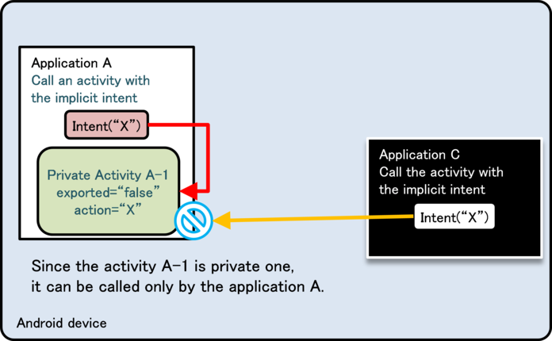
```eval_rst
.. {width="4.739583333333333in" height="2.9375in"}
```

Figure 4.1‑4

Figure 4.1‑5 below shows a scenario in which the same Intent filter
(action=\"X\") is defined in Application B as well as Application A.
Application A is trying to call a Private Activity in the same
application by sending an implicit Intent, but this time a dialogue
box asking the user which application to select is displayed, and the
Public Activity B-1 in Application B called by mistake due to the user
selection. Due to this loophole, it is possible that sensitive
information can be sent to other applications or application may
receive an unexpected retuned value.

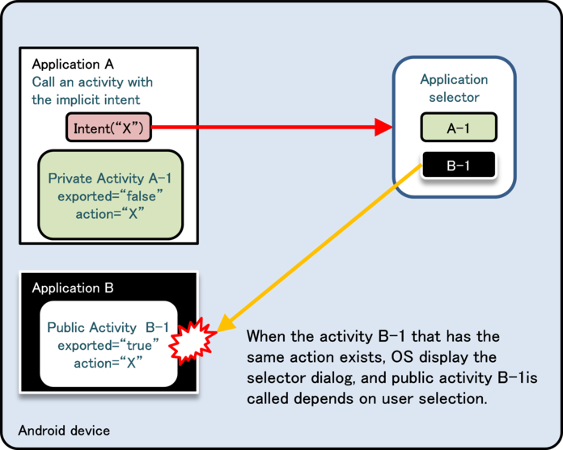
```eval_rst
.. {width="4.739583333333333in"
.. height="3.8020833333333335in"}
```

Figure 4.1‑5

As shown above, using Intent filters to send implicit Intents to
Private Activities may result in unexpected behavior so it is best to
avoid this setting. In addition, we have verified that this behavior
does not depend on the installation order of Application A and
Application B.

#### Validating the Requesting Application

Here we explain the technical information about how to implement a
Partner Activity. Partner applications permit that only particular
applications which are registered in a whitelist are allowed access
and all other applications are denied. Because applications other than
in-house applications also need access permission, we cannot use
signature permissions for access control.

Simply speaking, we want to validate the application trying to use the
Partner Activity by checking if it is registered in a predefined
whitelist and allow access if it is and deny access if it is not.
Application validation is done by obtaining the certificate from the
application requesting access and comparing its hash with the one in
the whitelist.

Some developers may think that it is sufficient to just compare the
package name without obtaining the certificate, however, it is easy to
spoof the package name of a legitimate application so this is not a
good method to check for authenticity. Arbitrarily assignable values
should not be used for authentication. On the other hand, because only
the application developer has the developer key for signing its
certificate, this is a better method for identification. Since the
certificate cannot be easily spoofed, unless a malicious third party
can steal the developer key, there is a very small chance that
malicious application will be trusted. While it is possible to store
the entire certificate in the whitelist, it is sufficient to only
store the SHA-256 hash value in order to minimize the file size.

There are two restrictions for using this method.

-   The requesting application has to use startActivityForResult() instead of startActivity().
-   The requesting application can only call from an Activity.

The second restriction is the restriction imposed as a result of the
first restriction, so technically there is only a single restriction.

This restriction occurs due to the restriction of
Activity.getCallingPackage() which gets the package name of the
calling application. Activity.getCallingPackage() returns the package
name of source (requesting) application only in case it is called by
startActivityForResult(), but unfortunately, when it is called by
startActivity(), it only returns null. Because of this, when using the
method explained here, the source (requesting) application needs to
use startActivityForResult() even if it does not need to obtain a
return value. In addition, startActivityForResult() can be used only
in Activity classes, so the source (requester) is limited to
Activities.

PartnerActivity.java
```eval_rst
.. literalinclude:: CodeSamples/Activity PartnerActivity.PartnerActivity.java
   :language: java
   :encoding: shift-jis
```

PkgCertWhitelists.java
```eval_rst
.. literalinclude:: CodeSamples/JSSEC Shared.PkgCertWhitelists.java
   :language: java
   :encoding: shift-jis
```

PkgCert.java
```eval_rst
.. literalinclude:: CodeSamples/JSSEC Shared.PkgCert.java
   :language: java
   :encoding: shift-jis
```


#### Reading Intents Sent to an Activity

In Android 5.0 (API Level 21) and later, the information retrieved
with getRecentTasks() has been limited to the caller\'s own tasks and
possibly some other tasks such as home that are known to not be
sensitive. However applications, which support the versions under
Android 5.0 (API Level 21), should protect against leaking sensitive
information.

The following describes the contents of this problem occurring in
Android 5.0 and earlier version.

Intents that are sent to the task\'s root Activity are added to the
task history. A root Activity is the first Activity started in a task.
It is possible for any application to read the Intents added to the
task history by using the ActivityManager class.

Sample code for reading the task history from an application is shown
below. To browse the task history, specify the GET\_TASKS permission
in the AndroidManifest.xml file.

AndroidManifest.xml
```eval_rst
.. literalinclude:: CodeSamples/Activity MaliciousActivity.app.src.main.AndroidManifest.xml
   :language: xml
   :encoding: shift-jis
```

MaliciousActivity.java
```eval_rst
.. literalinclude:: CodeSamples/Activity MaliciousActivity.MaliciousActivity.java
   :language: java
   :encoding: shift-jis
```


You can obtain specified entries of the task history by using the
getRecentTasks() function of the AcitivityManager class. Information
about each task is stored in an instance of the
ActivityManager.RecentTaskInfo class, but Intents that were sent to
the task\'s root Activity are stored in its member variable
baseIntent. Since the root Activity is the Activity which was started
when the task was created, please be sure to not fulfill the following
two conditions when calling an Activity.

-   A new task is created when the Activity is called.
-   The called Activity is the task\'s root Activity which already exists in the background or foreground.

#### Root Activity

The root Activity is the Activity which is the starting point of a
task. In other words, this is the Activity which was launched when
task was created. For example, when the default Activity is launched
by launcher, this Activity will be the root Activity. According to the
Android specifications, the contents of Intents sent to the root
Activity can be read from arbitrary applications. So, it is necessary
to take countermeasures not to send sensitive information to the root
Activity. In this guidebook, the following three rules have been made
to avoid a called Activity to become root Activity.

-   taskAffinity should not be specified.
-   launchMode should not be specified.
-   The FLAG\_ACTIVITY\_NEW\_TASK flag should not be set in an Intent sent to an Activity.

We consider the situations that an Activity can become the root
Activity below. A called Activity becoming a root Activity depends on
the following.

-   The launch mode of the called Activity
-   The task of a called Activity and its launch mode

First of all, let me explain the \"Launch mode of called Activity.\"
Launch mode of Activity can be set by writing android:launchMode in
AndroidManifest.xml. When it\'s not written, it\'s considered as
\"standard\". In addition, launch mode can be also changed by a flag
to set to Intent. Flag \"FLAG\_ACTIVITY\_NEW\_TASK\" launches Activity
by \"singleTask\" mode.

The launch modes that can be specified are as per below. I\'ll explain
about the relation with the root activity, mainly.

##### standard

Activity which is called by this mode won\'t be root, and it belongs
to the caller side task. Every time it\'s called, Instance of Activity
is to be generated.

##### singleTop

This launch mode is the same as \"standard\", except for that the
instance is not generated when launching an Activity which is
displayed in most front side of foreground task.

##### singleTask

This launch mode determines the task to which the activity would be
belonging by Affinity value. When task which is matched with
Activity\'s affinity doesn\'t exist either in background or in
foreground, a new task is generated along with Activity\'s instance.
When task exists, neither of them is to be generated. In the former
one, the launched Activity\'s Instance becomes root.

##### singleInstance

Same as \"singleTask\", but following point is different. Only root
Activity can belongs to the newly generated task. So instance of
Activity which was launched by this mode is always root activity. Now,
we need to pay attention to the case that the class name of called
Activity and the class name of Activity which is included in a task
are different although the task which has the same name of called
Activity\'s affinity already exists.

From as above, we can get to know that Activity which was launched by
\"singleTask\" or \"singleInstance\" has the possibility to become
root. In order to secure the application\'s safety, it should not be
launched by these modes.

Next, I\'ll explain about \"Task of the called Activity and its launch
mode\". Even if Activity is called by \"standard\" mode, it becomes
root Activity in some cases depends on the task state to which
Activity belongs.

For example, think about the case that called Activity\'s task has
being run already in background.

The problem here is the case that Activity Instance of the task is
launched by "singleInstance\". When the affinity of Activity which was
called by \"standard\" is same with the task, new task is to be
generated by the restriction of existing \"singleInstance\" Activity.
However, when class name of each Activity is same, task is not
generated and existing activity Instance is to be used. In any cases,
that called Activity becomes root Activity.

As per above, the conditions that root Activity is called are
complicated, for example it depends on the state of execution. So when
developing applications, it\'s better to contrive that Activity is
called by \"standard\".

As an example of that Intent which is sent to Private Activity is read
out form other application, the sample code shows the case that caller
side Activity of private Activity is launched by \"singleInstance\"
mode. In this sample code, private activity is launched by
\"standard\" mode, but this private Activity becomes root Activity of
new task due the \"singleInstance\" condition of caller side Activity.
At this moment, sensitive information that is sent to Private Activity
is recorded task history, so it can be read out from other
applications. FYI, both caller side Activity and Private Activity have
the same affinity.

AndroidManifest.xml(Not recommended)
```eval_rst
.. literalinclude:: CodeSamples/Activity SingleInstanceActivity.app.src.main.AndroidManifest.xml
   :language: xml
   :encoding: shift-jis
```


Private Activity only returns the results to the received Intent.

PrivateActivity.java
```eval_rst
.. literalinclude:: CodeSamples/Activity SingleInstanceActivity.PrivateActivity.java
   :language: java
   :encoding: shift-jis
```


In caller side of Private Activity, Private Activity is launched by
\"standard\" mode without setting flag to Intent.

PrivateUserActivity.java
```eval_rst
.. literalinclude:: CodeSamples/Activity SingleInstanceActivity.PrivateUserActivity.java
   :language: java
   :encoding: shift-jis
```


#### Log Output When using Activities 

When using an activity, the contents of intent are output to LogCat by
ActivityManager. The following contents are to be output to LogCat, so
in this case, sensitive information should not be included here.

-   Destination Package name
-   Destination Class name
-   URI which is set by Intent\#setData()

For example, when an application sent mails, the mail address is
unfortunately outputted to LogCat if the application would specify the
mail address to URI. So, better to send by setting Extras.

When sending a mail as below, mail address is shown to the logCat.

MainActivity.java
``` java
        // URI is output to the LogCat.
        Uri uri = Uri.parse("mailto:test@gmail.com");
        Intent intent = new Intent(Intent.ACTION_SENDTO, uri);
        startActivity(intent);
```

When using Extras, mail address is no more shown to the logCat.

MainActivity.java
``` java
        // Contents which was set to Extra, is not output to the LogCat.
        Uri uri = Uri.parse("mailto:");
        Intent intent = new Intent(Intent.ACTION_SENDTO, uri);
        intent.putExtra(Intent.EXTRA_EMAIL, new String[] {"test@gmail.com"});
        startActivity(intent);
```

However, there are cases where other applications can read the Extras
data of intent using ActivityManager\#getRecentTasks(). Please refer
to "4.1.2.2 Do Not Specify taskAffinity (Required)", "4.1.2.3 Do Not
Specify launchMode (Required)" and "4.1.2.4　Do Not Set the
FLAG\_ACTIVITY\_NEW\_TASK Flag for Intents that Start an Activity
(Required)".

#### Protecting against Fragment Injection in PreferenceActivity
```eval_rst
When a class derived from PreferenceActivity is a public Activity, a
problem known as *Fragment Injection* [5]_ may arise. To prevent this
problem from arising, it is necessary to override
PreferenceActivity.IsValidFragment() and check the validity of its
arguments to ensure that the Activity does not handle any Fragments
without intention. (For more on the safety of input data,　 see
Section　\"3.2 Handling Input Data Carefully and Securely\".)

.. [5] For more information on Fragment Injection, consult this URL: https://securityintelligence.com/new-vulnerability-android-framework-fragment-injection/
```
Below we show a sample in which IsValidFragment() has been overridden.
Note that, if the source code has been obfuscated, class names and the
results of parameter-value comparisons may change. In this case it is
necessary to pursue alternative countermeasures.

Example of an overridden isValidFragment() method

``` java
    protected boolean isValidFragment(String fragmentName) {
        // If the source code is obfuscated, we must pursue alternative strategies
        return PreferenceFragmentA.class.getName().equals(fragmentName)
                || PreferenceFragmentB.class.getName().equals(fragmentName)
                || PreferenceFragmentC.class.getName().equals(fragmentName)
                || PreferenceFragmentD.class.getName().equals(fragmentName);
    }
```

Note that if the app\'s targetSdkVersion is 19 or greater, failure to
override PreferenceActivity.isValidFragment() will result in a
security exception and the termination of the app whenever a Fragment
is inserted \[when isValidFragment() is called\], so in this case
overriding PreferenceActivity.isValidFragment() is mandatory.

#### The Autofill framework

The Autofill framework was added in Android 8.0 (API Level 26). Using
this framework allows apps to store information entered by
users---such as user names, passwords, addresses, phone numbers, and
credit cards---and subsequently to retrieve this information as
necessary to allow the app to fill in forms automatically. This is a
convenient mechanism that reduces data-entry burdens for users;
however, because it allows a given app to pass sensitive information
such as passwords and credit cards to other apps, it must be handled
with appropriate care.

##### Overview of the framework

###### 2 components
```eval_rst
In what follows, we provide an overview of the two components [6]_
registered by the Autofill framework.

-   Apps eligible for Autofill (user apps):

    -   Pass view information (text and attributes) to Autofill service;
        receive information from Autofill service as needed to
        auto-fill forms.

    -   All apps that have Activities are user apps (when in the
        foreground).

    -   It is possible for all Views of all user apps to be eligible for
        Autofill. It is also possible to explicitly specify that any
        given individual view should be ineligible for Autofill.

    -   It is also possible to restrict an app's use of Autofill to the
        Autofill service within the same package.

-   Services that provide Autofill (Autofill services):

    -   Save View information passed by an app (requires user
        permission); provide an app with information needed for
        Autofill in a View (candidate lists).

    -   The Views eligible for this information saving are determined by
        the Autofill service. (Within the Autofill framework, by
        default information on all Views contained in an Activity are
        passed to the Autofill service.)

    -   It is also possible to construct Autofill services provided by
        third parties.

    -   It is possible for several to be present within a single
        terminal with only the service selected by the user via
        Settings enabled (None is also a possible selection.)

    -   It also possible for a Service to provide a UI to validate users
        via password entry or other mechanisms to protect the security
        of the user information handled.

.. [6] The **user app** and the **Autofill service** may belong to the same package (the same APK file) or to different packages.
```
###### Procedural flowchart for the Autofill framework

Figure 4.1‑6 is a flowchart illustrating the procedural flow of
interactions among Autofill-related components during Autofill. When
triggered by events such as motion of the focus in a user app's View,
information on that View (primarily the parent-child relationships and
various attributes of the View) is passed via the Autofill framework
to the Autofill service selected within Settings**.** Based on the
data it receives, the Autofill service fetches from a database the
information (candidate lists) needed for Autofill, then returns this
to the framework. The framework displays a candidate list to the user,
and the app carries out the Autofill operation using the data selected
by the user.

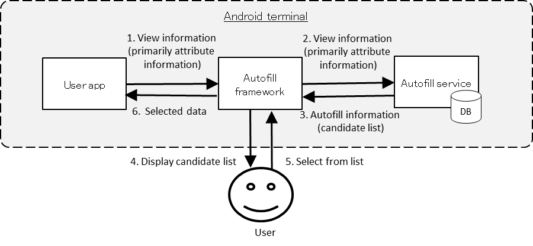
```eval_rst
.. {width="7.266666666666667in" height="3.325in"}
```

Figure 4.1‑6: Procedural flow among components for Autofill

Next, Figure 4.1‑7 is a flowchart illustrating the procedural flow for
saving user data via Autofill. Upon a triggering event such as when
AutofillManager\#commit() is called or when an Activity is unfocused, if
any Autofilled values for the View have been modified *and* the user has
granted permission via the Save Permission dialog box displayed by the
Autofill framework, information on the View (including text) is passed
via the Autofill framework to the Autofill service selected via
Settings, and the Autofill service stores information in the database to
complete the procedural sequence.

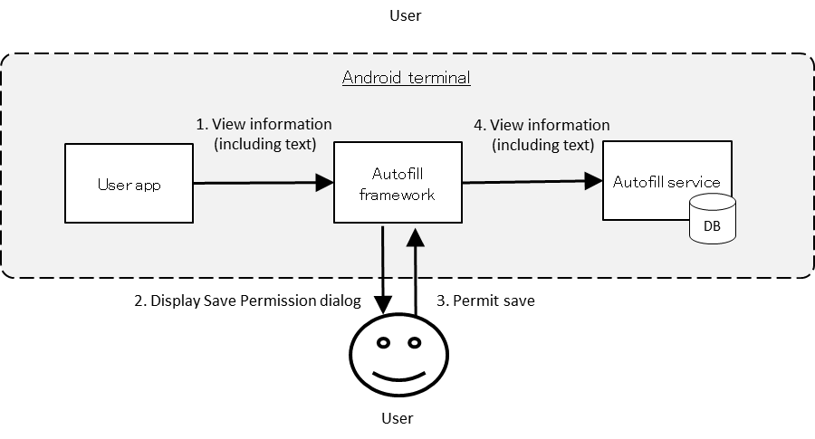
```eval_rst
.. {width="7.258333333333334in" height="3.3333333333333335in"}
```

Figure 4.1‑7: Procedural flow among components for saving user data

##### Security concerns for Autofill user apps

As noted in the section "Overview of the framework" above, the
security model adopted by the Autofill framework is premised on the
assumption that the user configures the Settings to select secure
Autofill services and makes appropriate decisions regarding which data
to pass to which Autofill service when storing data.

However, if a user unwittingly selects a non-secure Autofill service,
there is a possibility that the user may permit the storage of
sensitive information that should not be passed to the Autofill
service. In what follows we discuss the damage that could result in
such a scenario.

When saving information, if the user selects an Autofill service and
grants it permission via the Save Permission dialog box, information
for all Views contained in the Activity currently displayed by the app
in use may be passed to the Autofill service. If the Autofill service
is malware, or if other security issues arise---for example, if View
information is stored by the Autofill service on an external storage
medium or on an insecure cloud service---this could create the risk
that information handled by the app might be leaked.

On the other hand, during Autofill, if the user has selected a piece
of malware as the Autofill service, values transmitted by the malware
may be entered as input. At this point, if the security of the data
input is not adequately validated by the app or by the cloud services
to which the app sends data, risks of information leakage and/or
termination of the app or the service may arise.

Note that, as discussed above in the section *"2 components",* apps
with Activities are automatically eligible for Autofill, and thus all
developers of apps with Activities must take the risks described above
into account when designing and implementing apps. In what follows we
will present countermeasures to mitigate the risks described above we
recommend that these be adopted as appropriate based on a
consideration of the countermeasures required by an app---referring to
"3.1.3 Asset Classification and Protective Countermeasures" and other
relevant resources.

##### Steps to mitigate risk: 1
```eval_rst
As discussed above, security within the Autofill framework is
ultimately guaranteed only at the user's discretion. For this reason,
the range of countermeasures available to apps is somewhat limited.
However, there is one way to mitigate the concerns described above:
Setting the importantForAutofill attribute for a view to "no" ensures
that no View information is passed to the Autofill service (i.e. the
View is made ineligible for Autofill), even if the user cannot make
appropriate selections or permissions (such as selecting a piece of
malware as the Autofill service). [7]_

.. [7] Even after taking this step, in some cases it may not be possible
    to avoid the security concerns described above---for example, if the
    user intentionally uses Autofill. Implementing the steps described
    in **"**Steps to mitigate risk: 2**"** will improve security in
    these cases.
```
The importantForAutofill attribute may be specified by any of the
following methods.

-   Set the importantForAutofill attribute in the layout XML
-   Call View\#setImportantForAutofill()

The values that may be set for this attribute are shown below. Make
sure to use values appropriate for the specified range. In particular,
note with caution that, when a value is set to "no" for a View, that
View will be ineligible for Autofill, but its children *will* remain
eligible for Autofill. The default value is "auto."

Figure 4.1‑2

<table border="yes" bordercolor="gray">
    <thead bgcolor="lightgray">
		<tr>
			<th rowspan="2">Value</th>
			<th rowspan="2">Name of constant</th>
			<th colspan="2">Eligible for Autofill?</th>
		</tr>
		<tr>
			<th width="10%">Specified View</th>
			<th width="10%">Child View</th>
		</tr>
    </thead>
	<tbody>
		<tr>
			<td>"auto"</td>
			<td>IMPORTANT_FOR_AUTOFILL_AUTO</td>
			<td>Determined by Autofill framework</td>
			<td>Determined by Autofill framework</td>
		</tr>
		<tr>
			<td>"no"</td>
			<td>IMPORTANT_FOR_AUTOFILL_NO</td>
			<td>No</td>
			<td>Yes</td>
		</tr>
		<tr>
			<td>"noExcludeDescendants"</td>
			<td>IMPORTANT_FOR_AUTOFILL_NO_EXCLUDE_DESCENDANTS</td>
			<td>No</td>
			<td>No</td>
		</tr>
		<tr>
			<td>"yes"</td>
			<td>IMPORTANT_FOR_AUTOFILL_YES</td>
			<td>Yes</td>
			<td>Yes</td>
		</tr>
		<tr>
			<td>"yesExcludeDescendants"</td>
			<td>IMPORTANT_FOR_AUTOFILL_YES_EXCLUDE_DESCENDANTS</td>
			<td>Yes</td>
			<td>No</td>
		</tr>
	</tbody>
</table>

It is also possible to use
AutofillManager\#hasEnabledAutofillServices() to restrict the use of
Autofill functionality to Autofill services within the same package.

In what follows, we show an example that all Views in an Activity are
eligible for Autofill (whether or not a View actually uses Autofill is
determined by the Autofill service) only in case that settings have
been configured to use a Autofill service within the same package. It
is also possible to call View\#setImportantForAutofill() for
individual Views.

DisableForOtherServiceActivity.java
```eval_rst
.. literalinclude:: CodeSamples/Autofill Sample.DisableForOtherServiceActivity.java
   :language: java
   :encoding: shift-jis
```

##### Steps to mitigate risk: 2

Even in cases where an app has implemented the steps described in the
previous section ("Steps to mitigate risk: 1"), the user can forcibly
enable the use of Autofill by long-pressing the View, displaying the
floating toolbar or a similar control interface, and selecting
"Automatic input." In this case, information for all Views---including
Views for which the importantForAutofill attribute has been set to
"no," or for which similar steps have been taken---will be passed to
the Autofill service.

It is possible to avoid the risk of information leakage even in
circumstances such as these by deleting the "Automatic Input" option
from the floating-toolbar menu and other control interfaces; this step
is to be carried out in addition to the procedures described in "Steps
to mitigate risk: 1"

Sample code for this purpose is shown below.

DisableAutofillActivity.java
```eval_rst
.. literalinclude:: CodeSamples/Autofill Sample.DisableAutofillActivity.java
   :language: java
   :encoding: shift-jis
```

Receiving/Sending Broadcasts
----------------------------

### Sample Code<!-- a4bc3cfd -->

Creating Broadcast Receiver is required to receive Broadcast. Risks
and countermeasures of using Broadcast Receiver differ depending on
the type of the received Broadcast.

You can find your Broadcast Receiver in the following judgment flow.
The receiving applications cannot check the package names of
Broadcast-sending applications that are necessary for linking with the
partners. As a result, Broadcast Receiver for the partners cannot be
created.

Table 4.2‑1 Definition of broadcast receiver types
```eval_rst
=========================== ===================================
Type                        | Definition
=========================== ===================================
Private broadcast receiver  | A broadcast receiver that can receive broadcasts only from
                            | the same application, therefore is the safest broadcast
                            | receiver
Public broadcast receiver   | A broadcast receiver that can receive broadcasts from an
                            | unspecified large number of applications
                            |
                            | If the app's targetSDKVersion is 26 or above, then, on
                            | terminals running Android 8.0 (API level 26） or later,
                            | Broadcast Receivers may not be registered for implicit
                            | Broadcast Intents [8]_
In-house broadcast receiver | A broadcast receiver that can receive broadcasts only from
                            | other In-house applications
=========================== ===================================

.. [8] As exceptions to this rule, some implicit Broadcast Intents sent by the system may use Broadcast Receivers. For more information, consult the following URL.
   https://developer.android.com/guide/components/broadcast-exceptions.html
```

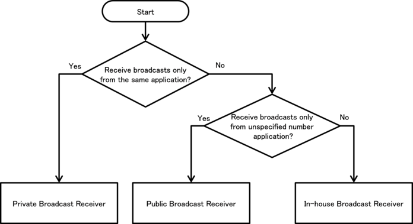
```eval_rst
.. {width="6.395833333333333in"
.. height="3.4895833333333335in"}
```

Figure 4.2‑1

In addition, Broadcast Receiver can be divided into 2 types based on
the definition methods, Static Broadcast Receiver and Dynamic
Broadcast Receiver. The differences between them can be found in the
following figure. In the sample code, an implementation method for
each type is shown. The implementation method for sending applications
is also described because the countermeasure for sending information
is determined depending on the receivers.

Table 4.2‑2
```eval_rst
========================== ======================== =======================================
..                         | Definition method      | Characteristic
========================== ======================== =======================================
Static Broadcast Receiver  | Define by writing      | - There is a restriction that some Broadcasts
                           | <receiver> elements    | (e.g. ACTION_BATTERY_CHANGED) sent by
                           | in AndroidManifest.xml | system cannot be received.
                                                    |
                                                    | - Broadcast can be received from application's
                                                    | initial boot till uninstallation.
Dynamic Broadcast Receiver | By calling             | - Broadcasts which cannot be received by
                           | registerReceiver()     | static Broadcast Receiver can be received.
                           | and                    |
                           | unregisterReceiver()   | - The period of receiving Broadcasts can be
                           | in a program,          | controlled by the program. For example,
                           | register/unregister    | Broadcasts can be received only while
                           | Broadcast Receiver     | Activity is on the front side.
                           | dynamically.           |
                                                    | - Private Broadcast Receiver cannot be created.
========================== ======================== =======================================

```

#### Private Broadcast Receiver - Receiving/Sending Broadcasts

Private Broadcast Receiver is the safest Broadcast Receiver because only Broadcasts sent from within the application can be received. Dynamic Broadcast Receiver cannot be registered as Private, so Private Broadcast Receiver consists of only Static Broadcast Receivers.

Points (Receiving Broadcasts):

1. Explicitly set the exported attribute to false.
2. Handle the received intent carefully and securely, even though the intent was sent from within the same application.
3. Sensitive information can be sent as the returned results since the requests come from within the same application.

AndroidManifest.xml
```eval_rst
.. literalinclude:: CodeSamples/Broadcast PrivateReceiver.app.src.main.AndroidManifest.xml
   :language: xml
   :encoding: shift-jis
```

PrivateReceiver.java
```eval_rst
.. literalinclude:: CodeSamples/Broadcast PrivateReceiver.PrivateReceiver.java
   :language: java
   :encoding: shift-jis
```

The sample code for sending Broadcasts to private Broadcast Receiver is shown below.

Points (Sending Broadcasts):

```eval_rst
4. Use the explicit Intent with class specified to call a receiver within the same application.
5. Sensitive information can be sent since the destination Receiver is within the same application.
6. Handle the received result data carefully and securely, even though the data came from the Receiver within the same application.
```

PrivateSenderActivity.java
```eval_rst
.. literalinclude:: CodeSamples/Broadcast PrivateReceiver.PrivateSenderActivity.java
   :language: java
   :encoding: shift-jis
```

#### Public Broadcast Receiver - Receiving/Sending Broadcasts

Public Broadcast Receiver is the Broadcast Receiver that can receive Broadcasts from unspecified large number of applications, so it\'s necessary to pay attention that it may receive Broadcasts from malware.

Points (Receiving Broadcasts):

1. Explicitly set the exported attribute to true.
2. Handle the received Intent carefully and securely.
3. When returning a result, do not include sensitive information.

Public Receiver which is the sample code for public Broadcast Receiver can be used both in static Broadcast Receiver and Dynamic Broadcast Receiver.

PublicReceiver.java
```eval_rst
.. literalinclude:: CodeSamples/Broadcast PublicReceiver.PublicReceiver.java
   :language: java
   :encoding: shift-jis
```

Static Broadcast Receive is defined in AndroidManifest.xml. Note with caution that---depending on the terminal version---reception of implicit Broadcast Intents may be restricted, as in 「Table 4.2‑1」.

AndroidManifest.xml
```eval_rst
.. literalinclude:: CodeSamples/Broadcast PublicReceiver.app.src.main.AndroidManifest.xml
   :language: xml
   :encoding: shift-jis
```

In Dynamic Broadcast Receiver, registration/unregistration is executed by calling registerReceiver() or unregisterReceiver() in the program. In order to execute registration/unregistration by button operations, the button is allocated on PublicReceiverActivity. Since the scope of Dynamic Broadcast Receiver Instance is longer than PublicReceiverActivity, it cannot be kept as the member variable of PublicReceiverActivity. In this case, keep the Dynamic Broadcast Receiver Instance as the member variable of DynamicReceiverService, and then start/end DynamicReceiverService from PublicReceiverActivity to register/unregister Dynamic Broadcast Receiver indirectly.

DynamicReceiverService.java
```eval_rst
.. literalinclude:: CodeSamples/Broadcast PublicReceiver.DynamicReceiverService.java
   :language: java
   :encoding: shift-jis
```

PublicReceiverActivity.java
```eval_rst
.. literalinclude:: CodeSamples/Broadcast PublicReceiver.PublicReceiverActivity.java
   :language: java
   :encoding: shift-jis
```

Next, the sample code for sending Broadcasts to public Broadcast Receiver is shown. When sending Broadcasts to public Broadcast Receiver, it\'s necessary to pay attention that Broadcasts can be received by malware.

Points (Sending Broadcasts):

```eval_rst
4. Do not send sensitive information.
5. When receiving a result, handle the result data carefully and securely.
```

PublicSenderActivity.java
```eval_rst
.. literalinclude:: CodeSamples/Broadcast PublicSender.PublicSenderActivity.java
   :language: java
   :encoding: shift-jis
```

#### In-house Broadcast Receiver - Receiving/Sending Broadcasts

In-house Broadcast Receiver is the Broadcast Receiver that will never receive any Broadcasts sent from other than in-house applications. It consists of several in-house applications, and it\'s used to protect the information or functions that in-house application handles.

Points (Receiving Broadcasts):

1. Define an in-house signature permission to receive Broadcasts.
2. Declare to use the in-house signature permission to receive results.
3. Explicitly set the exported attribute to true.
4. Require the in-house signature permission by the Static Broadcast Receiver definition.
5. Require the in-house signature permission to register Dynamic Broadcast Receiver.
6. Verify that the in-house signature permission is defined by an in-house application.
7. Handle the received intent carefully and securely, even though the Broadcast was sent from an in-house application.
8. Sensitive information can be returned since the requesting application is in-house.
9. When Exporting an APK, sign the APK with the same developer key as the sending application.

In-house Receiver which is a sample code of in-house Broadcast Receiver is to be used both in Static Broadcast Receiver and Dynamic Broadcast Receiver.

InhouseReceiver.java
```eval_rst
.. literalinclude:: CodeSamples/Broadcast InhouseReceiver.InhouseReceiver.java
   :language: java
   :encoding: shift-jis
```

Static Broadcast Receiver is to be defined in AndroidManifest.xml.Note with caution that---depending on the terminal version---reception of implicit Broadcast Intents may be restricted, as in 「Table 4.2‑1」.

AndroidManifest.xml
```eval_rst
.. literalinclude:: CodeSamples/Broadcast InhouseReceiver.broadcastInhouseReceiver.src.main.AndroidManifest.xml
   :language: xml
   :encoding: shift-jis
```

Dynamic Broadcast Receiver executes registration/unregistration by calling registerReceiver() or unregisterReceiver() in the program. In order to execute registration/unregistration by the button operations, the button is arranged on InhouseReceiverActivity. Since the scope of Dynamic Broadcast Receiver Instance is longer than InhouseReceiverActivity, it cannot be kept as the member variable of InhouseReceiverActivity. So, keep Dynamic Broadcast Receiver Instance as the member variable of DynamicReceiverService, and then start/end DynamicReceiverService from InhouseReceiverActivity to register/unregister Dynamic Broadcast Receiver indirectly.

InhouseReceiverActivity.java
```eval_rst
.. literalinclude:: CodeSamples/Broadcast InhouseReceiver.InhouseReceiverActivity.java
   :language: java
   :encoding: shift-jis
```

DynamicReceiverService.java
```eval_rst
.. literalinclude:: CodeSamples/Broadcast InhouseReceiver.DynamicReceiverService.java
   :language: java
   :encoding: shift-jis
```

SigPerm.java
```eval_rst
.. literalinclude:: CodeSamples/JSSEC Shared.SigPerm.java
   :language: java
   :encoding: shift-jis
```

PkgCert.java
```eval_rst
.. literalinclude:: CodeSamples/JSSEC Shared.PkgCert.java
   :language: java
   :encoding: shift-jis
```

\*\*\* Point 9 \*\*\* When exporting an APK, sign the APK with the same developer key as the sending application.


```eval_rst
.. {width="4.647222222222222in"
.. height="3.2743055555555554in"}
```

Figure 4.2‑2

Next, the sample code for sending Broadcasts to in-house Broadcast Receiver is shown.

Points (Sending Broadcasts):

```eval_rst
10. Define an in-house signature permission to receive results.
11. Declare to use the in-house signature permission to receive Broadcasts.
12. Verify that the in-house signature permission is defined by an in-house application.
13. Sensitive information can be returned since the requesting application is the in-house one.
14. Require the in-house signature permission of Receivers.
15. Handle the received result data carefully and securely.
16. When exporting an APK, sign the APK with the same developer key as the destination application.
```

AndroidManifest.xml
```eval_rst
.. literalinclude:: CodeSamples/Broadcast InhouseSender.broadcastInhouseSender.src.main.AndroidManifest.xml
   :language: xml
   :encoding: shift-jis
```

InhouseSenderActivity.java
```eval_rst
.. literalinclude:: CodeSamples/Broadcast InhouseSender.InhouseSenderActivity.java
   :language: java
   :encoding: shift-jis
```

SigPerm.java
```eval_rst
.. literalinclude:: CodeSamples/JSSEC Shared.SigPerm.java
   :language: java
   :encoding: shift-jis
```

PkgCert.java
```eval_rst
.. literalinclude:: CodeSamples/JSSEC Shared.PkgCert.java
   :language: java
   :encoding: shift-jis
```

\*\*\* Point 16 \*\*\* When exporting an APK, sign the APK with the same developer key as the destination application.


```eval_rst
.. {width="4.647222222222222in"
.. height="3.2743055555555554in"}
```

Figure 4.2‑3

### Rule Book<!-- 11babdbd -->

Follow the rules below to Send or receive Broadcasts.

1. Broadcast Receiver that Is Used Only in an Application Must Be Set as Private (Required)
2.  Handle the Received Intent Carefully and Securely (Required)
3.  Use the In-house Defined Signature Permission after Verifying that it\'s Defined by an In-house Application (Required)
4.  When Returning a Result Information, Pay Attention to the Result Information Leakage from the Destination Application (Required)
5.  When Sending Sensitive Information with a Broadcast, Limit the Receivable Receiver (Required)
6.  Sensitive Information Must Not Be Included in the Sticky Broadcast (Required)
7.  Pay Attention that the Ordered Broadcast without Specifying the receiverPermission May Not Be Delivered (Required)
8.  Handle the Returned Result Data from the Broadcast Receiver Carefully and Securely (Required)
9.  When Providing an Asset Secondarily, the Asset should be protected with the Same Protection Level (Required)

#### Broadcast Receiver that Is Used Only in an Application Must Be Set as Private (Required)

Broadcast Receiver which is used only in the application should be set as private to avoid from receiving any Broadcasts from other applications unexpectedly. It will prevent the application function abuse or the abnormal behaviors.

Receiver used only within the same application should not be designed with setting Intent-filter. Because of the Intent-filter characteristics, a public Receiver of other application may be called unexpectedly by calling through Intent-filter even though a private Receiver within the same application is to be called.

AndroidManifest.xml(Not recommended)
``` xml
        <!-- Private Broadcast Receiver -->
        <!-- *** POINT 1 *** Set the exported attribute to false explicitly. -->
        <receiver android:name=".PrivateReceiver"
            android:exported="false" >
            <intent-filter>
                <action android:name="org.jssec.android.broadcast.MY_ACTION" />
            </intent-filter>
        </receiver>
```

Please refer to \"4.2.3.1 Combinations of the exported Attribute and the Intent-filter setting (For Receiver).\"

#### Handle the Received Intent Carefully and Securely (Required)

Though risks are different depending on the types of the Broadcast Receiver, firstly verify the safety of Intent when processing received Intent data.

Since Public Broadcast Receiver receives the Intents from unspecified large number of applications, it may receive malware\'s attacking Intents. Private Broadcast Receiver will never receive any Intent from other applications directly, but Intent data which a public Component received from other applications may be forwarded to Private Broadcast Receiver. So don\'t think that the received Intent is totally safe without any qualification. In-house Broadcast Receivers have some degree of the risks, so it also needs to verify the safety of the received Intents.

Please refer to \"3.2 Handling Input Data Carefully and Securely\"

#### Use the In-house Defined Signature Permission after Verifying that it\'s Defined by an In-house Application (Required)

In-house Broadcast Receiver which receives only Broadcasts sent by an In-house application should be protected by in-house-defined Signature Permission. Permission definition/Permission request declarations in AndroidManifest.xml are not enough to protecting, so please refer to \"5.2.1.2 How to Communicate Between In-house Applications with In-house-defined Signature Permission.\" ending Broadcasts by specifying in-house-defined Signature Permission to receiverPermission parameter requires verification in the same way.

#### When Returning a Result Information, Pay Attention to the Result Information Leakage from the Destination Application (Required)

The Reliability of the application which returns result information by setResult() varies depending on the types of the Broadcast Receiver. In case of Public Broadcast Receiver, the destination application may be malware, and there may be a risk that the result information is used maliciously. In case of Private Broadcast Receiver and In-house Broadcast Receiver, the result destination is In-house developed application, so no need to mind the result information handling.

Need to pay attention to the result information leakage from the destination application when result information is returned from Broadcast Receivers as above.

#### When Sending Sensitive Information with a Broadcast, Limit the Receivable Receiver (Required)

Broadcast is the created system to broadcast information to unspecified large number of applications or notify them of the timing at once. So, broadcasting sensitive information requires the careful designing for preventing the illicit obtainment of the information by malware.

For broadcasting sensitive information, only reliable Broadcast Receiver can receive it, and other Broadcast Receivers cannot. The following are some examples of Broadcast sending methods.

- The method is to fix the address by Broadcast-sending with an
  explicit Intent for sending Broadcasts to the intended reliable
  Broadcast Receivers only. There are 2 patterns in this method.

  - When it\'s addressed to a Broadcast Receiver within the same
    application, specify the address by Intent\#setClass(Context,
    Class). Refer to sample code section \"4.2.1.1 Private Broadcast
    Receiver - Receiving/Sending Broadcast\" for the concrete code.

  - When it\'s addressed to a Broadcast Receiver in other
    applications, specify the address by
    Intent\#setClassName(String, String). Confirm the permitted
    application by comparing the developer key of the APK signature
    in the destination package with the white list to send
    Broadcasts. Actually the following method of using implicit
    Intents is more practical.

- The Method is to send Broadcasts by specifying in-house-defined
  Signature Permission to receiverPermission parameter and make the
  reliable Broadcast Receiver declare to use this Signature
  Permission. Refer to the sample code section \"4.2.1.3 In-house
  Broadcast Receiver - Receiving/Sending Broadcast\" for the concrete
  code. In addition, implementing this Broadcast-sending method needs
  to apply the rule \"4.2.2.3 Use the In-house Defined Signature
  Permission after Verifying that it\'s Defined by an In-house
  Application (Required).\"

#### Sensitive Information Must Not Be Included in the Sticky Broadcast (Required)

Usually, the Broadcasts will be disappeared when they are processed to be received by the available Broadcast Receivers. On the other hand, Sticky Broadcasts (hereafter, Sticky Broadcasts including Sticky Ordered Broadcasts), will not be disappeared from the system even when they processed to be received by the available Broadcast Receivers and will be able to be received by registerReceiver(). When Sticky Broadcast becomes unnecessary, it can be deleted anytime arbitrarily with removeStickyBroadcast().

As it\'s presupposed that Sticky Broadcast is used by the implicit
Intent. Broadcasts with specified receiverPermission Parameter cannot
be sent. For this reason, information sent via Sticky Broadcasts can
be accessed by multiple unspecified apps --- including malware --- and
thus sensitive information must not be sent in this way. Note that
Sticky Broadcast is deprecated in Android 5.0 (API Level 21).

####  Pay Attention that the Ordered Broadcast without Specifying the receiverPermission May Not Be Delivered (Required)

Ordered Broadcast without specified receiverPermission Parameter can
be received by unspecified large number of applications including
malware. Ordered Broadcast is used to receive the returned information
from Receiver, and to make several Receivers execute processing one by
one. Broadcasts are sent to the Receivers in order of priority. So if
the high- priority malware receives Broadcast first and executes
abortBroadcast(), Broadcasts won\'t be delivered to the following
Receivers.

#### Handle the Returned Result Data from the Broadcast Receiver Carefully and Securely (Required)

Basically the result data should be processed safely considering the
possibility that received results may be the attacking data though the
risks vary depending on the types of the Broadcast Receiver which has
returned the result data.

When sender (source) Broadcast Receiver is public Broadcast Receiver,
it receives the returned data from unspecified large number of
applications. So it may also receive malware\'s attacking data. When
sender (source) Broadcast Receiver is private Broadcast Receiver, it
seems no risk. However the data received by other applications may be
forwarded as result data indirectly. So the result data should not be
considered as safe without any qualification. When sender (source)
Broadcast Receiver is In-house Broadcast Receiver, it has some degree
of the risks. So it should be processed in a safe way considering the
possibility that the result data may be an attacking data.

Please refer to \"3.2 Handling Input Data Carefully and Securely\"

####  When Providing an Asset Secondarily, the Asset should be protected with the Same Protection Level (Required)

When information or function assets protected by Permission are
provided to other applications secondarily, it\'s necessary to keep
the protection standard by claiming the same Permission of the
destination application. In the Android Permission security models,
privileges are managed only for the direct access to the protected
assets from applications. Because of the characteristics, acquired
assets may be provided to other applications without claiming
Permission which is necessary for protection. This is actually same as
re-delegating Permission, as it is called, Permission re-delegation
problem. Please refer to \"5.2.3.4 Permission Re-delegation Problem.\"

### Advanced Topics<!-- acfc87e9 -->

#### Combinations of the exported Attribute and the Intent-filter setting (For Receiver)

Table 4.2-3 represents the permitted combination of export settings
and Intent-filter elements when implementing Receivers. The reason why
the usage of exported=\"false\" with Intent-filter definition is
principally prohibited, is described below.

Table 4.2‑3 Usable or not; Combination of exported attribute and intent-filter elements
```eval_rst
+---------------------------+-------------------------------------+
|                           | Value of exported attribute         |
+                           +------+--------------+---------------+
|                           | True | False        | Not specified |
+===========================+======+==============+===============+
| Intent-filter defined     | OK   | (Do not Use) | (Do not Use)  |
+---------------------------+------+--------------+---------------+
| Intent Filter Not Defined | OK   | OK           | (Do not Use)  |
+---------------------------+------+--------------+---------------+

When the exported attribute of a Receiver is left unspecified, the
question of whether or not the Receiver is public is determined by the
presence or absence of intent filters for that Receiver. [9]_ However,
in this guidebook it is forbidden to set the exported attribute to
unspecified. In general, as mentioned previously, it is best to avoid
implementations that rely on the default behavior of any given API;
moreover, in cases where explicit methods --- such as the exported
attribute --- exist for enabling important security-related settings,
it is always a good idea to make use of those methods.

.. [9] If any intent filters are defined then the Receiver is public; otherwise it is private. For more information, see https://developer.android.com/guide/topics/manifest/receiver-element.html#exported.
```

Public Receivers in other applications may be called unexpectedly even
though Broadcasts are sent to the private Receivers within the same
applications. This is the reason why specifying exported=\"false\"
with Intent-filter definition is prohibited. The following 2 figures
show how the unexpected calls occur.

Figure 4.2‑4 is an example of the normal behaviors which a private
Receiver (application A) can be called by implicit Intent only within
the same application. Intent-filter (in the figure, action=\"X\") is
defined only in application A, so this is the expected behavior.

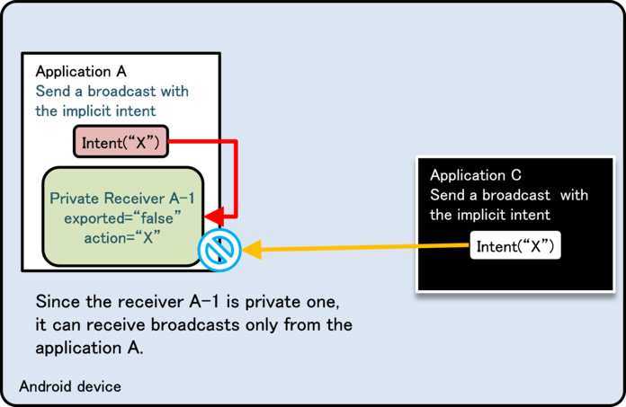
```eval_rst
.. {width="4.739583333333333in"
.. height="3.8020833333333335in"}
```

Figure 4.2‑4

Figure 4.2‑5 is an example that Intent-filter (see action=\"X\" in the
figure) is defined in the application B as well as in the application
A. First of all, when another application (application C) sends
Broadcasts by implicit Intent, they are not received by a private
Receiver (A-1) side. So there won\'t be any security problem. (See the
orange arrow marks in the Figure.)

From security point of view, the problem is application A\'s call to
the private Receiver within the same application. When the application
A broadcasts implicit Intent, not only Private Receiver within the
same application, but also public Receiver (B-1) with the same
Intent-filter definition can also receive the Intent. (Red arrow marks
in the Figure). In this case, sensitive information may be sent from
the application A to B. When the application B is malware, it will
cause the leakage of sensitive information. When the Broadcast is
Ordered Broadcast, it may receive the unexpected result information.

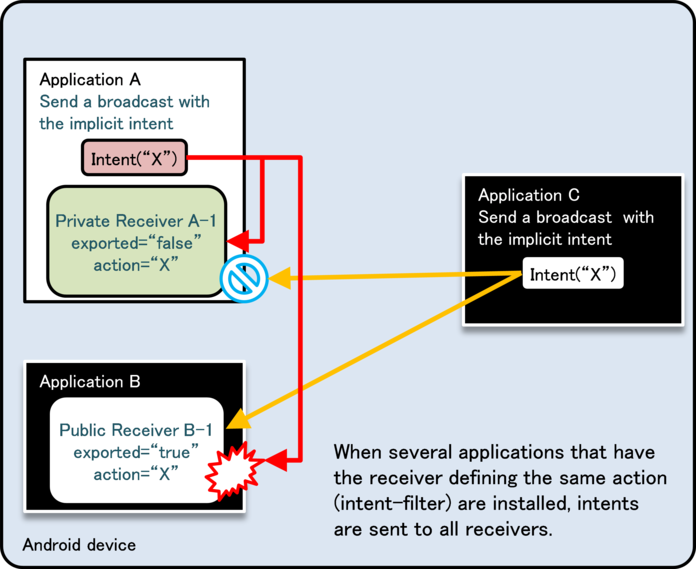
```eval_rst
.. {width="4.739583333333333in"
.. height="3.8020833333333335in"}
```

Figure 4.2‑5

However, exported=\"false\" with Intent-filter definition should be
used when Broadcast Receiver to receive only Broadcast Intent sent by
the system is implemented. Other combination should not be used. This
is based on the fact that Broadcast Intent sent by the system can be
received by exported=\"false\". If other applications send Intent
which has same ACTION with Broadcast Intent sent by system, it may
cause an unexpected behavior by receiving it. However, this can be
prevented by specifying exported=\"false\".

#### Receiver Won\'t Be Registered before Launching the Application

```eval_rst
It is important to note carefully that a Broadcast Receiver defined
statically in AndroidManifest.xml will not be automatically enabled
upon installation. [10]_ Apps are able to receive Broadcasts only after
they have been launched the first time; thus, it is not possible to
use the receipt of a Broadcast after installation as a trigger to
initiate operations. However, if the
Intent.FLAG\_INCLUDE\_STOPPED\_PACKAGES flag set when sending a
Broadcast, that Broadcast will be received even by apps that have not
yet been launched for the first time.

.. [10] In versions prior to Android 3.0, Receivers were registered automatically simply by installing apps.
```

#### Private Broadcast Receiver Can Receive the Broadcast that Was Sent by the Same UID Application

Same UID can be provided to several applications. Even if it\'s
private Broadcast Receiver, the Broadcasts sent from the same UID
application can be received.

However, it won\'t be a security problem. Since it\'s guaranteed that
applications with the same UID have the consistent developer keys for
signing APK. It means that what private Broadcast Receiver receives is
only the Broadcast sent from In-house applications.

#### Types and Features of Broadcasts

Regarding Broadcasts, there are 4 types based on the combination of
whether it\'s Ordered or not, and Sticky or not. Based on Broadcast
sending methods, a type of Broadcast to send is determined. Note that
Sticky Broadcast is deprecated in Android 5.0 (API Level 21).

Table 4.2‑4

```eval_rst
========================== ============================== ========== =========
Type of Broadcast          Method for sending             Ordered?   Sticky?
========================== ============================== ========== =========
Normal Broadcast           sendBroadcast()                No         No
Ordered Broadcast          sendOrderedBroadcast()         Yes        No
Sticky Broadcast           sendStickyBroadcast()          No         Yes
Sticky Ordered Broadcast   sendStickyOrderedBroadcast()   Yes        Yes
========================== ============================== ========== =========
```

The feature of each Broad cast is described.

Table 4.2‑5

```eval_rst
========================= ===========================================================
Type of Broadcast         | Features for each type of Broadcast
========================= ===========================================================
Normal Broadcast          | Normal Broadcast disappears when it is sent to receivable Broadcast Receiver.
                          | Broadcasts are received by several Broadcast Receivers simultaneously.
                          | This is a difference from Ordered Broadcast.
                          | Broadcasts are allowed to be received by the particular Broadcast Receivers.
Ordered Broadcast         | Ordered Broadcast is characterized by receiving Broadcasts one by one in order
                          | with receivable Broadcast Receivers.
                          | The higher-priority Broadcast Receiver receives earlier.
                          | Broadcasts will disappear when Broadcasts are delivered to all Broadcast Receivers or
                          | a Broadcast Receiver in the process calls abortBroadcast().
                          | Broadcasts are allowed to be received by the Broadcast Receivers which declare
                          | the specified Permission.
                          | In addition, the result information sent from Broadcast Receiver can be received
                          | by the sender with Ordered Broadcasts.
                          | The Broadcast of SMS-receiving notice (SMS\_RECEIVED) is a representative example
                          | of Ordered Broadcast.
Sticky Broadcast          | Sticky Broadcast does not disappear and remains in the system, and then
                          | the application that calls registerReceiver() can receive Sticky Broadcast later.
                          | Since Sticky Broadcast is different from other Broadcasts, it will never disappear
                          | automatically. So when Sticky Broadcast is not necessary, calling
                          | removeStickyBroadcast() explicitly is required to delete Sticky Broadcast.
                          | Also, Broadcasts cannot be received by the limited Broadcast Receivers with
                          | particular Permission. The Broadcast of changing battery-state notice
                          | (ACTION\_BATTERY\_CHANGED) is the representative example of Sticky Broadcast.
Sticky Ordered Broadcast  | This is the Broadcast which has both characteristics of Ordered Broadcast and
                          | Sticky Broadcast. Same as Sticky Broadcast, it cannot allow only Broadcast Receivers
                          | with the particular Permission to receive the Broadcast.
========================= ===========================================================
```

From the Broadcast characteristic behavior point of view, above table
is conversely arranged in the following one.

Table 4.2‑6

```eval_rst
+----------------------+------------+------------+------------+------------+
|| Characteristic      || Normal    || Ordered   || Sticky    || Sticky    |
|| behavior of         ||           ||           ||           || Ordered   |
|| Broadcast           || Broadcast || Broadcast || Broadcast || Broadcast |
+======================+============+============+============+============+
|| Limit Broadcast     || OK        || OK        || \-        || \-        |
|| Receivers which can |            |            |            |            |
|| receive Broadcast,  |            |            |            |            |
|| by Permission       |            |            |            |            |
+----------------------+------------+------------+------------+------------+
|| Get the results     || \-        || OK        || \-        || OK        |
|| of process from     |            |            |            |            |
|| Broadcast Receiver  |            |            |            |            |
+----------------------+------------+------------+------------+------------+
|| Make Broadcast      || \-        || OK        || \-        || OK        |
|| Receivers process   |            |            |            |            |
|| Broadcasts in order |            |            |            |            |
+----------------------+------------+------------+------------+------------+
|| Receive Broadcasts  || \-        || \-        || OK        || OK        |
|| later, which have   |            |            |            |            |
|| been already sent   |            |            |            |            |
+----------------------+------------+------------+------------+------------+
```

#### Broadcasted Information May be Output to the LogCat

Basically sending/receiving Broadcasts is not output to LogCat.
However, the error log will be output when lacking Permission causes
errors in receiver/sender side. Intent information sent by Broadcast
is included in the error log, so after an error occurs it\'s necessary
to pay attention that Intent information is displayed in LogCat when
Broadcast is sent.

Erorr of lacking Permission in sender side

```
W/ActivityManager(266): Permission Denial: broadcasting Intent {
act=org.jssec.android.broadcastreceiver.creating.action.MY_ACTION }
from org.jssec.android.broadcast.sending (pid=4685, uid=10058) requires
org.jssec.android.permission.MY_PERMISSION due to receiver
org.jssec.android.broadcastreceiver.creating/org.jssec.android.broadcastreceiver.creating.CreatingType3Receiver
```

Erorr of lacking Permission in receiver side

```
W/ActivityManager(275): Permission Denial: receiving Intent {
act=org.jssec.android.broadcastreceiver.creating.action.MY_ACTION } to
org.jssec.android.broadcastreceiver.creating requires
org.jssec.android.permission.MY_PERMISSION due to sender
org.jssec.android.broadcast.sending (uid 10158)
```

#### Items to Keep in Mind When Placing an App Shortcut on the Home Screen

In what follows we discuss a number of items to keep in mind when
creating a shortcut button for launching an app from the home screen
or for creating URL shortcuts such as bookmarks in web browsers. As an
example, we consider the implementation shown below.

Place an app shortcut on the home screen

``` java
        Intent targetIntent = new Intent(this, TargetActivity.class);

        // Intent to request shortcut creation
        Intent intent = new Intent("com.android.launcher.action.INSTALL_SHORTCUT");

        // Specify an Intent to be launched when the shortcut is tapped
        intent.putExtra(Intent.EXTRA_SHORTCUT_INTENT, targetIntent);
        Parcelable icon = Intent.ShortcutIconResource.fromContext(context, iconResource);
        intent.putExtra(Intent.EXTRA_SHORTCUT_ICON_RESOURCE, icon);
        intent.putExtra(Intent.EXTRA_SHORTCUT_NAME, title);
        intent.putExtra("duplicate", false);

        // Use Broadcast to send the system our request for shortcut creation
        context.sendBroadcast(intent);
```

In the Broadcast sent by the above code snippet, the receiver is the
home-screen app, and it is difficult to identify the package name; one
must take care to remember that this is a transmission to a public
receiver with an implicit intent. Thus the Broadcast sent by this
snippet could be received by any arbitrary app, including malware; for
this reason, the inclusion of sensitive information in the Intent may
create the risk of a damaging leak of information. It is particularly
important to note that, when creating a URL-based shortcut, secret
information may be contained in the URL itself.

As countermeasures, it is necessary to follow the points listed in
"4.2.1.2 Public Broadcast Receiver - Receiving/Sending Broadcasts" and
to ensure that the transmitted Intent does not contain sensitive
information.

Creating/Using Content Providers
--------------------------------

Since the interface of ContentResolver and SQLiteDatabase are so much
alike, it\'s often misunderstood that Content Provider is so closely
related to SQLiteDatabase. However, actually Content Provider simply
provides the interface of inter-application data sharing, so it\'s
necessary to pay attention that it does not interfere each data saving
format. To save data in Content Provider, SQLiteDatabase can be used,
and other saving formats, such as an XML file format, also can be
used. Any data saving process is not included in the following sample
code, so please add it if needed.

### Sample Code<!-- 45c21b70 -->

The risks and countermeasures of using Content Provider differ
depending on how that Content Provider is being used. In this section,
we have classified 5 types of Content Provider based on how the
Content Provider is being used. You can find out which type of Content
Provider you are supposed to create through the following chart shown below.

Table 4.3‑1 Definition of content provider types

```eval_rst
=========================== ===================================
| Type                      | Definition
=========================== ===================================
| Private Content Provider  | A content provider that cannot be used by another application,
                            | and therefore is the safest content provider
| Public Content Provider   | A content provider that is supposed to be used by an unspecified
                            | large number of applications
| Partner Content Provider  | A content provider that can be used by specific applications
                            | made by a trusted partner company.
| In-house Content Provider | A content provider that can only be used by other in-house applications
| Temporary permit          | A content provider that is basically private content provider,
| Content Provider          | but permits specific applications to access the particular URI.
=========================== ===================================
```

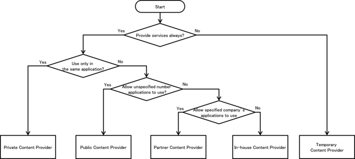
```eval_rst
.. {width="6.889763779527559in"
.. height="3.0866141732283463in"}
```

Figure 4.3‑1

#### Creating/Using Private Content Providers

```eval_rst
Private Content Provider is the Content Provider which is used only in
the single application, and the safest Content Provider [11]_.

.. [11] However, non-public settings for Content Provider are not functional in Android 2.2 (API Level 8) and previous versions.
```

Sample code of how to implement a private Content Provider is shown below.

Points (Creating a Content Provider):

1.  Explicitly set the exported attribute to false.
2.  Handle the received request data carefully and securely, even though
    the data comes from the same application.
3.  Sensitive information can be sent since it is sending and receiving
    all within the same application.

AndroidManifest.xml
```eval_rst
.. literalinclude:: CodeSamples/Provider PrivateProvider.app.src.main.AndroidManifest.xml
   :language: xml
   :encoding: shift-jis
```

PrivateProvider.java
```eval_rst
.. literalinclude:: CodeSamples/Provider PrivateProvider.PrivateProvider.java
   :language: java
   :encoding: shift-jis
```

Next is an example of Activity which uses Private Content Provider.

Points (Using a Content Provider):

4. Sensitive information can be sent since the destination provider is
   in the same application.

5. Handle received result data carefully and securely, even though the
   data comes from the same application.

PrivateUserActivity.java
```eval_rst
.. literalinclude:: CodeSamples/Provider PrivateProvider.PrivateUserActivity.java
   :language: java
   :encoding: shift-jis
```

#### Creating/Using Public Content Providers

Public Content Provider is the Content Provider which is supposed to
be used by unspecified large number of applications. It\'s necessary
to pay attention that since this doesn\'t specify clients, it may be
attacked and tampered by Malware. For example, a saved data may be
taken by select(), a data may be changed by update(), or a fake data
may be inserted/deleted by insert()/delete().

In addition, when using a custom Public Content Provider which is not
provided by Android OS, it\'s necessary to pay attention that request
parameter may be received by Malware which masquerades as the custom
Public Content Provider, and also the attack result data may be sent.
Contacts and MediaStore provided by Android OS are also Public Content
Providers, but Malware cannot masquerades as them.

Sample code to implement a Public Content Provider is shown below.

Points (Creating a Content Provider):

1.  Explicitly set the exported attribute to true.
2.  Handle the received request data carefully and securely.
3.  When returning a result, do not include sensitive information.

AndroidManifest.xml
```eval_rst
.. literalinclude:: CodeSamples/Provider PublicProvider.app.src.main.AndroidManifest.xml
   :language: xml
   :encoding: shift-jis
```

PublicProvider.java
```eval_rst
.. literalinclude:: CodeSamples/Provider PublicProvider.PublicProvider.java
   :language: java
   :encoding: shift-jis
```

Next is an example of Activity which uses Public Content Provider.

Points (Using a Content Provider):

4. Do not send sensitive information.

5. When receiving a result, handle the result data carefully and securely.

PublicUserActivity.java
```eval_rst
.. literalinclude:: CodeSamples/Provider PublicUser.PublicUserActivity.java
   :language: java
   :encoding: shift-jis
```

#### Creating/Using Partner Content Providers

Partner Content Provider is the Content Provider which can be used
only by the particular applications. The system consists of a partner
company\'s application and In-house application, and it is used to
protect the information and features which are handled between a
partner application and an In-house application.

Sample code to implement a partner-only Content Provider is shown below.

Points (Creating a Content Provider):

1. Explicitly set the exported attribute to true.
2. Verify if the certificate of a requesting application has been
   registered in the own white list.
3. Handle the received request data carefully and securely, even though
   the data comes from a partner application.
4. Information that is granted to disclose to partner applications can
   be returned.

AndroidManifest.xml
```eval_rst
.. literalinclude:: CodeSamples/Provider PartnerProvider.providerPartnerProvider.src.main.AndroidManifest.xml
   :language: xml
   :encoding: shift-jis
```

PartnerProvider.java
```eval_rst
.. literalinclude:: CodeSamples/Provider PartnerProvider.PartnerProvider.java
   :language: java
   :encoding: shift-jis
```

Next is an example of Activity which use partner only Content Provider.

Points (Using a Content Provider):

5. Verify if the certificate of the target application has been
   registered in the own white list.

6. Information that is granted to disclose to partner applications can
   be sent.

7. Handle the received result data carefully and securely, even though
   the data comes from a partner application.

PartnerUserActivity.java
```eval_rst
.. literalinclude:: CodeSamples/Provider PartnerUser.PartnerUserActivity.java
   :language: java
   :encoding: shift-jis
```

PkgCertWhitelists.java
```eval_rst
.. literalinclude:: CodeSamples/JSSEC Shared.PkgCertWhitelists.java
   :language: java
   :encoding: shift-jis
```

PkgCert.java
```eval_rst
.. literalinclude:: CodeSamples/JSSEC Shared.PkgCert.java
   :language: java
   :encoding: shift-jis
```

#### Creating/Using In-house Content Providers

In-house Content Provider is the Content Provider which prohibits to
be used by applications other than In house only applications.

Sample code of how to implement an In house only Content Provider is shown below.

Points (Creating a Content Provider):

1.  Define an in-house signature permission.
2.  Require the in-house signature permission.
3.  Explicitly set the exported attribute to true.
4.  Verify if the in-house signature permission is defined by an
    in-house application.
5.  Verify the safety of the parameter even if it\'s a request from In
    house only application.
6.  Sensitive information can be returned since the requesting
    application is in-house.
7.  When exporting an APK, sign the APK with the same developer key as
    that of the requesting application.

AndroidManifest.xml
```eval_rst
.. literalinclude:: CodeSamples/Provider InhouseProvider.providerInhouseProvider.src.main.AndroidManifest.xml
   :language: xml
   :encoding: shift-jis
```

InhouseProvider.java
```eval_rst
.. literalinclude:: CodeSamples/Provider InhouseProvider.InhouseProvider.java
   :language: java
   :encoding: shift-jis
```

SigPerm.java
```eval_rst
.. literalinclude:: CodeSamples/JSSEC Shared.SigPerm.java
   :language: java
   :encoding: shift-jis
```

PkgCert.java
```eval_rst
.. literalinclude:: CodeSamples/JSSEC Shared.PkgCert.java
   :language: java
   :encoding: shift-jis
```

\*\*\* Point 7 \*\*\* When exporting an APK, sign the APK with the
same developer key as the requesting application.


```eval_rst
.. {width="4.647222222222222in"
.. height="3.2743055555555554in"}
```

Figure 4.3‑2

Next is the example of Activity which uses In house only Content Provider.

Point (Using a Content Provider):
```eval_rst
8.  Declare to use the in-house signature permission.
9.  Verify if the in-house signature permission is defined by an
    in-house application.0
10. Verify if the destination application is signed with the in-house certificate.
11. Sensitive information can be sent since the destination application
    is in-house one.
12. Handle the received result data carefully and securely, even though
    the data comes from an in-house application.
13. When exporting an APK, sign the APK with the same developer key as
    that of the destination application.
```
AndroidManifest.xml
```eval_rst
.. literalinclude:: CodeSamples/Provider InhouseUser.providerInhouseUser.src.main.AndroidManifest.xml
   :language: xml
   :encoding: shift-jis
```

InhouseUserActivity.java
```eval_rst
.. literalinclude:: CodeSamples/Provider InhouseUser.InhouseUserActivity.java
   :language: java
   :encoding: shift-jis
```

SigPerm.java
```eval_rst
.. literalinclude:: CodeSamples/JSSEC Shared.SigPerm.java
   :language: java
   :encoding: shift-jis
```

PkgCert.java
```eval_rst
.. literalinclude:: CodeSamples/JSSEC Shared.PkgCert.java
   :language: java
   :encoding: shift-jis
```

\*\*\* Point 13 \*\*\* When exporting an APK, sign the APK with the
same developer key as that of the destination application.


```eval_rst
.. {width="4.647222222222222in"
.. height="3.2743055555555554in"}
```

Figure 4.3‑3

#### Creating/Using Temporary permit Content Providers

Temporary permit Content Provider is basically a private Content
Provider, but this permits the particular applications to access the
particular URI. By sending an Intent which special flag is specified
to the target applications, temporary access permission is provided to
those applications. Contents provider side application can give the
access permission actively to other applications, and it can also give
access permission passively to the application which claims the
temporary access permission.

Sample code of how to implement a temporary permit Content Provider is shown below.

Points (Creating a Content Provider):

1.  Explicitly set the exported attribute to false.
2.  Specify the path to grant access temporarily with the
    grant-uri-permission.
3.  Handle the received request data carefully and securely, even though
    the data comes from the application granted access temporarily.
4.  Information that is granted to disclose to the temporary access
    applications can be returned.
5.  Specify URI for the intent to grant temporary access.
6.  Specify access rights for the intent to grant temporary access.
7.  Send the explicit intent to an application to grant temporary access.
8.  Return the intent to the application that requests temporary access.

AndroidManifest.xml
```eval_rst
.. literalinclude:: CodeSamples/Provider TemporaryProvider.app.src.main.AndroidManifest.xml
   :language: xml
   :encoding: shift-jis
```

TemporaryProvider.java
```eval_rst
.. literalinclude:: CodeSamples/Provider TemporaryProvider.TemporaryProvider.java
   :language: java
   :encoding: shift-jis
```

TemporaryActiveGrantActivity.java
```eval_rst
.. literalinclude:: CodeSamples/Provider TemporaryProvider.TemporaryActiveGrantActivity.java
   :language: java
   :encoding: shift-jis
```

TemporaryPassiveGrantActivity.java
```eval_rst
.. literalinclude:: CodeSamples/Provider TemporaryProvider.TemporaryPassiveGrantActivity.java
   :language: java
   :encoding: shift-jis
```

Next is the example of temporary permit Content Provider.

Points (Using a Content Provider):

9. Do not send sensitive information.
10. When receiving a result, handle the result data carefully and securely.

TemporaryUserActivity.java
```eval_rst
.. literalinclude:: CodeSamples/Provider TemporaryUser.TemporaryUserActivity.java
   :language: java
   :encoding: shift-jis
```

### Rule Book<!-- f7f5d0a0 -->

Be sure to follow the rules below when Implementing or using a content provider.

1.  Content Provider that Is Used Only in an Application Must Be Set as Private (Required)
2.  Handle the Received Request Parameter Carefully and Securely (Required)
3.  Use an In-house Defined Signature Permission after Verifying that it
    is Defined by an In-house Application (Required)
4.  When Returning a Result, Pay Attention to the Possibility of
    Information Leakage of that Result from the Destination Application (Required)
5.  When Providing an Asset Secondarily, the Asset should be Protected
    with the Same Level of Protection (Required)

And user side should follow the below rules, too.

6.  Handle the Returned Result Data from the Content Provider Carefully and Securely (Required)

#### Content Provider that Is Used Only in an Application Must Be Set as Private (Required)

Content Provider which is used only in a single application is not
necessary to be accessed by other applications, and the access which
attacks the Content Provider is not often considered by developers. A
Content Provider is basically the system to share data, so it\'s
handled as public by default. A Content Provider which is used only in
a single application should be set as private explicitly, and it
should be a private Content Provider. In Android 2.3.1 (API Level 9)
or later, a Content Provider can be set as private by specifying
android:exported=\"false\" in provider element.

AndroidManifest.xml
```xml
        <!-- *** POINT 1 *** Set false for the exported attribute explicitly. -->
        <provider
            android:name=".PrivateProvider"
            android:authorities="org.jssec.android.provider.privateprovider"
            android:exported="false" />
```

#### Handle the Received Request Parameter Carefully and Securely (Required)

Risks differ depending on the types of Content Providers, but when
processing request parameters, the first thing you should do is input
validation.

Although each method of a Content Provider has the interface which is
supposed to receive the component parameter of SQL statement, actually
it simply hands over the arbitrary character string in the system, so
it\'s necessary to pay attention that Contents Provider side needs to
suppose the case that unexpected parameter may be provided.

Since Public Content Providers can receive requests from untrusted
sources, they can be attacked by malware. On the other hand, Private
Content Providers will never receive any requests from other
applications directly, but it is possible that a Public Activity in
the targeted application may forward a malicious Intent to a Private
Content Provider so you should not assume that Private Content
Providers cannot receive any malicious input.

Since other Content Providers also have the risk of a malicious intent
being forwarded to them as well, it is necessary to perform input
validation on these requests as well.

Please refer to \"3.2 Handling Input Data Carefully and Securely\"

#### Use an In-house Defined Signature Permission after Verifying that it is Defined by an In-house Application (Required) <!-- 24dcfd7e -->

Make sure to protect your in-house Content Providers by defining an
in-house signature permission when creating the Content Provider.
Since defining a permission in the AndroidManifest.xml file or
declaring a permission request does not provide adequate security,
please be sure to refer to \"5.2.1.2 How to Communicate Between
In-house Applications with In-house-defined Signature Permission.\"

#### When Returning a Result, Pay Attention to the Possibility of Information Leakage of that Result from the Destination Application (Required) <!-- a9a47c42 -->

In case of query() or insert(), Cursor or Uri is returned to the
request sending application as a result information. When sensitive
information is included in the result information, the information may
be leaked from the destination application. In case of update() or
delete(), number of updated/deleted records is returned to the request
sending application as a result information. In rare cases, depending
on some application specs, the number of updated/deleted records has
the sensitive meaning, so please pay attention to this.

#### When Providing an Asset Secondarily, the Asset should be Protected with the Same Level of Protection (Required) <!-- 2db21801 -->

When an information or function asset, which is protected by a
permission, is provided to another application secondhand, you need to
make sure that it has the same required permissions needed to access
the asset. In the Android OS permission security model, only an
application that has been granted proper permissions can directly
access a protected asset. However, there is a loophole because an
application with permissions to an asset can act as a proxy and allow
access to an unprivileged application. Substantially this is the same
as re-delegating a permission, so it is referred to as the
\"Permission Re-delegation\" problem. Please refer to \"5.2.3.4
Permission Re-delegation Problem.\"

#### Handle the Returned Result Data from the Content Provider Carefully and Securely (Required)

Risks differ depending on the types of Content Provider, but when
processing a result data, the first thing you should do is input
validation.

In case that the destination Content Provider is a public Content
Provider, Malware which masquerades as the public Content Provider may
return the attack result data. On the other hand, in case that the
destination Content Provider is a private Content Provider, it is less
risk because it receives the result data from the same application,
but you should not assume that private Content Providers cannot
receive any malicious input. Since other Content Providers also have
the risk of a malicious data being returned to them as well, it is
necessary to perform input validation on that result data as well.

Please refer to \"3.2 Handling Input Data Carefully and Securely\"

Creating/Using Services
-----------------------

### Sample Code<!-- d4d5857c -->

The risks and countermeasures of using Services differ depending on
how that Service is being used. You can find out which type of Service
you are supposed to create through the following chart shown below.
Since the secure coding best practice varies according to how the
service is created, we will also explain about the implementation of
the Service as well.

Table 4.4‑1 Definition of service types

```eval_rst
================= ==================================================
Type              Definition
================= ==================================================
Private Service   A service that cannot be used another application, and therefore is the safest service.
Public Service    A service that is supposed to be used by an unspecified large number of applications
Partner Service   A service that can only be used by the specific applications made by a trusted partner company.
In-house Service  A service that can only be used by other in-house applications.
================= ==================================================
```

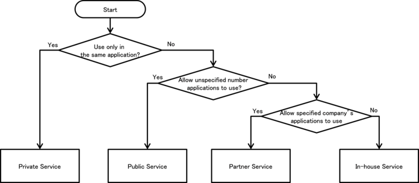
```eval_rst
.. {width="7.26875in" height="3.186301399825022in"}
```

Figure 4.4‑1

There are several implementation methods for Service, and you will
select the method which matches with the type of Service that you
suppose to create. The items of vertical columns in the table show the
implementation methods, and these are divided into 5 types. \"OK\"
stands for the possible combination and others show
impossible/difficult combinations in the table.

Please refer to \"4.4.3.2 How to Implement Service\" and Sample code
of each Service type (with \* mark in a table) for detailed
implementation methods of Service.

Table 4.4‑2

```eval_rst
=================== ========== ========== ========== ===========
Category            | Private  | Public   | Partner  | In-house
                    | Service  | Service  | Service  | Service
=================== ========== ========== ========== ===========
startService type   | **OK\*** | OK       | \-       | OK
IntentService type  | OK       | **OK\*** | \-       | OK
local bind type     | OK       | \-       | \-       | \-
Messenger bind type | OK       | OK       | \-       | **OK\***
AIDL bind type      | OK       | OK       | **OK\*** | OK
=================== ========== ========== ========== ===========
```

Sample code for each security type of Service are shown as below, by
using combination of \* mark in Table 4.4‑2.

#### Creating/Using Private Services

Private Services are Services which cannot be launched by the other
applications and therefore it is the safest Service.

When using Private Services that are only used within the application,
as long as you use explicit Intents to the class then you do not have
to worry about accidently sending it to any other application.

Sample code of how to use the startService type Service is shown below.

Points (Creating a Service):

1.  Explicitly set the exported attribute to false.
2.  Handle the received intent carefully and securely, even though the
    intent was sent from the same application.
3.  Sensitive information can be sent since the requesting application
    is in the same application.

AndroidManifest.xml
```eval_rst
.. literalinclude:: CodeSamples/Service PrivateService.app.src.main.AndroidManifest.xml
   :language: xml
   :encoding: shift-jis
```

PrivateStartService.java
```eval_rst
.. literalinclude:: CodeSamples/Service PrivateService.PrivateStartService.java
   :language: java
   :encoding: shift-jis
```

> Next is sample code for Activity which uses Private Service.
>
> Points (Using a Service):

4. Use the explicit intent with class specified to call a service in
   the same application.

5. Sensitive information can be sent since the destination service is
   in the same application.

6. Handle the received result data carefully and securely, even though
   the data came from a service in the same application.

PrivateUserActivity.java
```eval_rst
.. literalinclude:: CodeSamples/Service PrivateService.PrivateUserActivity.java
   :language: java
   :encoding: shift-jis
```

#### Creating/Using Public Services

Public Service is the Service which is supposed to be used by the
unspecified large number of applications. It\'s necessary to pay
attention that it may receive the information (Intent etc.) which was
sent by Malware. In case using public Service, It\'s necessary to pay
attention that information(Intent etc.) to send may be received by Malware.

Sample code of how to use the startService type Service is shown below.

Points (Creating a Service):

1.  Explicitly set the exported attribute to true.
2.  Handle the received intent carefully and securely.
3.  When returning a result, do not include sensitive information.

AndroidManifest.xml
```eval_rst
.. literalinclude:: CodeSamples/Service PublicService.app.src.main.AndroidManifest.xml
   :language: xml
   :encoding: shift-jis
```

PublicIntentService.java
```eval_rst
.. literalinclude:: CodeSamples/Service PublicService.PublicIntentService.java
   :language: java
   :encoding: shift-jis
```

Next is sample code for Activity which uses Public Service.

Points (Using a Service):

4. Do not send sensitive information.
5. When receiving a result, handle the result data carefully and securely.

AndroidManifest.xml
```eval_rst
.. literalinclude:: CodeSamples/Service PublicServiceUser.app.src.main.AndroidManifest.xml
   :language: xml
   :encoding: shift-jis
```

PublicUserActivity.java
```eval_rst
.. literalinclude:: CodeSamples/Service PublicServiceUser.PublicUserActivity.java
   :language: java
   :encoding: shift-jis
```

#### Creating/Using Partner Services

Partner Service is Service which can be used only by the particular
applications. System consists of partner company\'s application and In
house application, this is used to protect the information and
features which are handled between a partner application and In house application.

Following is an example of AIDL bind type Service.

Points (Creating a Service):

1.  Do not define the intent filter and explicitly set the exported
    attribute to true.
2.  Verify that the certificate of the requesting application has been
    registered in the own white list.
3.  Do not (Cannot) recognize whether the requesting application is
    partner or not by onBind (onStartCommand, onHandleIntent).
4.  Handle the received intent carefully and securely, even though the
    intent was sent from a partner application.
5.  Return only information that is granted to be disclosed to a partner application.

In addition, refer to \"5.2.1.3 How to Verify the Hash Value of an
Application\'s Certificate\" for how to verify the certification hash
value of destination application which is specified to white list.

AndroidManifest.xml
```eval_rst
.. literalinclude:: CodeSamples/Service PartnerServiceAIDL.servicePartnerServiceAIDL.src.main.AndroidManifest.xml
   :language: xml
   :encoding: shift-jis
```

In this example, 2 AIDL files are to be created. One is for callback
interface to give data from Service to Activity. The other one is
Interface to give data from Activity to Service and to get
information. In addition, package name that is described in AIDL file
should be consistent with directory hierarchy in which AIDL file is
created, same like package name described in java file.

IPartnerAIDLServiceCallback.aidl
```java
package org.jssec.android.service.partnerservice.aidl;

interface IPartnerAIDLServiceCallback {
    /**
     * It's called when the value is changed.
     */
    void valueChanged(String info);
}
```

IPartnerAIDLService.aidl
```java
package org.jssec.android.service.partnerservice.aidl;

import org.jssec.android.service.partnerservice.aidl.IExclusiveAIDLServiceCallback;

interface IPartnerAIDLService {

    /**
     * Register Callback
     */
    void registerCallback(IPartnerAIDLServiceCallback cb);

    /**
     * Get Information
     */
    String getInfo(String param);

    /**
     * Unregister Callback
     */
    void unregisterCallback(IPartnerAIDLServiceCallback cb);
}
```

PartnerAIDLService.java
```eval_rst
.. literalinclude:: CodeSamples/Service PartnerServiceAIDL.PartnerAIDLService.java
   :language: java
   :encoding: shift-jis
```

PkgCertWhitelists.java
```eval_rst
.. literalinclude:: CodeSamples/JSSEC Shared.PkgCertWhitelists.java
   :language: java
   :encoding: shift-jis
```

PkgCert.java
```eval_rst
.. literalinclude:: CodeSamples/JSSEC Shared.PkgCert.java
   :language: java
   :encoding: shift-jis
```

Next is sample code of Activity which uses partner only Service.

Points (Using a Service):

6. Verify if the certificate of the target application has been
   registered in the own white list.
7. Return only information that is granted to be disclosed to a partner
   application.
8. Use the explicit intent to call a partner service.
9. Handle the received result data carefully and securely, even though
   the data came from a partner application.

PartnerAIDLUserActivity.java
```eval_rst
.. literalinclude:: CodeSamples/Service PartnerServiceAIDLUser.PartnerAIDLUserActivity.java
   :language: java
   :encoding: shift-jis
```

PkgCertWhitelists.java
```eval_rst
.. literalinclude:: CodeSamples/JSSEC Shared.PkgCertWhitelists.java
   :language: java
   :encoding: shift-jis
```

PkgCert.java
```eval_rst
.. literalinclude:: CodeSamples/JSSEC Shared.PkgCert.java
   :language: java
   :encoding: shift-jis
```

#### Creating/Using In-house Services

In-house Services are the Services which are prohibited to be used by
applications other than in-house applications. They are used in
applications developed internally that want to securely share
information and functionality.

Following is an example which uses Messenger bind type Service.

Points (Creating a Service):

1.  Define an in-house signature permission.
2.  Require the in-house signature permission.
3.  Do not define the intent filter and explicitly set the exported
    attribute to true.
4.  Verify that the in-house signature permission is defined by an
    in-house application.
5.  Handle the received intent carefully and securely, even though the
    intent was sent from an in-house application.
6.  Sensitive information can be returned since the requesting
    application is in-house.
7.  When exporting an APK, sign the APK with the same developer key as
    the requesting application.

AndroidManifest.xml
```eval_rst
.. literalinclude:: CodeSamples/Service InhouseServiceMessenger.serviceInhouseServiceMessenger.src.main.AndroidManifest.xml
   :language: xml
   :encoding: shift-jis
```

InhouseMessengerService.java
```eval_rst
.. literalinclude:: CodeSamples/Service InhouseServiceMessenger.InhouseMessengerService.java
   :language: java
   :encoding: shift-jis
```

SigPerm.java
```eval_rst
.. literalinclude:: CodeSamples/JSSEC Shared.SigPerm.java
   :language: java
   :encoding: shift-jis
```

PkgCert.java
```eval_rst
.. literalinclude:: CodeSamples/JSSEC Shared.PkgCert.java
   :language: java
   :encoding: shift-jis
```

\*\*\* Point 7 \*\*\* When exporting an APK, sign the APK with the
same developer key as the requesting application.


```eval_rst
.. {width="4.647222222222222in"
.. height="3.2743055555555554in"}
```

Figure 4.4‑2

Next is the sample code of Activity which uses in house only Service.

Points (Using a Service):

8. Declare to use the in-house signature permission.
9. Verify that the in-house signature permission is defined by an
   in-house application.
10. Verify that the destination application is signed with the in-house certificate.
11. Sensitive information can be sent since the destination application is in-house.
12. Use the explicit intent to call an in-house service.
13. Handle the received result data carefully and securely, even though
    the data came from an in-house application.
14. When exporting an APK, sign the APK with the same developer key as
    the destination application.

AndroidManifest.xml
```eval_rst
.. literalinclude:: CodeSamples/Service InhouseServiceMessengerUser.serviceInhouseServiceMessengerUser.src.main.AndroidManifest.xml
   :language: xml
   :encoding: shift-jis
```

InhouseMessengerUserActivity.java
```eval_rst
.. literalinclude:: CodeSamples/Service InhouseServiceMessengerUser.InhouseMessengerUserActivity.java
   :language: java
   :encoding: shift-jis
```

SigPerm.java
```eval_rst
.. literalinclude:: CodeSamples/JSSEC Shared.SigPerm.java
   :language: java
   :encoding: shift-jis
```

PkgCert.java
```eval_rst
.. literalinclude:: CodeSamples/JSSEC Shared.PkgCert.java
   :language: java
   :encoding: shift-jis
```

\*\*\* Point14 \*\*\* When exporting an APK, sign the APK with the
same developer key as the destination application.


```eval_rst
.. {width="4.647222222222222in"
.. height="3.2743055555555554in"}
```

Figure 4.4‑3

### Rule Book<!-- b4210f43 -->

Implementing or using service, follow the rules below.

1.  Service that Is Used Only in an application, Must Be Set as Private (Required)
2.  Handle the Received Data Carefully and Securely (Required)
3.  Use the In-house Defined Signature Permission after Verifying If
    it\'s Defined by an In-house Application (Required)
4.  Do Not Determine Whether the Service Provides its Functions, in onCreate (Required)
5.  When Returning a Result Information, Pay Attention the Result
    Information Leakage from the Destination Application (Required)
6.  Use the Explicit Intent if the Destination Service Is fixed (Required)
7.  Verify the Destination Service If Linking with the Other Company\'s Application (Required)
8.  When Providing an Asset Secondarily, the Asset should be protected
    with the Same Level Protection (Required)
9.  Sensitive Information Should Not Be Sent As Much As Possible (Recommended)

#### Service that Is Used Only in an application, Must Be Set as Private (Required)

Service that is used only in an application (or in same UID) must be
set as Private. It avoids the application from receiving Intents from
other applications unexpectedly and eventually prevents from damages
such as application functions are used or application behavior becomes abnormal.

All you have to do in implementation is set exported attribute false
when defining Service in AndroidManifest.xml.

AndroidManifest.xml
```xml
        <!-- Private Service derived from Service class -->
        <!-- *** POINT 1 *** Set false for the exported attribute explicitly. -->
        <service android:name=".PrivateStartService" android:exported="false"/>
```

In addition, this is a rare case, but do not set Intent Filter when
service is used only within the application. The reason is that, due
to the characteristics of Intent Filter, public service in other
application may be called unexpectedly though you intend to call
Private Service within the application.

AndroidManifest.xml(Not recommended)
```xml
        <!-- Private Service derived from Service class -->
        <!-- *** POINT 1 *** Set false for the exported attribute explicitly. -->
        <service android:name=".PrivateStartService" android:exported="false">
            <intent-filter>
                <action android:name=”org.jssec.android.service.OPEN />
            </intent-filter>
        </service>
```

See \"4.4.3.1 Combination of Exported Attribute and Intent-filter
Setting (In the Case of Service).\"

#### Handle the Received Data Carefully and Securely (Required)

Same like Activity, In case of Service, when processing a received
Intent data, the first thing you should do is input validation. Also
in Service user side, it\'s necessary to verify the safety of result
information from Service. Please refer to \"4.1.2.5 Handling the
Received Intent Carefully and Securely (Required)\" and \"4.1.2.9
Handle the Returned Data from a Requested Activity Carefully and
Securely (Required).\"

In Service, you should also implement calling method and exchanging
data by Message carefully.

Please refer to \"3.2 Handling Input Data Carefully and Securely\"

#### Use the In-house Defined Signature Permission after Verifying If it\'s Defined by an In-house Application (Required) <!-- f8ccf894 -->

Make sure to protect your in-house Services by defining in-house
signature permission when creating the Service. Since defining a
permission in the AndroidManifest.xml file or declaring a permission
request does not provide adequate security, please be sure to refer to
\"5.2.1.2 How to Communicate Between In-house Applications with
In-house-defined Signature Permission.\"

#### Do Not Determine Whether the Service Provides its Functions, in onCreate (Required)

Security checks such as Intent parameter verification or
in-house-defined Signature Permission verification should not be
included in onCreate, because when receiving new request during
Service is running, process of onCreate is not executed. So, when
implementing Service which is started by startService, judgment should
be executed by onStartCommand (In case of using IntentService,
judgment should be executed by onHandleIntent.) It\'s also same in the
case when implementing Service which is started by bindService,
judgment should be executed by onBind.

#### When Returning a Result Information, Pay Attention the Result Information Leakage from the Destination Application (Required) <!-- ee466beb -->

Depends on types of Service, the reliability of result information
destination application (callback receiver side/ Message destination)
are different. Need to consider seriously about the information
leakage considering the possibility that the destination may be Malware.

See, Activity \"4.1.2.7 When Returning a Result, Pay Attention to the
Possibility of Information Leakage of that Result from the Destination
Application (Required)\", for details.

#### Use the Explicit Intent if the Destination Service Is fixed (Required)

When using a Service by implicit Intents, in case the definition of
Intent Filter is same, Intent is sent to the Service which was
installed earlier. If Malware with the same Intent Filter defined
intentionally was installed earlier, Intent is sent to Malware and
information leakage occurs. On the other hand, when using a Service by
explicit Intents, only the intended Service will receive the Intent so
this is much safer.

There are some other points which should be considered, please refer
to \"4.1.2.8 Use the explicit Intents if the destination Activity is
predetermined. (Required).\"

#### Verify the Destination Service If Linking with the Other Company\'s Application (Required)

Be sure to sure a whitelist when linking with another company\'s
application. You can do this by saving a copy of the company\'s
certificate hash inside your application and checking it with the
certificate hash of the destination application. This will prevent a
malicious application from being able to spoof Intents. Please refer
to sample code section \"4.4.1.3 Creating/Using Partner Service\" for
the concrete implementation method.

#### When Providing an Asset Secondarily, the Asset should be protected with the Same Level Protection (Required)

When an information or function asset, which is protected by
permission, is provided to another application secondhand, you need to
make sure that it has the same required permissions needed to access
the asset. In the Android OS permission security model, only an
application that has been granted proper permissions can directly
access a protected asset. However, there is a loophole because an
application with permissions to an asset can act as a proxy and allow
access to an unprivileged application. Substantially this is the same
as re-delegating permission so it is referred to as the \"Permission
Re-delegation\" problem. Please refer to \"5.2.3.4 Permission
Re-delegation Problem.\"

#### Sensitive Information Should Not Be Sent As Much As Possible (Recommended) <!-- 900385e7 -->

You should not send sensitive information to untrusted parties.

You need to consider the risk of information leakage when exchanging
sensitive information with a Service. You must assume that all data in
Intents sent to a Public Service can be obtained by a malicious third
party. In addition, there is a variety of risks of information leakage
when sending Intents to Partner or In-house Services as well depending
on the implementation.

Not sending sensitive data in the first place is the only perfect
solution to prevent information leakage therefore you should limit the
amount of sensitive information being sent as much as possible. When
it is necessary to send sensitive information, the best practice is to
only send to a trusted Service and to make sure the information cannot
be leaked through LogCat.

### Advanced Topics<!-- 78f16a9a -->

#### Combination of Exported Attribute and Intent-filter Setting (In the Case of Service)

We have explained how to implement the four types of Services in this
guidebook: Private Services, Public Services, Partner Services, and
In-house Services. The various combinations of permitted settings for
each type of exported attribute defined in the AndroidManifest.xml
file and the intent-filter elements are defined in the table below.
Please verify the compatibility of the exported attribute and
intent-filter element with the Service you are trying to create.

Table 4.4‑3

```eval_rst
+---------------------------+------------------------------------------------------------+
|                           | Value of exported attribute                                |
+                           +-----------------------------+--------------+---------------+
|                           | true                        | false        | Not specified |
+===========================+=============================+==============+===============+
| Intent Filter defined     | Public                      | (Do not Use) | (Do not Use)  |
+---------------------------+-----------------------------+--------------+---------------+
| Intent Filter Not Defined | Public, Partner, In-house   | Private      | (Do not Use)  |
+---------------------------+-----------------------------+--------------+---------------+

If the exported attribute is not unspecified in a Service, the
question of whether or not the Service is public is determined by
whether or not intent filters are defined; [12]_ however, in this
guidebook it is forbidden to set a Service's exported attribute to
unspecified. In general, as mentioned previously, it is best to avoid
implementations that rely on the default behavior of any given API;
moreover, in cases where explicit methods exist for configuring
important security-related settings such as the exported attribute, it
is always a good idea to make use of those methods.


.. [12] If any intent filters are defined then the Service is public;
    otherwise it is private. For more information, see
    https://developer.android.com/guide/topics/manifest/service-element.html#exported.
```

The reason why an undefined intent filter and an exported attribute of
false should not be used is that there is a loophole in Android\'s
behavior, and because of how Intent filters work, other application\'s
Services can be called unexpectedly.

Concretely, Android behaves as per below, so it\'s necessary to
consider carefully when application designing.

-   When multiple Services define the same content of intent-filter, the
    definition of Service within application installed earlier is prioritized.

-   In case explicit Intent is used, prioritized Service is
    automatically selected and called by OS.

The system that unexpected call is occurred due to Android\'s behavior
is described in the three figures below. Figure 4.4‑4 is an example of
normal behavior that Private Service (application A) can be called by
implicit Intent only from the same application. Because only
application A defines Intent-filter (action=\"X\" in the Figure), it
behaves normally. This is the normal behavior.

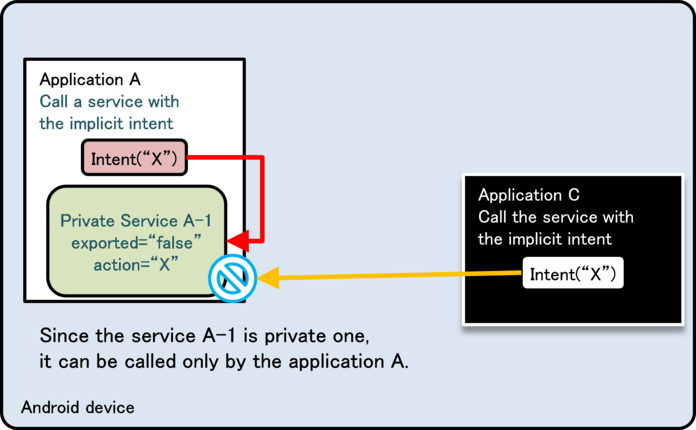
```eval_rst
.. {width="4.739583333333333in" height="2.9375in"}
```

Figure 4.4‑4

Figure 4.4‑5 and Figure 4.4‑6 below show a scenario in which the same
Intent filter (action=\"X\") is defined in Application B as well as Application A.

Figure 4.4‑5 shows the scenario that applications are installed in the
order, application A -\> application B. In this case, when application
C sends implicit Intent, calling Private Service (A-1) fails. On the
other hand, since application A can successfully call Private Service
within the application by implicit Intent as expected, there won\'t be
any problems in terms of security (counter-measure for Malware).

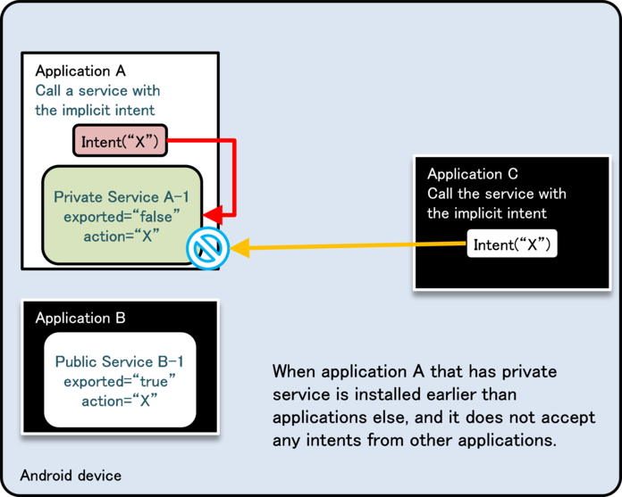
```eval_rst
.. {width="4.739583333333333in"
.. height="3.8020833333333335in"}
```

Figure 4.4‑5

Figure 4.4‑6 shows the scenario that applications are installed in the
order, applicationB -\> applicationA. There is a problem here, in terms
of security. It shows an example that applicationA tries to call
Private Service within the application by sending implicit Intent, but
actually Public Activity (B-1) in application B which was installed
earlier, is called. Due to this loophole, it is possible that
sensitive information can be sent from applicationA to applicationB.
If applicationB is Malware, it will lead the leakage of sensitive information.

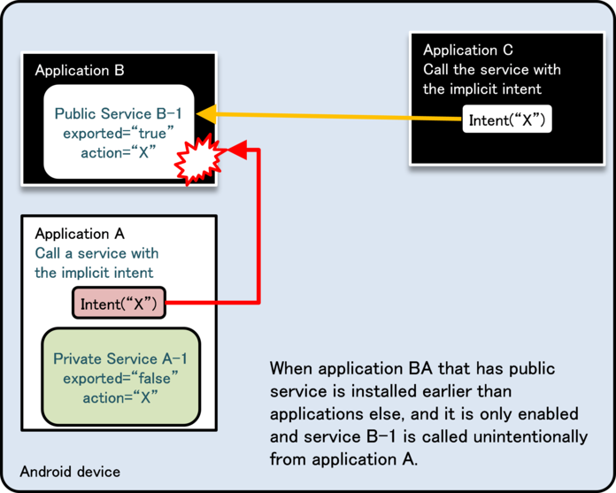
```eval_rst
.. {width="4.739583333333333in"
.. height="3.8020833333333335in"}
```

Figure 4.4‑6

As shown above, using Intent filters to send implicit Intents to
Private Service may result in unexpected behavior so it is best to
avoid this setting.

#### How to Implement Service 

Because methods for Service implementation are various and should be
selected with consideration of security type which is categorized by
sample code, each characteristics are briefly explained. It\'s divided
roughly into the case using startService and the case using
bindService. And it\'s also possible to create Service which can be
used in both startService and bindService. Following items should be
investigated to determine the implementation method of Service.

-   Whether to disclose Service to other applications or not (Disclosure of Service)
-   Whether to exchange data during running or not (Mutual sending/receiving data)
-   Whether to control Service or not (Launch or complete)
-   Whether to execute as another process (communication between processes)
-   Whether to execute multiple processes in parallel (Parallel process)

Table 4.4‑3 shows category of implementation methods and feasibility of each item.

\"NG\" stands for impossible case or case that another frame work
which is different from the provided function is required.

Table 4.4‑4 Category of implementation methods for Service

```eval_rst
=================== ============ ================= ================= =================== ==========
Category            | Disclosure | Mutual sending  | Control Service | Communication     | Parallel
                    | of Service | /receiving data | (Boot/Exit)     | between processes | process
=================== ============ ================= ================= =================== ==========
startService type   | OK         | NG              | OK              | OK                | NG
IntentService type  | OK         | NG              | NG              | OK                | NG
local bind type     | NG         | OK              | OK              | NG                | NG
Messenger bind type | OK         | OK              | OK              | OK                | NG
AIDL bind type      | OK         | OK              | OK              | OK                | OK
=================== ============ ================= ================= =================== ==========
```

##### startService type

This is the most basic Service. This inherits Service class, and
executes processes by onStartCommand.

In user side, specify Service by Intent, and call by startService.
Because data such as results cannot be returned to source of Intent
directly, it should be achieved in combination with another method
such as Broadcast. Please refer to \"4.4.1.1 Creating/Using Private
Service\" for the concrete example.

Checking in terms of security should be done by onStartCommand, but it
cannot be used for partner only Service since the package name of the
source cannot be obtained.

##### IntentService type

IntentService is the class which was created by inheriting Service.
Calling method is same as startService type. Following are
characteristics compared with standard service (startService type.)

-   Processing Intent is done by onHandleIntent (onStartCommand is not
    used.)
-   It\'s executed by another thread.
-   Process is to be queued.

Call is immediately returned because process is executed by another
thread, and process towards Intents is sequentially executed by
Queuing system. Each Intent is not processed in parallel, but it is
also selectable depending on the product\'s requirement, as an option
to simplify implementation. Since data such as results cannot be
returned to source of Intent, it should be achieved in combination
with another method such as Broadcast. Please refer to "4.4.1.2
Creating/Using Public Service\" for the concrete example of implementation.

Checking in terms of security should be done by onHandleIntent, but it
cannot be used for partner only Service since the package name of the
source cannot be obtained.

##### local bind type

This is a method to implement local Service which works only within
the process same as an application. Define the class which was derived
from Binder class, and prepare to provide the feature (method) which
was implemented in Service to caller side.

From user side, specify Service by Intent and call Service by using
bindService. This is the most simple implementation method among all
methods of binding Service, but it has limited usages since it cannot
be launched by another process and also Service cannot be disclosed.
See project \"Service PrivateServiceLocalBind\" which is included in
Sample code, for the concrete implementation example.

From the security point of view, only private Service can be implemented.

##### Messenger bind type

This is the method to achieve the linking with Service by using Messenger system.

Since Messenger can be given as a Message destination from Service
user side, the mutual data exchanging can be achieved comparatively
easily. In addition, since processes are to be queued, it has a
characteristic that behaves \"thread-safely". Parallel process for
each process is not possible, but it is also selectable as an option
to simplify the implementation depending on the product\'s
requirement. Regarding user side, specify Service by Intent, and call
Service by using bindService. See \"4.4.1.4 Creating/Using In-house
Service\" for the concrete implementation example.

Security check in onBind or by Message Handler is necessary, however,
it cannot be used for partner only Service since package name of
source cannot be obtained.

##### AIDL bind type

This is a method to achieve linking with Service by using AIDL system.
Define interface by AIDL, and provide features that Service has as a
method. In addition, call back can be also achieved by implementing
interface defined by AIDL in user side, Multi-thread calling is
possible, but it\'s necessary to implement explicitly in Service side
for exclusive process.

User side can call Service, by specifying Intent and using
bindService. Please refer to \"4.4.1.3 Creating/Using Partner
Service\" for the concrete implementation example.

Security must be checked in onBind for In-house only Service and by
each method of interface defined by AIDL for partner only Service.

This can be used for all security types of Service which are described
in this Guidebook.

Using SQLite
------------

Herein after, some cautions in terms of security when
creating/operating database by using SQLite. Main points are
appropriate setting of access right to database file, and
counter-measures for SQL injection. Database which permits
reading/writing database file from outside directly (sharing among
multiple applications) is not supposed here, but suppose the usage in
backend of Content Provider and in an application itself. In addition,
it is recommended to adopt counter-measures mentioned below in case of
handling not so much sensitive information, though handling a certain
level of sensitive information is supposed here.

### Sample Code<!-- b48a65ad -->

#### Creating/Operating Database

```eval_rst
When handling database in Android application, appropriate
arrangements of database files and access right setting (Setting for
denying other application\'s access) can be achieved by using
SQLiteOpenHelper [13]_. Here is an example of easy application that
creates database when it\'s launched, and executes
searching/adding/changing/deleting data through UI. Sample code is what
counter-measure for SQL injection is done, to avoid from incorrect SQL
being executed against the input from outside.

.. [13] As regarding file storing, the absolute file path can be
    specified as the 2nd parameter (name) of SQLiteOpenHelper
    constructor. Therefore, need attention that the stored files can be
    read and written by the other applications if the SD Card path is specified.
```

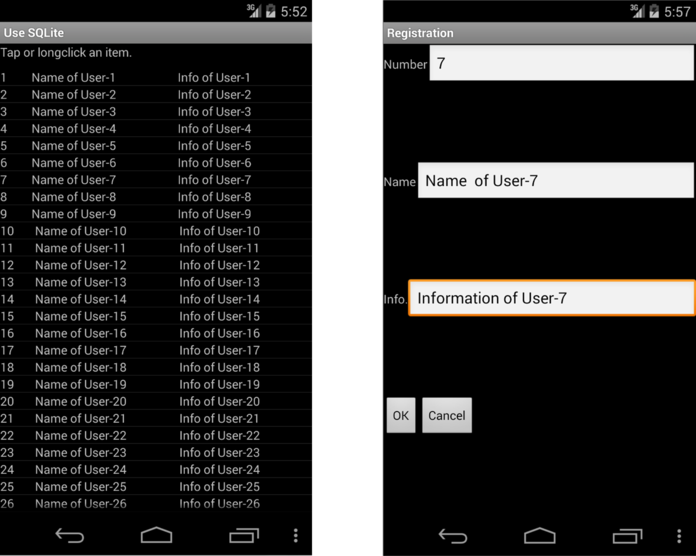
```eval_rst
.. {width="5.541666666666667in"
.. height="4.395833333333333in"}
```

Figure 4.5‑1

Points:

1.  SQLiteOpenHelper should be used for database creation.
2.  Use place holder.
3.  Validate the input value according the application requirements.

SampleDbOpenHelper.java
```eval_rst
.. literalinclude:: CodeSamples/SQLite Database.SampleDbOpenHelper.java
   :language: java
   :encoding: shift-jis
```

DataSearchTask.java (SQLite Database project)
```eval_rst
.. literalinclude:: CodeSamples/SQLite Database.DataSearchTask.java
   :language: java
   :encoding: shift-jis
```

DataValidator.java
```eval_rst
.. literalinclude:: CodeSamples/SQLite Database.DataValidator.java
   :language: java
   :encoding: shift-jis
```

### Rule Book<!-- 48e87243 -->

Using SQLite, follow the rules below accordingly.

1.  Set DB File Location and Access Right Correctly (Required)
2.  Use Content Provider for Access Control When Sharing DB Data with
    Other Application (Required)
3.  Place Holder Must Be Used in the Case Handling Variable Parameter
    during DB Operation (Required)

#### Set DB File Location and Access Right Correctly (Required)

Considering the protection of DB file data, DB file location and
access right setting is the very important elements that need to be
considered together.

For example, even if file access right is set correctly, a DB file can
be accessed from anybody in case that it is arranged in a location
which access right cannot be set, e.g. SD card. And in case that it\'s
arranged in application directory, if the access right is not
correctly set, it will eventually allow the unexpected access.
Following are some points to be met regarding the correct allocation
and access right setting, and the methods to realize them.

About location and access right setting, considering in terms of
protecting DB file (data), it\'s necessary to execute 2 points as per below.

```eval_rst
1. Location

Locate in file path that can be obtained by
Context#getDatabasePath(String name), or in some cases, directory
that can be obtained by Context#getFilesDir [14]_.

2. Access right

Set to MODE_PRIVATE ( = it can be accessed only by the application
which creates file) mode.

.. [14] Both methods provide the path under (package) directory which is
    able to be read and written only by the specified application.
```

By executing following 2 points, DB file which cannot be accessed by
other applications can be created. Here are some methods to execute them.

1\. Use SQLiteOpenHelper

2\. Use Context\#openOrCreateDatabase

When creating DB file, SQLiteDatabase\#openOrCreateDatabase can be
used. However, when using this method, DB files which can be read out
from other applications are created, in some Android smartphone
devices. So it is recommended to avoid this method, and using other
methods. Each characteristics for the above 2 methods are as per below.

##### Using SQLiteOpenHelper

```eval_rst
When using SQLiteOpenHelper, developers don't need to be worried
about many things. Create a class derived from SQLiteOpenHelper, and
specify DB name (which is used for file name) [15]_ to constructer's
parameter, then DB file which meets above security requirements, are
to be created automatically.

Refer to specific usage method for "4.5.1.1 Creating/Operating Database" for how to use.

.. [15] (Undocumented in Android reference) Since the full file path can
    be specified as the database name in SQLiteOpenHelper
    implementation, need attention that specifying the place (path)
    which does not have access control feature (e.g. SD cards) unintentionally.
```

##### Using Context\#openOrCreateDatabase

When creating DB by using Context\#openOrCreateDatabase method, file
access right should be specified by option, in this case specify
MODE\_PRIVATE explicitly.

Regarding file arrangement, specifying DB name (which is to be used to
file name) can be done as same as SQLiteOpenHelper, a file is to be
created automatically, in the file path which meets the above
mentioned security requirements. However, full path can be also
specified, so it\'s necessary to pay attention that when specifying SD
card, even though specifying MODE\_PRIVATE, other applications can
also access.

Example to execute accsee permission setting to DB explicitly: MainActivity.java

```java
public void onCreate(Bundle savedInstanceState) {
        super.onCreate(savedInstanceState);
        setContentView(R.layout.main);

        //Construct database
        try {
            //Create DB by setting MODE_PRIVATE
            db = Context.openOrCreateDatabase("Sample.db", MODE_PRIVATE, null);
        } catch (SQLException e) {
            //In case failed to construct DB, log output
            Log.e(this.getClass().toString(), getString(R.string.DATABASE_OPEN_ERROR_MESSAGE));
            return;
        }
        //Omit other initial process
    }
```

```eval_rst
There are three possible settings for access privileges:
MODE_PRIVATE, MODE_WORLD_READABLE, and MODE_WORLD_WRITEABLE.
These constants can be specified together by "OR" operator. However,
all settings other than MODE_PRIVATE are deprecated in API Level 17
and later versions, and will result in a security exception in API
Level 24 and later versions. Even for apps intended for API Level 15
and earlier, it is generally best not to use these flags. [16]_

- MODE_PRIVATE Only creator application can read and write
- MODE_WORLD_READABLE Creator application can read and write, Others can only read in
- MODE_WORLD_WRITEABLE Creator application can read and write, Others can only write in

.. [16] For more information as to MODE_WORLD_READABLE and
    MODE_WORLD_WRITEABLE and points of caution regarding their use,
    see Section "4.6.3.2 Access Permission Setting for the Directory"
```

#### Use Content Provider for Access Control When Sharing DB Data with Other Application (Required)

The method to share DB data with other application is that create DB
file as WORLD\_READABLE, WORLD\_WRITEABLE, to other applications to
access directly. However, this method cannot limit applications which
access to DB or operations to DB, so data can be read-in or written by
unexpected party (application). As a result, it can be considered that
some problems may occur in confidentiality or consistency of data, or
it may be an attack target of Malware.

As mentioned above, when sharing DB data with other applications in
Android, it\'s strongly recommended to use Content Provider. By using
Content Provider, there are some merits, not only the merits from the
security point of view which is the access control on DB can be
achieved, but also merits from the designing point of view which is DB
scheme structure can be hidden into Content Provider.

#### Place Holder Must Be Used in the Case Handling Variable Parameter during DB Operation. (Required)

In the sense that preventing from SQL injection, when incorporating
the arbitrary input value to SQL statement, placeholder should be
used. There are 2 methods as per below to execute SQL using placeholder.

1.  Get SQLiteStatement by using SQLiteDatabase\#compileStatement(), and
    after that place parameter to placeholder by using
    SQLiteStatement\#bindString() or bindLong() etc.

2.  When calling execSQL(), insert(), update(), delete(), query(),
    rawQuery() and replace() in SQLiteDatabese class, use SQL statement
    which has placeholder.

In addition, when executing SELECT command, by using
SQLiteDatabase\#compileStatement(), there is a limitation that \"only
the top 1 element can be obtained as a result of SELECT command,\" so
usages are limited.

In either method, the data content which is given to placeholder is
better to be checked in advance according the application
requirements. Following is the further explanation for each method.

##### When Using SQLiteDatabase\#compileStatement():

Data is given to placeholder in the following steps.

1.  Get the SQL statement which includes placeholder by using
    SQLiteDatabase\#compileStatement(), as SQLiteStatement.
2.  Set the created as SQLiteStatement objects to placeholder by using
    the method like bindLong() and bindString().
3.  Execute SQL by method like execute() of ExecSQLiteStatement object.

Use case of placeholder: DataInsertTask.java (an extra)

```java
//Adding data task
public class DataInsertTask extends AsyncTask<String, Void, Void> {
    private MainActivity    mActivity;
    private SQLiteDatabase  mSampleDB;

    public DataInsertTask(SQLiteDatabase db, MainActivity activity) {
        mSampleDB = db;
        mActivity = activity;
    }

    @Override
    protected Void doInBackground(String... params) {
        String  idno = params[0];
        String  name = params[1];
        String  info = params[2];

        // *** POINT 3 *** Validate the input value according the application requirements.
        if (!DataValidator.validateData(idno, name, info))
        {
            return null;
        }
        // Adding data task
        // *** POINT 2 *** Use place holder
        String commandString = "INSERT INTO " + CommonData.TABLE_NAME + " (idno, name, info) VALUES (?, ?, ?)";
        SQLiteStatement sqlStmt = mSampleDB.compileStatement(commandString);
        sqlStmt.bindString(1, idno);
        sqlStmt.bindString(2, name);
        sqlStmt.bindString(3, info);
        try {
            sqlStmt.executeInsert();
        } catch (SQLException e) {
            Log.e(DataInsertTask.class.toString(), mActivity.getString(R.string.UPDATING_ERROR_MESSAGE));
        } finally {
            sqlStmt.close();
        }
        return null;
    }
    ... Abbreviation ...
}
```

This is a type that SQL statement to be executed as object is created
in advance, and parameters are allocated to it. The process to execute
is fixed, so there\'s no room for SQL injection to occur. In addition,
there is a merit that process efficiency is enhanced by reutilizing SQLiteStatement object.

##### In the Case Using Method for Each Process which SQLiteDatabase provides:

There are 2 types of DB operation methods that SQLiteDatabase
provides. One is what SQL statement is used, and another is what SQL
statement is not used. Methods that SQL statement is used are
SQLiteDatabase\#execSQL()/rawQuery() and it\'s executed in the following steps.

1.  Prepare SQL statement which includes placeholder.
2.  Create data to allocate to placeholder.
3.  Send SQL statement and data as parameter, and execute a method for process.

On the other hand,
SQLiteDatabase\#insert()/update()/delete()/query()/replace() is the
method that SQL statement is not used. When using them, data should be
sent as per the following steps.

1.  In case there\'s data to insert/update to DB, register to ContentValues.
2.  Send ContentValues as parameter, and execute a method for each
    process (In the following example, SQLiteDatabase\#insert())

Use case of metod for each process (SQLiteDatabase\#insert())

```java
    private SQLiteDatabase  mSampleDB;
    private void addUserData(String idno, String name, String info) {

        // Validity check of the value(Type, range), escape process
        if (!validateInsertData(idno, name, info)) {
            // If failed to pass the validation, log output
            Log.e(this.getClass().toString(), getString(R.string.VALIDATION_ERROR_MESSAGE));
            return;
        }

        // Prepare data to insert
        ContentValues insertValues = new ContentValues();
        insertValues.put("idno", idno);
        insertValues.put("name", name);
        insertValues.put("info", info);

        // Execute Insert
        try {
            mSampleDb.insert("SampleTable", null, insertValues);
        } catch (SQLException e) {
            Log.e(this.getClass().toString(), getString(R.string.DB_INSERT_ERROR_MESSAGE));
            return;
        }
    }
```

In this example, SQL command is not directly written, for instead, a
method for inserting which SQLiteDatabase provides, is used. SQL
command is not directly used, so there\'s no room for SQL injection in this method, too.

### Advanced Topics<!-- 6461be2f -->

#### When Using Wild Card in LIKE Predicate of SQL Statement, Escape Process Should Be Implemented

When using character string which includes wild card (%, \_) of LIKE
predicate, as input value of place holder, it will work as a wild card
unless it is processed properly, so it\'s necessary to implement
escape process in advance according the necessity. It is the case
which escape process is necessary that wild card should be used as a
single character (\"%\" or \"\_\").

The actual escape process is executed by using ESCAPE clause as per
below sample code.

Example of ESCAPE process in case of using LIKE

```java
// Data search task
public class DataSearchTask extends AsyncTask<String, Void, Cursor> {
    private MainActivity        mActivity;
    private SQLiteDatabase      mSampleDB;
    private ProgressDialog      mProgressDialog;

    public DataSearchTask(SQLiteDatabase db, MainActivity activity) {
        mSampleDB = db;
        mActivity = activity;
    }

    @Override
    protected Cursor doInBackground(String... params) {
        String  idno = params[0];
        String  name = params[1];
        String  info = params[2];
        String  cols[]  =   {"_id", "idno","name","info"};

        Cursor cur;

        ... Abbreviation ...

        // Execute like search(partly match) with the condition of info
        // Point: Escape process should be performed on characters which is applied to wild card
        String argString = info.replaceAll("@", "@@"); // Escape @ in info which was received as input
        argString = argString.replaceAll("%", "@%"); // Escape % in info which was received as input
        argString = argString.replaceAll("_", "@_"); // Escape _ in info which was received as input
        String selectionArgs[] = {argString};

        try {
            // Point: Use place holder
            cur = mSampleDB.query("SampleTable", cols, "info LIKE '%' || ? || '%' ESCAPE '@'", 
                                   selectionArgs, null, null, null);
        } catch (SQLException e) {
            Toast.makeText(mActivity, R.string.SERCHING_ERROR_MESSAGE, Toast.LENGTH_LONG).show();
            return null;
        }
        return cur;
    }

    @Override
    protected void onPostExecute(Cursor resultCur) {
        mProgressDialog.dismiss();
        mActivity.updateCursor(resultCur);
    }
}
```

#### Use External Input to SQL Command in which Place Holder Cannot Be Used

When executing SQL statement which process targets are DB objects like
table creation/deletion etc., placeholder cannot be used for the value
of table name. Basically, DB should not be designed using arbitrary
character string which was input from outside in case that placeholder
cannot be used for the value.

When placeholder cannot be used due to the restriction of
specifications or features, whether the Input value is dangerous or
not, should be verified before execution, and it\'s necessary to
implement necessary processes.

Basically,

1.  When using as character string parameter, escape or quote process
    for character should be made.
2.  When using as numeric value parameter, verify that characters other
    than numeric value are not included.
3.  When using as identifier or command, verify whether characters which
    cannot be used are not included, along with 1.

should be executed.

> Reference: [http://www.ipa.go.jp/security/vuln/documents/website\_security\_sql.pdf](http://www.ipa.go.jp/security/vuln/documents/website_security_sql.pdf) (Japanese)

#### Take a Countermeasure that Database Is Not Overwritten Unexpectedly

```eval_rst
In case getting instance of DB by
SQLiteOpenHelper#getReadableDatabase, getWriteableDatabase,
DB is to be opened in readable/WRITEABLE state by using either
method [17]_. In addition, it's same to Context#openOrCreateDatabase,
SQLiteDatabase#openOrCreateDatabase, etc.

.. [17] getReableDatabase() returns the same object which can be got by
    getWritableDatabase. This spec is, in case writable object cannot be
    generated due to disc full etc., it will return Read- only object.
    (getWritableDatabase() will be execution error under the situation
    like disc full etc.)
```

It means that contents of DB may be overwritten unexpectedly by application operation or by
defects in implementation. Basically, it can be supported by the
application's spec and range of implementation, but when implementing
the function which requires only read in function like application's
searching function etc., opening database by read-only, it may lead to
simplify designing or inspection and furthermore, lead to enhance
application quality, so it's recommended depends on the situation.

Specifically, open database by specifying OPEN\_READONLY to SQLiteDatabase\#openDatabase.

Open database by read-only.

```java
    ... Abbreviation ...

    // Open DB(DB should be created in advance)
    SQLiteDatabase db
        = SQLiteDatabase.openDatabase(SQLiteDatabase.getDatabasePath("Sample.db"), null, OPEN_READONLY);
```

> Reference: [http://developer.android.com/reference/android/database/sqlite/SQLiteOpenHelper.html - getReadableDatabase()](http://developer.android.com/reference/android/database/sqlite/SQLiteOpenHelper.html#getReadableDatabase())

#### Verify the Validity of Input/Output Data of DB, According to Application\'s Requirement 

SQLite is the database which is tolerant types, and it can store
character type data into columns which is declared as Integer in DB.
Regarding data in database, all data including numeric value type is
stored in DB as character data of plain text. So searching of
character string type, can be executed to Integer type column. (LIKE
\'%123%\' etc.) In addition, the limitation for the value in SQLite
(validity verification) is untrustful since data which is longer than
limitation can be input in some case, e.g. VARCHAR(100).

So, applications which use SQLite, need to be very careful about this
characteristics of DB, and it is necessary take actions according to
application requirements, not to store unexpected data to DB or not to
get unexpected data. Countermeasures are as per below 2 points.

1.  When storing data in database, verify that type and length are matched.
2.  When getting the value from database, verify whether data is beyond
    the supposed type and length, or not.

Following is an example of the code which verifies that the Input
value is more than 1.

Verify that the Input value is more than 1 (Extract from MainActivity.java)

```java
public class MainActivity extends Activity {

    ... Abbreviation ...

    // Process for adding
    private void addUserData(String idno, String name, String info) {
        // Check for No
        if (!validateNo(idno, CommonData.REQUEST_NEW)) {
            return;
        }

        // Inserting data process
        DataInsertTask task = new DataInsertTask(mSampleDb, this);
        task.execute(idno, name, info);
    }

    ... Abbreviation ...

    private boolean validateNo(String idno, int request) {
        if (idno == null || idno.length() == 0) {
            if (request == CommonData.REQUEST_SEARCH) {
                // When search process, unspecified is considered as OK.
                return true;
            } else {
                // Other than search process, null and blank are error.
                Toast.makeText(this, R.string.IDNO_EMPTY_MESSAGE, Toast.LENGTH_LONG).show();
                return false;
            }
        }

        // Verify that it's numeric character
        try {
            // Value which is more than 1
            if (!idno.matches("[1-9][0-9]*")) {
                // In case of not numeric character, error
                Toast.makeText(this, R.string.IDNO_NOT_NUMERIC_MESSAGE, Toast.LENGTH_LONG).show();
                return false;
            }
        } catch (NullPointerException e) {
            // It never happen in this case
            return false;
        }
        return true;
    }

    ... Abbreviation ...
}
```

#### Consideration - the Data Stored into Database

In SQLite implementation, when storing data to file is as per below.

-   All data including numeric value type are stored into DB file as
    character data of plain text.
-   When executing data deletion to DB, data itself is not deleted form
    DB file. (Only deletion mark is added.)
-   When updating data, data before updating has not been deleted, and
    still remains there in DB file.

So, the information which \"must have\" been deleted may still remain
in DB file. Even in this case, take counter-measures according this
Guidebook, and when Android security function is enabled, data/file
may not be directly accessed by the third party including other
applications. However, considering the case that files are picked out
by passing through Android\'s protection system like root privilege is
taken, in case the data which gives huge influence on business is
stored, data protection which doesn\'t depend on Android protection
system, should be considered.

As above reasons, the important data which is necessary to be
protected even when device\'s root privilege is taken, should not be
stored in DB of SQLite, as it is. In case need to store the important
data, it\'s necessary to implement counter-measures, or encrypt overall DB.

When encryption is necessary, there are so many issues that are beyond
the range of this Guidebook, like handling the key which is used for
encryption or code obfuscation, so as of now it\'s recommended to
consult the specialist when developing an application which handles
data that has huge business impact.

Please refer to \"4.5.3.6 \[Reference\] Encrypt SQLite Database
(SQLCipher for Android)\" library which encrypts database is introduced here.

#### \[Reference\] Encrypt SQLite Database (SQLCipher for Android)

SQLCipher is the SQLite extension that provides encryption of
transparent 256 bit AES for database. It is open sourced (BSD license),
and maintained/managed by Zetetic LLC. In a world of mobile,
SQLCipher is widely used in Nokia/QT, Apple\'s iOS.

SQLCipher for Android project is aiming to support the standard
integrated encryption for SQLite database in Android environment. By
creating the standard SQLite\'s API for SQLCipher, developers can use
the encrypted database with the same coding as per usual.

Reference: [https://guardianproject.info/code/sqlcipher/](https://guardianproject.info/code/sqlcipher/)

##### How to Use

Application developers can use SQLCipher by following 3 steps below.

1.  Locate sqlcipher.jar, libdatabase\_sqlcipher.so,
    libsqlcipher\_android.so and libstlport\_shared.so in application\'s lib directory.
2.  Regarding all source files, change all android.database.sqlite.\*
    which is specified by import, to
    info.guardianproject.database.sqlite.\*. In addition,
    android.database.Cursor can be used as it is.
3.  Initialize database in onCreate(), and set password when opening database.

Easy code example

```java
SQLiteDatabase.loadLibs(this);                   // First, Initialize library by using context.
SQLiteOpenHelper.getWritableDatabase(password);  // Parameter is password(Suppose that it's string type and it's got in a secure way.)
```

SQLCipher for Android was version 1.1.0 at the time of writing, and
now version 2.0.0 is under developing, and RC4 is disclosed now. In
terms of the past usage in Android and stability of API, it\'s
necessary to be verified later, but currently still there\'s a room to
consider as encryption solution of SQLite, which can be used in Android.

##### Library Structure

The following files which are included as SDK, are necessary, to use SQLCipher.

-   assets/icudt46l.zip 2,252KB<br/>
    It\'s necessary when icudt46l.dat doesn\'t exist below /system/usr/icu/ and its earlier version.<br/>
    When icudt46l.dat cannot be found, this zip is unzipped and to be used.
-   libs/armeabi/libdatabase\_sqlcipher.so 44KB
-   libs/armeabi/libsqlcipher\_android.so 1,117KB
-   libs/armeabi/libstlport\_shared.so 555KB<br/>
    Native Library.<br/>
    It\'s read out when SQLCipher\'s initial load(When calling SQLiteDatabase\#loadLibs()).
-   libs/commons-codec.jar 46KB
-   libs/guava-r09.jar 1,116KB
-   libs/sqlcipher.jar 102KB<br/>
    Java library which calls Native library.<br/>
    sqlcipher.jar is main. Others are referred from sqlcipher.jar.

Total: about 5.12MB

However, when icudt46l.zip is unzipped, it amounts to around 7MB.

Handling Files
--------------

According to Android security designing idea, files are used only for
making information persistence and temporary save (cache), and it
should be private in principle. Exchanging information between
applications should not be direct access to files, but it should be
exchanged by inter-application linkage system, like Content Provider
or Service. By using this, inter-application access control can be achieved.

Since enough access control cannot be performed on external memory
device like SD card etc., so it should be limited to use only when
it\'s necessary by all means in terms of function, like when handling
huge size files or transferring information to another location (PC
etc.). Basically, files that include sensitive information should not
be saved in external memory device. In case sensitive information
needs to be saved in a file of external device at any rate,
counter-measures like encryption are necessary, but it\'s not referred here.

### Sample Code<!-- 267a2965 -->

As mentioned above, files should be private in principle. However,
sometimes files should be read out/written by other applications
directly for some reasons. File types which are categorized from the
security point of view and comparison are shown in Table 4.6‑1. These
are categorized into 4 types of files based on the file storage
location or access permission to other application. Sample code for
each file category is shown below and explanation for each of them are also added there.

Table 4.6‑1 File category and comparison from security point of view

```eval_rst
+----------------+-----------------------+-------------------+-----------------------------------------------------+
|| Feil category || Access permission    || Storage location || Overview                                           |
||               || to other application ||                  ||                                                    |
+================+=======================+===================+=====================================================+
|| Private file  || NA                   || In application   || - Can read and write only in an application.       |
|                |                       || directory        || - Sensitive information can be handled.            |
|                |                       |                   || - File should be this type in principle.           |
+----------------+-----------------------+-------------------+-----------------------------------------------------+
|| Read out      || Read out             || In application   || - Other applications and users can read.           |
|| public file   |                       || directory        || - Information that can be disclosed to outside of  |
|                |                       |                   || application is handled.                            |
+----------------+-----------------------+-------------------+-----------------------------------------------------+
|| Read write    || Read out             || In application   || - Other applications and users can read and write. |
|| public file   || Write in             || directory        || - It should not be used from both security         |
|                |                       |                   || and application designing points of view.          |
+----------------+-----------------------+-------------------+-----------------------------------------------------+
|| External      || Read out             || External memory  || - No access control.                               |
|| memory device || Write in             || device like      || - Other applications and users can always          |
|| (Read write   |                       || SD card          || read/write/delete files.                           |
|| public)       |                       |                   || - Usage should be minimum requirement.             |
|                |                       |                   || - Comparatively huge size of files can be handled. |
+----------------+-----------------------+-------------------+-----------------------------------------------------+
```

#### Using Private Files

This is the case to use files that can be read/written only in the
same application, and it is a very safe way to use files. In
principle, whether the information stored in the file is public or
not, keep files private as much as possible, and when exchanging the
necessary information with other applications, it should be done using
another Android system (Content Provider, Service.)

Points:

1.  Files must be created in application directory.
2.  The access privilege of file must be set private mode in order not
    to be used by other applications.
3.  Sensitive information can be stored.
4.  Regarding the information to be stored in files, handle file data
    carefully and securely.

PrivateFileActivity.java
```eval_rst
.. literalinclude:: CodeSamples/File PrivateFile.PrivateFileActivity.java
   :language: java
   :encoding: shift-jis
```

PrivateUserActivity.java
```eval_rst
.. literalinclude:: CodeSamples/File PrivateFile.PrivateUserActivity.java
   :language: java
   :encoding: shift-jis
```

#### Using Public Read Only Files

This is the case to use files to disclose the contents to unspecified
large number of applications. If you implement by following the below
points, it\'s also comparatively safe file usage method. Note that
using the MODE\_WORLD\_READABLE variable to create a public file is
deprecated in API Level 17 and later versions, and will trigger a
security exception in API Level 24 and later versions; thus
file-sharing methods using Content Provider are preferable.

Points:

1.  Files must be created in application directory.
2.  The access privilege of file must be set to read only to other applications.
3.  Sensitive information must not be stored.
4.  Regarding the information to be stored in files, handle file data
    carefully and securely.

PublicFileActivity.java
```eval_rst
.. literalinclude:: CodeSamples/File PublicROFile.PublicFileActivity.java
   :language: java
   :encoding: shift-jis
```

PublicUserActivity.java
```eval_rst
.. literalinclude:: CodeSamples/File PublicROUser.PublicUserActivity.java
   :language: java
   :encoding: shift-jis
```

#### Using Public Read/Write Files

This is the usage of the file which permits read-write access to
unspecified large number of application.

Unspecified large number of application can read and write, means that
needless to say. Malware can also read and write, so the credibility
and safety of data will be never guaranteed. In addition, even in case
of not malicious intention, data format in file or timing to write in
cannot be controlled. So this type of file is almost not practical in
terms of functionality.

As above, it\'s impossible to use read-write files safely from both
security and application designing points of view, so using read-write
files should be avoided.

Point:

1.  Must not create files that be allowed to read/write access from other applications.

#### Using Eternal Memory (Read Write Public) Files

This is the case when storing files in an external memory like SD
card. It\'s supposed to be used when storing comparatively huge
information (placing file which was downloaded from Web), or when
bring out the information to outside (backup etc.).

\"External memory file (Read Write public)\" has the equal
characteristics with \"Read Write public file\" to unspecified large
number of applications. In addition, it has the equal characteristics
with \"Read Write public file\" to applications which declares to use
android.permission.WRITE\_EXTERNAL\_STORAGE Permission. So, the usage
of \"External memory file (Read Write public) file\" should be
minimized as less as possible.

A Backup file is most probably created in an external memory device as
Android application\'s customary practice. However, as mentioned as
above, files in an external memory have the risk that is tampered/deleted
by other applications including malware. Hence, in
applications which output backup, some contrivances to minimize risks
in terms of application spec or designing like displaying a caution
\"Copy Backup files to the safety location like PC etc., a.s.a.p.\", are necessary.

Points:

1.  Sensitive information must not be stored.
2.  Files must be stored in the unique directory per application.
3.  Regarding the information to be stored in files, handle file data carefully and securely.
4.  Writing file by the requesting application should be prohibited as the specification.

AndroidManifest.xml
```eval_rst
.. literalinclude:: CodeSamples/File ExternalFile.app.src.main.AndroidManifest.xml
   :language: xml
   :encoding: shift-jis
```

ExternalFileActivity.java
```eval_rst
.. literalinclude:: CodeSamples/File ExternalFile.ExternalFileActivity.java
   :language: java
   :encoding: shift-jis
```

Sample code for use

ExternalUserActivity.java
```eval_rst
.. literalinclude:: CodeSamples/File ExternalUser.ExternalUserActivity.java
   :language: java
   :encoding: shift-jis
```

AndroidManifest.xml
```eval_rst
.. literalinclude:: CodeSamples/File ExternalUser.app.src.main.AndroidManifest.xml
   :language: xml
   :encoding: shift-jis
```

### Rule Book<!-- 2b11bdc8 -->

Handling files follow the rules below.

1.  File Must Be Created as a Private File in Principle (Required)
2.  Must Not Create Files that Be Allowed to Read/Write Access from Other Applications (Required)
3.  Using Files Stored in External Device (e.g. SD Card) Should Be Requisite Minimum (Required)
4.  Application Should Be Designed Considering the Scope of File (Required)

#### File Must Be Created as a Private File in Principle (Required)

As mentioned in \"4.6 Handling Files\" and \"4.6.1.3 Using Public
Read/Write File,\" regardless of the contents of the information to be
stored, files should be set private, in principle. From Android
security designing point of view, exchanging information and its
access control should be done in Android system like Content Provider
and Service, etc., and in case there\'s a reason that is impossible,
it should be considered to be substituted by file access permission as alternative method.

Please refer to sample code of each file type and following rule items.

#### Must Not Create Files that Be Allowed to Read/Write Access from Other Applications (Required)

As mentioned in \"4.6.1.3 Using Public Read/Write File,\" when
permitting other applications to read/write files, information stored
in files cannot be controlled. So, sharing information by using
read/write public files should not be considered from both security
and function/designing points of view.

#### Using Files Stored in External Device (e.g. SD Card) Should Be Requisite Minimum (Required)

As mentioned in \"4.6.1.4 Using Eternal Memory (Read Write Public)
File,\" storing files in external memory device like SD card, leads to
holding the potential problems from security and functional points of
view. On the other hand, SD card can handle files which have longer
scope, compared with application directory, and this is the only one
storage that can be always used to bring out the data to outside of
application. So, there may be many cases that cannot help using it,
depends on application\'s spec.

When storing files in external memory device, considering unspecified
large number of applications and users can read/write/delete files, so
it\'s necessary that application is designed considering the points as
per below as well as the points mentioned in sample code.

-   Sensitive information should not be saved in a file of external memory device, in principle.
-   In case sensitive information is saved in a file of external memory device, it should be encrypted.
-   In case saving in a file of external memory device information that
    will be trouble if it\'s tampered by other application or users, it
    should be saved with electrical signature.
-   When reading in files in external memory device, use data after
    verifying the safety of data to read in.
-   Application should be designed supposing that files in external
    memory device can be always deleted.

Please refer to \"4.6.2.4 Application Should Be Designed Considering the Scope of File (Required).\"

#### Application Should Be Designed Considering the Scope of File (Required)

Data saved in application directory is deleted by the following user
operations. It\'s consistent with the application\'s scope, and it\'s
distinctive that it\'s shorter than the scope of application.

-   Uninstalling application.
-   Delete data and cache of each application (Setting \> Apps \> select target application.)

Files that were saved in external memory device like SD card, it\'s
distinctive that the scope of the file is longer than the scope of the
application. In addition, the following situations are also necessary to be considered.

-   File deletion by user
-   Pick off/replace/unmount SD card
-   File deletion by Malware

As mentioned above, since scope of files are different depends on the
file saving location, not only from the viewpoint to protect sensitive
information, but also form view point to achieve the right behavior as
application, it\'s necessary to select the file save location.

### Advanced Topics<!-- c8492450 -->

#### File Sharing Through File Descriptor

There is a method to share files through file descriptor, not letting
other applications access to public files. This method can be used in
Content Provider and in Service. Opponent application can read/write
files through file descriptors which are got by opening private files
in Content Provider or in Service.

Comparison between the file sharing method of direct access by other
applications and the file sharing method via file descriptor, is as
per below Table 4.6‑2. Variation of access permission and range of
applications that are permitted to access, can be considered as
merits. Especially, from security point of view, this is a great merit
that, applicaions that are permitted to accesss can be controlled in detail.

Table 4.6‑2 Comparison of inter-application file sharing method

```eval_rst
+----------------------------+----------------------------+-------------------------------------+
|| File sharing method       || Variation or              || Range of applications              |
||                           || access permission setting || that are permitted to access       |
+============================+============================+=====================================+
|| File sharing that permits || Read in                   || Give all applications access       |
|| other applications to     || Write in                  || permissions equally                |
|| access files directly     || Read in + Write in        |                                     |
+----------------------------+----------------------------+-------------------------------------+
|| File sharing through      || Read in                   || Can control whether to give access |
|| file descriptor           || Write in                  || permission or not, to application  |
|                            || Only add                  || which try to access individually   |
|                            || Read in + Write in        || and temporarily,                   |
|                            || Read in + Only add        || to Content Provider or Service     |
+----------------------------+----------------------------+-------------------------------------+
```

This is common in both of above file sharing methods, when giving
write permission for files to other applications, integrity of file
contents are difficult to be guaranteed. When several applications
write in in parallel, there\'s a risk that data structure of file
contents are destroyed, and application doesn\'t work normally. So, in
sharing files with other applications, giving only read only
permission is preferable.

Herein below an implementation example of file sharing by Content
Provider and its sample code, are published.

Point

1.  The source application is In house application, so sensitive
    information can be saved.
2.  Even if it\'s a result from In house only Content Provider
    application, verify the safety of the result data.

InhouseProvider.java
```eval_rst
.. literalinclude:: CodeSamples/File InhouseProvider.InhouseProvider.java
   :language: java
   :encoding: shift-jis
```

InhouseUserActivity.java
```eval_rst
.. literalinclude:: CodeSamples/File InhouseProviderUser.InhouseUserActivity.java
   :language: java
   :encoding: shift-jis
```

#### Access Permission Setting for the Directory

Herein above, security considerations are explained, focusing on
files. It\'s also necessary to consider the security for directory
which is a file container. Herein below, security considerations of
access permission setting for directory are explained.

In Android, there are some methods to get/create subdirectory in
application directory. The major ones are as per below Table 4.6‑3.

Table 4.6‑3 Methods to get/create subdirectory in application directory

```eval_rst
====================================== ============================= =============================
 ..                                    | Specify access permission   | Deletion by user
                                       | to other application        |
====================================== ============================= =============================
Context\#getFilesDir()                 | Impossible                  | "Setting" > "Apps" >
                                       | (Only execution permission) | select target application >
                                                                     | "Clear data"
Context\#getCacheDir()                 | Impossible                  | "Setting" > "Apps" >
                                       | (Only execution permission) | select target application >
                                                                     | "Clear cache"
                                                                     |
                                                                     | It can be deleted by
                                                                     | "Clear data," too.
Context\#getDir(String name, int mode) | Following can be specified  | "Setting" > "Apps" >
                                       | to MODE                     | select target application >
                                       | MODE_PRIVATE                | "Clear data"
                                       | MODE_WORLD_READABLE
                                       | MODE_WORLD_WRITEABLE
====================================== ============================= =============================
```

Here especially what needs to pay attention is access permission
setting by Context\#getDir(). As explained in file creation, basically
directory also should be set private from the security designing point
of view. When sharing information depends on access permission
setting, there may be an unexpected side effect, so other methods
should be taken as information sharing.

##### MODE\_WORLD\_READABLE

```eval_rst
This is a flag to give all applications read-only permission to
directory. So all applications can get file list and individual file
attribute information in the directory. Because secret files may not
be placed in these directories, in general this flag must not be used. [18]_

.. [18] MODE_WORLD_READABLE and MODE_WORLD_WRITEABLE are deprecated
    in API Level17 and later versions, and in API Level 24 and later
    versions their use will trigger a security exception.
```

##### MODE\_WORLD\_WRITEABLE

```eval_rst
This flag gives other applications write permission to directory. All
applications can create/move [19]_/rename/delete files in the
directory. These operations has no relation with access permission
setting (Read/Write/Execute) of file itself, so it\'s necessary to pay
attention that operations can be done only with write permission to
directory. This flag allows other apps to delete or replace files
arbitrarily, so in general it must not be used. [18]_

.. [19] Files cannot be moved over mount point (e.g. from internal
    storage to external storage). Therefore, moving the protected files
    from internal storage to external storage cannot be happened.
```

Regarding Table 4.6‑3 \"Deletion by User,\" refer to \"4.6.2.4
Application Should Be Designed Considering the Scope of File (Required).\"

#### Access Permission Setting for Shared Preference and Database File

Shared Preference and database also consist of files. Regarding access
permission setting what are explained for files are applied here.
Therefore, both Shared Preference and database, should be created as
private files same like files, and sharing contents should be achieved
by the Android\'s inter-application linkage system.

Herein below, the usage example of Shared Preference is shown. Shared
Preference is crated as private file by MODE\_PRIVATE.

Example of setting access restriction to Shared Preference file.

```java
import android.content.SharedPreferences;
import android.content.SharedPreferences.Editor;

... Abbreviation ...

        // Get Shared Preference.(If there's no Shared Preference, it's to be created.)
        // Point: Basically, specify MODE_PRIVATE mode.
        SharedPreferences preference = getSharedPreferences(
            PREFERENCE_FILE_NAME, MODE_PRIVATE);

        // Example of writing preference which value is charcter string.
        Editor editor = preference.edit();
        editor.putString("prep_key", "prep_value"); // key:"prep_key", value:"prep_value"
        editor.commit();
```

Please refer to \"4.5 Using SQLite\" for database.

#### Specification Change regarding External Storage Access in Android 4.4 (API Level 19) and later

The specification regarding External Storage Access has been changed
to the followings since Android 4.4 (API Level 19).

(1) In the case that the application needs read/write to its specific
    directories on external storage media, the
    WRITE\_EXTERNAL\_STORAGE/READ\_EXTERNAL\_STORAGE permissions need
    not to be declared with \<uses-permission\>. (Changed)

(2) In the case that the application needs read files on other
    directories than its specific directories on external storage media,
    the READ\_EXTERNAL\_STORAGE permission needs to be declared with
    \<uses-permission\>. (Changed)

(3) In the case that the application needs to write files on other
    directories than its specific directories on the primary external
    storage media, the WRITE\_EXTERNAL\_STORAGE permission needs to be
    declared with \<uses-permission\>.

(4) The application cannot write files on other directories than its
    specific directories on the secondary external storage media.

In that specification, whether the permission requisitions are needed
is determined according to the version of Android OS. So in the case
that the application supports the versions including Android 4.3 and
4.4, it could lead to a pleasant situation that the application
requires the unnecessary permission of users. Therefore, applications
just corresponding to the paragraph (1) is recommended to use the
maxSdkVersion attribute of \<uses-permission\> like the below.

AndroidManifest.xml
```eval_rst
.. literalinclude:: CodeSamples/File ExternalFile.app.src.main.AndroidManifest.xml
   :language: xml
   :encoding: shift-jis
```

#### Revised specifications in Android 7.0 (API Level 24) for accessing specific directories on external storage media

On devices running Android 7.0 (API Level 24) or later, a new API
known as Scoped Directory Access API has been introduced. Scoped
Directory Access allows the application to access to specific
directories on external storage media without permission.

Within Scoped Directory Access, a directory defined in the Environment
class is passed as a parameter to the
StorageVolume\#createAccessIntent method to create an Intent. By
sending this Intent via startActivityForResult, you can enable a
situation in which a dialog box requesting access permission appears
on the terminal screen, and---if the user grants permission---the
specified directories on each storage volume become accessible.

Table 4.6-4 Directories that may be accessed via Scoped Directory Access

```eval_rst
========================== ============================================================
DIRECTORY\_MUSIC           Standard location for general music files
DIRECTORY\_PODCASTS        Standard directory for podcasts
DIRECTORY\_RINGTONES       Standard directory for ringtones
DIRECTORY\_ALARMS          Standard directory for alarms
DIRECTORY\_NOTIFICATIONS   Standard directory for notifications
DIRECTORY\_PICTURES        Standard directory for pictures
DIRECTORY\_MOVIES          Standard directory for movies
DIRECTORY\_DOWNLOADS       Standard directory for user-downloaded files
DIRECTORY\_DCIM            Standard directory for image/video files produced by cameras
DIRECTORY\_DOCUMENTS       Standard directory for user-created documents
========================== ============================================================
```

If the location to be accessed by an app lies within one of the above
directories, and if the app is running on an Android 7.0 or later
device, the use of Scoped Directory Access is recommended for the
following reasons. For apps that must continue to support pre-Android
7.0 devices, see the sample code in the AndroidManifest listed in
Section "4.6.3.4 Specification Change regarding External Storage Access
in Android 4.4 (API Level 19) and later".

-   When a Permission is granted to access external storage, the app is
    able to access directories other than its intended destination.

-   Using Storage Access Framework to require users to choose accessible
    directories results in a cumbersome procedure in which the user must
    configure a selector on each access. Also, when access to the root
    directory of an external storage is granted, the entirety of that
    storage becomes accessible.

Using Browsable Intent
----------------------

Android application can be designed to launch from browser
corresponding with a webpage link. This functionality is called
\'Browsable Intent.\' By specifying URI scheme in Manifest file, an
application responds the transition to the link (user tap etc.) which
has its URI scheme, and the application is launched with the link as a parameter.

In addition, the method to launch the corresponding application from
browser by using URI scheme is supported not only in Android but also
in iOS and other platforms, and this is generally used for the linkage
between Web application and external application, etc. For example,
following URI scheme is defined in Twitter application or Facebook
application, and the corresponding applications are launched from the
browser both in Android and in iOS.

Table 4.7‑1

```eval_rst
========== =========================
URI scheme Corresponding application
========== =========================
fb://      Facebook
twitter:// Twitter
========== =========================
```

It seems very convenient function considering the linkage and
convenience, but there are some risks that this function is abused by
a malicious third party. What can be supposed are as follows, they
abuse application functions by preparing a malicious Web site with a
link in which URL has incorrect parameter, or they get information
which is included in URL by cheating a smartphone owner into
installing the Malware which responds the same URI scheme.

There are some points to be aware when using \'Browsable Intent\' against these risks.

### Sample Code<!-- bde3d2b5 -->

Sample codes of an application which uses \'Browsable Intent\' are shown below.

Points:

1.  (Webpage side) Sensitive information must not be included.
2.  Handle the URL parameter carefully and securely.

Starter.html
```html
<html>
    <body>
        <!-- *** POINT 1 *** Sensitive information must not be included. -->
        <!-- Character strings to be passed as URL parameter, should be UTF-8 and URI encoded. -->
        <a href="secure://jssec?user=user_id"> Login </a>
    </body>
</html>
```

AndroidManifest.xml
```eval_rst
.. literalinclude:: CodeSamples/Browsable Intent.app.src.main.AndroidManifest.xml
   :language: xml
   :encoding: shift-jis
```

BrowsableIntentActivity.java
```eval_rst
.. literalinclude:: CodeSamples/Browsable Intent.BrowsableIntentActivity.java
   :language: java
   :encoding: shift-jis
```

### Rule Book<!-- f1ed81a9 -->

Follow rules listed below when using \"Browsable Intent\".

1.  (Webpage side) Sensitive Information Must Not Be Included in
    Parameter of Corresponding Link (Required)
2.  Handle the URL Parameter Carefully and Securely (Required)

#### (Webpage side) Sensitive Information Must Not Be Included in Parameter of Corresponding Link (Required)

When tapping the link in browser, an intent which has a URL value in
its data (It can be retrieve by Intent\#getData) is issued, and an
application which has a corresponding Intent Filter is launched from Android system.

At this moment, when there are several applications which Intent
Filter is set to receive the same URI scheme, application selection
dialogue is shown in the same way as normal launch by implicit Intent,
and an application which user selected is launched. In case that a
Malware is listed in the selection of application selection dialogue,
there is a risk that user may launch the Malware by mistake and
parameters in URL are sent to Malware.

As per above, it is necessary to avoid from include sensitive
information directly in URL parameter as it is for creating general
Webpage link since all parameters which are included in Webpage link
URL can be given to Malware.

Example that User ID and Password are included in URL.

```
insecure://sample/login?userID=12345&password=abcdef
```

In addition, there is a risk that user may launch a Malware and input
password to it when it is defined in specs that password input is
executed in an application after being launched by \'Browsable
Intent\', even if the URL parameter includes only non-sensitive
information like User ID. So it should be considered that specs like a
whole Login process is completed within application side. It must be
kept in mind when designing an application and a service that
launching application by \'Browsable Intent\' is equivalent to
launching by implicit Intent and there is no guarantee that a valid
application is launched.

#### Handle the URL Parameter Carefully and Securely (Required)

URL parameters which are sent to an application are not always from a
legitimate Web page, since a link which is matched with URI scheme can
be made by not only developers but anyone. In addition, there is no
method to verify whether the URL parameter is sent from a valid Web page or not.

So it is necessary to verify safety of a URL parameter before using
it, e.g. check if an unexpected value is included or not.

Outputting Log to LogCat
------------------------

```eval_rst
There\'s a logging mechanism called LogCat in Android, and not only
system log information but also application log information are also
output to LogCat. Log information in LogCat can be read out from other
application in the same device [20]_, so the application which outputs
sensitive information to Logcat, is considered that it has the
vulnerability of the information leakage. The sensitive information
should not be output to LogCat.

.. [20] The log information output to LogCat can be read by applications
    that declare using READ\_LOGS permission. However, in Android 4.1
    and later, log information that is output by other application
    cannot be read. But smartphone user can read every log information
    output to logcat through ADB.
```
From a security point of view, in release version application, it\'s
preferable that any log should not be output. However, even in case of
release version application, log is output for some reasons in some
cases. In this chapter, we introduce some ways to output messages to
LogCat in a safe manner even in a release version application. Along
with this explanation, please refer to \"4.8.3.1 Two Ways of Thinking
for the Log Outputting in Release version application\".

### Sample Code<!-- a0d9430e -->

Herein after, the method to control the Log output to LogCat by
ProGuard in release version application. ProGuard is one of the
optimization tools which automatically delete the unnecessary code
like unused methods, etc.

There are five types of log output methods, Log.e(), Log.w(), Log.i(),
Log.d(), Log.v(), in android.util.Log class. Regarding log
information, intentionally output log information (hereinafter
referred to as the Operation log information) should be distinguished
from logging which is inappropriate for a release version application
such as debug log (hereinafter referred to as the Development log
information). It\'s recommended to use Log.e()/w()/i() for outputting
operation log information, and to use Log.d()/v() for outputting
development log. Refer to \"4.8.3.2 Selection Standards of Log Level
and Log Output Method\" for the details of proper usage of five types
of log output methods, in addition, also refer to \"4.8.3.3 DEBUG Log
and VERBOSE Log Are Not Always Deleted Automatically\".

Here\'s an example of how to use LogCat in a safe manner. This example
includes Log.d() and Log.v() for outputting debug log. If the
application is for release, these two methods would be deleted
automatically. In this sample code, ProGuard is used to automatically
delete code blocks where Log.d()/v() is called.

Points:

1.  Sensitive information must not be output by Log.e()/w()/i(), System.out/err.
2.  Sensitive information should be output by Log.d()/v() in case of need.
3.  The return value of Log.d()/v() should not be used (with the purpose
    of substitution or comparison).
4.  When you build an application for release, you should bring the
    mechanism that automatically deletes inappropriate logging method
    like Log.d() or Log.v() in your code.
5.  An APK file for the (public) release must be created in release build configurations.

ProGuardActivity.java
```eval_rst
.. literalinclude:: CodeSamples/Log ProGuard.ProGuardActivity.java
   :language: java
   :encoding: shift-jis
```

proguard-project.txt
```shell
# prevent from changing class name and method name etc.
-dontobfuscate

# *** POINT 4 *** In release build, the build configurations in which Log.d()/v() are deleted automatically should be constructed.
-assumenosideeffects class android.util.Log {
    public static int d(...);
    public static int v(...);
}
```

\*\*\* Point 5 \*\*\* An APK file for the (public) release must be created in release build configurations.

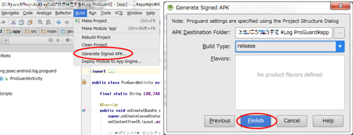
```eval_rst
.. {width="7.26875in" height="2.7849146981627295in"}
```

Figure 4.8‑1 How to create release version application

The difference of LogCat output between development version
application (debug build) and release version application (release
build) are shown in below Figure 4.8‑2.

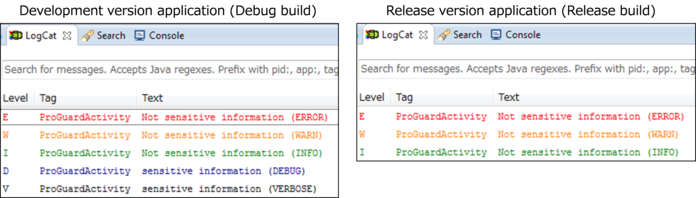
```eval_rst
.. {width="6.889763779527559in"
.. height="2.2236220472440946in"}
```

Figure 4.8‑2 Difference of LogCat output between development version application and release version application

### Rule Book<!-- 7121bb68 -->

When you output log messages, follow the rules below.

1.  Sensitive Information Must Not Be Included in Operation Log Information (Required)
2.  Construct the Build System to Auto-delete Codes which Output
    Development Log Information When Build for the Release (Recommended)
3.  Use Log.d()/v() Method When Outputting Throwable Object (Recommended)
4.  Use Only Methods of the android.util.Log Class for the Log Output (Recommended)

#### Sensitive Information Must Not Be Included in Operation Log Information (Required)

Log which was output to LogCat can be read out from other
applications, so sensitive information like user\'s login information
should not be output by release version application. It\'s necessary
not to write code which outputs sensitive information to log during
development, or it\'s necessary to delete all of such codes before release.

To follow this rule, first, not to include sensitive information in
operation log information. In addition, it\'s recommended to construct
the system to delete code which outputs sensitive information when
build for release. Please refer to \"4.8.2.2 Construct the Build
System to Auto-delete Codes which Output Development Log Information
When Build for the Release (Recommended)\".

#### Construct the Build System to Auto-delete Codes which Output Development Log Information When Build for the Release (Recommended)

When application development, sometimes it\'s preferable if sensitive
information is output to log for checking the process contents and for
debugging, for example the interim operation result in the process of
complicated logic, information of program\'s internal state,
communication data structure of communication protocol. It doesn\'t
matter to output the sensitive information as debug log during
developing, in this case, the corresponding log output code should be
deleted before release, as mentioned in \"4.8.2.1 Sensitive
Information Must Not Be Included in Operation Log Information (Required)\".

To delete surely the code which outputs development log information
when release builds, the system which executes code deletion
automatically by using some tools, should be constructed. ProGuard,
which was described in \"4.8.1 Sample Code\", can work for this
method. As described below, there are some noteworthy points on
deleting code by ProGuard. Here it\'s supposed to apply the system to
applications which output development log information by either of
Log.d()/v(), based on \"4.8.3.2 Selection Standards of Log Level and
Log Output Method\".

ProGuard deletes unnecessary code like unused methods, automatically.
By specifying Log.d()/v() as parameter of -assumenosideeffects option,
call for Log.d(), Log.v() are granted as unnecessary code, and those
are to be deleted.

By specifying -assumenosideeffects to Log.d()/v(), make it auto-deletion target.

```shell
-assumenosideeffects class android.util.Log {
    public static int d(...);
    public static int v(...);
}
```

In case using this auto deletion system, pay attention that
Log.v()/d() code is not deleted when using returned value of Log.v(),
Log.d(), so returned value of Log.v(), Log.d(), should not be used.
For example, Log.v() is not deleted in the next examination code.

Examination code which Log.v() that is specifeied to be deleted is not deketed.

```java
int i = android.util.Log.v("tag", "message");
System.out.println(String.format("Log.v() returned %d.", i)); //Use the returned value of Log.v() for examination.
```

If you\'d like to reuse source code, you should keep the consistency
of the project environment including ProGuard settings. For example,
source code that presupposes Log.d() and Log.v() are deleted
automatically by above ProGuard setting. If using this source code in
another project which ProGuard is not set, Log.d() and Log.v() are not
to be deleted, so there\'s a risk that the sensitive information may
be leaked. When reusing source code, the consistency of project
environment including ProGuard setting should be secured.

#### Use Log.d()/v() Method When Outputting Throwable Object (Recommended)

As mentioned in \"4.8.1 Sample Code\" and \"4.8.3.2 Selection
Standards of Log Level and Log Output Method\", sensitive information
should not be output to log through Log.e()/w()/i(). On the other
hand, in order that a developer wants to output the details of program
abnormality to log, when exception occurs, stack trace is output to
LogCat by Log.e(\..., Throwable tr)/w(\..., Throwable tr)/i(\...,
Throwable tr), in some cases. However, sensitive information may
sometimes be included in the stack trace because it shows detail
internal structure of the program. For example, when SQLiteException
is output as it is, what type of SQL statement is issued is clarified,
so it may give the clue for SQL injection attack. Therefore, it\'s
recommended that use only Log.d()/Log.v() methods, when outputting throwable object.

#### Use Only Methods of the android.util.Log Class for the Log Output (Recommended)

You may output log by System.out/err to verify the application\'s
behavior whether it works as expected or not, during development. Of
course, log can be output to LogCat by print()/println() method of
System.out/err, but it\'s strongly recommended to use only methods of
android.util.Log class, by the following reasons.

When outputting log, generally, use the most appropriate output method
properly based on the urgency of the information, and control the
output. For example, categories like serious error, caution, simple
application\'s information notice, etc. are to be used. However, in
this case, information which needs to be output at the time of release
(operation log information) and information which may include the
sensitive information (development log information) are output by the
same method. So, it may happen that when delete code which outputs
sensitive information, it\'s in danger that some deletion are dropped by oversight.

Along with this, when using android.util.Log and System.out/err for
log output, compared with using only android.util.Log, what needs to
be considered will increase, so it\'s in danger that some mistakes may
occur, like some deletion are dropped by oversight.

To decrease risk of above mentioned mistakes occurrence, it\'s
recommended to use only methods of android.util.Log class.

### Advanced Topics<!-- 309f2fdf -->

#### Two Ways of Thinking for the Log Outputting in Release version application

There are two ways of thinking for log output in release version
application. One is any log should never be output, and another is
necessary information for later analysis should be output as log.
It\'s favorable that any log should never be output in release version
application from the security point of view, but sometimes, log is
output even in release version application for various reasons. Each
way of thinking is described as per below.

The former is \"Any log should never be output\", this is because
outputting log in release version application is not so much valuable,
and there is a risk to leak sensitive information. This comes from
there\'s no method for developers to collect log information of the
release version application in Android application operation
environment, which is different from many Web application operation
environments. Based on this thinking, the logging codes are used only
in development phase, and all the logging codes are deleted on
building release version application.

The latter is \"necessary information should be output as log for the
later analysis\", as a final option to analyze application bugs in
customer support, in case of any questions or doubt to your customer
support. Based on this idea, as introduced above, it is necessary to
prepare the system that prevent human errors and bring it in your
project because if you don\'t have the system you have to keep in mind
to avoid logging the sensitive information in release version application.

For more details about logging method, refer to the following document.

Code Style Guidebook for Contributors / Log Sparingly

> [https://source.android.com/setup/contribute/code-style\#log-sparingly](https://source.android.com/setup/contribute/code-style#log-sparingly)

#### Selection Standards of Log Level and Log Output Method

There are five levels of log level (ERROR, WARN, INFO, DEBUG, VERBOSE)
are defined in android.util.Log class in Android. You should select
the most appropriate method when using the android.util.Log class to
output log messages according to Table 4.8‑1 which shows the selection
standards of logging levels and methods.

Table 4.8‑1 Selection standards of log levels and log output method

```eval_rst
+------------+----------+------------------------------------+--------------------------------------+
| Log level  | Method   | Log information to be output       | Cautions for application release     |
+============+==========+====================================+======================================+
| ERROR      | Log.e()  || Log information which is          || Log information as per left may be  |
|            |          || output when application is        || referred by users, so it could be   |
|            |          || in a fatal state.                 || output both in development version  |
|            |          |                                    || application and in release version  |
|            |          |                                    || application. Therefore, sensitive   |
|            |          |                                    || information should not be output    |
|            |          |                                    || in these levels.                    |
+------------+----------+------------------------------------+                                      |
| WARN       | Log.w()  || Log information which is          |                                      |
|            |          || output when application faces     |                                      |
|            |          || the unexpected serious situation. |                                      |
+------------+----------+------------------------------------+                                      |
| INFO       | Log.i()  || Other than above, log information |                                      |
|            |          || which is output to notify any     |                                      |
|            |          || remarkable changes or results in  |                                      |
|            |          || application state.                |                                      |
+------------+----------+------------------------------------+--------------------------------------+
| DEBUG      | Log.d()  || Program's internal state          || Log information as per left is      |
|            |          || information which needs to be     || only for application developers.    |
|            |          || output temporarily for analyzing  || Therefore, this type of information |
|            |          || the cause of specific bug when    || should not be output in case of     |
|            |          || developing application.           || release version application.        |
+------------+----------+------------------------------------+                                      |
| VERBOSE    | Log.v()  || Log information which is not      |                                      |
|            |          || applied to any of above.          |                                      |
|            |          || Log information which application |                                      |
|            |          || developer outputs for many        |                                      |
|            |          || purposes, is applied this. For    |                                      |
|            |          || example, in case of outputting    |                                      |
|            |          || server communication data to dump.|                                      |
+------------+----------+------------------------------------+--------------------------------------+
```

For more details about logging method, refer to the following document.

Code Style Guidelines for Contributors / Log Sparingly

> [https://source.android.com/setup/contribute/code-style\#log-sparingly](https://source.android.com/setup/contribute/code-style#log-sparingly)

#### DEBUG Log and VERBOSE Log Are Not Always Deleted Automatically

```eval_rst
The following is quoted from the developer reference of android.util.Log class [21]_.

The order in terms of verbosity, from least to most is ERROR, WARN,
INFO, DEBUG, VERBOSE. Verbose should never be compiled into an
application except during development. Debug logs are compiled in but
stripped at runtime. Error, warning and info logs are always kept.

.. [21] http://developer.android.com/reference/android/util/Log.html
```

After reading the above texts, some developers might have
misunderstood the Log class behavior as per below.

-   Log.v() call is not compiled when release build, VERBOSE log is never output.
-   Log.v() call is compiled, but DEBUG log is never output when execution.

However, logging methods never behave in above ways, and all messages
are output regardless of whether it is compiled with debug mode or
release mode. If you read the document carefully, you will be able to
realize that the gist of the document is not about the behavior of
logging methods but basic policies for logging.

In this chapter, we introduced the sample code to get the expected
result as described above by using ProGuard.

#### Remove Sensitive Information from Assembly

If you build the following code with ProGuard for the purpose of
deleting Log.d() method, it is necessary to remember that ProGuard
keeps the statement that construct the string for logging message (the
first line of the code) even though it remove the statement of calling
Log.d() method (the second line of the code).

```java
    String debug_info = String.format("%s:%s", "Sensitive information 1", "Sensitive information 2");
    if (BuildConfig.DEBUG) android.util.Log.d(TAG, debug_info);
```
The following disassembly shows the result of release build of the
code above with ProGuard. Actually, there\'s no Log.d() call process,
but you can see that character string consistence definition like
\"Sensitive information1\" and calling process of String\#format()
method, are not deleted and still remaining there.

```
    const-string v1, "%s:%s"
    const/4 v2, 0x2
    new-array v2, v2, [Ljava/lang/Object;
    const/4 v3, 0x0
    const-string v4, "Sensitive information 1"
    aput-object v4, v2, v3
    const/4 v3, 0x1
    const-string v4, "Sensitive information 2"
    aput-object v4, v2, v3
    invoke-static {v1, v2}, Ljava/lang/String;->format(Ljava/lang/String;[Ljava/lang/Object;)Ljava/lang/String;
    move-result-object v0
```

Actually, it\'s not easy to find the particular part that disassembled
APK file and assembled log output information as above. However, in
some application which handles the very confidential information, this
type of process should not be remained in APK file in some cases.

You should implement your application like below to avoid such a
consequence of remaining the sensitive information in bytecode. In
release build, the following codes are deleted completely by the compiler optimization.

```java
    if (BuildConfig.DEBUG) {
        String debug_info = String.format("%s:%s", "Snsitive information 1", "Sensitive information 2");
        if (BuildConfig.DEBUG) android.util.Log.d(TAG, debug_info);
    }
```

Besides, ProGuard cannot remove the log message of the following code(\"result:\" + value).

```java
    Log.d(TAG, "result:" + value);
```

In this case, you can solve the problem in the following manner.

```java
    if (BuildConfig.DEBUG) Log.d(TAG, "result:" + value);
```

#### The Contents of Intent Is Output to LogCat

When using Activity, it\'s necessary to pay attention, since
ActivityManager outputs the content of Intent to LogCat. Refer to
\"4.1.3.5 Log Output When using Activities\".

#### Restrain Log which Is Output to System.out/err

System.out/err method outputs all messages to LogCat. Android could
send some messages to System.out/err even if developers did not use
these methods in their code, for example, in the following cases,
Android sends stack trace to System.err method.

-   When using Exception\#printStackTrace()
-   When it\'s output to System.err implicitly<br/>
    (When the exception is not caught by application, it\'s given to
    Exception\#printStackTrace() by the system.)

You should handle errors and exceptions appropriately since the stack
trace includes the unique information of the application.

We introduce a way of changing default output destination of
System.out/err. The following code redirects the output of
System.out/err method to nowhere when you build a release version
application. However, you should consider whether this redirection
does not cause a malfunction of application or system because the code
temporarily overwrites the default behavior of System.out/err method.
Furthermore, this redirection is effective only to your application
and is worthless to system processes.

OutputRedirectApplication.java
```eval_rst
.. literalinclude:: CodeSamples/Log OutputRedirection.OutputRedirectApplication.java
   :language: java
   :encoding: shift-jis
```

AndroidManifest.xml
```eval_rst
.. literalinclude:: CodeSamples/Log OutputRedirection.app.src.main.AndroidManifest.xml
   :language: xml
   :encoding: shift-jis
```

proguard-project.txt
```shell
# Prevent from changing class name and method name, etc.
-dontobfuscate

# In release build, delete call from Log.d()/v() automatically.
-assumenosideeffects class android.util.Log {
    public static int d(...);
    public static int v(...);
}

# In release build, delete resetStreams() automatically.
-assumenosideeffects class org.jssec.android.log.outputredirection.OutputRedirectApplication {
    private void resetStreams(...);
}
```

The difference of LogCat output between development version
application (debug build) and release version application (release
build) are shown as per below Figure 4.8‑3.

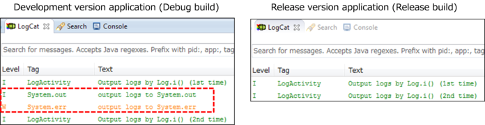
```eval_rst
.. {width="7.26875in" height="2.237303149606299in"}
```

Figure 4.8‑3 Difference of System.out/err in LogCat output, between development application and release application.

Using WebView
-------------

WebView enables your application to integrate HTML/JavaScript content.

### Sample Code<!-- 1363357c -->

We need to take proper action, depending on what we\'d like to show
through WebView although we can easily show web site and html file by
it. And also we need to consider risk from WebView\'s remarkable
function; such as JavaScript-Java object bind.

Especially what we need to pay attention is JavaScript. (Please note
that JavaScript is disabled as default. And we can enable it by
WebSettings\#setJavaScriptEnabled()). With enabling JavaScript, there
is potential risk that malicious third party can get device
information and operate your device.

```eval_rst
The following is principle for application with WebView [23]_:

(1) You can enable JavaScript if the application uses contents which are managed in house.

(2) You should NOT enable JavaScript other than the above case.

.. [23] Strictly speaking, you can enable JavaScript if we can say the
    content is safe. If the contents are managed in house, the contents
    should be guaranteed of security. And the company can secure them.
    In other words, we need to have business representation's decision
    to enable JavaScript for other company's contents. The contents
    which are developed by trusted partner might have security
    guarantee. But there is still potential risk. Therefore the decision
    is needed by responsible person.
```
Figure 4.9‑1 shows flow chart to choose sample code according to content characteristic.

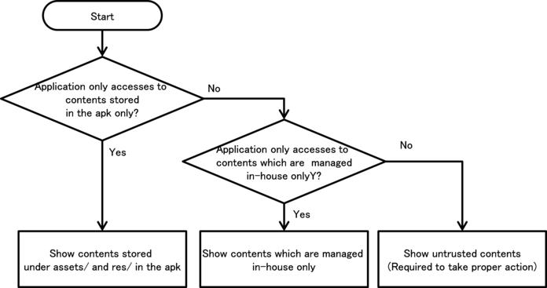
```eval_rst
.. {width="6.889763779527559in"
.. height="2.912204724409449in"}
```

Figure 4.9‑1 Flow Figure to select Sample code of WebView.

#### Show Only Contents Stored under assets/res Directory in the APK

You can enable JavaScript if your application shows only contents
stored under assets/ and res/ directory in apk.

The following sample code shows how to use WebView to show contents
stored under assets/ and res/.

Points:

1.  Disable to access files (except files under assets/ and res/ in apk).
2.  You may enable JavaScript.

WebViewAssetsActivity.java
```eval_rst
.. literalinclude:: CodeSamples/WebView Assets.WebViewAssetsActivity.java
   :language: java
   :encoding: shift-jis
```

#### Show Only Contents which Are Managed In-house

You can enable JavaScript to show only contents which are managed
in-house only if your web service and your Android application can
take proper actions to secure both of them.

-   Web service side actions:

As Figure 4.9‑2 shows, your web service can only refer to contents
which are managed in-house. In addition, the web service is needed to
take appropriate security action. Because there is potential risk if
contents which your web service refers to may have risk; such as
malicious attack code injection, data manipulation, etc.

Please refer to \"4.9.2.1 Enable JavaScript Only If Contents Are Managed In-house (Required)\".

-   Android application side actions:

Using HTTPS, the application should establish network connection to
your managed web service only if the certification is trusted.

The following sample code is an activity to show contents which are managed in-house.

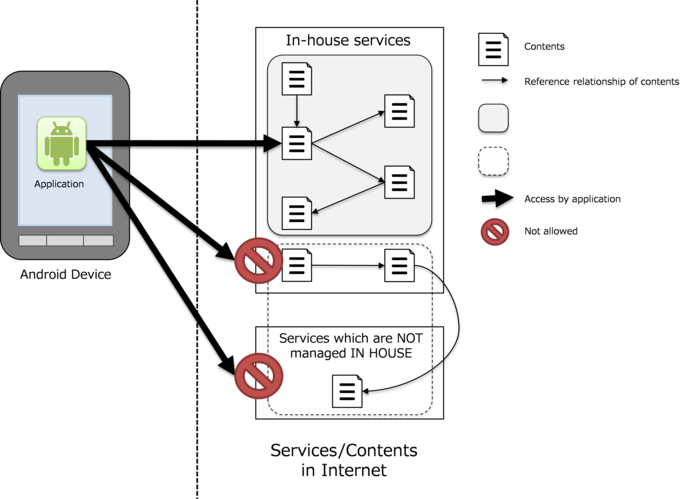
```eval_rst
.. {width="6.471653543307086in"
.. height="4.366141732283465in"}
```

Figure 4.9‑2 Accessible contents and Non-accessible contents from application.

Points:

1.  Handle SSL error from WebView appropriately.
2.  (Optional) Enable JavaScript of WebView.
3.  Restrict URLs to HTTPS protocol only.
4.  Restrict URLs to in-house.

WebViewTrustedContentsActivity.java
```eval_rst
.. literalinclude:: CodeSamples/WebView TrustedContents.WebViewTrustedContentsActivity.java
   :language: java
   :encoding: shift-jis
```

#### Show Contents which Are Not Managed In-house

Don\'t enable JavaScript if your application shows contents which are
not managed in house because there is potential risk to access to malicious content.

The following sample code is an activity to show contents which are not managed in-house.

This sample code shows contents specified by URL which user inputs
through address bar. Please note that JavaScript is disabled and
connection is aborted when SSL error occurs. The error handling is the
same as \"4.9.1.2 Show Only Contents which Are Managed In-house\" for
the details of HTTPS communication. Please refer to \"5.4
Communicating via HTTPS\" for the details also.

Points:

1.  Handle SSL error from WebView appropriately.
2.  Disable JavaScript of WebView.

WebViewUntrustActivity.java
```eval_rst
.. literalinclude:: CodeSamples/WebView Untrust.WebViewUntrustActivity.java
   :language: java
   :encoding: shift-jis
```

### Rule Book<!-- c6c109b5 -->

Comply with following rule when you need to use WebView.

1.  Enable JavaScript Only If Contents Are Managed In-house (Required)
2.  Use HTTPS to Communicate to Servers which Are Managed In-house (Required)
3.  Disable JavaScript to Show URLs Which Are Received through Intent, etc. (Required)
4.  Handle SSL Error Properly (Required)

#### Enable JavaScript Only If Contents Are Managed In-house (Required)

What we have to pay attention on WebView is whether we enable the
JavaScript or not. As principle, we can only enable the JavaScript
only IF the application will access to services which are managed
in-house. And you must not enable the JavaScript if there is
possibility to access services which are not managed in-house.

##### Services managed In-house

In case that application accesses contents which are developed IN
HOUSE and are distributed through servers which are managed IN HOUSE,
we can say that the contents are ONLY modified by your company. In
addition, it is also needed that each content refers to only contents
stored in the servers which have proper security.

In this scenario, we can enable JavaScript on the WebView. Please
refer to \"4.9.1.2 Show Only Contents which Are Managed In-house\" also.

And you can also enable JavaScript if your application shows only
contents stored under assets/ and res/ directory in the apk. Please
refer to \"4.9.1.1 Show Only Contents Stored under assets/res Directory\" also.

##### Services unmanaged in-house

You must NOT think you can secure safety on contents which are NOT
managed IN HOUSE. Therefore you have to disable JavaScript. Please
refer to \"4.9.1.3 Show Contents which Are Not Managed In-house\".

In addition, you have to disable JavaScript if the contents are stored
in external storage media; such as microSD because other application
can modify the contents.

#### Use HTTPS to Communicate to Servers which Are Managed In-house (Required)

You have to use HTTPS to communicate to servers which are managed
in-house because there is potential risk of spoofing the services by
malicious third party.

Please refer to both \"4.9.2.4 Handle SSL Error Properly (Required)\",
and \"5.4 Communicating via HTTPS\".

#### Disable JavaScript to Show URLs Which Are Received through Intent, etc. (Required)

Don\'t enable JavaScript if your application needs to show URLs which
are passed from other application as Intent, etc. Because there is
potential risk to show malicious web page with malicious JavaScript.

Sample code in the section \"4.9.1.2 Show Only Contents which Are
Managed In-house\", uses fixed value URL to show contents which are
managed in-house, to secure safety.

If you need to show URL which is received from Intent, etc., you have
to confirm that URL is in managed URL in-house. In short, the
application has to check URL with white list which is regular
expression, etc. In addition, it should be HTTPS.

#### Handle SSL Error Properly (Required)

You have to terminate the network communication and inform error
notice to user when SSL error happens on HTTPS communication.

SSL error shows invalid server certification risk or MTIM
(man-in-the-middle attack) risk. Please note that WebView has NO error
notice mechanism regarding SSL error. Therefore your application has
to show the error notice to inform the risk to the user. Please refer
to sample code in the section of \"4.9.1.2 Show Only Contents which
Are Managed In-house\", and \"4.9.1.3 Show Contents which Are Not
Managed In-house\".

In addition, your application MUST terminate the communication with the error notice.

In other words, you MUST NOT do following.

-   Ignore the error to keep the transaction with the service.
-   Retry HTTP communication instead of HTTPS.

Please refer to the detail described in \"5.4 Communicating via HTTPS\".

WebView\'s default behavior is to terminate the communication in case
of SSL error. Therefore what we need to add is to show SSL error
notice. And then we can handle SSL error properly.

### Advanced Topics<!-- bbb3af0f -->

#### Vulnerability caused by addJavascriptInterface() at Android versions 4.1 or earlier

Android versions under 4.2（API Level 17） have a vulnerability caused
by addJavascriptInterface(), which could allow attackers to call
native Android methods (Java) via JavaScript on WebView.

As explained in \"4.9.2.1 Enable JavaScript Only If Contents Are
Managed In-house (Required)\", JavaScript must not be enabled if the
services could access services out of in-house control.

In Android 4.2（API Level 17） or later, the measure of the
vulnerability has been taken to limit access from JavaScript to only
methods with @JavascriptInterface annotation on Java source codes
instead of all methods of Java objects injected. However it is
necessary to disable JavaScript if the services could access services
out of in-house control as mentioned in \"4.9.2.1\".

#### Issue caused by file scheme

In case of using WebView with default settings, all files that the app
has access rights can be accessed to by using the file scheme in web
pages regardless of the page origins. For example, a malicious web
page could access the files stored in the app\'s private directory by
sending a request to the uri of a private file of the app with the
file scheme.

A countermeasure is to disable JavaScript as explained in \"4.9.2.1
Enable JavaScript Only If Contents Are Managed In-house (Required)\"
if the services could access services out of in-house control. Doing
that is to protect against sending the malicious file scheme request.

Also in case of Android 4.1 (API Level 16) or later,
setAllowFileAccessFromFileURLs() and
setAllowUniversalAccessFromFileURLs() can be used to limit access via the file scheme.

Disabling the file scheme
```java
        webView = (WebView) findViewById(R.id.webview);
        webView.setWebViewClient(new WebViewUnlimitedClient());
        WebSettings settings = webView.getSettings();
        settings.setAllowUniversalAccessFromFileURLs(false);
        settings.setAllowFileAccessFromFileURLs(false);
```

#### Specifying a Sender Origin When Using Web Messaging 

```eval_rst
Android 6.0 (API Level 23) adds an API for realizing HTML5 Web
Messaging. Web Messaging is a framework defined in HTML5 for sending
and receiving data between different browsing contexts. [24]_

.. [24] http://www.w3.org/TR/webmessaging/

The postWebMessage() method added to the WebView class is a method for
processing data transmissions via the Cross-domain messaging protocol defined by Web Messaging.

This method sends a message object---specified by its first
parameter---from the browsing context that has been read into WebView;
however, in this case it is necessary to specify the origin of the
sender as the second parameter. If the specified origin [25]_ does not
agree with the origin in the sender context, the message will not be
sent. By placing restrictions on the sender origin in this way, this
mechanism aims to prevent the passing of messages to unintended senders.

.. [25] An "origin" is a URL scheme together with a host name and port
    number. For the detailed definition see http://tools.ietf.org/html/rfc6454.

However, it is important to note that wildcards may be specified as
the origin in the postWebMessage() method. [26]_ If wildcards are
specified, the sender origin of the message is not checked, and the
message may be sent from any arbitrary origin. In a situation in which
malicious content has been read into WebView, various types of harm or
damage may result if important messages are sent without origin
restrictions. Thus, when using WebView for Web messaging, it is best
to specify explicitly a specific origin in the postWebMessage() method.

.. [26] Note that Uri.EMPTY and Uri.parse("") function as wildcards (at
    the time of writing the September 1, 2016 version).
```

Using Notifications
-------------------

Android offers the Notification feature for sending messages to end
users. Using a Notification causes a region known as a status bar to
appear on the screen, inside which you may display icons and messages.

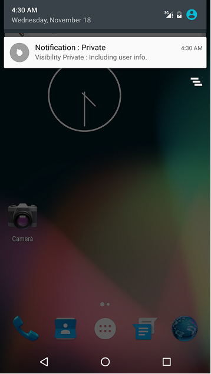
```eval_rst
.. {width="3.716666666666667in"
.. height="6.603472222222222in"}
```

Figure 4.10‑1　An example of a Notification

The communication functionality of Notifications is enhanced in
Android 5.0 (API Level 21) to allow messages to be displayed via
Notifications even when the screen is locked, depending on user and
application settings. However, incorrect use of Notifications runs the
risk that private information---which should only be shown to the
terminal user herself---may be seen by third parties. For this reason,
this functionality must be implemented with careful attention paid to privacy and security.

The possible values for the Visibility option and the corresponding
behavior of Notifications is summarized in the following table.

```eval_rst
================ ================================================================================
Visibility value Behavior of Notifications
================ ================================================================================
Public           | Notifications are displayed on all locked screens.
Private          | Notifications are displayed on all locked screens;
                 | however, on locked screens that have been password-protected (secure locks),
                 | fields such as the title and text of the Notification are hidden
                 | (replaced by publicly-releasable messages in which private information is hidden).
Secret           | Notifications are not displayed on locked screens
                 | that are protected by passwords or other security measures (secure locks).
                 | (Notifications are displayed on locked screens that do not involve secure locks.)
================ ================================================================================
```
### Sample Code<!-- 2de6db20 -->

When a Notification contains private information regarding the
terminal user, a message from which the private information has been
excluded must be prepared and added to be displayed in the event of a locked screen.

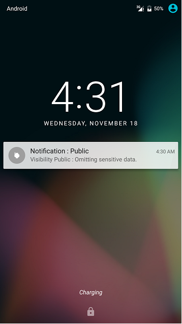
```eval_rst
.. {width="3.716666666666667in"
.. height="6.603472222222222in"}
```

Figure 4.10‑2 A notification on a locked screen

Sample code illustrating the proper use of Notifications for messages
containing private data is shown below.

Points:

1.  When using Notifications for messages containing private data,
    prepare a version of the Notification that is suitable for public
    display (to be displayed when the screen is locked).
2.  Do not include private information in Notifications prepared for
    public display (displayed when the screen is locked).
3.  Explicitly set Visibility to Private when creating Notifications.
4.  When Visibility is set to Private, Notifications may contain private information.

VisibilityPrivateNotificationActivity.java
```eval_rst
.. literalinclude:: CodeSamples/Notification VisibilityPrivate.VisibilityPrivateNotificationActivity.java
   :language: java
   :encoding: shift-jis
```

### Rule Book<!-- a8692504 -->

When creating Notification, the following rules must be observed.

1.  Regardless of the Visibility setting, Notifications must not contain
    sensitive information (although private information is an exception)
2.  Notifications with Visibility=Public must not contain private information (Required)
3.  For Notifications that contain private information, Visibility must
    be explicitly set to Private or Secret (Required)
4.  When using Notifications with Visibility=Private, create an
    additional Notification with Visibility=Public for public display (Recommended)

####  Regardless of the Visibility setting, Notifications must not contain sensitive information (although private information is an exception) (Required)

On terminals using Android4.3 (API Level 18) or later, users can use
the Settings window to grant apps permission to read Notifications.
Apps granted this permission will be able to read all information in
Notifications; for this reason, sensitive information must not be
included in Notifications. (However, private information may be
included in Notifications depending on the Visibility setting).

Information contained in Notifications may generally not be read by
apps other than the app that sent the Notification. However, users may
explicitly grant permission to certain user-selected apps to read all
information in Notifications. Because only apps that have been granted
user permission may read information in Notifications, there is
nothing problematic about including private information on the user
within the Notification. On the other hand, if sensitive information
other than the user\'s private information (for example, secret
information known only to the app developers) is include in a
Notification, the user herself may attempt to read the information
contained in the Notification and may grant applications permission to
view this information as well; thus the inclusion of sensitive
information other than private user information is problematic.

For specific methods and conditions, see Section "4.10.3.1 On
User-granted Permission to View Notifications".

#### Notifications with Visibility=Public must not contain private information (Required)

When sending Notifications with Visibility=Public, private user
information must not be included in the Notification. When a
Notifications has the setting Visibility=Public, the information in
the Notification is displayed even when the screen is locked. This is
because such Notifications carry the risk that private information
might be seen and stolen by a third party in physical proximity to the terminal.

VisibilityPrivateNotificationActivity.java
```java
    // Prepare a Notification for public display (to be displayed on locked screens) that does not contain sensitive information.
    Notification.Builder publicNotificationBuilder = new Notification.Builder(this).setContentTitle("Notification : Public");

    publicNotificationBuilder.setVisibility(Notification.VISIBILITY_PUBLIC);
    // Do not include private information in Notifications for public display (to be displayed on locked screens).
    publicNotificationBuilder.setContentText("Visibility Public: sending notification without sensitive information.");
    publicNotificationBuilder.setSmallIcon(R.drawable.ic_launcher);
```

####  For Notifications that contain private information, Visibility must be explicitly set to Private or Secret (Required)

Terminals using Android 5.0 (API Level 21) or later will display
Notifications even when the screen is locked. Thus, when the
Notification contains private information, its Visibility flag should
be set explicitly to Private or Secret. This is to protect against the
risk of private information contained in a Notification being
displayed on a locked screen.

At present, the default value of Visibility is set to Private for
Notifications, so the aforementioned risk will only arise if this flag
is explicitly changed to Public. However, the default value of
Visibility may change in the future; for this reason, and also for the
purpose of clearly communicating one\'s intentions at all times when
handling information, it is mandatory to set Visibility=Private
explicitly for Notifications that contain private information.

VisibilityPrivateNotificationActivity.java
```java
        // Create a Notification that includes private information.
        Notification.Builder priavteNotificationBuilder = new Notification.Builder(this).setContentTitle("Notification : Private");

        // *** POINT *** Explicitly set Visibility=Private when creating the Notification.
        priavteNotificationBuilder.setVisibility(Notification.VISIBILITY_PRIVATE);
```

Typical examples of private information include emails sent to the
user, the user\'s location data, and other items listed in Section
"5.5 Handling privacy data\".

On terminals using Android4.3 (API Level 18) or later, users can use
the Settings window to grant apps permission to read Notifications.
Apps granted this permission will be able to read all information in
Notifications; for this reason, sensitive information other than
private user information must not be included in Notifications.

####  When using Notifications with Visibility=Private, create an additional Notification with Visibility=Public for public display (Recommended)

When communicating information via a Notification with
Visibility=Private, it is desirable to create simultaneously an
additional Notification, for public display, with Visibility=Public;
this is to restrict the information displayed on locked screens.

If a public-display Notification is not registered together with a
Visibility=Private notification, a default message prepared by the
operating system will be displayed when the screen is locked. Thus
there is no security problem in this case. However, for the purpose of
clearly communicating one\'s intentions at all times when handling
information, it is recommended that a public-display Notification be
explicitly created and registered.

VisibilityPrivateNotificationActivity.java
```java
    // Create a Notification that contains private information.
    Notification.Builder privateNotificationBuilder = new Notification.Builder(this).setContentTitle("Notification : Private");

    // *** POINT *** Explicitly set Visibility=Private when creating the Notification.
    if (Build.VERSION.SDK_INT >= 21)
        privateNotificationBuilder.setVisibility(Notification.VISIBILITY_PRIVATE);
    // *** POINT *** Notifications with Visibility=Private may include private information.
    privateNotificationBuilder.setContentText("Visibility Private : Including user info.");
    privateNotificationBuilder.setSmallIcon(R.drawable.ic_launcher);
    // When creating a Notification with Visibility=Private, simultaneously create and register a public-display Notification with Visibility=Public.
    if (Build.VERSION.SDK_INT >= 21)
        privateNotificationBuilder.setPublicVersion(publicNotification);
```

### Advanced Topics<!-- 5fe6bbe1 -->

#### On User-granted Permission to View Notifications

As noted above in Section "4.10.2.1 Regardless of the Visibility
setting, Notifications must not contain sensitive information
(although private information is an exception)", on terminals using
Android 4.3 (API Level 18) or later, certain user-selected apps that
have been granted user permission may read information in all Notifications.

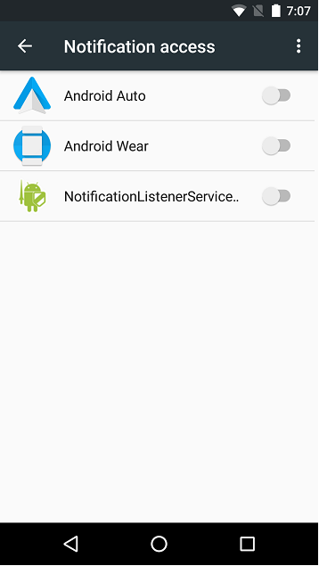
```eval_rst
.. {width="3.71875in" height="6.604166666666667in"}
```

Figure 4.10‑3 The Access to Notifications window, from which Notification read controls may be configured

The following sample code illustrates the use of NotificationListenerService.

AndroidManifest.xml
```eval_rst
.. literalinclude:: CodeSamples/NotificationListenerService.app.src.main.AndroidManifest.xml
   :language: xml
   :encoding: shift-jis
```

MyNotificationListenerService.java
```eval_rst
.. literalinclude:: CodeSamples/NotificationListenerService.MyNotificationListenerService.java
   :language: java
   :encoding: shift-jis
```

As discussed above, by using NotificationListenerService to obtain
user permission it is possible to read Notifications. However, because
the information contained in Notifications frequently includes private
information on the terminal, care is required in handling such information.
