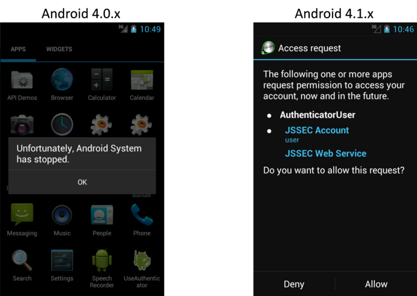

How to use Security Functions
=============================

There are various security functions prepared in Android, like
encryption, digital signature and permission etc. If these security
functions are not used correctly, security functions don\'t work
efficiently and loophole will be prepared. This chapter will explain
how to use the security functions properly.


Creating Password Input Screens
-------------------------------

### Sample Code<!-- fac12c7b -->

When creating password input screen, some points to be considered in
terms of security, are described here. Only what is related to
password input is mentioned, here. Regarding how to save password,
another articles is planned to be published is future edition.


```eval_rst
.. {width="2.0in"
.. height="3.345138888888889in"}
```

Figure 5.1‑1

Points:

1.  The input password should be mask displayed (Display with \*)

2. Provide the option to display the password in a plain text.

3. Alert a user that displaying password in a plain text has a risk.
&nbsp;
Points: When handling the last Input password, pay attention the
following points along with the above points.
&nbsp;
&nbsp;
4. In the case there is the last input password in an initial display,
    display the fixed digit numbers of black dot as dummy in order not
    that the digits number of last password is guessed.

5. When the dummy password is displayed and the \"Show password\"
    button is pressed, clear the last input password and provide the
    state for new password input.

6. When last input password is displayed with dummy, in case user tries
    to input password, clear the last input password and treat new user
    input as a new password.


password_activity.xml
```eval_rst
.. literalinclude:: CodeSamples/Password PasswordInputUI.app.src.main.res.layout.password_activity.xml
   :language: xml
   :encoding: shift-jis
```


Implementation for 3 methods which are located at the bottom of
PasswordActivity.java, should be adjusted depends on the purposes.

-   private String getPreviousPassword()

-   private void onClickCancelButton(View view)

-   private void onClickOkButton(View view)

PasswordActivity.java
```eval_rst
.. literalinclude:: CodeSamples/Password PasswordInputUI.PasswordActivity.java
   :language: java
   :encoding: shift-jis
```


### Rule Book<!-- c4ed2029 -->

Follow the below rules when creating password input screen.

1.  Provide the Mask Display Feature, If the Password Is Entered
    (Required)

2.  Provide the Option to Display Password in a Plain Text (Required)

3.  Mask the Password when Activity Is Launched (Required)

4.  When Displaying the Last Input Password, Dummy Password Must Be
    Displayed (Required)

#### Provide the Mask Display Feature, If the Password Is Entered (Required)

Smartphone is often used in crowded places like in a train or in a
bus, and the risk that password is peeked by someone. So the function
to mask display password is necessary as an application spec.

There are two ways to display the EditText as password: specifying
this statically in the layout XML, or specifying this dynamically by
switching the display from a program. The former is achieved by
specifying "textPassword" for the android:inputType attribute or by
using android:password attribute. The latter is achieved by using the
setInputType() method of the EditText class to add
InputType.TYPE\_TEXT\_VARIATION\_PASSWORD to its input type.

Sample code of each of them is shown below.

Masking password in layout XML.

password\_activity.xml
```xml
    <!-- Password input item -->
    <!-- Set true for the android:password attribute -->
    <EditText
        android:id="@+id/password_edit"
        android:layout_width="fill_parent"
        android:layout_height="wrap_content"
        android:hint="@string/hint_password"
        android:password="true" />
```

Masking password in Activity.

PasswordActivity.java
```java
        // Set password display type
        // Set TYPE_TEXT_VARIATION_PASSWORD for InputType.
        EditText passwordEdit = (EditText) findViewById(R.id.password_edit);
        int type = InputType.TYPE_CLASS_TEXT
                | InputType.TYPE_TEXT_VARIATION_PASSWORD;
        passwordEdit.setInputType(type);
```

#### Provide the Option to Display Password in a Plain Text (Required)

Password input in Smartphone is done by touch panel input, so compared
with keyboard input in PC, miss input may be easily happened. Because
of the inconvenience of inputting, user may use the simple password,
and it makes more dangerous. In addition, when there\'s a policy like
account is locked due the several times of password input failure,
it\'s necessary to avoid from miss input as much as possible. As a
solution of these problems, by preparing an option to display password
in a plain text, user can use the safe password.

However, when displaying password in a plain text, it may be sniffed,
so when using this option. It\'s necessary to call user cautions for
sniffing from behind. In addition, in case option to display in a
plain text is implemented, it\'s also necessary to prepare the system
to auto cancel the plain text display like setting the time of plain
display. The restrictions for password plain text display are
published in another article in future edition. So, the restrictions
for password plain text display are not included in sample code.


Figure 5.1‑2

By specifying InputType of EditText, mask display and plain text
display can be switched.

PasswordActivity.java
```java
    /**
     * Process when check of password display option is changed.
     */
    private class OnPasswordDisplayCheckedChangeListener implements
            OnCheckedChangeListener {

        public void onCheckedChanged(CompoundButton buttonView,
                boolean isChecked) {
            // *** POINT 5 *** When the dummy password is displayed and the "Show password" button is pressed,
            // Clear the last input password and provide the state for new password input.
            if (mIsDummyPassword && isChecked) {
                // Set dummy password flag
                mIsDummyPassword = false;
                // Set password empty
                mPasswordEdit.setText(null);
            }

            // Cursor position goes back the beginning, so memorize the current cursor position.
            int pos = mPasswordEdit.getSelectionStart();

            // *** POINT 2 *** Provide the option to display the password in a plain text
            // Create InputType
            int type = InputType.TYPE_CLASS_TEXT;
            if (isChecked) {
                // Plain display when check is ON.
                type |= InputType.TYPE_TEXT_VARIATION_VISIBLE_PASSWORD;
            } else {
                // Masked display when check is OFF.
                type |= InputType.TYPE_TEXT_VARIATION_PASSWORD;
            }

            // Set InputType to password EditText
            mPasswordEdit.setInputType(type);

            // Set cursor position
            mPasswordEdit.setSelection(pos);
        }

    }
```

#### Mask the Password when Activity Is Launched (Required)

To prevent it from a password peeping out, the default value of
password display option, should be set OFF, when Activity is launched.
The default value should be always defined as safer side, basically.

#### When Displaying the Last Input Password, Dummy Password Must Be Displayed (Required)

When specifying the last input password, not to give the third party
any hints for password, it should be displayed as dummy with the fixed
digits number of mask characters (\* etc.). In addition, in the case
pressing \"Show password\" when dummy display, clear password and
switch to plain text display mode. It can help to suppress the risk
that the last input password is sniffed low, even if the device is
passed to a third person like when it\'s stolen. FYI, In case of dummy
display and when a user tries to input password, dummy display should
be cancelled, it necessary to turn the normal input state.

When displaying the last Input password, display dummy password.

PasswordActivity.java
```java

    @Override
    public void onCreate(Bundle savedInstanceState) {

        super.onCreate(savedInstanceState);
        setContentView(R.layout.password_activity);

        // Get View
        mPasswordEdit = (EditText) findViewById(R.id.password_edit);
        
        mPasswordDisplayCheck = (CheckBox);
        findViewById(R.id.password_display_check);

        // Whether last Input password exist or not.
        if (getPreviousPassword() != null) {
            // *** POINT 4 *** In the case there is the last input password in an initial display,
            // display the fixed digit numbers of black dot as dummy in order not that the digits number of last password is guessed.
            // Display should be dummy password.
            mPasswordEdit.setText("**********");
            // To clear the dummy password when inputting password, set text change listener.
            mPasswordEdit.addTextChangedListener(new PasswordEditTextWatcher());
            // Set dummy password flag
            mIsDummyPassword = true;
        }

        [...]

    }

    /**
     * Get the last input password.
     *
     * @return the last input password
     */
    private String getPreviousPassword() {
        // To restore the saved password, return the password character string.
        // For the case password is not saved, return null.
        return "hirake5ma";
    }
```

In the case of dummy display, when password display option is turned
ON, clear the displayed contents.

PasswordActivity.java
```java
    /**
     * Process when check of password display option is changed.
     */
    private class OnPasswordDisplayCheckedChangeListener implements
            OnCheckedChangeListener {

        public void onCheckedChanged(CompoundButton buttonView,
                boolean isChecked) {
            // *** POINT 5 *** When the dummy password is displayed and the "Show password" button is pressed,
            // Clear the last input password and provide the state for new password input.
            if (mIsDummyPassword && isChecked) {
                // Set dummy password flag
                mIsDummyPassword = false;
                // Set password empty
                mPasswordEdit.setText(null);
            }

            [...]

        }

    }
```

In case of dummy display, when user tries to input password, clear
dummy display.

PasswordActivity.java
```java
    // Key to save the state
    private static final String KEY_DUMMY_PASSWORD = "KEY_DUMMY_PASSWORD";

    [...]

    // Flag to show whether password is dummy display or not.
    private boolean mIsDummyPassword;

    @Override
    public void onCreate(Bundle savedInstanceState) {

        [...]

        // Whether last Input password exist or not.
        if (getPreviousPassword() != null) {
            // *** POINT 4 *** In the case there is the last input password in an initial display,
            // display the fixed digit numbers of black dot as dummy in order not that the digits number of last password is guessed.

            // Display should be dummy password.
            mPasswordEdit.setText("**********");
            // To clear the dummy password when inputting password, set text change listener.
            mPasswordEdit.addTextChangedListener(new PasswordEditTextWatcher());
            // Set dummy password flag
            mIsDummyPassword = true;
        }

        [...]

    }

    @Override
    public void onSaveInstanceState(Bundle outState) {
        super.onSaveInstanceState(outState);

        // Unnecessary when specifying not to regenerate Activity by the change in screen aspect ratio.
        // Save Activity state
        outState.putBoolean(KEY_DUMMY_PASSWORD, mIsDummyPassword);
    }

    @Override
    public void onRestoreInstanceState(Bundle savedInstanceState) {
        super.onRestoreInstanceState(savedInstanceState);

        // Unnecessary when specifying not to regenerate Activity by the change in screen aspect ratio.
        // Restore Activity state
        mIsDummyPassword = savedInstanceState.getBoolean(KEY_DUMMY_PASSWORD);
    }

    /**
     * Process when inputting password.
     */
    private class PasswordEditTextWatcher implements TextWatcher {

        public void beforeTextChanged(CharSequence s, int start, int count,
                int after) {
            // Not used
        }

        public void onTextChanged(CharSequence s, int start, int before,
                int count) {
            // *** POINT 6 *** When last Input password is displayed as dummy, in the case an user tries to input password,
            // Clear the last Input password, and treat new user input as new password.
            if (mIsDummyPassword) {
                // Set dummy password flag
                mIsDummyPassword = false;
                // Trim space
                CharSequence work = s.subSequence(start, start + count);
                mPasswordEdit.setText(work);
                // Cursor position goes back the beginning, so bring it at the end.
                mPasswordEdit.setSelection(work.length());
            }
        }

        public void afterTextChanged(Editable s) {
            // Not used
        }

    }
```

### Advanced Topics<!-- c699a7d7 -->

#### Login Process

The representative example of where password input is required is
login process. Here are some Points that need cautions in Login
process.

##### Error message when login fail

In login process, need to input 2 information which is ID(account) and
password. When login failure, there are 2 cases. One is ID doesn\'t
exist. Another is ID exists but password is incorrect. If either of
these 2 cases is distinguished and displayed in a login failure
message, attackers can guess whether the specified ID exists or not.
To stop this kind of guess, these 2 cases should not be specified in
login failure message, and this message should be displayed as per
below.

Message example: Login ID or password is incorrect.

##### Auto Login function

There is a function to perform auto login by omitting login
ID/password input in the next time and later, after successful login
process has been completed once. Auto login function can omit the
complicated input. So the convenience will increase, but on the other
hand, when a Smartphone is stolen, the risk which is maliciously being
used by the third party, will follow.

Only the use when damages caused by the malicious third party is
somehow acceptable, or only in the case enough security measures can
be taken, auto login function can be used. For example, in the case of
online banking application, when the device is operated by the third
party, financial damage may be caused. So in this case, security
measures are necessary along with auto login function. There are some
possible counter-measures, like \[Require re-inputting password just
before financial process like payment process occurs\], \[When setting
auto login, call a user for enough attentions and prompt user to
secure device lock\], etc. When using auto login, it\'s necessary to
investigate carefully considering the convenience and risks along with
the assumed counter measures.

#### Changing Password

When changing the password which was once set, following input items
should be prepared on the screen.

-   Current password

-   New password

-   New password (confirmation)

When auto login function is introduced, there are possibilities that
third party can use an application. In that case, to avoid from
changing password unexpectedly, it\'s necessary to require the current
password input. In addition, to decrease the risk of getting into
unserviceable state due to miss inputting new password, it\'s
necessary to require new password input 2 times.

#### Regarding \"Make passwords visible\" Setting

There is a setting in Android\'s setting menu, called \"Make passwords
visible.\" In case of Android 4.4, it\'s shown as below.
```
Setting > Security > Make passwords visible
```

There is a setting in Android\'s setting menu, called \"Make passwords
visible.\" In case of Android 4.4, it\'s shown as below.


```eval_rst
.. {width="1.6598425196850393in"
.. height="2.7598425196850394in"}
```

Figure 5.1‑3

When turning ON \"Make passwords visible\" setting, the last input
character is displayed in a plain text. After the certain time (about
2 seconds) passed, or after inputting the next character, the
characters which was displayed in a plain text is masked. When turning
OFF, it\'s masked right after inputting. This setting affects overall
system, and it\'s applied to all applications which use password
display function of EditText.


Figure 5.1‑4

#### Disabling Screen Shot

In password input screens, passwords could be displayed in the clear
on the screens. In such screens as handle personal information, they
could be leaked from screenshot files stored on external storage if
the screenshot function is stayed enable as default. Thus it is
recommended to disable the screenshot function for such screens as
password input screens. The screenshot can be disabled by appending
the following code.

PasswordActivity.java
```java
    @Override
    [...]
    Window window = getWindow();
    window.addFlags(WindowManager.LayoutParams.FLAG_SECURE);
    setContentView(R.layout.passwordInputScreen);
    [...]
```

Permission and Protection Level
-------------------------------

There are four types of Protection Level within permission and they
consist of normal, dangerous, signature, and signatureOrSystem.
Depending on the Protection Level, permission is referred to as normal
permission, dangerous permission, signature permission, or
signatureOrSystem permission. In the following sections, such names
are used.

### Sample Code<!-- 93d9a76c -->

#### How to Use System Permissions of Android OS
```eval_rst
Android OS has a security mechanism called \"permission\" that
protects its user\'s assets such as contacts and a GPS feature from a
malware. When an application seeks access to such information and/or
features, which are protected under Android OS, the application needs
to explicitly declare a permission in order to access them. When an
application, which has declared a permission that needs user\'s
consent to be used, is installed, the following confirmation screen
appears
[27]_.

.. [27] In Android 6.0 (API Level 23) and later, the granting or refusal
    of user permissions does not occur when an app is installed, but
    instead at runtime when then app requests permissions. For more
    details, see Section　"5.2.1.4　Methods for using Dangerous
    Permissions in Android 6.0 and later"　and Section
    "5.2.3.6　Modifications to the Permission model specifications in
    Android versions 6.0 and later".
```


```eval_rst
.. {width="1.8645833333333333in"
.. height="3.34375in"}
```

Figure 5.2‑1

From this confirmation screen, a user is able to know which types of
features and/or information an application is trying to access. If the
behavior of an application is trying to access features and/or
information that are clearly unnecessary, then there is a high
possibility that the application is a malware. Hence, as your
application is not suspected to be a malware, declarations of
permission to use needs to be minimized.

Points:

1.  Declare a permission used in an application with uses-permission.
2.  Do not declare any unnecessary permissions with uses-permission.

AndroidManifest.xml
```eval_rst
.. literalinclude:: CodeSamples/Permission UsesPermission.app.src.main.AndroidManifest.xml
   :language: xml
   :encoding: shift-jis
```

#### How to Communicate Between In-house Applications with In-house-defined Signature Permission

Besides system permissions defined by Android OS, an application can
define its own permissions as well. If using an in-house-defined
permission (it is an in-house-defined signature permission to be more
precise), you can build a mechanism where only communications between
in-house applications is permitted. By providing the composite
function based on inter-application communication between multiple
in-house applications, the applications get more attractive and your
business could get more profitable by selling them as series. It is a
case of using in-house-defined signature permission.

The sample application \"In-house-defined Signature Permission
(UserApp)\" launches the sample application \"In-house-defined
Signature Permission (ProtectedApp)\" with Context.startActivity()
method. Both applications need to be signed with the same developer
key. If keys for signing them are different, the UserApp sends no
Intent to the ProtectedApp, and the ProtectedApp processes no Intent
received from the UserApp. Furthermore, it prevents malwares from
circumventing your own signature permission using the matter related
to the installation order as explained in the Advanced Topic section.


```eval_rst
.. {width="6.889763779527559in"
.. height="2.0933070866141734in"}
```

Figure 5.2‑2

Points: Application Providing Component

1.  Define a permission with protectionLevel=\"signature\".
2.  For a component, enforce the permission with its permission attribute.
3.  If the component is an activity, you must define no intent-filter.
4.  At run time, verify if the signature permission is defined by itself on the program code.
5.  When exporting an APK, sign the APK with the same developer key that applications using the component use.

AndroidManifest.xml
```eval_rst
.. literalinclude:: CodeSamples/Permission CustomSignaturePermission ProtectedApp.permissionCustomSignaturePermissionProtectedApp.src.main.AndroidManifest.xml
   :language: xml
   :encoding: shift-jis
```

ProtectedActivity.java
```eval_rst
.. literalinclude:: CodeSamples/Permission CustomSignaturePermission ProtectedApp.ProtectedActivity.java
   :language: java
   :encoding: shift-jis
```


SigPerm.java
```eval_rst
.. literalinclude:: CodeSamples/JSSEC Shared.SigPerm.java
   :language: java
   :encoding: shift-jis
```

PkgCert.java
```eval_rst
.. literalinclude:: CodeSamples/JSSEC Shared.PkgCert.java
   :language: java
   :encoding: shift-jis
```


*** Point 5 *** When exporting an APK, sign the APK with the
same developer key that applications using the component have used.


```eval_rst
.. {width="4.646481846019247in"
.. height="3.2817082239720037in"}
```

Figure 5.2‑3

Points: Application Using Component

6.  The same signature permission that the application uses must not be defined.
7.  Declare the in-house permission with uses-permission tag.
8.  Verify if the in-house signature permission is defined by the application that provides the component on the program code.
9.  Verify if the destination application is an in-house application.
10.  Use an explicit intent when the destination component is an activity.
11.  When exporting an APK, sign the APK with the same developer key that the destination application uses.

AndroidManifest.xml
```eval_rst
.. literalinclude:: CodeSamples/Permission CustomSignaturePermission UserApp.permissionCustomSignaturePermissionUserApp.src.main.AndroidManifest.xml
   :language: xml
   :encoding: shift-jis
```

UserActivity.java
```eval_rst
.. literalinclude:: CodeSamples/Permission CustomSignaturePermission UserApp.UserActivity.java
   :language: java
   :encoding: shift-jis
```

PkgCertWhitelists.java
```eval_rst
.. literalinclude:: CodeSamples/JSSEC Shared.PkgCertWhitelists.java
   :language: java
   :encoding: shift-jis
```

PkgCert.java
```eval_rst
.. literalinclude:: CodeSamples/JSSEC Shared.PkgCert.java
   :language: java
   :encoding: shift-jis
```


*** Point 11 *** When generating an APK by \[Build\] -\>
\[Generate Signed APK\], sign the APK with the same developer key that
the destination application uses.


```eval_rst
.. {width="4.646481846019247in"
.. height="3.2817082239720037in"}
```

Figure 5.2‑4

#### How to Verify the Hash Value of an Application\'s Certificate

We will provide an explanation on how to verify the hash value of an
application\'s certificate that appears at different points in this
Guidebook. Strictly speaking, the hash value means \"the SHA256 hash
value of the public key certificate for the developer key used to sign
the APK.\"

##### How to verify it with Keytool

Using a program called keytool that is bundled with JDK, you can get
the hash value (also known as certificate fingerprint) of a public key
certificate for the developer key. There are various hash methods such
as MD5, SHA1, and SHA256 due to the differences in hash algorithm.
However, considering the security strength of the encryption bit
length, this Guidebook recommends the use of SHA256. Unfortunately,
the keytool bundled to JDK6 that is used in Android SDK does not
support SHA256 for calculating hash values. Therefore, it is necessary
to use the keytool that is bundled to JDK7 or later.

Example of outputting the content of a debugging certicate of an
Android through a keytool
```shell
> keytool -list -v -keystore <キーストアファイル> -storepass <パスワード>

Type of keystore: JKS
Keystore provider: SUN

One entry is included in a keystore

Other name: androiddebugkey
Date of creation: 2012/01/11
Entry type: PrivateKeyEntry
Length of certificate chain: 1
Certificate[1]:
Owner: CN=Android Debug, O=Android, C=US
Issuer: CN=Android Debug, O=Android, C=US
Serial number: 4f0cef98
Start date of validity period: Wed Jan 11 11:10:32 JST 2012 End date: Fri Jan 03 11:10:32 JST 2042
Certificate fingerprint:
         MD5:  9E:89:53:18:06:B2:E3:AC:B4:24:CD:6A:56:BF:1E:A1
         SHA1: A8:1E:5D:E5:68:24:FD:F6:F1:ED:2F:C3:6E:0F:09:A3:07:F8:5C:0C
         SHA256: FB:75:E9:B9:2E:9E:6B:4D:AB:3F:94:B2:EC:A1:F0:33:09:74:D8:7A:CF:42:58:22:A2:56:85:1B:0F:85:C6:35
         Signatrue algorithm name: SHA1withRSA
         Version: 3


*******************************************
*******************************************
```

##### How to Verify it with JSSEC Certificate Hash Value Checker

Without installing JDK7 or later, you can easily verify the
certificate hash value by using JSSEC Certificate Hash Value Checker.


```eval_rst
.. {width="3.93125in"
.. height="2.2180555555555554in"}
```

Figure 5.2‑5

This is an Android application that displays a list of certificate
hash values of applications which are installed in the device. In the
Figure above, the 64-character hexadecimal notation string that is
shown on the right of \"sha-256\" is the certificate hash value. The
sample code folder, \"JSSEC CertHash Checker\" that comes with this
Guidebook is the set of source codes. If you would like, you can
compile the codes and use it.

#### Methods for using Dangerous Permissions in Android 6.0 and later

Android 6.0 (API Level 23) incorporates modified specifications that
are relevant to the implementation of apps\-\--specifically, to the
times at which apps are granted permission.

Under the Permission model of Android 5.1 (API Level 22) and earlier
versions (See section

"5.2.3.6 Modifications to the Permission model specifications in
Android versions 6.0 and later"), all Permissions declared by an app
are granted to that app at the time of installation. However, in
Android 6.0 and later versions, app developers must explicitly
implement apps in such a way that, for Dangerous Permissions, the app
requests Permission at appropriate times. When an app requests a
Permission, a confirmation window like that shown below is displayed
to the Android OS user, requesting a decision from the user as to
whether or not to grant the Permission in question. If the user allows
the use of the Permission, the app may execute whatever operations
require that Permission.


```eval_rst
.. {width="2.0072648731408576in"
.. height="3.571259842519685in"}
```

Figure 5.2‑6

The specifications are also modified regarding the units in which
Permissions are granted. Previously, all Permissions were granted
simultaneously; in Android 6.0 (API Level 23) and later versions,
Permissions are granted by Permission Group. In Android 8.0 (API 
Level 26) and later versions, Permissions are granted individually. In
conjunction with this modification, users are now shown individual
confirmation windows for each Permission, allowing users to make more
flexible decisions regarding the granting or refusal of Permissions.
App developers must revisit the specifications and design of their
apps with full consideration paid to the possibility that Permissions
may be refused.

For details on the Permission model in Android 6.0 and later, see
Section "5.2.3.6 Modifications to the Permission model specifications
in Android versions 6.0 and later".

Points:

1.  Apps declare the Permissions they will use
2.  Do not declare the use of unnecessary Permissions
3.  Check whether or not Permissions have been granted to the app
4.  Request Permissions (open a dialog to request permission from users)
5.  Implement appropriate behavior for cases in which the use of a Permission is refused

AndroidManifest.xml
```eval_rst
.. literalinclude:: CodeSamples/PermissionRequestingPermissionAtRunTime.app.src.main.AndroidManifest.xml
   :language: xml
   :encoding: shift-jis
```


MainActivity.java
```eval_rst
.. literalinclude:: CodeSamples/PermissionRequestingPermissionAtRunTime.MainActivity.java
   :language: java
   :encoding: shift-jis
```


### Rule Book<!-- 9e17b769 -->

Be sure to follow the rules below when using in-house permission.

1.  System Dangerous Permissions of Android OS Must Only Be Used for Protecting User Assets (Required)

2.  Your Own Dangerous Permission Must Not Be Used (Required)

3.  Your Own Signature Permission Must Only Be Defined on the Provider-side Application (Required)

4.  Verify If the In-house-defined Signature Permission Is Defined by an In-house Application (Required)

5.  Your Own Normal Permission Should Not Be Used (Recommended)

6.  The String for Your Own Permission Name Should Be of an Extent of the Package Name of Application (Recommended)

#### System Dangerous Permissions of Android OS Must Only Be Used for Protecting User Assets (Required)

Since the use of your own dangerous permission is not recommended
(please refer to \"5.2.2.2 Your Own Dangerous Permission Must Not Be
Used (Required)\", we will proceed on the premise of using system
dangerous permission of Android OS.

Unlike the other three types of permissions, dangerous permission has
a feature that requires the user\'s consent to the grant of the
permission to the application. When installing an application on a
device that has declared a dangerous permission to use, the following
screen will be displayed. Subsequently, the user is able to know what
level of permission (dangerous permission and normal permission) the
application is trying to use. When the user taps \"install,\" the
application will be granted the permission and then it will be
installed.


```eval_rst
.. {width="1.6666666666666667in"
.. height="2.7736111111111112in"}
```

Figure 5.2‑7

An application can handle user assets and assets that the developer
wants to protect. We must be aware that dangerous permission can
protect only user assets because the user is just who the granting of
permission is entrusted to. On the other hand, assets that the
developer wants to protect cannot be protected by the method above.

For example, suppose that an application has a Component that
communicates only with an In-house application, it doesn\'t permit the
access to the Component from any applications of the other companies,
and it is implemented that it\'s protected by dangerous permission.
When a user grants permission to an application of another company
based on the user\'s judgment, in-house assets that need to be
protected may be exploited by the application granted. In order to
provide protection for in-house assets in such cases, we recommend the
usage of in-house-defined signature permission.

#### Your Own Dangerous Permission Must Not Be Used (Required)

Even when in-house-defined Dangerous Permission is used, the screen
prompt \"Asking for the Allowance of Permission from User\" is not
displayed in some cases. This means that at times the feature that
asks for permission based on the judgment of a user, which is the
characteristic of Dangerous Permission, does not function.
Accordingly, the Guidebook will make the rule \"In-house -defined
dangerous permission must not be used.\"

In order to explain it, we assume two types of applications. The first
type of application defines an in-house dangerous permission, and it
is an application that makes a Component, which is protected by this
permission, public. We call this ProtectedApp. The other is another
application which we call AttackerApp and it tries to exploit the
Component of ProtectedApp. Also we assume that the AttackerApp not
only declares the permission to use it, but also defines the same
permission.

AttackerApp can use the Component of a ProtectedApp without the
consent of a user in the following cases:

1.  When the user installs the AttackerApp, the installation will be
    completed without the screen prompt that asks for the user to
    grant the application the dangerous permission.

2.  Similarly, when the user installs the ProtectedApp, the installation
    will be completed without any special warnings.

3.  When the user launches the AttackerApp afterwards, the AttackerApp
    can access the Component of the ProtectedApp without being
    detected by the user, which can potentially lead to damage.

The cause of this case is explained in the following. When the user
tries to install the AttackerApp first, the permission that has been
declared for usage with uses-permission is not defined on the
particular device yet. Finding no error, Android OS will continue the
installation. Since the user consent for dangerous permission is
required only at the time of installation, an application that has
already been installed will be handled as if it has been granted
permission. Accordingly, if the Component of an application which is
installed later is protected with the dangerous permission of the same
name, the application which was installed beforehand without the user
permission will be able to exploit the Component.

Furthermore, since the existence of system dangerous permissions
defined by Android OS is guaranteed when an application is installed,
the user verification prompt will be displayed every time an
application with uses-permission is installed. This problem arises
only in the case of self-defined dangerous permission.

At the time of this writing, no viable method to protect the access to
the Component in such cases has been developed yet. Therefore, your
own dangerous permission must not be used.

#### Your Own Signature Permission Must Only Be Defined on the Provider-side Application (Required)

As demonstrated in, \"5.2.1.2 How to Communicate Between In-house
Applications with In-house-defined Signature Permission,\" the
security can be assured by checking the signature permission at the
time of executing inter-communications between In-house applications.
When using this mechanism, the definition of the permission whose
Protection Level is signature must be written in AndroidManifest.xml
of the provider-side application that has the Component, but the
user-side application must not define the signature permission.

This rule is applied to signatureOrSystem　Permission　as well.

The reason for this is as follows.

We assume that there are multiple user-side applications that have
been installed prior to the provider-side application and every
user-side application not only has required the signature permission
that the provider-side application has defined, but also has defined
the same permission. Under these circumstances, all user-side
applications will be able to access the provider-side application just
after the provider-side application is installed. Subsequently, when
the user-side application that was installed first is uninstalled, the
definition of the permission also will be deleted and then the
permission will turn out to be undefined. As a result, the remaining
user-side applications will be unable to access to the provider-side
application.

```eval_rst
In this manner, when the user-side application defines a self-defined
permission, it can unexpectedly turn out the permission to be
undefined. Therefore, only the provider-side application providing the
Component that needs to be protected should define the permission, and
defining the permission on the user-side must be avoided.

By doing as mentioned just above, the self-defined permission will be
applied by Android OS at the time of the installation of the
provider-side application, and the permission will turn out to be
undefined at the time of the uninstallation of the application.
Therefore, since the existence of the permission\'s definition always
corresponds to that of the provider-side application, it is possible
to provide an appropriate Component and protect it. Please be aware
that this argument stands because regarding in-house-defined signature
permission the user-side application is granted the permission
regardless of the installation order of applications in
inter-communication
[28]_.

.. [28] If using normal/dangerous permission, the permission will not be
    granted the user-side application if the user-side application is
    installed before the provider-side application, the permission
    remains undefined. Therefore, the Component cannot be accessed even
    after the provider-side application has been installed.
```

#### Verify If the In-house-defined Signature Permission Is Defined by an In-house Application (Required)

Actuality, you cannot say to be secure enough only by declaring a
signature permission through AnroidManifest.xml and protecting the
Component with the permission. For the details of this issue, please
refer to, \"5.2.3.1 Characteristics of Android OS that Avoids
Self-defined Signature Permission and Its Counter-measures\" in the
Advanced Topics section.

The following are the steps for using in-house-defined signature
permission securely and correctly.

First, write as the followings in AndroidManifest.xml:
1.  Define an in-house signature permission in the AndroidManifest.xml
    of the provider-side application. (definition of permission)<br/>
    Example: \<permission android:name=\"xxx\"
    android:protectionLevel=\"signature\" /\>

2.  Enforce the permission with the permission attribute of the
    Component to be protected in the AndroidManifest.xml of the
    provider-side application. (enforcement of permission)<br/>
    Example: \<activity android:permission=\"xxx\"
    \... \>\...\</activity\>

3.  Declare the in-house-defined signature permission with the
    uses-permission tag in the AndroidManifest.xml of every user-side
    application to access the Component to be protected. (declaration
    of using permission)<br/>
    Example: \<uses-permission android:name=\"xxx\" /\>
&nbsp;
Next, implement the followings in the source code.
&nbsp;
4.  Before processing a request to the Component, first verify that the
    in-house-defined signature permission has been defined by an
    in-house application. If not, ignore the request. (protection in the
    provider-side component)

5.  Before accessing the Component, first verify that the
    in-house-defined signature permission has been defined by an
    in-house application. If not, do not access the Component
    (protection in the user-side component).
&nbsp;
Lastly, execute the following with the Signing function of Android
Studio.
&nbsp;
6.  Sign APKs of all inter-communicating applications with the same
    developer key.

Here, for specific points on how to implement \"Verify that the
in-house-defined signature permission has been defined by an In house
application\", please refer to \"5.2.1.2 How to Communicate Between
In-house Applications with In-house-defined Signature Permission\".

This rule is applied to signatureOrSystem　Permission　as well.

#### Your Own Normal Permission Should Not Be Used (Recommended)

An application can use a normal permission just by declaring it with
uses-permission in AndroidManifest.xml. Therefore, you cannot use a
normal permission for the purpose of protecting a Component from a
malware installed.

Furthermore, in the case of inter-application communication with
self-defined normal permission, whether an application can be granted
the permission depends on the order of installation. For example, when
you install an application (user-side) that has declared to use a
normal permission prior to another application (provider-side) that
possesses a Component which has defined the permission, the user-side
application will not be able to access the Component protected with
the permission even if the provider-side application is installed
later.

As a way to prevent the loss of inter-application communication due to
the order of installation, you may think of defining the permission in
every application in the communication. By this way, even if a
user-side application has been installed prior to the provider-side
application, all user-side applications will be able to access the
provider-side application. However, it will create a situation that
the permission is undefined when the user-side application installed
first is uninstalled. As a result, even if there are other user-side
applications, they will not be able to gain access to the
provider-side application.

As stated above, there is a concern of damaging the availability of an
application, thus your own normal permission should not be used.

#### The String for Your Own Permission Name Should Be of an Extent of the Package Name of Application (Recommended)

When multiple applications define permissions under the same name, the
Protection Level that has been defined by an application installed
first will be applied. Protection by signature permission will not be
available in the case that the application installed first defines a
normal permission and the application installed later defines a
signature permission under the same name. Even in the absence of
malicious intent, a conflict of permission names among multiple
applications could cause behavior s of any applications as an
unintended Protection Level. To prevent such accidents, it is
recommended that a permission name extends (starts with) the package
name of the application defining the permission as below.

```
(package name).permission.(identifying string)
```

For example, the following name would be preferred when defining a
permission of READ access for the package of org.jssec.android.sample.

```java
org.jssec.android.sample.permission.READ
```

### Advanced Topics<!-- 8340873a -->

#### Characteristics of Android OS that Avoids Self-defined Signature Permission and Its Counter-measures

Self-defined signature permission is a permission that actualizes
inter-application communication between the applications signed with
the same developer key. Since a developer key is a private key and
must not be public, there is a tendency to use signature permission
for protection only in cases where in-house applications communicate
with each other.

First, we will describe the basic usage of self-defined signature
permission that is explained in the Developer Guide
([http://developer.android.com/guide/topics/security/security.html](http://developer.android.com/guide/topics/security/security.html))
of Android. However, as it will be explained later, there are problems
with regard to the avoidance of permission. Consequently,
counter-measures that are described in this Guidebook are necessary.

The followings are the basic usage of self-defined Signature
Permission.

1.  Define a self-defined signature permission in the
    AndroidManifest.xml of the provider-side application. (definition of
    permission)<br/>
    Example: \<permission android:name=\"xxx\"
    android:protectionLevel=\"signature\" /\>

2.  Enforce the permission with the permission attribute of the
    Component to be protected in the AndroidManifest.xml of the
    provider-side application. (enforcement of permission)<br/>
    Example: \<activity android:permission=\"xxx\"
    \... \>\...\</activity\>

3.  Declare the self-defined signature permission with the
    uses-permission tag in the AndroidManifest.xml of every user-side
    application to access the Component to be protected. (declaration of
    using permission)<br/>
    Example: \<uses-permission android:name=\"xxx\" /\>

4.  Sign APKs of all inter-communicating applications with the same
    developer key.

Actually, if the following conditions are fulfilled, this approach
will create a loophole to avoid signature permission from being
performed.

For the sake of explanation, we call an application that is protected
by self-defined signature permission as ProtectedApp, and AttackerApp
for an application that has been signed by a different developer key
from the ProtectedApp. What a loophole to avoid signature permission
from being performed means is, despite the mismatch of the signature
for AttackerApp, it is possible to gain access to the Component of
ProtectedApp.

1.  An AttackerApp also defines a normal permission (strictly speaking,
    signature permission is also acceptable) under the same name as
    the signature permission which has been defined by the
    ProtectedApp.<br/>
    Example: \<permission android:name=\" xxx\"
    android:protectionLevel=\"normal\" /\>

2.  The AttackerApp declares the self-defined normal permission with
    uses-permission.<br/>
    Example: \<uses-permission android:name=\"xxx\" /\>

3.  The AttackerApp has installed on the device prior to the
    ProtectedApp.


```eval_rst
.. {width="6.5in" height="4.270833333333333in"}
```

Figure 5.2‑8

The permission name that is necessary to meet Condition 1 and
Condition 2 can easily be known by an attacker taking
AndroidManifest.xml out from an APK file. The attacker also could
satisfy Condition 3 with a certain amount of effort (e.g. deceiving a
user).

There is a risk of self-defined signature permission to evade
protection if only the basic usage is adopted, and a counter-measure
to prevent such loopholes is needed. Specifically, you could find how
to solve the above-mentioned issues by using the method described in
\"5.2.2.4 Verify If the In-house-defined Signature Permission Is
Defined by an In-house Application(Required)\".

#### Falsification of AndroidManifest.xml by a User

We have already touched on the case that a Protection Level of
self-defined permission could be changed as not intended. To prevent
malfunctioning due to such cases, it has been needed to implement some
sort of counter-measures on the source-code side of Java. From the
viewpoint of AndroidManifest.xml falsification, we will talk about the
counter-measures to be taken on the source-code side. We will
demonstrate a simple case of installation that can detect
falsifications. However, please note that these counter-measures are
little effective against professional hackers who falsify with
criminal intent.

This section is about the falsification of an application and users
with malicious intent. Although this is originally outside of the
scope of a Guidebook, from the fact that this is related to Permission
and the tools for such falsification are provided in public as Android
applications, we decided to mention it as \"Simple counter-measures
against amateur hackers\".

It must be remembered that applications that can be installed from
market are applications that can be falsified without root privilege.
The reason is that applications that can rebuild and sign APK files
with altered AndroidManifest.xml are distributed. By using these
applications, anyone can delete any permission from applications they
have installed.

As an example, there seems to be cases of rebuilding APKs with
different signatures altering AndroidManifest.xml with INTERNET
permission removed to render advertising modules attached in
applications as useless. There are some users who praise these types
of tools due to the fact that no personal information is leaked
anywhere. As these ads which are attached in applications stop
functioning, such actions cause monetary damage for developers who are
counting on ad revenue. And it is believed that most of the users
don\'t have any compunction.

In the following code, we show an instance of implementation that an
application that has declared INTERNET permission with uses-permission
verifies if INTERNET permission is described in the
AndroidManifest.xml of itself at run time.

```java
public class CheckPermissionActivity extends Activity {
    
    @Override
    public void onCreate(Bundle savedInstanceState) {
        super.onCreate(savedInstanceState);
        setContentView(R.layout.main);
        
        // Acquire Permission defined in AndroidManifest.xml
        List<String> list = getDefinedPermissionList();
        
        // Detect falsification
        if( checkPermissions(list) ){
            // OK
            Log.d("dbg", "OK.");
        }else{
            Log.d("dbg", "manifest file is stale.");
            finish();
        }
    }

    /**
     * Acquire Permission through list that was defined in AndroidManifest.xml
     * @return
     */
    private List<String> getDefinedPermissionList(){
        List<String> list = new ArrayList<String>();
        list.add("android.permission.INTERNET");
        return list;
    }
    
    /**
     * Verify that Permission has not been changed Permission
     * @param permissionList
     * @return
     */
    private boolean checkPermissions(List<String> permissionList){
        try {
            PackageInfo packageInfo = getPackageManager().getPackageInfo(
                    getPackageName(), PackageManager.GET_PERMISSIONS);
            String[] permissionArray = packageInfo.requestedPermissions;
            if (permissionArray != null) {
                for (String permission : permissionArray) {
                    if(! permissionList.remove(permission)){
                        // Unintended Permission has been added
                        return false;
                    }
                }
            }
            
            if(permissionList.size() == 0){
                // OK
                return true;
            }
            
        } catch (NameNotFoundException e) {
        }
        
        return false;
    }
}
```

#### Detection of APK Falsification

We explained about detecting the falsification of permissions by a
user in \"5.2.3.2 Falsification of AndroidManifest.xml by a User\".
However, the falsification of applications is not limited to
permission only, and there are many other cases where applications are
appropriated without any changes in the source code. For example, it
is a case where they distribute other developers\' applications
(falsified) in the market as if they were their own applications just
by replacing resources to their own. Here, we will show a more generic
method to detect the falsification of an APK file.

In order to falsify an APK, it is needed to decode the APK file into
folders and files, modify their contents, and then rebuild them into a
new APK file. Since the falsifier does not have the key of the
original developer, he would have to sign the new APK file with his
own key. As the falsification of an APK inevitably brings with a
change in signature (certificate), it is possible to detect whether an
APK has been falsified at run time by comparing the certificate in the
APK and the developer\'s certificate embedded in the source code as
below.

The following is a sample code. Also, a professional hacker will be
able to easily circumvent the detection of falsification if this
implementation example is used as it is. Please apply this sample code
to your application by being aware that this is a simple
implementation example.

Points:

1.  Verify that an application\'s certificate belongs to the developer
    before major processing is started.


SignatureCheckActivity.java
```eval_rst
.. literalinclude:: CodeSamples/Permission ActivitySignatureCheck.SignatureCheckActivity.java
   :language: java
   :encoding: shift-jis
```


PkgCert.java
```eval_rst
.. literalinclude:: CodeSamples/JSSEC Shared.PkgCert.java
   :language: java
   :encoding: shift-jis
```


#### Permission Re-delegation Problem

An application must declare to use permission when accessing contacts
or GPS with its information and features that are protected by Android
OS. When the permission required is granted, the permission is
delegated to the application and the application would be able to
access the information and features protected with the permission.

Depending on how the program is designed, the application to which has
been delegated (granted) the permission is able to acquire data that
is protected with the permission. Furthermore, the application can
offer another application the protected data without enforcing the
same permission. This is nothing less than permission-less application
to access data that is protected by permission. This is virtually the
same thing as re-delegating the permission, and this is referred to
the Permission Re-delegation Problem. Accordingly, the specification
of the permission mechanism of Android only is able to manage
permission of direct access from an application to protected data.

A specific example is shown in Figure 5.2‑9. The application in the
center shows that an application which has declared
android.permission.READ\_CONTACTS to use it reads contacts and then
stores them into its own database. The Permission Re-delegation
Problem occurs when information that has been stored is offered to
another application without any restriction via Content Provider.


```eval_rst
.. {width="5.375in" height="3.8020833333333335in"}
```

Figure 5.2‑9 An Application without Permission Acquires Contacts

As a similar example, an application that has declared
android.permission.CALL\_PHONE to use it receives a phone number
(maybe input by a user) from another application that has not declared
the same permission. If that number is being called without the
verification of a user, then also there is the Permission
Re-delegation Problem.

There are cases where the secondary provision of another application
with nearly-intact information asset or functional asset acquired with
the permission is needed. In those cases, the provider-side
application must demand the same permission for the provision in order
to maintain the original level of protection. Also, in the case of
only providing a portion of information asset as well as functional
asset in a secondary fashion, an appropriate amount of protection is
necessary in accordance with the degree of damage that is incurred
when a portion of that information or functional asset is exploited.
We can use protective measures such as demanding permission as similar
to the former, verifying user consent, and setting up restrictions for
target applications by using \"4.1.1.1 Creating/Using Private
Activities,\" or \"4.1.1.4 Creating/Using In-house Activities\" etc.

Such Permission Re-delegation Problem is not only limited to the issue
of the Android permission. For an Android application, it is generic
that the application acquires necessary information/functions from
different applications, networks, and storage media. And in many
cases, some permissions as well as restrictions are needed to access
them. For example, if the provider source is an Android application,
it is the permission, if it is a network, then it is the log-in, and
if it is a storage media, there will be access restrictions.
Therefore, such measures need to be implemented for an application
after carefully considering as information/functions are not used in
the contrary manner of the user\'s intention. This is especially
important at the time of providing acquired information/functions to
another application in a secondary manner or transferring to networks
or storage media. Depending on the necessity, you have to enforce
permission or restrict usage like the Android permission. Asking for
the user\'s consent is part of the solution.

In the following code, we demonstrate a case where an application that
acquires a list from the contact database by using READ\_CONTACTS
permission enforces the same READ\_CONTACTS permission on the
information destination source.

Point

1.  Enforce the same permission that the provider does.

AndroidManifest.xml
```xml
<?xml version="1.0" encoding="utf-8"?>
<manifest xmlns:android="http://schemas.android.com/apk/res/android"
    package="org.jssec.android.permission.transferpermission"
    android:versionCode="1"
    android:versionName="1.0" >
    
    <uses-sdk android:minSdkVersion="8" >
    <uses-permission android:name="android.permission.READ_CONTACTS"/>

    <application
        android:icon="@drawable/ic_launcher"
        android:label="@string/app_name"
        android:theme="@style/AppTheme" >
        <activity
            android:name=".TransferPermissionActivity"
            android:label="@string/title_activity_transfer_permission" >
            <intent-filter>
                <action android:name="android.intent.action.MAIN" />
                <category android:name="android.intent.category.LAUNCHER" />
            </intent-filter>
        </activity>

        <!-- *** Point1 *** Enforce the same permission that the rovider does. -->
        <provider
            android:name=".TransferPermissionContentProvider"
            android:authorities="org.jssec.android.permission.transferpermission"
            android:enabled="true"
            android:exported="true"
            android:readPermission="android.permission.READ_CONTACTS" >
        </provider>
    </application>

</manifest>
```

When an application enforces multiple permissions, the above method
will not solve it. By using Context\#checkCallingPermission() or
PackageManager\#checkPermission() from the source code, verify whether
the invoker application has declared all permissions with
uses-permission in the Manifest.

In the case of an Activity

```java
public void onCreate(Bundle savedInstanceState) {
    [...]
	if (checkCallingPermission("android.permission.READ_CONTACTS") == PackageManager.PERMISSION_GRANTED
	 && checkCallingPermission("android.permission.WRITE_CONTACTS") == PackageManager.PERMISSION_GRANTED) {
		// Processing during the time when an invoker is correctly declaring to use
		return;
	}
	finish();
}

```

#### Signature check mechanism for custom permissions (Android 5.0 and later)

In versions of Android 5.0 (API Level 21) and later, the application
which defines its own custom permissions cannot be installed if the
following conditions are met.

1.  Another application which defines its own permission with the same
    name has already installed on the device.

2.  The applications are signed with different keys

When both an application with the protected function (Component) and
an application using the function define their own permission with the
same name and are signed with the same key, the above mechanism will
protect against installation of other company\'s applications which
define their own custom permission with the same name. However, as
mentioned in \"5.2.2.3 Your Own Signature Permission Must Only Be
Defined on the Provider-side Application (Required)\", that mechanism
won\'t work well for checking if a custom permission is defined by
your own company because the permission could be undefined without
your intent by uninstalling applications when plural applications
define the same permission.

To sum it up, also in versions of Android 5.0 (API Level 21) and
later, you are required to comply with the two rules, \"5.2.2.3 Your
Own Signature Permission Must Only Be Defined on the Provider-side
Application (Required)\" and \"5.2.2.4 Verify If the In-house-defined
Signature Permission Is Defined by an In-house Application
(Required)\" when your application defines your own Signature
Permission.

#### Modifications to the Permission model specifications in Android versions 6.0 and later

Android 6.0 (API Level 23) introduces modified specifications for the
Permission model that affect both the design and specifications of
apps. In this section we offer an overview of the Permission model in
Android 6.0 and later. We also describe modifications made in Android
8.0 and later.

##### The timing of permission grants and refusals

In cases where an app declares use of permissions requiring user
confirmation (Dangerous Permissions) \[see Section "5.2.2.1 System
Dangerous Permissions of Android OS Must Only Be Used for Protecting
User Assets (Required)"\], the specifications for Android 5.1 (API
level 22) and earlier versions called for a list of such permissions
to be displayed when the app is installed, and the user must grant all
permissions for the installation to proceed. At this point, all
permissions declared by the app (including permissions other than
Dangerous Permissions) were granted to the app; once these permissions
were granted to the app, they remained in effect until the app was
>uninstalled from the terminal.
```eval_rst
However, in the specifications for Android 6.0 and later versions, the
granting of permissions takes place when an app is executed. The
granting of permissions, and user confirmation of permissions, does
not take place when the app is installed. When an app executes a
procedure that requires Dangerous Permissions, it is necessary to
check whether or not those permissions have been granted to the app in
advance; if not, a confirmation window must be displayed in Android OS
to request permission from the user
[29]_.If the user grants
permission from the confirmation window, the permissions are granted
to the app. However, permissions granted to an app by a user
(Dangerous Permissions) may be revoked at any time via the Settings
menu (Figure 5.2‑10). For this reason, appropriate procedures must be
implemented to ensure that apps cause no irregular behavior even in
situations in which they cannot access needed information or
functionality because permission has not been granted.

.. [29] Because Normal Permissions and Signature Permissions are
    automatically granted by Android OS, there is no need to obtain user
    confirmation for these permissions.
```

```eval_rst
.. {width="1.9999628171478565in"
.. height="3.558266622922135in"}
```

Figure 5.2‑10

##### Units of permission grants and refusals

Multiple Permissions may be grouped together into what is known as a
Permission Group based on their functions and type of information
relevant to them. For example, the Permission
android.permission.READ\_CALENDAR, which is required to read calendar
information, and the Permission android.permission.WRITE\_CALENDAR,
which is required to write calendar information, are both affiliated
with the Permission Group named android.permission-group.CALENDAR.

In the Permission model for Android 6.0 (API Level 23) and later,
privileges are granted or denied at the block-unit level of the
Permission Group, as shown here. However, developers must be careful
to note that the block unit may vary depending on the combination of
OS and SDK (see below).

-   For terminals running Android 6.0 (API Level 23) or later and app
    targetSdkVersion: 23\~25

If android.permission.READ\_CALENDAR and
android.permission.WRITE\_CALENDAR are listed in the Manifest, then
when the app is launched a request for
android.permission.READ\_CALENDAR is issued; if the user grants this
permission, Android OS determines that both
android.permission.READ\_CALENDAR and
android.permission.WRITE\_CALENDAR are permitted for use and thus
grants the permission.

-   For terminals running Android 8.0 (API Level 26） or later and app
    targetSdkVersion 26 and above:

```eval_rst
Only requested Permissions are granted. Thus, even if
android.permission.READ\_CALENDAR and
android.permission.WRITE\_CALENDAR are both listed, if only
android.permission.READ\_CALENDAR has been requested and granted by
the user, then only android.permission.READ\_CALENDAR will be granted.
Thereafter, if android.permission.WRITE\_CALENDAR is requested, the
permission will be granted immediately with no dialog box shown to the
user
[30]_.

.. [30] In this case as well, the app must declare usage of both
    android.permission.READ\_CALENDAR and
    android.permission.WRITE\_CALENDAR.
```
Also, in contrast to the granting of permissions, cancelling of
permissions from the settings menu is carried out at the block-unit
level of the Permission Group on Android 8.0 or later.

For more information on the classification of Permission Groups, see
the Developer Reference
(http://developer.android.com/intl/ja/guide/topics/security/permissions.html\#perm-groups).

##### The affected range of the revised specifications

Cases in which apps require Permission requests at runtime are
restricted to situations in which the terminal is running Android 6.0
or later and the app\'s targetSDKVersion is 23 or higher. If the
terminal is running Android 5.1 or earlier, or if the app\'s
targetSDKVersion was 23 or lower, permissions are requested and
granted altogether at the time of installation, as was traditionally
the case. However, if the terminal is running Android 6.0 or later,
then---even if the app\'s targetSDKVersion is below 23---permissions
that were granted by the user at installation may be revoked by the
user at any time. This creates the possibility of unintended irregular
app termination. Developers must either comply immediately with the
modified specifications or set the maxSDKVersion of their app to 22 or
earlier to ensure that the app cannot be installed on terminals
running Android 6.0 (API Level 23) or later(Table 5.2‑1).

Table 5.2‑1
```eval_rst
============================ ======================= =============================================== =========================
Terminal Android OS Version   App targetSDKVersion   Times at which app is granted permissions       User has control over permissions?
============================ ======================= =============================================== =========================
≧8.0                         | ≧26                   | App execution (granted individually)          | Yes
                             | ＜26                  | App execution (granted by Permission Group)   | Yes
                             | ＜23                  | App installation                              | Yes (rapid response required)
≧6.0                         | ≧23                   | App execution (granted by Permission Group)   | Yes
                             | ＜23                  | App installation                              | Yes (rapid response required)
≦5.1                         | ≧23                   | App installation                                | No
                             | ＜23                  | App installation                                | No
============================ ======================= =============================================== =========================
```
However, it should be noted that the effect of maxSdkVersion is
limited.　When the value of maxSdkVersion is set 22 or earlier,
Android 6.0 (API Level 23) and later of the devices are no longer
listed as an installable device of the target application in Google
Play. On the other hand, because the value of maxSdkVersion is not
checked in the marketplace other than Google Play, it may be possible
to install the target application in the Android 6.0 (API Level 23) or
later.

Because the effect of maxSdkVersion is limited, and further Google
does not recommend the use of maxSdkVersion, it is recommended that
developers comply immediately with the modified specifications.

In Android 6.0 and later versions, permissions for the following
network communications have their Protection Level changed from
Dangerous to Normal. Thus, even if apps declare the use of these
Permissions, there is no need to acquire explicit permission from the
user, and hence the modified specification has no impact in this case.

-   android.permission.BLUETOOTH

-   android.permission.BLUETOOTH\_ADMIN

-   android.permission.CHANGE\_WIFI\_MULTICAST\_STATE

-   android.permission.CHANGE\_WIFI\_STATE

-   android.permission.CHANGE\_WIMAX\_STATE

-   android.permission.DISABLE\_KEYGUARD

-   android.permission.INTERNET

-   android.permission.NFC

Add In-house Accounts to Account Manager
----------------------------------------
```eval_rst
Account Manager is the Android OS\'s system which centrally manages
account information (account name, password) which is necessary for
applications to access to online service and authentication token
[31]_.
A user needs to register the account information to Account Manager in
advance, and when an application tries to access to online service,
Account Manager will automatically provide application authentication
token after getting user\'s permission. The advantage of Account
Manager is that an application doesn\'t need to handle the extremely
sensitive information, password.

.. [31] Account Managerはオンラインサービスとの同期の仕組みも提供するが、本節では扱っていない。
```
The structure of account management function which uses Account
Manager is as per below Figure 5.3‑1. \"Requesting application\" is
the application which accesses the online service, by getting
authentication token, and this is above mentioned application. On the
other hand, \"Authenticator application\" is function extension of
Account Manager, and by providing Account Manager of an object called
Authenticator, as a result Account Manager can manage centrally the
account information and authentication token of the online service.
Requesting application and Authenticator application don\'t need to be
the separate ones, so these can be implemented as a single
application.


```eval_rst
.. {width="6.889763779527559in" height="1.9748031496062992in"}
```

Figure 5.3‑1 Configuration of account management function which uses
Account Manager

Originally, the developer\'s signature key of user application
(requesting application) and Authenticator application can be the
different ones. However, only in Android 4.0.x devices, there\'s an
Android Framework bug, and when the signature key of user application
and Authenticator application are different, exception occurs in user
application, and in-house account cannot be used. The following sample
code does not implement any workarounds against this defect. Please
refer to \"5.3.3.2 Exception Occurs When Signature Keys of User
Application and Authenticator Application Are Different, in Android
4.0.x\" for details.

### Sample Code<!-- ff53be23 -->

\"5.3.1.1 Creating In-house account\" is prepared as a sample of
Authenticator application, and \"5.3.1.2 Using In-house Account\" is
prepared as a sample of requesting application. In sample code set
which is distributed in JSSEC\'s Web site, each of them is
corresponded to AccountManager Authenticator and AccountManager User.

#### Creating In-house accounts

Here is the sample code of Authenticator application which enables
Account Manager to use the in-house account. There is no Activity
which can be launched from home screen in this application. Please pay
attention that it\'s called indirectly via Account Manager from
another sample code \"5.3.1.2 Using In-house Account.\"

Points:

1.  The service that provides an authenticator must be private.
2.  The login screen activity must be implemented in an authenticator
    application.
3.  The login screen activity must be made as a public activity.
4.  The explicit intent which the class name of the login screen
    activity is specified must be set to KEY\_INTENT.
5.  Sensitive information (like account information or authentication
    token) must not be output to the log.
6.  Password should not be saved in Account Manager.
7.  HTTPS should be used for communication between an authenticator and
    the online services.

Service which gives Account Manager IBinder of Authenticator is
defined in AndroidManifest.xml. Specify resource XML file which
Authenticator is written, by meta-data.

AccountManager Authenticator/AndroidManifest.xml
```eval_rst
.. literalinclude:: CodeSamples/AccountManager Authenticator.app.src.main.AndroidManifest.xml
   :language: xml
   :encoding: shift-jis
```

Define Authenticator by XML file. Specify account type etc. of
in-house account.

res/xml/authenticator.xml
```eval_rst
.. literalinclude:: CodeSamples/AccountManager Authenticator.app.src.main.res.xml.authenticator.xml
   :language: xml
   :encoding: shift-jis
```

Service which gives Authenticator\'s Instance to AccountManager. Easy
implementation which returns Instance of JssecAuthenticator class that
is Authenticator implemented in this sample by onBind(), is enough.

AuthenticationService.java
```eval_rst
.. literalinclude:: CodeSamples/AccountManager Authenticator.AuthenticationService.java
   :language: java
   :encoding: shift-jis
```

JssecAuthenticator is the Authenticator which is implemented in this
sample. It inherits AbstractAccountAuthenticator, and all abstract
methods are implemented. These methods are called by Account Manager.
At addAccount() and at getAuthToken(), the intent for launching
LoginActivity to get authentication token from online service are
returned to Account Manager.

JssecAuthenticator.java
```eval_rst
.. literalinclude:: CodeSamples/AccountManager Authenticator.JssecAuthenticator.java
   :language: java
   :encoding: shift-jis
```

This is Login activity which sends an account name and password to
online service, and perform login authentication, and as a result, get
an authentication token. It\'s displayed when adding a new account or
when getting authentication token again. It\'s supposed that the
actual access to online service is implemented in WebService class.

LoginActivity.java
```eval_rst
.. literalinclude:: CodeSamples/AccountManager Authenticator.LoginActivity.java
   :language: java
   :encoding: shift-jis
```

Actually, WebService class is dummy implementation here, and this is
the sample implementation which supposes authentication is always
successful, and fixed character string is returned as an
authentication token.

WebService.java
```eval_rst
.. literalinclude:: CodeSamples/AccountManager Authenticator.WebService.java
   :language: java
   :encoding: shift-jis
```


#### Using In-house Accounts

Here is the sample code of an application which adds an in-house
account and gets an authentication token. When another sample
application \"5.3.1.1 Creating In-house account\" is installed in a
device, in-house account can be added or authentication token can be
got. \"Access request\" screen is displayed only when the signature
keys of both applications are different.


```eval_rst
.. {width="6.889763779527559in"
.. height="2.296456692913386in"}
```

Figure 5.3‑2 Behavior screen of sample application AccountManager User

Point:

1.  Execute the account process after verifying if the authenticator is
    regular one.

AndroidManifest.xml of AccountManager user application. Declare to use
necessary Permission. Refer to \"5.3.3.1 Usage of Account Manager and
Permission\" for the necessary Permission.

AccountManager User/AndroidManifest.xml
```eval_rst
.. literalinclude:: CodeSamples/AccountManager User.accountManagerUser.src.main.AndroidManifest.xml
   :language: xml
   :encoding: shift-jis
```


Activity of user application. When tapping the button on the screen,
either addAccount() or getAuthToken() is to be executed. Authenticator
which corresponds to the specific account type may be fake in some
cases, so pay attention that the account process is started after
verifying that the Authenticator is regular one.

UserActivity.java
```eval_rst
.. literalinclude:: CodeSamples/AccountManager User.UserActivity.java
   :language: java
   :encoding: shift-jis
```


PkgCert.java
```eval_rst
.. literalinclude:: CodeSamples/JSSEC Shared.PkgCert.java
   :language: java
   :encoding: shift-jis
```


### Rule Book<!-- b26235fa -->

Follow the rules below when implementing Authenticator application.

1.  Service that Provides Authenticator Must Be Private (Required)

2.  Login Screen Activity Must Be Implemented by Authenticator
    Application (Required)

3.  The Login Screen Activity Must Be Made as a Public Activity and
    Suppose Attack Accesses by Other Applications (Required)

4.  Provide KEY\_INTENT with Explicit Intent with the Specified Class
    Name of Login Screen Activity (Required)

5.  Sensitive Information (like Account Information and Authentication
    Token) Must Not Be Output to the Log (Required)

6.  Password Should Not Be Saved in Account Manager (Recommended)

7.  HTTPS Should Be Used for Communication Between an Authenticator and
    the Online Service (Required)
&nbsp;
Follow the rules below when implementing user application.
&nbsp;
&nbsp;
8.  Account Process Should Be Executed after verifying if the
    Authenticator is the regular one (Required)

#### Service that Provides Authenticator Must Be Private (Required)

It\'s presupposed that the Service which provides with Authenticator
is used by Account Manager, and it should not be accessed by other
applications. So, by making it Private Service, it can exclude
accesses by other applications. In addition, Account Manager runs with
system privilege, so Account Manager can access even if it\'s private
Service.

#### Login Screen Activity Must Be Implemented by Authenticator Application (Required)

Login screen for adding a new account and getting the authentication
token should be implemented by Authenticator application. Own Login
screen should not be prepared in user application side. As mentioned
at the beginning of this article, \[The advantage of AccountManager is
that the extremely sensitive information/password is not necessarily
to be handled by application.\], If login screen is prepared in user
application side, password is handled by user application, and its
design becomes what is beyond the policy of Account Manager.

By preparing login screen by Authenticator application, who can
operate login screen is limited only the device\'s user. It means that
there\'s no way to attack the account for malicious applications by
attempting to login directly, or by creating an account.

#### The Login Screen Activity Must Be Made as a Public Activity and Suppose Attack Accesses by Other Applications (Required)

Login screen Activity is the system launched by the user
application\'s p. In order that the login screen Activity is displayed
even when the signature keys of user application and Authenticator
application are different, login screen Activity should be implemented
as Public Activity.

What login screen Activity is public Activity means, that there\'s a
chance that it may be launched by malicious applications. Never trust
on any input data. Hence, it\'s necessary to take the counter-measures
mentioned in \"3.2 Handling Input Data Carefully and Securely\"

#### Provide KEY\_INTENT with Explicit Intent with the Specified Class Name of Login Screen Activity (Required)

When Authenticator needs to open login screen Activity, Intent which
launches login screen Activity is to be given in the Bundle that is
returned to Account Manager, by KEY\_INTENT. The Intent to be given,
should be the explicit Intent which specifies class name of login
screen Activity. If an *implicit* Intent is given, the framework may
attempt to launch an Activity *other* than the Activity prepared by
the Authenticator app for the login window. On Android 4.4 (API Level 19) 
and later versions, this may cause the app to crash; on earlier
versions it may cause unintended Activities prepared by other apps to
be launched.

On Android 4.4(API Level 19) and later versions, if the signature of
an app launched by an intent given by the framework via KEY\_INTENT
does not match the signature of the Authenticator app, a
SecurityException is generated; in this case, there is no risk that a
false login screen will be launched; however, there is a possibility
that the ordinary screen will be able to launch and the user's normal
use of the app will be obstructed. On versions prior to Android
4.4(API Level 19), there is a risk that a false login screen prepared
by a malicious app will be launched, and thus that the user may input
passwords and other authentication information to the malicious app.

#### Sensitive Information (like Account Information and Authentication Token) Must Not Be Output to the Log (Required)

Applications which access to online service sometimes face a trouble
like it cannot access to online service successfully. The causes of
unsuccessful access are various, like lack in network environment
arrangement, mistakes in implementing communication protocol, lack of
Permission, authentication error, etc. A common implementation is that
a program outputs the detailed information to log, so that developer
can analyze the cause of a problem later.

Sensitive information like password or authentication token should not
be output to log. Log information can be read from other applications,
so it may become the cause of information leakage. Also, account names
should not be output to log, if it could be lead the damage of
leakage.

#### Password Should Not Be Saved in Account Manager (Recommended)

Two of authentication information, password and authentication token,
can be saved in an account to be register to AccountManager. This
information is to be stored in accounts.db under the following
directories, in a plain text (i.e. without encryption).
- Android 4.1 or earlier<br/>
/data/system/accounts.db
- Android 4.2 to Android 6.0<br/>
/data/system/0/accounts.db or /data/system/\<UserId\>/accounts.db
- Android 7.0以降
/data/system\_ce/0/accounts\_ce.db<br/>

Note: Because multiuser functionality is supported on Android 4.2 and
later versions, this has been changed to save the content to a
user-specific directory. Also, because Android 7.0 and later versions
support Direct Boot, the database file is divided into two parts: one
file that handles data while locked
(/data/system\_de/0/accounts\_de\_db) and a separate file that handles
data while unlocked (/data/system\_ce/0/accounts\_ce.db) Under
ordinary circumstances, authentication information is stored in the
latter database file.

Root privileges or system privileges are required to read the content
of these database files, so they cannot be read on commercial Android
terminals. If Android OS contains any vulnerabilities that allow
attackers to acquire root privileges or system privileges, this would
leave the authentication information stored in accounts.db exposed to
risk.

To read in the contents of accounts.db, either root privilege or
system privilege is required, and it cannot be read from the marketed
Android devices. In the case there is any vulnerability in Android OS,
which root privilege or system privilege may be taken over by
attackers, authentication information which is saved in accounts.db
will be on the edge of the risk.

The Authentication application, which is introduced in this article,
is designed to save authentication token in AccountManager without
saving user password. When accessing to online service continuously in
a certain period, generally the expiration period of authentication
token is extended, so the design that password is not saved is enough
in most cases.

In general, valid date of authentication token is shorter than
password, and it\'s characteristic that it can be disabled anytime. In
case, authentication token is leaked, it can be disabled, so
authentication token is comparatively safer, compared with password.
In the case authentication token is disabled, user can input the
password again to get a new authentication token.

If disabling password when it\'s leaked, user cannot use online
service any more. In this case, it requires call center support etc.,
and it will take huge cost. Hence, it\'s better to avoid from the
design to save password in AccountManager. In case, the design to save
password cannot be avoided, high level of reverse engineering
counter-measures like encrypting password and obfuscating the key of
that encryption, should be taken.

#### HTTPS Should Be Used for Communication Between an Authenticator and the Online Service (Required)

Password or authentication token is so called authentication
information, and if it\'s taken over by the third party, the third
party can masquerade as the valid user. Since Authenticator
sends/receives these types of authentication information with online
service, reliable encrypted communication method like an HTTPS should
be used.

#### Account Process Should Be Executed after verifying if the Authenticator is the regular one (Required)

In the case there are several Authenticators which the same account
type is defined in a device, Authenticator which was installed earlier
becomes valid. So, when the own Authenticator was installed later,
it\'s not to be used.

If the Authenticator which was installed earlier, is the malware\'s
masquerade, account information inputted by user may be taken over by
malware. User application should verify the account type which
performs account operation, whether the regular Authenticator is
allocated to it or not, before executing account operation.

Whether the Authenticator which is allocated to one account type is
regular one or not, can be verified by checking whether the
certificate hash value of the package of Authenticator matches with
pre-confirmed valid certificate hash value. If the certificate hash
values are found to be not matched, a measure to prompt user to
uninstall the package which includes the unexpected Authenticator
allocated to that account type, is preferable.

### Advanced Topics<!-- 1b5bcc77 -->

#### Usage of Account Manager and Permission

To use each method of AccountManager class, it\'s necessary to declare
to use the appropriate Permission respectively, in application\'s
AndroidManifest.xml. In Android 5.1 (API Level 22) and earlier
versions, privileges such as AUTHENTICATE\_ACCOUNTS, GET\_ACCOUNTS, or
MANAGE\_ACCOUNTS are required; the privileges corresponding to various
methods are shown in Table 5.3‑1.

Table 5.3‑1 Function of Account Manager and Permission

```eval_rst
+------------------------------+---------------------------------------------------------------------+
|                              | Functions that Account Manager provides                             |
+------------------------------+--------------------------------+------------------------------------+
|| Permission                  | Method                         || Explanation                       |
+==============================+================================+====================================+
|| AUTHENTICATE_ACCOUNTS       | getPassword()                  || To get password                   |
|| (Only Packages which are    +--------------------------------+------------------------------------+
|| signed by the same key of   | getUserData()                  || To get user information           |
|| Authenticator, can use.)    +--------------------------------+------------------------------------+
|                              | addAccountExplicitly()         || To add accounts to DB             |
|                              +--------------------------------+------------------------------------+
|                              | peekAuthToken()                || To get cached token               |
|                              +--------------------------------+------------------------------------+
|                              | setAuthToken()                 || To register authentication token  |
|                              +--------------------------------+------------------------------------+
|                              | setPassword()                  || To change password                |
|                              +--------------------------------+------------------------------------+
|                              | setUserData()                  || To set user information           |
|                              +--------------------------------+------------------------------------+
|                              | renameAccount()                || To rename account                 |
+------------------------------+--------------------------------+------------------------------------+
|| GET_ACCOUNTS                | getAccounts()                  || To get a list of all accounts     |
|                              +--------------------------------+------------------------------------+
|                              | getAccountsByType()            || To get a list of all accounts     |
|                              |                                || which account types are same      |
|                              +--------------------------------+------------------------------------+
|                              | getAccountsByTypeAndFeatures() || To get a list of all accounts     |
|                              |                                || which have the specified function |
|                              +--------------------------------+------------------------------------+
|                              | addOnAccountsUpdatedListener() || To register event listener        |
|                              +--------------------------------+------------------------------------+
|                              | hasFeatures()                  || Whether it has the specified      |
|                              |                                || function or not                   |
+------------------------------+--------------------------------+------------------------------------+
|| MANAGE_ACCOUNTS             | getAuthTokenByFeatures()       || To get authentication token of    |
|                              |                                || the accounts which have the       |
|                              |                                || specified function                |
|                              +--------------------------------+------------------------------------+
|                              | addAccount()                   || To request a user to add accounts |
|                              +--------------------------------+------------------------------------+
|                              | removeAccount()                || To remove an account              |
|                              +--------------------------------+------------------------------------+
|                              | clearPassword()                || Initialize password               |
|                              +--------------------------------+------------------------------------+
|                              | updateCredentials()            || Request a user to change password |
|                              +--------------------------------+------------------------------------+
|                              | editProperties()               || Change Authenticator setting      |
|                              +--------------------------------+------------------------------------+
|                              | confirmCredentials()           || Request a user to input password  |
|                              |                                || again                             |
+------------------------------+--------------------------------+------------------------------------+
|| USE_CREDENTIALS             | getAuthToken()                 || To get authentication token       |
|                              +--------------------------------+------------------------------------+
|                              | blockingGetAuthToken()         || To get authentication token       |
+------------------------------+--------------------------------+------------------------------------+
|| MANAGE_ACCOUNTS             | invalidateAuthToken()          || To delete cached token            |
|| or                          |                                |                                    |
|| USE_CREDENTIALS             |                                |                                    |
+------------------------------+--------------------------------+------------------------------------+
```

In case using methods group which AUTHENTICATE\_ACCOUNTS Permission is
necessary, there is a restriction related to package signature key
along with Permission. Specifically, the key for signature of package
that provides Authenticator and the key for signature of package in
the application that uses methods, should be the same. So, when
distributing an application which uses method group which
AUTHENTICATE\_ACCOUNTS Permission is necessary other than
Authenticator, signature should be signed by the key which is the same
as Authenticator.

In Android 6.0 (API Level 23) and later versions, Permissions other
than GET\_ACCOUNTS are not used, and there is no difference between
what may be done whether or not it is declared. For methods that
request AUTHENTICATE\_ACCOUNTS on Android 5.1 (API Level 22) and
earlier versions, note that---even if you wish to request a
Permission---the call can only be made if signatures match (if the
signatures do not match then a SecurityException is generated).

In addition, access controls for API routines that require
GET\_ACCOUNTS changed in Android 8.0 (API Level 26). In this and later
versions, if the targetSdkVersion of the app on the side using the
account information is 26 or higher, account information can generally
not be obtained if the signature does not match that of the
Authenticator app, even if GET\_ACCOUNTS has been granted. However, if
the Authenticator app calls the setAccountVisibility method to specify
a package name, account information can be provided even to apps with
non-matching signatures.

In a development phase by Android Studio, since a fixed debug keystore
might be shared by some Android Studio projects, developers might
implement and test Account Manager by considering only permissions and
no signature. It\'s necessary for especially developers who use the
different signature keys per applications, to be very careful when
selecting which key to use for applications, considering this
restriction. In addition, since the data which is obtained by
AccountManager includes the sensitive information, so need to handle
with care in order to decrease the risk like leakage or unauthorized
use.

#### Exception Occurs When Signature Keys of User Application and Authenticator Application Are Different, in Android 4.0.x

When authentication token acquisition function, is required by the
user application which is signed by the developer key which is
different from the signature key of Authenticator application that
includes Authenticator, AccountManager verifies users whether to grant
the usage of authentication token or not, by displaying the
authentication token license screen
(GrantCredentialsPermissionActivity.) However, there\'s a bug in
Android Framework of Android 4.0.x, as soon as this screen in opened
by AccountManager, exception occurs, and application is force closed.
(Figure 5.3‑3:). See
[https://code.google.com/p/android/issues/detail?id=23421](https://code.google.com/p/android/issues/detail?id=23421)
for the details of the bug. This bug cannot be found in Android 4.1.x.
and later.


```eval_rst
.. {width="6.3597222222222225in" height="4.5in"}
```

Figure 5.3‑3: When displaying Android standard authentication token
license screen.

#### Cases in which Authenticator accounts with non-matching signatures may be read in Android 8.0 (API Level 26) or later {#cases-in-which-authenticator-accounts-with-non-matching-signatures-may-be-read-in-android-8.0-api-level-26-or-later-1}

In Android 8.0 (API Level 26) and later versions,
account-information-fetching methods that required GET\_ACCOUNTS
Permission in Android 7.1 (API Level 25) and earlier versions may now
be called without that permission. Instead, account information may
now be obtained only in cases where the signature matches or in which
the setAccountVisibility method has been used on the Authenticator app
side to specify an app to which account information may be provided
However, note carefully that there are a number of exceptions to this
rule, implemented by the framework. In what follows we discuss these
exceptions.

First, when the targetSdkVersion of the app using the account
information is 25 (Android 7.1) or below, the above rule does not
apply; in this case apps with the GET\_ACCOUNTS permission may obtain
account information within the terminal regardless of its signature.
However, below we discuss how this behavior may be changed depending
on the Authenticator-side implementation.
```eval_rst
Next, account information for Authenticators that declare the use of
WRITE\_CONTACTS Permission may be read by other apps with READ\_CONTACTS
Permission, regardless of signature. This is not a bug, but is rather
the way the framework is designed
[32]_.Note again that this behavior
may differ depending on the Authenticator-side implementation.

.. [32] It is assumed that Authenticators that declare the use of
    WRITE\_CONTACTS Permission will write account information to
    ContactsProvider, and that apps with READ\_CONTACTS Permission will
    be granted permission to obtain account information.
```
Thus we see that there are some exceptional cases in which account
information may be read even for apps with non-matching signatures and
for which the setAccountVisibility method has not been called to
specify a destination to which account information is to be provided.
However, these behaviors may be modified by calling the
setAccountVisibility method on the Authenticator side, as in the
following snippet.

Do not provide account information to third-party apps
```java
accountManager.setAccountVisibility(account, // account for which to change visibility
        AccountManager.PACKAGE_NAME_KEY_LEGACY_VISIBLE,
        AccountManager.VISIBILITY_USER_MANAGED_NOT_VISIBLE);

```

By proceeding this way, we can avoid the framework's default behavior
regarding account information for Authenticators that have called the
setAccountVisibility method; the above modification ensures that
account information is not provided even in cases where
targetSdkVersion \<= 25 or READ\_CONTACTS permission is present.

HTTPSで通信する
---------------
```eval_rst
スマートフォンアプリはインターネット上のWebサーバーと通信するものが多い。その通信方式として当ガイドではHTTPとHTTPSの2方式に着目する。この2方式のうち、セキュリティの観点ではHTTPSによる通信が望ましい。近年GoogleやFacebookなど大手のWebサービスはHTTPSによる接続を基本とするように変わってきた。ただし、HTTPSによる接続の中でもSSLv3を用いた接続に関しては脆弱性の存在(通称POODLE)が知られており、極力使用しないことを推奨する [33]_。

.. [33] Android 8.0(API Level 26)以降ではプラットフォームレベルでSSLv3を用いた接続が非サポートになっている。
```

2012年以降AndroidアプリのHTTPS通信の実装方法における欠陥が多く指摘されている。これは信頼できる第三者認証局から発行されたサーバー証明書ではなく、私的に発行されたサーバー証明書（以降、プライベート証明書と呼ぶ）により運用されているテスト用Webサーバーに接続するために実装された欠陥であると推察される。

この記事では、HTTPおよびHTTPS通信の方法について説明する。HTTPS通信の方法には、プライベート証明書で運用されているWebサーバーに安全に接続する方法も含む。

### サンプルコード<!-- 628700df -->

開発しているアプリの通信処理の特性を踏まえ、図
5.4‑1に従いサンプルコードを選択すること。


```eval_rst
.. {width="6.900393700787402in"
.. height="4.751968503937008in"}
```

図 5.4‑1
HTTP/HTTPSのサンプルコードを選択するフローチャート

センシティブな情報を送受信する場合はSSL/TLSで通信経路が暗号化されるHTTPS通信を用いる。HTTPS通信を用いたほうが良いセンシティブな情報としては以下のようなものがある。

-   WebサービスへのログインID、パスワード

-   認証状態を維持するための情報（セッションID、トークン、Cookieの情報など）

-   その他Webサービスの特性に応じた重要情報・秘密情報（個人情報やクレジットカード情報など）

ここで対象となっているスマートフォンアプリは、サーバーと通信を行うことで連携し、構築されるシステムの一部を担っている。従って、通信のどの部分をHTTPもしくはHTTPSとするのかについては、システム全体を考慮して適切なセキュア設計・セキュアコーディングを施すこと。HTTPとHTTPSの通信方式の違いは表
5.4‑1を参考にすること。またサンプルコードの違いについては表
5.4‑2を参考にすること。

表 5.4‑1 HTTP通信方式、HTTPS通信方式の比較
```eval_rst
+--------+--------------------------------+-----------------+------------------+
|        | HTTP                           | HTTPS           |                  |
+========+================================+=================+==================+
| 特徴   | URL                            | http://で始まる | https://で始まる |
|        |                                |                 |                  |
|        | 通信内容の暗号化               | なし            | あり             |
|        |                                |                 |                  |
|        | 通信内容の改ざん検知           | 不可            | 可               |
|        |                                |                 |                  |
|        | 接続先サーバーの認証           | 不可            | 可               |
+--------+--------------------------------+-----------------+------------------+
| 被害\  | 攻撃者による通信内容の読み取り | 高              | 低               |
| リスク |                                |                 |                  |
|        | 攻撃者による通信内容の書き換え | 高              | 低               |
|        |                                |                 |                  |
|        | アプリの偽サーバーへの接続     | 高              | 低               |
+--------+--------------------------------+-----------------+------------------+
```
表 5.4‑2 HTTP/HTTPS通信のサンプルコードの説明
```eval_rst
+-----------------------+-------+-----------------+-----------------------+
|| サンプルコード       | 通信  || センシティブな || サーバー証明書       |
|                       |       || 情報の送受信   |                       |
+=======================+=======+=================+=======================+
|| HTTP通信する         | HTTP  || X              || \-                   |
+-----------------------+-------+-----------------+-----------------------+
|| HTTPS通信する        | HTTPS || o              || CybertrustやVeriSign |
|                       |       |                 || 等の第三者認証局によ |
|                       |       |                 || り発行されたサーバー |
|                       |       |                 || 証明書               |
+-----------------------+-------+-----------------+-----------------------+
|| プライベート証明書で | HTTPS || o              || プライベート証明書   |
|| HTTPS通信する        |       |                 ||                      |
|                       |       |                 || ※イントラサーバーや  |
|                       |       |                 || テストサーバーで良く |
|                       |       |                 || みられる運用形態     |
+-----------------------+-------+-----------------+-----------------------+
```
なおAndroidがサポートし現在広く使われているHTTP/HTTPS通信用APIは、Java
SDK由来のjava.net.HttpURLConnection/javax.net.ssl.HttpsURLConnectionである。Apache
HTTPComponent由来のApache HttpClientライブラリについては、Android
6.0（API Level 23)でサポートが打ち切られている。

#### HTTP通信する

HTTP通信で送受信する情報はすべて攻撃者に盗聴・改ざんされる可能性があることを前提としなければならない。また接続先サーバーも攻撃者が用意した偽物のサーバーに接続することがあることも前提としなければならない。このような前提においても被害が生じない、または許容範囲に収まる用途のアプリにおいてのみ、HTTP通信を利用できる。こうした前提を受け入れられないアプリについては「5.4.1.2 HTTPS通信する」や「5.4.1.3 プライベート証明書でHTTPS通信する」を参照すること。
```eval_rst
以下のサンプルコードは、Webサーバー上で画像検索を行い、検索画像を取得して表示するアプリである。1回の検索でサーバーとHTTP通信を2回行う。1回目の通信で画像検索を実施し、2回目の通信で画像を取得する。UIスレッドでの通信を避けるために、AsyncTaskを利用して通信処理用のワーカースレッドを作成している。Webサーバーとの通信で送受信する情報は、画像の検索文字列、画像のURL、画像データだが、どれもセンシティブな情報はないとみなしている。そのため、受信データである画像のURLと画像データは、攻撃者が用意した攻撃用のデータである可能性がある。簡単のため、サンプルコードでは受信データが攻撃データであっても許容されるとして対策を施していない。同様の理由により、JSONパース時や画像データを表示する時に発生する可能性のある例外に対する例外処理を省略している。アプリの仕様に応じて適切に処理を実装する必要があることに注意すること [34]_。

.. [34] 本サンプルコード内で画像検索APIとして利用している Google Image Search API は2016年2月15日をもって正式にサービス提供を終了している。そのため、サンプルコードをそのまま動作させるには同等のサービスに置き換える必要がある。
```
ポイント：

1.  送信データにセンシティブな情報を含めない
2.  受信データが攻撃者からの送信データである場合を想定する

HttpImageSearch.java
```eval_rst
.. literalinclude:: CodeSamples/HTTPS ImageSearch.HttpImageSearch.java
   :language: java
   :encoding: shift-jis
```


ImageSearchActivity.java
```eval_rst
.. literalinclude:: CodeSamples/HTTPS ImageSearch.ImageSearchActivity.java
   :language: java
   :encoding: shift-jis
```


AndroidManifest.xml
```eval_rst
.. literalinclude:: CodeSamples/HTTPS ImageSearch.app.src.main.AndroidManifest.xml
   :language: xml
   :encoding: shift-jis
```


#### HTTPS通信する

HTTPS通信では送受信するデータが暗号化されるだけでなく、接続先サーバーが本物かどうかの検証も行われる。そのためにHTTPS通信開始時のハンドシェイク処理において、サーバーから送られてくるサーバー証明書に対して、AndroidのHTTPSライブラリ内部で次のような観点で検証が行われる。

-   第三者認証局により署名されたサーバー証明書であること

-   サーバー証明書の期限等が有効であること

-   サーバー証明書のSubjectのCN（Common Name）またはSAN（Subject
    Altername
    Names）のDNS名が接続先サーバーのホスト名と一致していること

```eval_rst
これらの検証に失敗するとサーバー証明書検証エラー（SSLException）が発生する。サーバー証明書に不備がある場合、もしくは攻撃者が中間者攻撃 [35]_ をしている場合にこのエラーが発生する。エラーが発生した場合には、アプリの仕様に応じて適切な処理を実行する必要がある点に注意すること。

.. [35] 中間者攻撃については次のページを参照。http://www.ipa.go.jp/about/press/20140919_1.html

ここでは第三者認証局から発行されたサーバー証明書で運用されているWebサーバーに接続するHTTPS通信のサンプルコードを示す。第三者認証局から発行されたサーバー証明書ではなく、私的に発行したサーバー証明書でHTTPS通信を実現したい場合には「5.4.1.3
プライベート証明書でHTTPS通信する」を参照すること。

以下のサンプルコードは、Webサーバー上で画像検索を行い、検索画像を取得して表示するアプリである。1回の検索でサーバーとHTTPS通信を2回行う。1回目の通信で画像検索を実施し、2回目の通信で画像を取得する。UIスレッドでの通信を避けるために、AsyncTaskを利用して通信処理用のワーカースレッドを作成している。Webサーバーとの通信で送受信する情報は、画像の検索文字列、画像のURL、画像データで、全てセンシティブな情報とみなしている。なお、簡単のため、SSLExceptionに対してはユーザーへの通知などの例外処理を行っていないが、アプリの仕様に応じて適切な処理を実装する必要がある [36]_。また、以下のサンプルコードではSSLv3を用いた通信が許容されている [37]_。SSLv3の脆弱性（通称 POODLE）に対する攻撃を回避するためには、接続先サーバーにおいてSSLv3を無効化する設定を施すことをお勧めする。

.. [36] 本サンプルコード内で画像検索APIとして利用している Google Image Search API は2016年2月15日をもって正式にサービス提供を終了している。そのため、サンプルコードをそのまま動作させるには同等のサービスに置き換える必要がある。

.. [37] Android 8.0(API Level 26)以降ではプラットフォームレベルで禁止しているためSSLv3での接続は起こらないが、サーバー側でのSSLv3無効化対策は行うことをお勧めする。
```

ポイント：

1.  URIはhttps://で始める
2.  送信データにセンシティブな情報を含めてよい
3.  HTTPS接続したサーバーからのデータであっても、受信データの安全性を確認する
4.  SSLExceptionに対してアプリに適した例外処理を行う

HttpsImageSearch.java
```eval_rst
.. literalinclude:: CodeSamples/HTTPS ImageSearch.HttpsImageSearch.java
   :language: java
   :encoding: shift-jis
```


サンプルコードの他のファイルについては「5.4.1.1　HTTP通信する」と共用しているので「5.4.1.1　HTTP通信する」も参照すること。

#### プライベート証明書でHTTPS通信する

ここでは第三者認証局から発行されたサーバー証明書ではなく、私的に発行したサーバー証明書（プライベート証明書）でHTTPS通信をするサンプルコードを示す。プライベート認証局のルート証明書とプライベート証明書の作成方法およびWebサーバーのHTTPS設定については「5.4.3.1
プライベート証明書の作成方法とサーバー設定」を参考にすること。またサンプルプログラムのassets中のcacert.crtファイルはプライベート認証局のルート証明書ファイルである。

以下のサンプルコードは、Webサーバー上の画像を取得して表示するアプリである。WebサーバーとはHTTPSを用いた通信を行う。UIスレッドでの通信を避けるために、AsyncTaskを利用して通信処理用のワーカースレッドを作成している。Webサーバーとの通信で送受信する情報は画像のURLと画像データで、このサンプルではどちらもセンシティブな情報とみなしている。また、簡単のため、SSLExceptionに対してはユーザーへの通知などの例外処理を行っていないが、アプリの仕様に応じて適切な処理を実装する必要がある。

ポイント：

1.  プライベート認証局のルート証明書でサーバー証明書を検証する
2.  URIはhttps://で始める
3.  送信データにセンシティブな情報を含めてよい
4.  受信データを接続先サーバーと同じ程度に信用してよい
5.  SSLExceptionに対しユーザーに通知する等の適切な例外処理をする

PrivateCertificateHttpsGet.java
```eval_rst
.. literalinclude:: CodeSamples/HTTPS PrivateCertificate.PrivateCertificateHttpsGet.java
   :language: java
   :encoding: shift-jis
```


KeyStoreUtil.java
```java
package org.jssec.android.https.privatecertificate;

import java.io.IOException;
import java.io.InputStream;
import java.security.KeyStore;
import java.security.KeyStoreException;
import java.security.NoSuchAlgorithmException;
import java.security.cert.Certificate;
import java.security.cert.CertificateException;
import java.security.cert.CertificateFactory;
import java.security.cert.X509Certificate;
import java.util.Enumeration;

public class KeyStoreUtil {
    public static KeyStore getEmptyKeyStore() throws KeyStoreException,
            NoSuchAlgorithmException, CertificateException, IOException {
        KeyStore ks = KeyStore.getInstance("BKS");
        ks.load(null);
        return ks;
    }

    public static void loadAndroidCAStore(KeyStore ks)
            throws KeyStoreException, NoSuchAlgorithmException,
            CertificateException, IOException {
        KeyStore aks = KeyStore.getInstance("AndroidCAStore");
        aks.load(null);
        Enumeration<String> aliases = aks.aliases();
        while (aliases.hasMoreElements()) {
            String alias = aliases.nextElement();
            Certificate cert = aks.getCertificate(alias);
            ks.setCertificateEntry(alias, cert);
        }
    }
    
    public static void loadX509Certificate(KeyStore ks, InputStream is)
            throws CertificateException, KeyStoreException {
        try {
            CertificateFactory factory = CertificateFactory.getInstance("X509");
            X509Certificate x509 = (X509Certificate)factory.generateCertificate(is);
            String alias = x509.getSubjectDN().getName();
            ks.setCertificateEntry(alias, x509);
        } finally {
            try { is.close(); } catch (IOException e) { /* 例外処理は割愛 */ }
        }
    }
}
```

PrivateCertificateHttpsActivity.java
```eval_rst
.. literalinclude:: CodeSamples/HTTPS PrivateCertificate.PrivateCertificateHttpsActivity.java
   :language: java
   :encoding: shift-jis
```


### ルールブック<!-- fcae0be8 -->

HTTP通信、HTTPS通信する場合には以下のルールを守ること。

1.  センシティブな情報はHTTPS通信で送受信する （必須）

2.  HTTP通信では受信データの安全性を確認する （必須）

3.  SSLExceptionに対しユーザーに通知する等の適切な例外処理をする （必須）

4.  独自のTrustManagerを作らない （必須）

5.  独自のHostnameVerifierは作らない （必須）


#### センシティブな情報はHTTPS通信で送受信する （必須）

HTTPを使った通信では、送受信する情報の盗聴・改ざん、または、接続先サーバーのなりすましが起こる可能性がある。センシティブな情報はHTTPS通信で送受信すること。

#### HTTP通信では受信データの安全性を確認する （必須）

HTTP通信における受信データは攻撃者が制御可能であるため、コード脆弱性を狙った攻撃データを受信する可能性がある。あらゆる値、形式のデータを受信することを想定して、受信データを処理するコードに脆弱性がないように気を付けてコーディングする必要がある。また、HTTPS通信における受信データについても、受信データを無条件に安全であると考えてはならない。HTTPS接続先のサーバーが攻撃者によって用意されたものである場合や、受信データが接続先サーバーとは別の場所で生成されたデータである場合もあるためである。「3.2
入力データの安全性を確認する」も参照すること。

#### SSLExceptionに対しユーザーに通知する等の適切な例外処理をする （必須）

HTTPS通信ではサーバー証明書の検証時にSSLExceptionが発生することがある。SSLExceptionはサーバー証明書の不備が原因となって発生する。証明書の不備は攻撃者による中間者攻撃によって発生している可能性があるので、SSLExceptionに対しては適切な例外処理を実装することが必要である。例外処理の例としては、SSLExceptionによる通信失敗をユーザーに通知すること、あるいはログに記録することが考えられる。その一方で、アプリによってはユーザーに対する特別な通知は必要とされないこともありうる。このように、実装すべき処理はアプリの仕様や特性によって異なるので、それらを十分に検討した上で決定しなければならない。

加えて、SSLExceptionが発生した場合には中間者攻撃を受けている可能性があるので、HTTPなどの非暗号化通信によってセンシティブな情報の送受信を再度試みるような実装してはならない。

#### 独自のTrustManagerを作らない （必須）

自己署名証明書などのプライベート証明書でHTTPS通信するためには、サーバー証明書検証に使うKeyStoreを変更するだけで済む。しかしながら「5.4.3.3　証明書検証を無効化する危険なコード」で説明しているように、インターネット上で公開されているサンプルコードには、危険なTrustManagerを実装する例を紹介しているものが多くある。これらのサンプルを参考にして実装されたアプリは、脆弱性を作りこむ可能性がある。

プライベート証明書でHTTPS通信をしたい場合には「5.4.1.3　プライベート証明書でHTTPS通信する」の安全なサンプルコードを参照すること。

本来ならば独自のTrustManagerを安全に実装することも可能であるが、暗号処理や暗号通信に十分な知識をもった技術者でなければミスを作り込む危険性があるため、このルールはあえて必須とした。

#### 独自のHostnameVerifierは作らない （必須）

自己署名証明書などのプライベート証明書でHTTPS通信するためには、サーバー証明書検証に使うKeyStoreを変更するだけで済む。しかしながら「5.4.3.3　証明書検証を無効化する危険なコード」で説明しているように、インターネット上で公開されているサンプルコードには、危険なHostnameVerifierを利用する例を紹介しているものが多くある。これらのサンプルを参考にして実装したアプリは、脆弱性を作りこむ可能性がある。

プライベート証明書でHTTPS通信をしたい場合には「5.4.1.3　プライベート証明書でHTTPS通信する」の安全なサンプルコードを参照すること。

本来ならば独自のHostnameVerifierを安全に実装することも可能であるが、暗号処理や暗号通信に十分な知識をもった技術者でなければミスを作り込む危険性があるため、このルールはあえて必須とした。

### アドバンスト<!-- b1dc5346 -->

#### プライベート証明書の作成方法とサーバー設定

ここではUbuntuやCentOSなどのLinux環境におけるプライベート証明書の作成方法とサーバー設定について説明する。プライベート証明書は私的に発行されたサーバー証明書のことである。CybertrustやVeriSignなどの第三者認証局から発行されたサーバー証明書と区別してプライベート証明書と呼ばれる。

##### プライベート認証局の作成

まずプライベート証明書を発行するためのプライベート認証局を作成する。CybertrustやVeriSignなどの第三者認証局と区別してプライベート認証局と呼ばれる。1つのプライベート認証局で複数のプライベート証明書を発行できる。プライベート認証局を作成したPCは、限られた信頼できる人物しかアクセスできないように厳重に管理されなければならない。

プライベート認証局を作成するには、下記のシェルスクリプトnewca.shおよび設定ファイルopenssl.cnfを作成し実行する。シェルスクリプト中のCASTARTおよびCAENDは認証局の有効期間、CASUBJは認証局の名称であるので、作成する認証局に合わせて変更すること。シェルスクリプト実行の際には認証局アクセスのためのパスワードが合計3回聞かれるので、同じパスワードを入力すること。

newca.sh -- プライベート認証局を作成するシェルスクリプト
```shell
#!/bin/bash

umask 0077

CONFIG=openssl.cnf
CATOP=./CA
CAKEY=cakey.pem
CAREQ=careq.pem
CACERT=cacert.pem
CAX509=cacert.crt
CASTART=130101000000Z   # 2013/01/01 00:00:00 GMT
CAEND=230101000000Z     # 2023/01/01 00:00:00 GMT
CASUBJ="/CN=JSSEC Private CA/O=JSSEC/ST=Tokyo/C=JP"

mkdir -p ${CATOP}
mkdir -p ${CATOP}/certs
mkdir -p ${CATOP}/crl
mkdir -p ${CATOP}/newcerts
mkdir -p ${CATOP}/private
touch ${CATOP}/index.txt

openssl req -new -newkey rsa:2048 -sha256 -subj "${CASUBJ}" \
        -keyout ${CATOP}/private/${CAKEY} -out ${CATOP}/${CAREQ}
openssl ca -selfsign -md sha256 -create_serial -batch \
        -keyfile ${CATOP}/private/${CAKEY} \
        -startdate ${CASTART} -enddate ${CAEND} -extensions v3_ca \
        -in ${CATOP}/${CAREQ} -out ${CATOP}/${CACERT} \
        -config ${CONFIG}
openssl x509 -in ${CATOP}/${CACERT} -outform DER -out ${CATOP}/${CAX509}
```

openssl.cnf - 2つのシェルスクリプトが共通に参照するopensslコマンドの設定ファイル
```shell
[ ca ]
default_ca      = CA_default            # The default ca section

[ CA_default ]
dir             = ./CA                  # Where everything is kept
certs           = $dir/certs            # Where the issued certs are kept
crl_dir         = $dir/crl              # Where the issued crl are kept
database        = $dir/index.txt        # database index file.
#unique_subject = no                    # Set to 'no' to allow creation of
                                        # several ctificates with same subject.
new_certs_dir   = $dir/newcerts         # default place for new certs.
certificate     = $dir/cacert.pem       # The CA certificate
serial          = $dir/serial           # The current serial number
crlnumber       = $dir/crlnumber        # the current crl number
                                        # must be commented out to leave a V1 CRL
crl             = $dir/crl.pem          # The current CRL
private_key     = $dir/private/cakey.pem# The private key
RANDFILE        = $dir/private/.rand    # private random number file
x509_extensions = usr_cert              # The extentions to add to the cert
name_opt        = ca_default            # Subject Name options
cert_opt        = ca_default            # Certificate field options
policy          = policy_match

[ policy_match ]
countryName             = match
stateOrProvinceName     = match
organizationName        = supplied
organizationalUnitName  = optional
commonName              = supplied
emailAddress            = optional

[ usr_cert ]
basicConstraints=CA:FALSE
nsComment                       = "OpenSSL Generated Certificate"
subjectKeyIdentifier=hash
authorityKeyIdentifier=keyid,issuer
subjectAltName=@alt_names

[ v3_ca ]
subjectKeyIdentifier=hash
authorityKeyIdentifier=keyid:always,issuer
basicConstraints = CA:true

[ alt_names ]
DNS.1=${ENV::HOSTNAME}
DNS.2=*.${ENV::HOSTNAME}
```

上記シェルスクリプトを実行すると、作業ディレクトリ直下にCAというディレクトリが作成される。このCAディレクトリがプライベート認証局である。CA/cacert.crtファイルがプライベート認証局のルート証明書であり、「5.4.1.3
プライベート証明書でHTTPS通信する」のassetsに使用されたり、「5.4.3.2　Android
OSの証明書ストアにプライベート認証局のルート証明書をインストールする」でAndroid端末にインストールされたりする。

##### プライベート証明書の作成

プライベート証明書を作成するには、下記のシェルスクリプトnewsv.shを作成し実行する。シェルスクリプト中のSVSTARTおよびSVENDはプライベート証明書の有効期間、SVSUBJはWebサーバーの名称であるので、対象Webサーバーに合わせて変更すること。特にSVSUBJの/CNで指定するWebサーバーのホスト名はタイプミスがないように気を付けること。シェルスクリプトを実行すると認証局アクセスのためのパスワードが聞かれるので、プライベート認証局を作成するときに指定したパスワードを入力すること。その後、合計2回のy/nを聞かれるのでyを入力すること。

newsv.sh - プライベート証明書を発行するシェルスクリプト
```shell
#!/bin/bash

umask 0077

CONFIG=openssl.cnf
CATOP=./CA
CAKEY=cakey.pem
CACERT=cacert.pem
SVKEY=svkey.pem
SVREQ=svreq.pem
SVCERT=svcert.pem
SVX509=svcert.crt
SVSTART=130101000000Z   # 2013/01/01 00:00:00 GMT
SVEND=230101000000Z     # 2023/01/01 00:00:00 GMT
HOSTNAME=selfsigned.jssec.org
SVSUBJ="/CN="${HOSTNAME}"/O=JSSEC Secure Coding Group/ST=Tokyo/C=JP"

openssl genrsa -out ${SVKEY} 2048
openssl req -new -key ${SVKEY} -subj "${SVSUBJ}" -out ${SVREQ}
openssl ca -md sha256 \
        -keyfile ${CATOP}/private/${CAKEY} -cert ${CATOP}/${CACERT} \
        -startdate ${SVSTART} -enddate ${SVEND} \
        -in ${SVREQ} -out ${SVCERT} -config ${CONFIG}
openssl x509 -in ${SVCERT} -outform DER -out ${SVX509}
```

上記シェルスクリプトを実行すると、作業ディレクトリ直下にWebサーバー用のプライベートキーファイルsvkey.pemおよびプライベート証明書ファイルsvcert.pemが生成される。

WebサーバーがApacheである場合には、設定ファイル中に上で作成したprikey.pemとcert.pemを次のように指定するとよい。
``` shell
SSLCertificateFile "/path/to/svcert.pem"
SSLCertificateKeyFile "/path/to/svkey.pem"
```

#### Android OSの証明書ストアにプライベート認証局のルート証明書をインストールする

「5.4.1.3
プライベート証明書でHTTPS通信する」のサンプルコードは、1つのアプリにプライベート認証局のルート証明書を持たせることで、プライベート証明書で運用するWebサーバーにHTTPS接続する方法を紹介した。ここではAndroid
OSにプライベート認証局のルート証明書をインストールすることで、すべてのアプリがプライベート証明書で運用するWebサーバーにHTTPS接続する方法を紹介する。インストールしてよいのは、信頼できる認証局の発行した証明書に限ることに注意すること。

まずプライベート認証局のルート証明書ファイルcacert.crtをAndroid端末の内部ストレージにコピーする。なおサンプルコードで使用しているルート証明書ファイルは[https://selfsigned.jssec.org/cacert.crt](https://selfsigned.jssec.org/cacert.crt)からも取得できる。

次にAndroidの設定メニューのセキュリティを開き、下図のような手順を進めることでAndroid
OSにルート証明書をインストールすることができる。


```eval_rst
.. {width="6.624409448818898in"
.. height="3.771259842519685in"}
```

図 5.4‑2　プライベート認証局のルート証明書のインストール手順


```eval_rst
.. {width="6.448031496062992in"
.. height="3.665748031496063in"}
```

図 5.4‑3 ルート証明書がインストールされていることの確認

Android
OSにプライベート認証局のルート証明書をインストールすると、その認証局から発行されたプライベート証明書をすべてのアプリで正しく証明書検証できるようになる。下図はChromeブラウザで[https://selfsigned.jssec.org/droid\_knight.png](https://selfsigned.jssec.org/droid_knight.png)を表示した場合の例である。


```eval_rst
.. {width="6.3082677165354335in"
.. height="4.186220472440945in"}
```

図
5.4‑4ルート証明書のインストール後はプライベート証明書を正しく検証できるようになる

この方法を使えば「5.4.1.2
HTTPS通信する」のサンプルコードでもプライベート証明書で運用するWebサーバーにHTTPS接続できるようになる。

#### 証明書検証を無効化する危険なコード

インターネット上にはサーバー証明書検証エラーを無視してHTTPS通信をするサンプルコードが多数掲載されている。これらのサンプルコードはプライベート証明書を使ってHTTPS通信を実現する方法として紹介されているため、そうしたサンプルコードをコピー＆ペーストして利用しているアプリが多数存在している。残念ながらこうしたサンプルコードは中間者攻撃に脆弱なものであることが多く、この記事の冒頭で「2012年にはAndroidアプリのHTTPS通信の実装方法における欠陥が多く指摘された。」と述べたように、こうしたインターネット上の脆弱なサンプルコードを利用してしまったと思われる多くの脆弱なAndroidアプリが報告されている。

ここではこうした脆弱なHTTPS通信のサンプルコードの断片を紹介する。こうしたサンプルコードを見かけた場合には「5.4.1.3
プライベート証明書でHTTPS通信する」のサンプルコードに置き換えるなどしていただきたい。

危険：空っぽのTrustManagerを作るケース
```java
        TrustManager tm = new X509TrustManager() {
            
            @Override
            public void checkClientTrusted(X509Certificate[] chain,
                    String authType) throws CertificateException {
                // 何もしない → どんな証明書でも受付ける
            }

            @Override
            public void checkServerTrusted(X509Certificate[] chain,
                    String authType) throws CertificateException {
                // 何もしない → どんな証明書でも受付ける
            }

            @Override
            public X509Certificate[] getAcceptedIssuers() {
                return null;
            }
        };
```

危険：空っぽのHostnameVerifierを作るケース
```java
        HostnameVerifier hv = new HostnameVerifier() {
            @Override
            public boolean verify(String hostname, SSLSession session) {
                // 常にtrueを返す → どんなホスト名でも受付ける
                return true;
            }
        };
```
危険：ALLOW\_ALL\_HOSTNAME\_VERIFIERを使っているケース
```java
        SSLSocketFactory sf;
        // …
        sf.setHostnameVerifier(SSLSocketFactory.ALLOW_ALL_HOSTNAME_VERIFIER);
```

#### HTTPリクエストヘッダを設定する際の注意点

HTTPおよびHTTPS通信において、独自のHTTPリクエストヘッダを設定したい場合は、URLConnectionクラスのsetRequestProperty()メソッド、もしくはaddRequestProperty()メソッドを使用する。これらメソッドの引数に外部からの入力データを用いる場合は、HTTPヘッダ・インジェクションの対策が必要となる。HTTPヘッダ・インジェクションによる攻撃の最初のステップとなるのは、HTTPヘッダの区切り文字である改行コードを入力データに含めることであるため、入力データから改行コードを排除するようにしなければならない。

HTTPリクエストヘッダを設定する
```java
public byte[] openConnection(String strUrl, String strLanguage, String strCookie) {
        // HttpURLConnection はURLConnectionの派生クラス
        HttpURLConnection connection;

        try {
            URL url = new URL(strUrl);
            connection = (HttpURLConnection) url.openConnection();
            connection.setRequestMethod("GET");

            // ★ポイント★ HTTPリクエストヘッダに入力値を使用する場合は、アプリケーション要件に従って
            // 入力データをチェックする(「3.2 入力データの安全性を確認する」を参照)
            if (strLanguage.matches("^[a-zA-Z ,-]+$")) {
                connection.addRequestProperty("Accept-Language", strLanguage);
            } else {
                throw new IllegalArgumentException("Invalid Language : " + strLanguage);
            }
            // ★ポイント★ もしくは入力データをURLエンコードする(というアプリケーション要件にする)
            connection.setRequestProperty("Cookie", URLEncoder.encode(strCookie, "UTF-8"));

            connection.connect();
            
            // ～省略～
```

#### ピンニングによる検証の注意点と実装例

アプリがHTTPS通信を行う際は、通信開始時のハンドシェイク処理において、接続先サーバーから送られてくる証明書が第三者認証局により署名されているかどうかの検証が行われる。しかし、攻撃者が第三者認証局から不正な証明書を入手したり、認証局の署名鍵を入手して不正な証明書を作成したりした場合、その攻撃者により不正なサーバーへの誘導や中間者攻撃が行われても、アプリはそれらの攻撃をハンドシェイク処理で検出することができず、結果として被害につながってしまう可能性がある。

このような不正な第三者認証局の証明書を用いた中間者攻撃に対しては「ピンニングによる検証」が有効である。これは、あらかじめ接続先サーバーの証明書や公開鍵をアプリ内に保持しておき、それらの情報をハンドシェイク処理で用いたり、ハンドシェイク処理後に再検証したりする方法である。

ピンニングによる検証は、公開鍵基盤（PKI）の基礎である第三者認証局の信頼性が損なわれた場合に備え、通信の安全性を補填する目的で用いられる。開発者は自身のアプリが扱う資産レベルに応じて、この検証を行うかどうか検討してほしい。

##### アプリ内に保持した証明書・公開鍵をハンドシェイク処理で使用する

アプリ内に保持しておいた接続先サーバーの証明書や公開鍵の情報をハンドシェイク処理で用いるためには、それらの情報を含めた独自のKeyStoreを作成して通信に用いる。これにより、上記のような不正な第三者認証局の証明書を用いた中間者攻撃が行われても、ハンドシェイク処理において不正を検出することができるようになる。独自のKeyStoreを設定してHTTPS通信を行う具体的な方法は「5.4.1.3
プライベート証明書でHTTPS通信する」で紹介したサンプルコードを参照すること。

##### アプリ内に保持した証明書・公開鍵を用いてハンドシェイク処理後に再検証する

ハンドシェイク処理が行われた後に接続先を再検証するためには、まずハンドシェイク処理で検証されシステムに信頼された証明書チェーンを取得し、その証明書チェーンを、あらかじめアプリ内に保持しておいた情報と照合する。照合の結果、保持しておいた情報と一致するものが含まれていれば通信を許可し、含まれていなければ通信処理を中断させればよい。
```eval_rst
ただし、ハンドシェイク処理でシステムに信頼された証明書チェーンを取得する際に以下のメソッドを使用すると、期待通りの証明書チェーンが得られず、結果としてピンニングによる検証が正常に機能しなくなってしまう危険がある [38]_。

.. [38] この危険性については以下の記事で詳しく説明されている https://www.cigital.com/blog/ineffective-certificate-pinning-implementations/
```
-   javax.net.ssl.SSLSession.getPeerCertificates()

-   javax.net.ssl.SSLSession.getPeerCertificateChain()

これらのメソッドが返すのは、ハンドシェイク処理でシステムに信頼された証明書チェーンではなく、アプリが通信相手から受け取った証明書チェーンそのものである。そのため、中間者攻撃により不正な第三者認証局の証明書が証明書チェーンに付け加えられても、上記のメソッドはハンドシェイク処理でシステムが信用した証明書だけでなく、本来アプリが接続しようとしていたサーバーの証明書も一緒に返してしまう。この「本来アプリが接続しようとしていたサーバーの証明書」は、ピンニングによる検証のためアプリ内にあらかじめ保持しておいたものと同等の証明書なので、再検証を行っても不正を検出することができない。このような理由から、ハンドシェイク処理後の再検証を実装する際に上記のメソッドを使用することは避けるべきである。

Android 4.2（API Level
17）以上であれば、上記のメソッドの代わりにnet.http.X509TrustManagerExtensionsのcheckServerTrusted()を使用することで、ハンドシェイク処理でシステムに信頼された証明書チェーンのみを取得することができる。

X509TrustManagerExtensionsを用いたピンニング検証の例
```java
// 正しい通信先サーバーの証明書に含まれる公開鍵のSHA-256ハッシュ値を保持（ピンニング）
private static final Set<String> PINS = new HashSet<>(Arrays.asList(
        new String[] {
                "d9b1a68fceaa460ac492fb8452ce13bd8c78c6013f989b76f186b1cbba1315c1",
                "cd13bb83c426551c67fabcff38d4496e094d50a20c7c15e886c151deb8531cdc"
        }
));

// AsyncTaskのワーカースレッドで通信する
protected Object doInBackground(String... strings) {

    // ～省略～

   // ハンドシェイク時の検証によりシステムに信頼された証明書チェーンを取得する
   X509Certificate[] chain = (X509Certificate[]) connection.getServerCertificates();
   X509TrustManagerExtensions trustManagerExt = new X509TrustManagerExtensions((X509TrustManager) (trustManagerFactory.getTrustManagers()[0]));
   List<X509Certificate> trustedChain = trustManagerExt.checkServerTrusted(chain, "RSA", url.getHost());

   // 公開鍵ピンニングを用いて検証する
   boolean isValidChain = false;
   for (X509Certificate cert : trustedChain) {
       PublicKey key = cert.getPublicKey();
       MessageDigest md = MessageDigest.getInstance("SHA-256");
       String keyHash = bytesToHex(md.digest(key.getEncoded()));

       // ピンニングしておいた公開鍵のハッシュ値と比較する
       if(PINS.contains(keyHash)) isValidChain = true;
   }
   if (isValidChain) {
       // 処理を継続する
   } else {
       // 処理を継続しない
   }

    // ～省略～
}

private String bytesToHex(byte[] bytes) {
    StringBuilder sb = new StringBuilder();
    for (byte b : bytes) {
        String s = String.format("%02x", b);
        sb.append(s);
    }
    return sb.toString();
}

```

#### Google Play開発者サービスを利用したOpenSSLの脆弱性対策

Google Play開発者サービス（バージョン5.0以降）では、Provider
Installerという仕組みが提供されている。これは、OpenSSLを含む暗号関連技術の実装であるSecurity
Providerの脆弱性対策に利用できる。詳しくは「5.6.3.5 Google
Play開発者サービスによるSecurity Providerの脆弱性対策」を参照のこと。

#### Network Security Configuration
```eval_rst
Android 7.0（API Level 24）において、ネットワーク通信時のセキュリティ設定をアプリ毎に行うことができるNetwork
Security Configurationが導入された。この仕組みを利用することにより、プライベート証明書でのHTTPS通信やピンニングによる証明書検証のほか、非暗号化（HTTP）通信の抑制、デバッグ時のみ有効なプライベート証明書の導入など、アプリのセキュリティを向上させる種々の施策をアプリに簡単に取り入れることができる [39]_。

.. [39] Network Security Configurationの詳細については以下を参照すること
    https://developer.android.com/training/articles/security-config.html
```
Network Security
Configurationの各種機能はxmlファイルの設定を行うだけで使用でき、アプリが行うHTTPおよびHTTPS通信全てに適用することができる。その結果、アプリのコードに修正や追加処理を行う必要がなくなるため、実装がシンプルになりバグや脆弱性の作り込み防止に効果があると考えられる。

##### プライベート証明書でHTTPS通信する

「5.4.1.3プライベート証明書でHTTPS通信する」で、私的に発行したサーバー証明書（プライベート証明書）でHTTPS通信をするためのサンプルコードを示した。Network
Security
Configurationを用いれば、開発者がプライベート証明書の検証処理を明示的に実装しなくても、「5.4.1.2
HTTPS通信する」のサンプルコードで示した通常のHTTPS通信と同じ実装でプライベート証明書を用いることができる。

特定ドメインへの通信時にプライベート証明書を用いる

```xml
    <?xml version="1.0" encoding="utf-8"?>
    <network-security-config>
        <domain-config>
            <domain includeSubdomains="true">jssec.org</domain>
            <trust-anchors>
                <certificates src="@raw/private_ca" />
            </trust-anchors>
        </domain-config>
    </network-security-config>
```

上記の例では、通信で使用するプライベート証明書（private\_ca）をアプリ内にリソースとして保持しておき、それらを利用する条件や適用範囲をxmlファイルに記述している。\<domain-config\>タグを使用することで特定のドメインに対してのみプライベート証明書が適用される。アプリが行う全てのHTTPS通信に対してプライベート証明書を用いるためには、以下のように\<base-config\>タグを用いればよい。

アプリが行う全てのHTTPS通信時にプライベート証明書を用いる
```xml
    <?xml version="1.0" encoding="utf-8"?>
    <network-security-config>
        <base-config>
            <trust-anchors>
                <certificates src="@raw/private_ca" />
            </trust-anchors>
        </base-config>
    </network-security-config>
```

##### ピンニングによる検証

「5.4.3.5
ピンニングによる検証の注意点と実装例」でピンニングによる証明書の検証について説明した。Network
Security
Configurationを用い以下のように設定すれば、コード上の検証処理が不要となり、xmlの記述だけで検証を行うことができる。

HTTPS通信時にピンニングによる検証を行う
```xml
    <?xml version="1.0" encoding="utf-8"?>
    <network-security-config>
        <domain-config>
            <domain includeSubdomains="true">jssec.org</domain>
            <pin-set expiration="2018-12-31">
                <pin digest="SHA-256">e30Lky+iWK21yHSls5DJoRzNikOdvQUOGXvurPidc2E=</pin>
                <!-- バックアップ用 -->
                <pin digest="SHA-256">fwza0LRMXouZHRC8Ei+4PyuldPDcf3UKgO/04cDM1oE=</pin>
            </pin-set>
        </domain-config>
    </network-security-config>
```

上記の\<pin\>タグに記述するのは、ピンニング検証の対象となる公開鍵のハッシュ値をbase64でエンコードしたものである。また、ハッシュ関数はSHA-256のみサポートされている。

##### 非暗号化（HTTP）通信の抑制

Network Security
Configurationを用いて、アプリのHTTP通信（非暗号化通信）を抑制することができる。

非暗号化通信を抑制する
```xml
    <?xml version="1.0" encoding="utf-8"?>
    <network-security-config>
        <domain-config cleartextTrafficPermitted="false">
            <domain includeSubdomains="true">jssec.org</domain>
        </domain-config>
    </network-security-config>
```
```eval_rst
上記のように、\<domain-config\>タグに cleartextTrafficPermitted=\"false\" を属性値として設定することにより、特定ドメインとのHTTP通信が抑制され、HTTPS通信を用いることが強制される。同様の属性値を\<base-config\>タグに設定すると、全てのドメインに対するHTTP通信が抑制される [40]_。また、この設定はAndroid 8.0（API Level 26）以降ではWebViewにも適用されるが、Android 7.0(API
Level 25)以前ではWebViewには適用されないことに注意する必要がある。

.. [40] HTTP以外の通信方式に対してどのような制御が行われるかについては、以下を参照すること https://developer.android.com/reference/android/security/NetworkSecurityPolicy.html#isCleartextTrafficPermitted
```
##### デバッグ専用のプライベート証明書

アプリ開発時にデバッグ目的でプライベート証明書を用いた開発用サーバーとのHTTPS通信を行う場合、開発者は「5.4.3.3
証明書検証を無効化する危険なコード」で述べたような、証明書検証を無効化させる危険な実装をアプリに組み込んでしまわないよう注意する必要がある。Network
Security
Configurationで以下のような設定を行えば、デバッグ時にのみ（AndroidManifest.xml内のandroid:debuggableが\"true\"である場合のみ）使用する証明書を指定することができるため、前述のような危険なコードを製品版に残してしまう危険性がなくなり、脆弱性の作り込み防止に役立てることができる。

デバッグ時にのみプライベート証明書を用いる
```xml
    <?xml version="1.0" encoding="utf-8"?>
    <network-security-config>
        <debug-overrides>
            <trust-anchors>
                <certificates src="@raw/private_cas" />
            </trust-anchors>
        </debug-overrides>
    </network-security-config>
```

#### （コラム）　セキュア接続のTLS1.2への移行について

``` eval_rst

米国立標準技術研究所(NIST) [41]_ では、SSLとTLS
1.0についてセキュリティ上の問題を報告しておりサーバーでの利用が非推奨となっている。特に
2014年から2015 年には　Heartbleed（2014年4月） [42]_,
POODLE（2014年10月） [43]_,
FREAK（2015年3月） [44]_ 等の脆弱性が発表されており、特にOpenSSL(暗号ソフトウェアライブラリ)上で発見された脆弱性
Heartbleed
では、日本の企業でも不正アクセスを受け顧客データを閲覧されるなどの被害が出ている。[45]_

このような背景から米国の政府調達においては、これらの使用を禁止しているが、商用においては影響範囲の大きさから(特にTLS
1.0はセキュリティバッチを施しながら)現在においてもインターネットの暗号化技術として広く使われているのが現状である。しかし、ここ数年のセキュリティ騒動や新しいバージョンのTLSの普及から「SSLやTLSの古いバージョン」のサポートを取りやめるサイトやサービスも増えており、TLS1.2への移行が確実に進みつつある。[46]_

例えば、移行の一例としてPCI SSC(Payment Card Industry Security Standards
Council)によって策定された「ペイメントカード業界データセキュリティ基準(PCI
DSS: Payment Card Industry Data Security
Standard)」と呼ばれるセキュリティ基準がある。[47]_

.. [41] 米国立標準技術研究所, NIST (https://www.nist.gov/)

.. [42] Heartbleed（CVE-2014-0160）, IPA (https://www.ipa.go.jp/security/ciadr/vul/20140408-openssl.html)

.. [43] POODLE（CVE-2014-3566）, IPA 
    (https://www.ipa.go.jp/security/announce/20141017-ssl.html)

.. [44] FREAK（CVE-2015-0204）, NIST
    (https://nvd.nist.gov/vuln/detail/CVE-2015-0204)

.. [45] TLS/SSL  既知の脆弱性, Wiki
 `(https://ja.wikipedia.org/wiki/Transport_Layer_Security#TLS/SSLの既知の脆弱性) <https://ja.wikipedia.org/wiki/Transport_Layer_Security#TLS/SSL%E3%81%AE%E6%97%A2%E7%9F%A5%E3%81%AE%E8%84%86%E5%BC%B1%E6%80%A7>`_

.. [46] SSL/TLS 暗号設定ガイドライン, IPA (https://www.ipa.go.jp/files/000045645.pdf)

.. [47] ペイメントカード業界データセキュリティ基準(PCI DSS), PCI SSC (https://ja.pcisecuritystandards.org/minisite/env2/)

現在Eコマースはスマートフォンやタブレットでも広く利用されており、決済にはクレジットカードを利用する事が普通であろう。本書（Androidアプリのセキュア設計・セキュアコーディングガイド）を利用するユーザーにおいても、アプリケーションを介してクレジットカード情報などをサーバサイドに送信するサービスを企画するケースも多いと予想するが、ネットワークでクレジットカードを利用する際にはその経路の安全性を確保することが必要で、PCI
DSSは、このようなサービスにおける会員データを取り扱う際の基準であり、カードの不正利用や情報漏えいなどを防止する目的で定められている。このセキュリティ基準の中で、インターネット上でのクレジットカードの処理にTLS
1.0の使用は非推奨とされ、TLS
1.2（ハッシュ関数SHA-2(SHA-256やSHA-384)の利用、認証付暗号利用モードが利用可能な暗号スイートのサポートなど、より強力な暗号アルゴリズムの利用が可能になっている）などに対応することが求められている。

スマートフォンとサーバー間の通信において、経路上の安全を確保することは、クレジット情報の取り扱いに限らずプライバシー情報のやりとりやその他情報のやりとりにおいても非常に重要な点であると言えるため、サービスを提供する(サーバー)側がTLS1.2を利用したセキュア接続へ移行する事は差し迫った課題であるといえる。

一方、クライアント側であるAndroidにおいてTLS
1.1以降に対応できるWebView機能はAndroid 4.3( Jelly
Bean後期)以降であり、HTTP通信を直接行う場合は多少追加実装を伴うがAndroid
4.1(Jelly Bean前期)からとなる。

サービス開発者の中には、TLS 1.2を採用するとAndroid
4.3以前のユーザーを切り捨てることになり、少なからず影響があると思われる向きがあるかもしれない。しかしながら、下図の通り、最新のデータ（2018年1月現在） [48]_ によると現在利用されているAndroid
OSのシェアは4.3以降が94.3%と圧倒的であるため、扱う資産などの安全性を考慮して、TLS
1.2への移行を真剣に検討されることをお薦めする。

.. image:: media/android_os_share.png

図 5.4‑5 Android OSのシェア (Andorid Developpersサイトより引用)

.. [48] Android OSのシェア, Andorid Developpersダッシュボード (https://developer.android.com/about/dashboards/index.html)

```

プライバシー情報を扱う
----------------------

近年、プライバシー情報を守るための世界的な潮流として「プライバシー・バイ・デザイン」が提唱されており、この概念に基づき各国政府においてもプライバシー保護のための法制化を進めているところである。

スマ-トフォン内の利用者情報を活用するアプリは、利用者が個人情報やプライバシーの観点から安全・安心にアプリを活用できるように、利用者情報を適切に取り扱うとともに、利用者に対して分かりやすい説明を行い、利用者に利用の可否の選択を促すことが求められる。そのためには、アプリがどのような情報をどのように扱うか等を示したアプリ毎のアプリケーション・プライバシーポリシー（以下、アプリ・プライバシーポリシー）を作成・提示するとともに、慎重な取り扱いが求められる利用者情報の取得・利用については事前にユーザーの同意を得る必要がある。なお、アプリケーション・プライバシーポリシーは従来から存在する「個人情報保護方針」や「利用規約」等とは異なり別途作成を要するものであることに留意すること。

プライバシーポリシーの作成や運用に関して、詳しくは総務省が提唱する『スマートフォン
プライバシー イニシアティブ』及び『スマートフォン プライバシー
イニシアティブⅡ』（以下 総務省SPIと省略）を参照のこと。

また、本記事で扱う用語については、本文内の解説および「5.5.3.2用語解説」を参照すること。

### サンプルコード<!-- 6a83d758 -->
```eval_rst
アプリ・プライバシーポリシーの作成には、一般に公開されている「アプリケーション・プライバシーポリシー作成支援ツール [49]_」を利用することもできる。このツールの出力はHTML形式およびXML形式となっており、概要版アプリケーション・プライバシーポリシーと詳細版アプリケーション・プライバシーポリシーのそれぞれのファイルが作成される。作成されたXMLファイルには検査用のタグがつくなど、総務省SPIに準拠した形となっている。以下のサンプルコードでは、上記ツールを使って作成したHTMLファイルを利用してアプリ・プライバシーポリシーを提示する例を示す。

.. [49] http://www.kddilabs.jp/tech/public-tech/appgen.html
```

```eval_rst
.. image:: media/image82.png
   :width: 50%
```
図 5.5‑1概要版アプリケーション・プライバシーポリシーの例

具体的には、次の判定フローに従うことで利用するサンプルコードを判断できる。


図 5.5‑2　 プライバシー情報を扱うサンプルコードを選択するフローチャート

ここで、包括同意とは、アプリ初回起動時のアプリ・プライバシーポリシーの提示・確認により、アプリがサーバーに送信する利用者情報について包括的に同意を得ることである。

また、個別同意とは、個々の利用者情報について送信の直前に個別の同意を得ることである。

#### \[包括同意・個別同意あり\] アプリ・プライバシーポリシーを組み込んだアプリ

ポイント：(\[包括同意・個別同意あり\] アプリ・プライバシーポリシーを組み込んだアプリ)

1.  初回起動時(アップデート時)に、アプリが扱う利用者情報の送信について包括同意を得る
2.  ユーザーの包括同意が得られていない場合は、利用者情報の送信はしない
3.  慎重な取り扱いが求められる利用者情報を送信する場合は、個別にユーザーの同意を得る
4.  ユーザーの個別同意が得られていない場合は、該当情報の送信はしない
5.  ユーザーがアプリ・プライバシーポリシーを確認できる手段を用意する
6.  送信した情報をユーザー操作により削除する手段を用意する
7.  ユーザー操作により利用者情報の送信を停止する手段を用意する
8.  利用者情報の紐づけにはUUID/cookieを利用する
9.  アプリ・プライバシーポリシー概要版をassetsフォルダ内に配置しておく

MainActivity.java
```eval_rst
.. literalinclude:: CodeSamples/PrivacyPolicy.MainActivity.java
   :language: java
   :encoding: shift-jis
```

ConfirmFragment.java
```eval_rst
.. literalinclude:: CodeSamples/PrivacyPolicy.ConfirmFragment.java
   :language: java
   :encoding: shift-jis
```

WebViewAssetsActivity.java
```eval_rst
.. literalinclude:: CodeSamples/PrivacyPolicy.WebViewAssetsActivity.java
   :language: java
   :encoding: shift-jis
```


#### \[包括同意あり\] アプリ・プライバシーポリシーを組み込んだアプリ

ポイント：\[包括同意あり\] アプリ・プライバシーポリシーを組み込んだアプリ

1.  初回起動時(アップデート時)に、アプリが扱う利用者情報の送信について包括同意を得る
2.  ユーザーの包括同意が得られていない場合は、利用者情報の送信はしない
3.  ユーザーがアプリ・プライバシーポリシーを確認できる手段を用意する
4.  送信した情報をユーザー操作により削除する手段を用意する
5.  ユーザー操作により利用者情報の送信を停止する手段を用意する
6.  利用者情報の紐づけにはUUID/cookieを利用する
7.  アプリ・プライバシーポリシー概要版をassetsフォルダ内に配置しておく

MainActivity.java
```eval_rst
.. literalinclude:: CodeSamples/PrivacyPolicyNoPreConfirm.MainActivity.java
   :language: java
   :encoding: shift-jis
```


ConfirmFragment.java
```eval_rst
.. literalinclude:: CodeSamples/PrivacyPolicyNoPreConfirm.ConfirmFragment.java
   :language: java
   :encoding: shift-jis
```


WebViewAssetsActivity.java
```eval_rst
.. literalinclude:: CodeSamples/PrivacyPolicyNoPreConfirm.WebViewAssetsActivity.java
   :language: java
   :encoding: shift-jis
```


#### \[包括同意なし\] アプリ・プライバシーポリシーを組み込んだアプリ

ポイント：\[包括同意なし\] アプリ・プライバシーポリシーを組み込んだアプリ

1.  ユーザーがアプリ・プライバシーポリシーを確認できる手段を用意する
2.  送信した情報をユーザー操作により削除する手段を用意する
3.  ユーザー操作により利用者情報の送信を停止する手段を用意する
4.  利用者情報の紐づけにはUUID/cookieを利用する
5.  アプリ・プライバシーポリシー概要版をassetsフォルダ内に配置しておく

MainActivity.java
```eval_rst
.. literalinclude:: CodeSamples/PrivacyPolicyNoComprehensive.MainActivity.java
   :language: java
   :encoding: shift-jis
```


WebViewAssetsActivity.java
```eval_rst
.. literalinclude:: CodeSamples/PrivacyPolicyNoComprehensive.WebViewAssetsActivity.java
   :language: java
   :encoding: shift-jis
```


#### アプリ・プライバシーポリシーを組み込まないアプリ

ポイント：(アプリ・プライバシーポリシーを組み込まないアプリ)

1.  取得した情報を端末内部でのみ利用する場合、アプリ・プライバシーポリシーを表示しなくても良い
2.  マーケットプレイス等のアプリ説明欄に、取得した情報を外部送信しない旨を記載する

MainActivity.java
```eval_rst
.. literalinclude:: CodeSamples/PrivacyPolicyNoInfoSent.MainActivity.java
   :language: java
   :encoding: shift-jis
```


★ポイント2★マーケットプレイス等のアプリ説明欄に、取得した情報を外部送信しない旨を記載する

```eval_rst
.. image:: media/image84.png
   :width: 50%
```
図 5.5‑3　マーケットプレイス上での説明例

### ルールブック<!-- 68dc21c7 -->

プライバシー情報を扱う際には以下のルールを守ること。

1.  送信する利用者情報は必要最低限に留める （必須）

2.  初回起動時(アップデート時)に、ユーザーによる取り換えが困難、または、慎重な取り扱いが求められる利用者情報の送信について包括同意を得る （必須）

3.  慎重な取り扱いが求められる利用者情報を送信する場合は、ユーザーに個別同意を得る （必須）

4.  ユーザーがアプリ・プライバシーポリシーを確認できる手段を用意する （必須）

5.  アプリ・プライバシーポリシー概要版をassetsフォルダ内に配置しておく （推奨）

6.  送信した利用者情報をユーザー操作により削除および送信停止する手段を用意する （推奨）

7.  端末固有IDとUUID/cookieを使い分ける （推奨）

8.  利用者情報を端末内のみで利用する場合、外部送信しない旨をユーザーに通知する （推奨）

#### 送信する利用者情報は必要最低限に留める （必須）

アプリマニュアルなどの説明を元にユーザーが想起できるアプリの動作および目的以外で利用者情報にアクセスしないよう設計すること。また、アプリの動作および目的に必要な利用者情報であっても、アプリ内部でのみ必要な情報と外部サーバー等に送信すべき情報を精査し、必要最低限の情報のみを送信すること。

例えば、アラームアプリで、指定した時間にアラームが鳴る機能しか提供していないにもかかわらず位置情報をサーバーに送信している場合、ユーザーは位置情報とアプリの機能を関連付けることは難しい。一方で、このアラームアプリが、ユーザーがいる場所に応じて設定されたアラームを鳴らす機能を持つ場合は、アプリが位置情報を利用する理由を説明することができる。このように、ユーザーが機能と利用者情報との関連を理解できる説明が可能であれば、利用者情報の利用に妥当性があるとみなせる。

#### 初回起動時(アップデート時)に、ユーザーによる取り換えが困難、または、慎重な取り扱いが求められる利用者情報の送信について包括同意を得る （必須）

ユーザーによる取り換えが困難な利用者情報や慎重な取り扱いが求められる利用者情報を外部サーバーに送信する場合、ユーザーがアプリを使用する前に、アプリがどのような情報をどのような目的でサーバーに送信するか、第三者提供はあるかなどについて、事前にユーザーの同意(オプトイン)を得ることが求められる。具体的には、アプリの初回起動時にアプリ・プライバシーポリシーを提示して、ユーザーの確認と同意を得るようにするべきである。また、アプリケーションのアップデートにより、新たな利用者情報を外部サーバーに送信するようになった時にも、再度ユーザーの確認と同意を得るようにする必要がある。同意が得られない場合は、アプリを終了するなど、情報の送信が必要な機能(処理)を無効にすること。

これにより、ユーザーが利用者情報の利用状況を理解した上でアプリを使用していることが保証され、ユーザーに安心感を提供するとともにアプリへの信頼感を得ることが期待できる。

MainActivity.java
```java
protected void onStart() {
		super.onStart();
		
		// ～省略～
		if (privacyPolicyAgreed <= VERSION_TO_SHOW_COMPREHENSIVE_AGREEMENT_ANEW) {
			// ★ポイント★ 初回起動時(アップデート時)に、ユーザーによる取り換えが困難、または、慎重な取り扱いが求められる利用者情報の送信について包括同意を得る
			// アップデート時については、新しい利用者情報を扱うようになった場合にのみ、再度包括同意を得る必要がある。
			ConfirmFragment dialog = ConfirmFragment.newInstance(
					R.string.privacyPolicy, R.string.agreePrivacyPolicy,
					DIALOG_TYPE_COMPREHENSIVE_AGREEMENT);
			dialog.setDialogListener(this);
			FragmentManager fragmentManager = getSupportFragmentManager();
			dialog.show(fragmentManager, "dialog");
		}
```

```eval_rst
.. image:: media/image85.png
   :width: 50%
```
図 5.5‑4　包括同意の例

#### 慎重な取り扱いが求められる利用者情報を送信する場合は、ユーザーに個別同意を得る （必須）

慎重な取扱いが求められる利用者情報を外部サーバーに送信する場合は、包括同意に加えて、利用者情報(または利用者情報の送信を伴う機能)毎に、事前にユーザーの同意(オプトイン)を得ることが必要である。ユーザーの同意が得られなかった場合は、外部サーバーへの情報送信は実施してはならない。

これにより、ユーザーは包括同意で確認した利用者情報の送信に関して、より具体的なアプリ機能(提供サービス)との関連を知ることができ、アプリ提供者はユーザーのより正確な判断による同意を得ることが期待できる。

MainActivity.java
```java
	public void onSendToServer(View view) {
		// ★ポイント★慎重な取り扱いが求められる利用者情報を送信する場合は、個別にユーザーの同意を得る
		ConfirmFragment dialog = ConfirmFragment.newInstance(R.string.sendLocation, R.string.cofirmSendLocation, DIALOG_TYPE_PRE_CONFIRMATION);
		dialog.setDialogListener(this);
		FragmentManager fragmentManager = getSupportFragmentManager();
		dialog.show(fragmentManager, "dialog");
	}
```

```eval_rst
.. image:: media/image86.png
   :width: 50%
```
図 5.5‑5 個別同意の例

#### ユーザーがアプリ・プライバシーポリシーを確認できる手段を用意する （必須）

一般に、ユーザーが該当アプリをインストールする前にアプリ・プライバシーポリシーを確認する手段として、Androidアプリのマーケットプレイス上にアプリ・プライバシーポリシーのリンクを表示する機能がある。この機能への対応に加え、アプリを端末にインストールした後でも、ユーザーがアプリ・プライバシーポリシーを参照できる手段を用意すること。特に利用者情報を外部サーバー等に送信する場合の個別同意確認時にはアプリ・プライバシーポリシーを容易に確認できる手段を用意し、ユーザーが正しく判断できるようにすることが望ましい。

MainActivity.java
```java
	@Override
	public boolean onOptionsItemSelected(MenuItem item) {
		switch (item.getItemId()) {
		case R.id.action_show_pp:
			// ★ポイント★ ユーザーがアプリ・プライバシーポリシーを確認できる手段を用意する
			Intent intent = new Intent();
			intent.setClass(this, WebViewAssetsActivity.class);
			startActivity(intent);
			return true;
```

```eval_rst
.. image:: media/image87.png
   :width: 50%
```
図 5.5‑6　プライバシーポリシー表示用メニュー

#### アプリ・プライバシーポリシー概要版をassetsフォルダ内に配置しておく （推奨）

アプリ・プライバシーポリシーの概要版はassetsフォルダ内に配置しておき、必要に応じて閲覧に利用することが望ましい。アプリ・プライバシーポリシーがassetsフォルダにあれば、いつでも容易にアクセス可能であると同時に、悪意のある第三者により、偽造や改造されたアプリ・プライバシーポリシーを参照させられるリスクが回避可能なためである。また、assetsフォルダに配置するファイルは、利用者情報に関する第三者検証が可能であることが望ましい。本節で紹介した「アプリケーション・プライバシーポリシー作成支援ツール」を利用する場合、検査用タグのあるXMLファイルもassetsフォルダに配置することで第三者検証が可能になる。

#### 送信した利用者情報をユーザー操作により削除および送信停止する手段を用意する （推奨）

利用者の求めに応じ、外部サーバー上に送信された利用者情報を削除する機能を提供することが望ましい。同様に、アプリ自身で端末内に利用者情報（もしくはそのコピー）を保存した場合も、その情報を削除する機能をユーザーに提供することが望ましい。また、利用者の求めに応じ、利用者情報の送信を停止する機能を提供することが望ましい。

本ルール（推奨）の内、利用者情報の削除については、EUで提唱されている『忘れられる権利』により定められたものであるが、今後は利用者データ保護に関する個人の権利の強化も提案されているため、特に理由がない限り、本ガイドでは利用者情報の削除機能を用意することを推奨する。また、利用者情報の送信停止については、主にブラウザによる対応が進んでいる『Do
Not
Track（追跡拒否）』の観点により定められたものであり、削除同様に送信停止機能を用意することを推奨する。

MainActivity.java
```java
	@Override
	public boolean onOptionsItemSelected(MenuItem item) {
		switch (item.getItemId()) {
		// ～省略～
		case R.id.action_del_id:
			// ★ポイント★ 送信した情報をユーザー操作により削除する手段を用意する
			new SendDataAsyncTack().execute(DEL_ID_URI, UserId);
			return true;
		}
```

#### 端末固有IDとUUID/cookieを使い分ける （推奨）

IMEIなどの端末固有IDは、利用者情報と紐付けて送信すべきでない。端末固有IDと利用者情報が紐付いた形で一度でも公開や漏洩してしまうと、後から端末固有IDの変更が不可能なため、IDと利用者情報の紐づけを切ることができない（難しい）ことが、その理由である。この場合、端末固有IDに変わって、UUID/cookieなどの乱数をベースにした都度作成する変更可能なIDを使って、利用者情報との紐づけおよび送信をすると良い。これにより、上記で説明した『忘れられる権利』を考慮した実装とすることができる。

MainActivity.java
```java
		@Override
		protected String doInBackground(String... params) {
			// ★ポイント★ 利用者情報の紐づけにはUUID/cookieを利用する
			// 本サンプルではサーバー側で生成したIDを利用する
			SharedPreferences sp = getSharedPreferences(PRIVACY_POLICY_PREF_NAME, MODE_PRIVATE);
			UserId = sp.getString(ID_KEY, null);
			if (UserId == null) {
				// SharedPreferences内にトークンが存在しなため、サーバーからIDを取り寄せる。
				try {
					UserId = NetworkUtil.getCookie(GET_ID_URI, "", "id");
				} catch (IOException e) {
					// 証明書エラーなどの例外をキャッチする
					extMessage = e.toString();
				}

				// 取り寄せたIDをSharedPreferencesに保存する。
				sp.edit().putString(ID_KEY, UserId).commit();
			}
			return UserId;
		}
```

#### 利用者情報を端末内のみで利用する場合、外部送信しない旨をユーザーに通知する （推奨）

利用者の端末内部で一時的に利用者情報にアクセスするのみの場合であっても、利用者の理解を助け透明性を高めるために、その旨を伝えることが望ましい。具体的には、アクセスした利用者情報は、ある決まった目的のために端末内部で一時的に使用するのみであり、端末内に保存したり、外部サーバに送信したりしない旨をを利用者に通知すると良い。通知方法としては、マーケットプレイス上でのアプリ説明欄に記載するなどの方法が考えられる。なお、端末内での一時利用のみの場合は、アプリ・プライバシーポリシーへの記載は必須ではない。


```eval_rst
.. {width="3.1145833333333335in" height="4.875in"}
```

図 5.5‑7　マーケットプレイス上での説明例

### アドバンスト<!-- c2199637 -->

#### プライバシーポリシーを取りまく状況

スマートフォンにおける利用者情報を取得し、外部に送信する場合には、利用者に対してアプリがどのような情報をどのように扱うか等を示したアプリ・プライバシーポリシーを作成・提示する必要がある。アプリ・プライバシーポリシーに記載すべき内容は、総務省SPIにて定義されている。

アプリ・プライバシーポリシーは個々のアプリが扱うすべての利用者情報と、その用途や情報の保存先、送信先等を明らかにすることに主眼が置かれている。それとは別に事業者が個々のアプリから収集したすべての利用者情報をどのように保管・管理・廃棄をするかを示す事業者プライバシーポリシーも必要となる。従来、個人情報保護法をもとに作成されているプライバシーポリシーとはこの事業者プライバシーポリシーが相当する。

プライバシーポリシーの作成・提示方法やそれぞれのプラバシーポリシーの役割分担などは、『JSSEC　スマホ・アプリのプライバシーポリシー作成・開示についての考察』([http://www.jssec.org/event/20140206/03-1\_app\_policy.pdf](http://www.jssec.org/event/20140206/03-1_app_policy.pdf)）
に詳細説明が記載されているので参照のこと。

#### 用語解説

以下に、本ガイドで使用している用語について、『JSSEC　スマホ・アプリのプライバシーポリシー作成・開示についての考察』
([http://www.jssec.org/event/20140206/03-1\_app\_policy.pdf](http://www.jssec.org/event/20140206/03-1_app_policy.pdf))
に記載されている用語解説を引用しておく。

表 5.5‑1
```eval_rst
======================================= =================================================
用語                                    解説
======================================= =================================================
事業者プライバシーポリシー              | 事業者における個人情報保護方針を記したプライバ
                                        | シーポリシー。個人情報保護法に基づき作成。
アプリ・プライバシーポリシー            | アプリケーション向けプライバシーポリシー。総務
                                        | 省SPIの指針に基づき作成。概要版と詳細版での解り
                                        | やすい説明が望まれる。
概要版アプリ・プライバシーポリシー      | アプリが取得する利用者情報、取得目的、第三者提
                                        | 供の有無などを簡潔に記述した文書。
詳細版アプリ・プライバシーポリシー      | 総務省SPIの定める８項目に準拠した詳細な内容を記
                                        | 述した文書。
利用者による取り換えが容易な利用者情報  | cookie、UUIDなど。
利用者による取り換えが困難な利用者情報  | IMEI、IMSI、ICCID、MACアドレス、OSが生成する
                                        | IDなど。
慎重な取り扱いが求められる利用者情報    | 位置情報、アドレス帳、電話番号、メールアドレス
                                        | など。
======================================= =================================================
```

#### Android IDのバージョンによる違いについて

Android ID(Settings.Secure.ANDROID\_ID)は、ランダムに生成される64ビットの数値を16進数文字列で表現したものであり、(ごく稀に重複する可能性はあるが)端末を個別に識別することができる識別子である。そのため、使用法を間違えるとユーザーのトラッキングに繋がるリスクが大きくなり、使用の際には注意を必要とするが、Android 7.1(API Level 25)以前とAndroid 8.0(API Level26)以降の端末では、生成規則やアクセス可能範囲などが異なるため以下ではその違いについて説明する。

**Android 7.1(API Level 25)以前の端末**

Android 7.1(API Level
25)以前の端末では端末内に1つの値を持ちすべてのアプリからアクセス可能となる。ただし、マルチユーザーをサポートする端末ではユーザー毎に別の値が生成される。生成のタイミングとしては、最初は端末の工場出荷後の初回起動時であり、その後は、ファクトリーリセットの度に新しく生成される。

**Android 8.0(API Level 26)以降の端末**

Android 8.0(API Level 26)以降の端末ではアプリ(開発者)毎に異なる値を持ち、対象のアプリだけがアクセスできるように変更されている。具体的には、Android 7.1(API Level 25)以前のユーザーおよび端末に加えて、アプリの署名を要素として値が一意に決定される仕組みとなっており、署名の異なるアプリは別の(署名が同じ場合は同じ)Android IDの値を持つことになる。

値が変更されるタイミングに関しては以前とほぼ変わらないが、いくつか注意する点があるので以下に示す。

-   パッケージのアンインストール・再インストール時

Android IDの値は、署名が同じである限り、アプリをアンインストール・再インストールされても変わらない。逆に、署名する鍵が変わった場合は、パッケージ名が同じでも再インストール時にAndroid IDの値が異なることに注意する。

-   Android 8.0(API Level 26)以降の端末へのアップデート時

Android 7.1(API Level 25)以前の端末で既にアプリがインストールされていた場合、端末をAndroid 8.0(API Level 26)以降にアップデートしてもアプリで取得できるAndroid IDの値は変わらない。ただし、アップデート後にアプリがアンインストール・再インストールする場合は除く。

なお、いずれのAndroid
IDでも「5.5.3.2用語解説」における「利用者による取り換えが困難な利用者情報」に分類されるため、冒頭に言及したように使用の際は同様の注意を払うことを推奨する。

暗号技術を利用する
------------------

セキュリティの世界では、脅威を分析し対策するための観点として、機密性(Confidentiality)、完全性(Integrity)、可用性(Availavility)という用語が使われる。それぞれ秘密のデータを第三者に見られないようにすること、参照するデータが改ざんされないように(または、改ざんされたことを検知)すること、サービスやデータが必要な時にいつでも利用できることを意味しており、セキュリティを確保する際に考慮すべき大切な要素である。中でも、機密性や完全性のために暗号技術が用いられることが多く、Androidにおいてもアプリが機密性や完全性を実現するための様々な暗号機能が用意されている。

ここでは、Androidアプリにおける暗号化・復号(機密性の実現)、メッセージ認証コード/デジタル署名
(完全性の実現)の安全な実装方法をサンプルコードで示す。

### サンプルコード<!-- 5743e4ff -->

「暗号化・復号する(機密性を確保する)」、「改ざんを検知する(完全性を確認する)」というユースケースの具体的な用途や条件に対して、様々な暗号方式が開発されている。ここでは、暗号技術をどのような用途で利用するかという観点から、暗号方式を大きく3つに分類してサンプルコードを用意している。それぞれの暗号技術の特徴から利用すべき暗号方式・鍵の種類を判断することができる。より細やかな判断が必要な場合には、「5.6.3.1
暗号方式の選択」も参照すること。

また、暗号技術を利用する実装をする際には、「5.6.3.3
乱数生成における脆弱性と対策」もあらかじめ参照すること。

-   第三者の盗聴からデータを守る


```eval_rst
.. {width="5.606944444444444in"
.. height="2.933333333333333in"}
```

図 5.6‑1
盗聴からデータを守るサンプルコードを選択するフローチャート

-   第三者によるデータの改ざんを検知する


```eval_rst
.. {width="5.720833333333333in"
.. height="2.933333333333333in"}
```

図
5.6‑2　データの改ざんを検知するサンプルコードを選択するフローチャート

#### パスワード鍵を利用して暗号化・復号する

ユーザーの情報資産の秘匿性を守る目的にはパスワードベース鍵暗号を使うことができる。

ポイント：

1.  明示的に暗号モードとパディングを設定する
2.  脆弱でない(基準を満たす)暗号技術（アルゴリズム・モード・パディング等）を使用する
3.  パスワードから鍵を生成する場合は、Saltを使用する
4.  パスワードから鍵を生成する場合は、適正なハッシュの繰り返し回数を指定する
5.  十分安全な長さを持つ鍵を利用する

AesCryptoPBEKey.java
```eval_rst
.. literalinclude:: CodeSamples/CryptSymmetricPasswordBasedKey.AesCryptoPBEKey.java
   :language: java
   :encoding: shift-jis
```


#### 公開鍵を利用して暗号化・復号する

アプリ側では公開鍵を保持してデータの暗号化のみを行い、復号を異なる安全な場所(サーバーなど)で秘密鍵によって行うような用途には公開鍵(非対称鍵)暗号を使うことができる。

ポイント：

1.  明示的に暗号モードとパディングを設定する
2.  脆弱でない(基準を満たす)暗号技術（アルゴリズム・モード・パディング等）を使用する
3.  十分安全な長さを持つ鍵を利用する

RsaCryptoAsymmetricKey.java
```eval_rst
.. literalinclude:: CodeSamples/CryptAsymmetricKey.RsaCryptoAsymmetricKey.java
   :language: java
   :encoding: shift-jis
```


#### 共通鍵を利用して暗号化・復号する

サイズの大きなデータを扱う場合やアプリの資産・ユーザーの資産の秘匿性を守る目的で使うことができる。

ポイント：

1.  明示的に暗号モードとパディングを設定する
2.  脆弱でない(基準を満たす)暗号技術（アルゴリズム・モード・パディング等）を使用する
3.  十分安全な長さを持つ鍵を利用する

AesCryptoPreSharedKey.java
```eval_rst
.. literalinclude:: CodeSamples/CryptSymmetricPreSharedKey.AesCryptoPreSharedKey.java
   :language: java
   :encoding: shift-jis
```


#### パスワード鍵を利用して改ざんを検知する

ユーザーの情報資産の完全性をチェックする目的にはパスワードベース(共通鍵)暗号を使うことができる。

ポイント：

1.  明示的に暗号モードとパディングを設定する
2.  脆弱でない(基準を満たす)暗号技術（アルゴリズム・モード・パディング等）を使用する
3.  パスワードから鍵を生成する場合は、Saltを使用する
4.  パスワードから鍵を生成する場合は、適正なハッシュの繰り返し回数を指定する
5.  十分安全な長さを持つ鍵を利用する

HmacPBEKey.java
```eval_rst
.. literalinclude:: CodeSamples/SignSymmetricPasswordBasedKey.HmacPBEKey.java
   :language: java
   :encoding: shift-jis
```


#### 公開鍵を利用して改ざんを検知する

異なる安全な場所(サーバーなど)で秘密鍵による署名を行ったデータに対して、アプリ側では公開鍵を保持してデータの署名検証のみを行うような用途には公開鍵(非対称鍵)暗号を使うことができる。

ポイント：

1.  明示的に暗号モードとパディングを設定する
2.  脆弱でない(基準を満たす)暗号技術（アルゴリズム・モード・パディング等）を使用する
3.  十分安全な長さを持つ鍵を利用する

RsaSignAsymmetricKey.java
```eval_rst
.. literalinclude:: CodeSamples/SignAsymmetricKey.RsaSignAsymmetricKey.java
   :language: java
   :encoding: shift-jis
```


#### 共通鍵を利用して改ざんを検知する

アプリの資産・ユーザーの資産の完全性をチェックする目的で使うことができる。

ポイント：

1.  明示的に暗号モードとパディングを設定する
2.  脆弱でない(基準を満たす)暗号技術（アルゴリズム・モード・パディング等）を使用する
3.  十分安全な長さを持つ鍵を利用する

HmacPreSharedKey.java
```eval_rst
.. literalinclude:: CodeSamples/SignSymmetricPreSharedKey.HmacPreSharedKey.java
   :language: java
   :encoding: shift-jis
```


### ルールブック<!-- 44c89dc5 -->

暗号技術を利用する際には以下のルールを守ること。

1.  暗号を指定する場合は、明示的に暗号モードとパディングを設定する （必須）

2.  脆弱でないアルゴリズム（基準を満たすもの）を使用する （必須）

3.  パスワードベース暗号のパスワードを端末内に保存しないこと （必須）

4.  パスワードから鍵を生成する場合は、Saltを使用する （必須）

5.  パスワードから鍵を生成する場合は、適正なハッシュの繰り返し回数を指定する （必須）

1.  パスワードの強度を高める工夫をする （推奨）

#### 暗号を指定する場合は、明示的に暗号モードとパディングを設定する （必須）

暗号化やデータ検証などで暗号技術を利用する場合、明示的に暗号モードとパディングを設定すること。Androidアプリの開発で暗号技術を利用する場合、主に
java.crypto のクラスである Cipher
クラスを利用する。Cipherクラスを利用する際、初めにどのような暗号を利用するかを指定してCipherクラスのオブジェクトを生成する。この指定をTransformationと呼ぶが、Transformationの指定の書式には以下の2種類が存在する

-   "algorithm/mode/padding"

-   "algorithm"

後者の場合、暗号モードとパディングは、Androidで利用可能な暗号化サービスプロバイダ固有のデフォルト値が使用される。このデフォルト値は、利便性や互換性などを優先し、あまり安全でないものが設定されていることがあり、セキュリティを確保するためには必ず、前者の暗号モードとパディングを指定する書式を利用する必要がある。

#### 脆弱でないアルゴリズム（基準を満たすもの）を使用する （必須）

暗号技術を利用する場合、アルゴリズムとして脆弱でない、一定の基準を満たしたものを使用すること。また、アルゴリズムとして複数の鍵長を許容する場合、アプリの製品ライフタイムを考慮して十分安全な鍵長を利用すること。さらには、暗号モードやパディングモードについても既知の攻撃方法が存在するものもあり、脆弱でない十分安全な方式を利用すること。

脆弱な暗号技術を利用した場合、例えば第三者からの盗聴を防ぐために暗号化したファイルでも、有効な保護になっておらず、第三者の盗聴を許してしまう為である。IT技術の進化に伴い、暗号解析の技術も向上されるため、利用する技術はアプリが稼働することを想定する期間中、安全が保護されることが期待できるアルゴリズムを検討し選択する必要がある。

実際の暗号技術の基準としては、以下のように各国の基準が利用できるため参考にすること。

表 5.6‑1　 NIST（米国） NIST SP800-57
```eval_rst
+------------------+------------+------------+----------+----------------+-----------+
| アルゴリズムのラ | 対称鍵暗号 | 非対称暗号 | 楕円暗号 |      HASH      |   HASH    |
|    イフタイム    |            |            |          |                |           |
|                  |            |            |          | (デジタル署名, | (HMA,KD,  |
|                  |            |            |          |                |           |
|                  |            |            |          |     HASH)      | 乱数生成) |
+==================+============+============+==========+================+===========+
| ～2010           | 80         | 1024       | 160      | 160            | 160       |
+------------------+------------+------------+----------+----------------+-----------+
| ～2030           | 112        | 2048       | 224      | 224            | 160       |
+------------------+------------+------------+----------+----------------+-----------+
| 2030～           | 128        | 3072       | 256      | 256            | 160       |
+------------------+------------+------------+----------+----------------+-----------+
```
単位：bit

表 5.6‑2　 ECRYPT II (EU)
```eval_rst
=========================== =========== =========== ========= =====
アルゴリズムのライフタイム  対称鍵暗号  非対称暗号  楕円暗号  HASH
=========================== =========== =========== ========= =====
2009～2012                  80          1248        160       160
2009～2020                  96          1776        192       192
2009～2030                  112         2432        224       224
2009～2040                  128         3248        256       256
2009～                      256         15424       512       512
=========================== =========== =========== ========= =====
```
単位：bit

表 5.6‑3　 CRYPTREC(日本) 電子政府推奨暗号リスト
```eval_rst
+----------------------+-------------------------------+-------------------------------------+
| 技術分類                                             |名称                                 |
+======================+===============================+=====================================+
| 公開鍵暗号           | 署名                          | DSA,ECDSA,RSA=PSS,RSASSA=PKCS1=V1_5 |
|                      +-------------------------------+-------------------------------------+
|                      | 守秘                          | RSA-OAEP                            |
|                      +-------------------------------+-------------------------------------+
|                      | 鍵共有                        | DH,ECDH                             |
+----------------------+-------------------------------+-------------------------------------+
| 共通鍵暗号           | 64ビットブロック暗号          | 3-key Triple DES                    |
|                      +-------------------------------+-------------------------------------+
|                      | 128ビットブロック暗号         | AES,Camellia                        |
|                      +-------------------------------+-------------------------------------+
|                      | ストリーム暗号                | KCipher-2                           |
+----------------------+-------------------------------+-------------------------------------+
| ハッシュ関数                                         | SHA-256,SHA-384,SHA-512             |
+----------------------+-------------------------------+-------------------------------------+
| 暗号利用モード       | 秘匿モード                    | CBC,CFB,CTR,OFB                     |
|                      +-------------------------------+-------------------------------------+
|                      | 認証付き秘匿モード            | CCM,GCM                             |
+----------------------+-------------------------------+-------------------------------------+
| メッセージ認証コード                                 | CMAC,HMAC                           |
+----------------------+-------------------------------+-------------------------------------+
| エンティティ認証                                     | ISO/IEC 9798-2,ISO/IEC 9798-3       |
+----------------------+-------------------------------+-------------------------------------+
```

#### パスワードベース暗号のパスワードを端末内に保存しないこと （必須）

パスワードベース暗号で、ユーザーから入力を受けたパスワードをベースに暗号鍵を生成する場合、入力されたパスワードを端末内に保存しないこと。パスワードベース暗号の利点は暗号鍵の管理を不要とすることであり、端末内にパスワードを保存してしまうと、その利点が得られなくなるためである。もちろん、端末内にパスワードを保存することで、他のアプリから盗聴されてしまうリスクが生じることもあり、安全面から考えても端末内への保存はしてはならない。

#### パスワードから鍵を生成する場合は、Saltを使用する （必須）

パスワードベース暗号で、ユーザーから入力を受けたパスワードをベースに暗号鍵を生成する場合、必ずSaltを使用すること。また、端末内の別ユーザーに機能を提供する場合は、ユーザー毎に異なるSaltを利用すること。Saltを利用せずに単純なハッシュ関数のみで暗号鍵を生成した場合、レインボーテーブルと呼ばれる技術を使うことで、容易に元のパスワードを類推することができるためである。Saltを付けた場合、同じパスワードから生成した鍵であっても異なる鍵（ハッシュ値）が生成されるようになり、レインボーテーブルによる鍵の探索を妨害することができる。

パスワードから鍵を生成する場合に、Saltを使用する例
```java
	public final byte[] encrypt(final byte[] plain, final char[] password) {
		byte[] encrypted = null;

		try {
			// ★ポイント★ 明示的に暗号モードとパディングを設定する
			// ★ポイント★ 脆弱でない(基準を満たす)暗号技術（アルゴリズム・モード・パディング等）を使用する
			Cipher cipher = Cipher.getInstance(TRANSFORMATION);

			// ★ポイント★ パスワードから鍵を生成する場合は、Saltを使用する
			SecretKey secretKey = generateKey(password, mSalt);
```

#### パスワードから鍵を生成する場合は、適正なハッシュの繰り返し回数を指定する （必須）

パスワードベース暗号で、ユーザーから入力を受けたパスワードをベースに暗号鍵を生成する場合、鍵生成で適用するハッシュ処理を十分安全な回数繰り返す（ストレッチングする）こと。一般に1,000回以上の繰り返しであれば良いとされる。さらに重要な資産を保護するために利用する場合は1,000,000回以上の繰り返しを行うこと。ハッシュ関数は一回の計算にかかる時間が非常に短時間であるため、攻撃者による総当たり攻撃が容易になる原因にもなっている。そのため、ハッシュ処理を繰り返し用いるストレッチング手法で、わざと時間がかかるようにして総当たり攻撃を困難にする。なお、ストレッチング回数はアプリの処理速度にも影響を及ぼすため、設定する回数には注意すること。

パスワードから鍵を生成する場合に、ハッシュの繰り返し回数を指定する例
```java
	private static final SecretKey generateKey(final char[] password, final byte[] salt) {
		SecretKey secretKey = null;
		PBEKeySpec keySpec = null;

		// ～省略～

			// ★ポイント★ パスワードから鍵を生成する場合は、Saltを使用する
			// ★ポイント★ パスワードから鍵を生成する場合は、適正なハッシュの繰り返し回数を指定する
			// ★ポイント★ 十分安全な長さを持つ鍵を利用する
			keySpec = new PBEKeySpec(password, salt, KEY_GEN_ITERATION_COUNT, KEY_LENGTH_BITS);

```

#### パスワードの強度を高める工夫をする （推奨）

パスワードベース暗号で、ユーザーから入力を受けたパスワードをベースに暗号鍵を生成する場合、暗号鍵の強度はユーザーのパスワードの強度に直結するため、ユーザーから受け付けるパスワードの強度を高める工夫をすることが望ましい。例えば、パスワードの最低長を8文字以上としたり、複数の文字種の利用を必須としたり(英数記号を各1文字以上など)するなどの方法が考えられる。

### アドバンスト<!-- b624f617 -->

#### 暗号方式の選択

「サンプルコード」では、暗号化・復号、改ざん検知の各々について3つの暗号方式の実装例を示した。用途によってどの暗号方式を使用するかも、「図
5.6‑1 盗聴からデータを守るサンプルコードを選択するフローチャート」、「図
5.6‑2　データの改ざんを検知するサンプルコードを選択するフローチャート」を利用して大まかに判断することができる。一方で、暗号方式の選択は、その特徴を比較することでより細やかに判断することもできる。以下に比較を示す。

-   暗号化・復号における暗号方式の比較

公開鍵暗号は、処理コストが高いため大きなサイズのデータ処理には向かないが、暗号化と復号に使う鍵が異なるため、公開鍵のみアプリ側で扱い（暗号化のみ行い）、復号を別の（安全な）場所で行うような場合は鍵の管理が比較的容易である。共通鍵暗号は、制限の少ない万能な暗号方式であるが、暗号化・復号ともに同じ鍵を使用するため、アプリ内に鍵を安全に保持する必要があり、鍵の保護が難しい。パスワードベース暗号(パスワードを元にした共通鍵暗号)は、ユーザーのパスワードから鍵を生成するため、端末内に鍵に関する秘密を保存する必要がない。用途としては、ユーザーの資産を保護する場合のみに使える。また、暗号の強度がパスワードの強度に依存するため、資産の保護レベルに応じてパスワードを複雑にする必要がある。「5.6.2.6
パスワードの強度を高める工夫をする （推奨）」も参照すること。

表 5.6‑4 暗号化・復号における暗号方式の比較
```eval_rst
+---------------------+-------------------+----------------+--------------------+
|| 暗号方式           || 公開鍵           || 共通鍵        || パスワードベース  |
+=====================+===================+================+====================+
|| サイズの大きな     || NG(処理コストが  || OK            || OK                |
|| データの処理       || 高い)            |                |                    |
+---------------------+-------------------+----------------+--------------------+
|| アプリ(サービス)   || OK               || OK            || NG(ユーザーによる |
|| 資産の保護         |                   |                || 盗聴が可能)       |
+---------------------+-------------------+----------------+--------------------+
|| ユーザー           || OK               || OK            || OK                |
|| 資産の保護         |                   |                |                    |
+---------------------+-------------------+----------------+--------------------+
|| 暗号の強度         || 鍵の長さに依存   || 鍵の長さに依存|| パスワードの強度、|
|                     |                   |                || Salt、ハッシュの  |
|                     |                   |                || 繰り返し回数に依存|
+---------------------+-------------------+----------------+--------------------+
|| 鍵の保護           || 容易(公開鍵のみ) || 困難          || 容易              |
+---------------------+-------------------+----------------+--------------------+
|| アプリで行う処理   || 暗号化(復号は    || 暗号化・復号  || 暗号化・復号      |
|                     || サーバーなど)    ||               |                    |
+---------------------+-------------------+----------------+--------------------+
```
-   改ざん検知における暗号方式の比較

データのサイズの項を除いた以外は、暗号化・復号における暗号方式の比較とほぼ同様である。

表 5.6‑5　改ざん検知における暗号方式の比較
```eval_rst
+-------------------+-------------------+-----------------+---------------------+
|| 暗号方式         || 公開鍵           || 共通鍵         || パスワードベース   |
+===================+===================+=================+=====================+
|| アプリ(サービス) || OK               || OK             || NG(ユーザーによ    |
|| 資産の保護       |                   |                 || る改ざんが可能)    |
+-------------------+-------------------+-----------------+---------------------+
|| ユーザー         || OK               || OK             || OK                 |
|| 資産の保護       |                   |                 |                     |
+-------------------+-------------------+-----------------+---------------------+
|| 暗号の強度       || 鍵の長さに依存   | 鍵の長さに依存  || パスワードの強度、 |
|                   |                   |                 || Salt、ハッシュの   |
|                   |                   |                 || 繰り返し回数に依存 |
+-------------------+-------------------+-----------------+---------------------+
|| 鍵の保護         || 容易(公開鍵のみ) || 困難「5.6.3.4  || 容易               |
|                   |                   || 鍵の保護」参照 |                     |
+-------------------+-------------------+-----------------+---------------------+
|| アプリで行う処理 || 署名検証(署名は  || MAC計算・      || MAC計算・          |
|                   || サーバーなど)    || MAC検証        || MAC検証            |
+-------------------+-------------------+-----------------+---------------------+
```

MAC：メッセージ認証コード

なお本ガイドでは、「3.1.3
資産分類と保護施策」における資産レベル低中位の資産を主な保護対象としている。暗号の使用は鍵の管理問題など一般の保護施策(アクセス制御など)と比べて多くの検討事項を伴うため、Android
OSのセキュリティモデルでは資産の保護を充分にできない場合のみ、暗号の使用を検討することが望ましい。

#### 乱数の生成

暗号技術の利用おいて、強固な暗号アルゴリズムや暗号モードを選択し、十分な長さの鍵を使用することは、アプリやサービスで扱うデータのセキュリティを確保する上で非常に重要である。しかし、これらの選択が適切であっても秘密の起点となる鍵が漏洩したり、予測されたりすると、アルゴリズム等で保証するセキュリティの強度が全く意味をなさなくなってしまう。また、AES等の共通暗号で使用する初期化ベクトル(IV)やパスワードベース暗号で使用するSalt(ソルト)に関しても、偏りが大きいと第三者による攻撃が容易になり、情報の漏洩や改ざんなどの被害に繋がる可能性が高くなる。このような事態を防ぐには、第三者に鍵やIVの値の予測が困難な方法で生成する必要があり、それを実現するために極めて重要な役割を果たすのが乱数である。乱数を生成する装置は乱数生成器と呼ばれ、センサー等を用いて予測・再現が不可能とされる自然状態を観測することで乱数を生成するハードウェアの乱数生成器(RNG)に対して、ソフトウェアで実現する乱数生成器を疑似乱数生成器(PRNG)と呼ぶのが一般的である。

Androidアプリでは、暗号用途での利用に対して十分セキュアな乱数をSecureRandomクラス経由で取得することができる。SecureRandomクラスの機能は、Providerと呼ばれる実装によって提供される。また、内部に複数のProvider(実装)を持つことが可能であり、Providerを明示的に指定しない場合はデフォルトのProviderが選ばれる。そのため、実装時にProviderの存在を意識しないでSecureRandomを使うことも可能である。以下に、SecureRandomの使い方の例を示す。

なお、SecureRandomにはAndroidのバージョンによっていくつか脆弱性があり、実装上の対策が必要になる。「5.6.3.3　乱数生成における脆弱性と対策」を参照すること。

SecureRandomの使用(デフォルトの実装を使用する)
```java
import java.security.SecureRandom;
// ～省略～
	SecureRandom random = new SecureRandom();
	byte[] randomBuf = new byte [128];
	
	random.nextBytes(randomBuf);
// ～省略～
```

SecureRandomの使用(明示的にアルゴリズムを指定する)
```java
import java.security.SecureRandom;
// ～省略～
	SecureRandom random = SecureRandom.getInstance("SHA1PRNG");
	byte[] randomBuf = new byte [128];
	
	random.nextBytes(randomBuf); 
// ～省略～
```

SecureRandomの使用(明示的に実装(Provider)を指定する)
```java
import java.security.SecureRandom;
// ～省略～
	SecureRandom random = SecureRandom.getInstance("SHA1PRNG", "Crypto");
	byte[] randomBuf = new byte [128];
	
	random.nextBytes(randomBuf); 
// ～省略～
```

SecureRandomのようなプログラムで実現されている疑似乱数生成器は一般に「図
5.6‑3　疑似乱数生成器の内部プロセス」のように動作しており、乱数の種を入力して内部状態を初期化すると、乱数を生成する度に内部状態を一定のアルゴリズムで更新することで、次々と乱数列の生成が可能になる。


```eval_rst
.. {width="5.697916666666667in"
.. height="1.9430555555555555in"}
```

図 5.6‑3　疑似乱数生成器の内部プロセス

##### 乱数の種

疑似乱数生成器において乱数の種の役割は極めて重要である。

既に説明したように疑似乱数生成器は乱数の種による初期化が必要である。また、乱数の種で初期化された後は決められたアルゴリズムで乱数の生成が行われるので、同じ乱数の種からは同じ乱数列が生成されることになる。これは乱数の種が第三者に知られ(盗聴され)たり、予測可能であったりすると、第三者が同じ乱数列を取得することになり、乱数を起点にした機密性や完全性が失われることを意味している。

そのため、乱数の種はそれ自身機密性の高い情報であり、かつ予測困難でなければならない。例えば時刻情報や端末固有値(MACアドレス、IMEI、Android
IDなど)を乱数の種として使うべきではない。多くのAndroid端末においては、/dev/urandom,
/dev/random等が利用可能であり、Androidデフォルトで提供されるSecureRandomの実装もそれらのデバイスファイルを使って乱数の種を設定している。また、機密性に関しては、乱数の種がメモリ内にのみ存在するならば、root権限を取得したマルウェア・ツールでない限り、盗聴の危険性は低い。仮に、root化された端末でも安全にする必要の場合は、セキュア設計・実装の専門家と相談して対応すること。

##### 疑似乱数生成器の内部状態

疑似乱数生成器の内部状態は、乱数の種によって初期化され、乱数を生成する毎に状態が更新される。また、乱数の種と同様に、同じ内部状態の疑似乱数生成器が存在した場合は、その後に生成される乱数列はどちらもまったく同じものになる。よって、内部状態も第三者に対して、盗聴されないように気を付けなければならない。ただし、内部状態はメモリ内に存在するため、root権限を取得したマルウェア・ツールでない限り、盗聴の危険性は低い。root化された端末でも安全にする必要の場合は、セキュア設計・実装の専門家と相談して対応すること。

#### 乱数生成における脆弱性と対策

Android 4.3.x以前の"Crypto\"
ProviderのSecureRandom実装には、内部状態のエントロピー(Randomness)が充分に確保されないという不具合がある。特にAndroid
4.1.x以前は、SecureRandomの実装が"Crypto\"
Providerしかなく、SecureRandomを直接・間接的に使用するほとんどのアプリはこの脆弱性の影響を受ける。また、Android
4.2以降にSecureRandomのデフォルト実装となる"AndroidOpenSSL\"
Providerでは、OpenSSLが「乱数の種」として使うデータの大部分がアプリ間で共有されるという不具合(対象はAnroid
4.2.x-4.3.x)により、あるアプリが別のアプリの生成する乱数を推測しやすくなるという脆弱性を抱えている。以下にAndroid
OSバージョンと各脆弱性の影響を受ける機能の整理しておく。

表 5.6‑6　 Android OSバージョンと各脆弱性の影響を受ける機能
```eval_rst
==================== ================================== =================================
      脆弱性         | "Crypto" Provider SecureRandom   | 別アプリのOpenSSLの
                     | の実装におけるエントロピー不足   | 乱数の種が推測可能
==================== ================================== =================================
Android 4.1.x以前    | - SecureRandomのデフォルト実装   | 影響なし
                     | - Crypto Providerの明示的な使用
                     | - Cipherクラスの提供する暗号機能
                     | - HTTPS通信機能 etc.
Android 4.2 - 4.3.x  | Crypto Providerの明示的な使用    | - SecureRandomのデフォルト実装
                                                        | - AndroidOpenSSL Providerの
                                                        | 明示的な使用
                                                        | - OpenSSLの乱数機能の直接使用
                                                        | - Cipherクラスの提供する暗号
                                                        | 機能
                                                        | - HTTPS通信機能etc.
Android 4.4以降      | 影響なし                         | 影響なし
==================== ================================== =================================
```
2013年8月以降、これらAndroid
OSの脆弱性を修正するパッチがGoogleからパートナー(端末メーカーなど)に配布されている。しかし、これらSecureRandomに関する脆弱性は暗号機能、HTTPS通信機能を含めて広い範囲に影響する上に、パッチが適用されていない端末が多数存在することも考えられるため、Android
4.3.x以前のOSを対象とするアプリでは、以下のサイトで紹介されている対策(実装)を組み込んでおくことをお薦めする。

[http://android-developers.blogspot.jp/2013/08/some-securerandom-thoughts.html](http://android-developers.blogspot.jp/2013/08/some-securerandom-thoughts.html)

#### 鍵の保護

　　

センシティブな情報の安全性(機密性、完全性)を実現するために暗号技術を利用する際に、堅牢な暗号化アルゴリズムや鍵長を選んでも、鍵そのもののデータが簡単に取得できる状態では、第三者から情報の安全性を保つことはできない。そのため、暗号技術を利用する際の鍵の取り扱いは、もっとも重要な検討項目の一つである。一方で、守るべき資産のレベルによっては鍵の取り扱いは非常に高度な設計・実装を必要とするため本ガイドの範囲を超える。そこで本ガイドでは、鍵の配置場所と用途ごとに安全な鍵の取り扱いをするための基本的な考え方を示すにとどめ、具体的な実現方法に関しては言及しない。必要に応じてAndroidセキュリティ設計・実装に詳しい専門家に相談することをお勧めする。

まずは、Androidスマートフォン/タブレットにおいて暗号化等に使う鍵が存在する可能性のある場所とその保護方針の概観を「図
5.6‑4　暗号鍵が存在する場所と保護方針」に示す。


```eval_rst
.. {width="5.642125984251969in"
.. height="3.719685039370079in"}
```

図 5.6‑4　暗号鍵が存在する場所と保護方針

また、鍵によって守る資産の資産分類やオーナーによる保護方針の違いを表にまとめておく。資産レベルについては「3.1.3　資産分類と保護施策」を参照すること。

表 5.6‑7　資産分類と保護方針
```eval_rst
+--------------------+----------------+----------------+----------------+----------------+
| 資産のオーナー     | 端末のユーザー                  | アプリ・サービス提供者          |
+--------------------+----------------+----------------+----------------+----------------+
| 資産レベル         | 高位           | 中低位         | 高位           | 中低位         |
+--------------------+----------------+----------------+----------------+----------------+
| 鍵の保存場所       | 保護方針                                                          |
+--------------------+----------------+----------------+----------------+----------------+
| ユーザーの記憶     | パスワードの強度の向上          | ユーザーパスワードの利用不可    |
+--------------------+----------------+----------------+----------------+----------------+
| アプリディレクトリ | 鍵データの     | アプリ以外から | 鍵データの     | アプリ以外から |
|                    |                |                |                |                |
| (非公開ストレージ) | 暗号化・難読化 | の読み書き禁止 | 暗号化・難読化 | の読み書き禁止 |
+--------------------+----------------+----------------+----------------+----------------+
| APKファイル        | | 鍵データの難読化                                                |
|                    | | ※ ProguardなどJavaの難読化ツールの多くは、                      |
|                    | | データ(文字)列を難読化しないことに注意                          |
+--------------------+----------------+----------------+----------------+----------------+
| SDカードなど       | | 鍵データの暗号化・難読化                                        |
|                    |                                                                   |
| (公開ストレージ)   |                                                                   |
+--------------------+----------------+----------------+----------------+----------------+
```
以下、鍵の存在場所ごとに保護方針の補足を示す。

##### ユーザーの記憶

この項ではパスワードベース暗号を想定している。パスワードから生成される鍵の場合は、鍵の保管場所はユーザーの記憶の中にあるため、保存場所からマルウェア等に漏洩することはない。ただし、パスワードの強度によっては簡単に鍵が再現されてしまうため、サービスへのログインパスワード等と同様にユーザーに対して一定のパスワード強度になるようにUIによって制限したり、メッセージによる注意喚起したりすることが必要となる。「5.5.2.8利用者情報を端末内のみで利用する場合、外部送信しない旨をユーザーに通知する
（推奨）」も参照すること。また、ユーザーの記憶にあるパスワードは忘れる可能性も考慮にいれておかなければならない。パスワードを忘れた場合でもデータの復元が必要な場合は、バックアップデータを端末以外の安全な場所(サーバーなど)に保存しておく必要がある。

##### アプリディレクトリ内

アプリのディレクトリ内にPrivateモードで保存した場合は他のアプリから鍵データを読み取られることはない。また、バックアップ機能をアプリで無効にした場合には、ユーザーも参照できなくなるので、アプリの資産を守る鍵をアプリディレクトリ内に保存する場合はバックアップを無効にすれば良い。

ただし、root権限を持つアプリやユーザーからも鍵を保護したい場合は、鍵データを暗号化もしくは難読化する必要がある。ユーザー資産を守る鍵を暗号化する場合にはパスワードベース暗号が利用できる。ユーザーにも秘密にしたいアプリの資産を暗号化する鍵を保護する場合には、APKファイルに鍵暗号化鍵を埋める必要があり、鍵暗号化鍵データを難読化する必要がある。

##### APKファイル内

APKファイル内に存在するデータは読み取り可能であるため、基本的には鍵のような秘匿データを含めるべきではない。鍵を含める場合は鍵データを難読化して、容易にAPKファイルから鍵データが取得されないように対策を講じる必要がある。

##### 公開ストレージ(SDカードなど)内

公開ストレージはすべてのアプリから読み取り可能なため、基本的には鍵のような秘匿データを含めるべきではない。鍵を含める場合は鍵データを暗号化・難読化して容易に鍵データが取得されないように対策する必要がある。「アプリディレクトリ内」のroot権限を持つアプリやユーザーからも鍵を保護したい場合の対策も参照すること。

##### プロセスメモリ内の鍵の扱い

Androidの持つ暗号技術を使用する場合、上図におけるアプリプロセス以外の場所で暗号化もしくは難読化されていた鍵データは暗号処理の手前で必ず復号(パスワードベース鍵の場合は生成)が必要なため、プロセスメモリ内に鍵データが生のまま存在することになる。一方、アプリプロセスのメモリは通常別のアプリから読み書きすることはできないので、資産分類が本ガイドの対象範囲であれば、特別な対策を講じる必要性は少なく安全と言える。もし、アプリの扱う資産レベルや用途からプロセスメモリ内であっても鍵データがそのまま出現してはならない場合は、鍵データ・暗号ロジックの難読化など対策が必要であるが、一般にJava層での実現は難しく、JNI層での難読化ツールを使用することになる。これらの対応は本ガイドの範囲を超えるため、セキュア設計・実装の専門家と相談して対応すること。

#### Google Play開発者サービスによるSecurity Providerの脆弱性対策

Google Play開発者サービス（バージョン5.0以降）では、Provider
Installerという仕組みが提供されており、Security
Providerの脆弱性対策に利用できる。

まず、Security Providerとは、Java Cryptography
Architecture（JCA）に基づいて各種暗号関連アルゴリズムの実装を提供するものである。Androidアプリで暗号技術を用いる際には、Cipher、Signature、Macといったクラスを通じてこのSecurity
Providerを利用できる。一般に、暗号技術関連の実装で脆弱性が明らかになったときは迅速な対応が求められる。なぜなら脆弱性が悪用された際に大きな被害に繋がる可能性があるためである。Security
Providerも暗号技術が関係するため、脆弱性への修正がいち早く反映されることが望ましい。

Security
Providerの修正を反映する方法としては端末のアップデートが一般的である。端末のアップデートによる修正の反映は、メーカーがアップデートを用意し、ユーザーが用意されたアップデートを端末に適用するといったプロセスを経て行われる。そのため、アプリから、修正を含む最新の状態のSecurity
Providerを使えるかどうかは、メーカーとユーザーの対応に左右される実態がある。それに対して、Google
Play開発者サービスのProvider
Installerを利用すると、自動更新されるSecurity
Providerを使用できるようになる。

Google Play開発者サービスのProvider Installerでは、アプリからProvider
Installerを呼び出すことで、Google Play開発者サービスが提供するSecurity
Providerを使用できるようになる。Google Play開発者サービスは、Google
Playストアを通じて自動的にアップデートされるので、Provider
Installerで提供されるSecurity
Providerも、メーカーとユーザーの対応状況に関わらず、最新の状態に更新されている。

以下に、Provider Installerを呼び出すサンプルコードを示す。

Provider Installerを呼び出す
```java
import com.google.android.gms.common.GooglePlayServicesUtil;
import com.google.android.gms.security.ProviderInstaller;

public class MainActivity extends Activity
        implements ProviderInstaller.ProviderInstallListener {

    @Override
    protected void onCreate(Bundle savedInstanceState) {
        super.onCreate(savedInstanceState);

        ProviderInstaller.installIfNeededAsync(this, this);
        setContentView(R.layout.activity_main);
    }

    @Override
    public void onProviderInstalled() {
        // Security Providerが最新、またはインストールが済んだときに呼ばれる
    }

    @Override
    public void onProviderInstallFailed(int errorCode, Intent recoveryIntent) {
        GoogleApiAvailability.getInstance().showErrorNotification(this, errorCode);

    }
}
```

指紋認証機能を利用する
----------------------

生体認証の分野では、顔、声紋をはじめ、様々な方式が研究・開発されている。中でも、指紋認証は本人を特定する方法として古くから存在しており、署名（拇印）や犯罪捜査の目的で利用されてきた。コンピューターの世界においても様々な分野で応用が進み、近年ではスマートフォンの所有者識別（主に画面ロック解除）に採用されるなど、（入力の容易さなど）利便性の高い機能としての認識が浸透しつつある。

そのような流れを受けて、Android 6.0(API Level
23)では端末に指紋認証のフレームワークが組み込まれ、アプリから指紋認証（本人確認）機能が利用できるようになった。以下に、指紋認証を使った際のセキュリティ上の注意事項を記す。

### サンプルコード<!-- 077e2daa -->

以下に、Androidの指紋認証機能をアプリから利用するためのサンプルコードを示す。

ポイント：

1.  USE\_FINGERPRINTパーミッションを利用宣言する
2.  \"AndroidKeyStore\" Providerからインスタンスを取得する
3.  鍵を生成するためには指紋の登録が必要である旨をユーザーに伝える
4.  鍵生成(登録)時、暗号アルゴリズムは脆弱でないもの（基準を満たすもの）を使用する
5.  鍵生成(登録)時、ユーザー(指紋)認証の要求を有効にする（認証の有効期限は設定しない）
6.  鍵を作る時点と鍵を使う時点で指紋の登録状況が変わることを前提に設計を行う
7.  暗号化するデータは、指紋認証以外の手段で復元（代替）可能なものに限る

MainActivity.java
```eval_rst
.. literalinclude:: CodeSamples/FingerprintAuthentication.MainActivity.java
   :language: java
   :encoding: shift-jis
```


FingerprintAuthentication.java
```eval_rst
.. literalinclude:: CodeSamples/FingerprintAuthentication.FingerprintAuthentication.java
   :language: java
   :encoding: shift-jis
```


AndroidManifest.xml
```eval_rst
.. literalinclude:: CodeSamples/FingerprintAuthentication.app.src.main.AndroidManifest.xml
   :language: xml
   :encoding: shift-jis
```


### ルールブック<!-- 02779659 -->

指紋認証機能を利用する場合には以下のルールを守ること。

1.  鍵生成(登録)時、暗号アルゴリズムは脆弱でないもの（基準を満たすもの）を使用する （必須）

1.  暗号化するデータは、指紋認証以外の手段で復元（代替）可能なものに限る （必須）

2.  鍵を生成するためには指紋の登録が必要であり、ユーザーにその旨を伝える （推奨）

#### 鍵生成(登録)時、暗号アルゴリズムは脆弱でないもの（基準を満たすもの）を使用する （必須）

「5.6　暗号技術を利用する」で解説したパスワード鍵や公開鍵等と同様に、指紋認証機能を用いて鍵を生成する場合においても、第三者による盗聴を防ぐため一定の基準を満たした脆弱でない暗号アルゴリズムを設定すること。また、暗号アルゴリズムだけではなく、暗号モードやパディングについても脆弱でない安全な方式を選択すること。

暗号アルゴリズムの選択については「5.6.2.2　脆弱でないアルゴリズム（基準を満たすもの）を使用する
（必須）」を参照すること。

#### 暗号化するデータは、指紋認証以外の手段で復元（代替）可能なものに限る （必須）

アプリ内データの暗号化に際して指紋認証機能を利用する場合は、そのデータが指紋認証機能以外の手段でも復元（代替）できるようにアプリを設計すること。一般に、生体情報には秘匿や変更の困難性、誤認識といった問題が付随しているため、認証を生体情報のみに頼ることは避けるべきである。

例えば、指紋認証機能を利用して生成した鍵を用いてアプリ内のデータを暗号化した後、端末に登録されていた指紋情報がユーザーによって削除されると、データの暗号化に用いていた鍵が使用できなくなり、データを復号することもできなくなる。データの復元が指紋認証機能以外の手段でも行えなければ、可用性が損なわれる可能性が生じるのである。
```eval_rst
また、指紋認証機能を利用して生成した鍵が使用できなくなる状況は指紋情報の削除以外でも生じうる。Nexus5Xにおいては、指紋認証機能を利用して鍵を生成した後に新たに指紋情報を追加登録すると、それ以前に生成した鍵が使用できなくなることが確認されている [50]_。また、本来正しく使用できるべき鍵が指紋センサーの誤認識により使用できなくなる可能性も否定できない。

.. [50] 2016年9月1日版執筆時点の情報。後日、修正される可能性がある。
```
#### 鍵を生成するためには指紋の登録が必要であり、ユーザーにその旨を伝える （推奨）

指紋認証機能を利用して鍵を生成するためには端末にユーザーの指紋が登録されている必要がある。指紋登録ユーザーに促すため、設定メニューへ誘導する際には、指紋が重要な個人情報であることに留意し、ユーザーに対してアプリが指紋を利用する必要性や利便性について説明することが望ましい。

指紋認証の登録が必要である旨、ユーザーに伝える
```java
        if (!mFingerprintAuthentication.isFingerprintAuthAvailable()) {
            // ★ポイント★ 鍵を生成するためには指紋の登録が必要である旨をユーザーに伝える
            new AlertDialog.Builder(this)
                    .setTitle(R.string.app_name)
                    .setMessage("指紋情報が登録されていません。\n" +
                            "設定メニューの「セキュリティ」で指紋を登録してください。\n" +
                            "指紋を登録することにより、簡単に認証することができます。")
                    .setPositiveButton("OK", null)
                    .show();
            return false;
        }
```

### アドバンスト<!-- 2f9aa719 -->

#### Androidアプリにおける指紋認証機能利用の前提条件

アプリで指紋認証機能を利用するためには以下の2点が必要である。

-   端末にユーザーの指紋が登録されていること

-   登録された指紋に（アプリ固有の）鍵が紐づいていること

##### ユーザーの指紋登録

ユーザーの指紋情報は設定メニューの「セキュリティ」からしか登録することができず、一般のアプリが指紋登録処理を行うことはできない。そのため、アプリが指紋認証機能を利用する時点で端末に指紋が登録されていなければ、ユーザーを設定メニューに誘導し指紋の登録を促す必要がある。その際、アプリが指紋を利用する必要性や利便性についての説明がユーザーに対して行われることが望ましい。

なお、指紋登録が可能となる前提として、端末に予備の画面ロック方式が設定されていることが必要である。端末に指紋が登録されている状態で画面ロックを無効にすると、登録済みの指紋情報も削除される。

##### 鍵の生成・登録

端末に登録された指紋と鍵を紐付けるためには、\"AndroidKeyStore\"
Providerが提供するKeyGeneratorやKeyStoreインスタンス等を使用する際に、ユーザー（指紋）認証の要求を有効にして、新しい鍵の生成と登録、あるいは既存の鍵の登録を行う。

指紋情報と紐づいた鍵を生成する場合は、KeyGeneratorを生成する際のパラメータとして、ユーザー認証の要求を有効にするよう設定する。

指紋情報と紐づいた鍵の生成と登録
```java
    try {
        // "AndroidKeyStore" ProviderからKeyGeneratorインスタンスを取得する
        KeyGenerator keyGenerator = KeyGenerator.getInstance(KeyProperties.KEY_ALGORITHM_AES, "AndroidKeyStore");
        keyGenerator.init(
            new KeyGenParameterSpec.Builder(KEY_NAME, KeyProperties.PURPOSE_ENCRYPT)
            .setBlockModes(KeyProperties.BLOCK_MODE_CBC)
            .setEncryptionPaddings(KeyProperties.ENCRYPTION_PADDING_PKCS7)
            .setUserAuthenticationRequired(true)  // ユーザー（指紋）認証の要求を有効にする
            .build());
        keyGenerator.generateKey();
    } catch (IllegalStateException e) {
        // 端末に指紋が登録されていない
	  throw new RuntimeException("No fingerprint registered", e);
    } catch (NoSuchAlgorithmException | InvalidAlgorithmParameterException
                | CertificateException | KeyStoreException | IOException e) {
        // 鍵の生成に失敗
        throw new RuntimeException("Failed to generate a key", e); 
    }
```

既存の鍵に指紋情報を紐づける場合は、ユーザー認証の要求を有効にする設定を加えたKeyStoreエントリーに鍵を登録する。

既存の鍵に指紋情報を紐付ける
```java
    SecretKey key = existingKey;  // 既存の鍵

    KeyStore keyStore = KeyStore.getInstance("AndroidKeyStore");
    keyStore.load(null);
    keyStore.setEntry(
        "alias_for_the_key",
        new KeyStore.SecretKeyEntry(key),
        new KeyProtection.Builder(KeyProperties.PURPOSE_ENCRYPT)
                .setUserAuthenticationRequired(true)  // ユーザー（指紋）認証の要求を有効にする
                .build());
```
