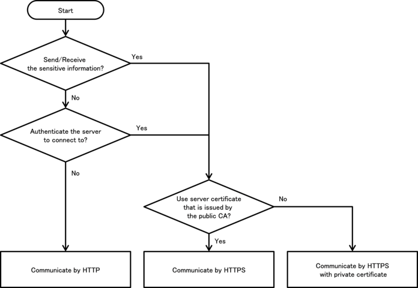
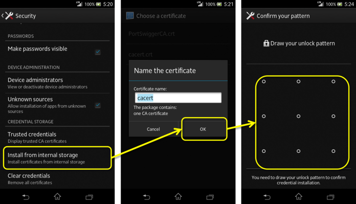
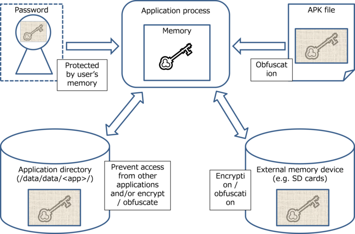

How to use Security Functions
=============================

There are various security functions prepared in Android, like
encryption, digital signature and permission etc. If these security
functions are not used correctly, security functions don\'t work
efficiently and loophole will be prepared. This chapter will explain
how to use the security functions properly.


Creating Password Input Screens
-------------------------------

### Sample Code<!-- fac12c7b -->

When creating password input screen, some points to be considered in
terms of security, are described here. Only what is related to
password input is mentioned, here. Regarding how to save password,
another articles is planned to be published is future edition.

```eval_rst
.. image:: media/image57.png
   :width: 50%
```

Figure 5.1‑1

```eval_rst
**Points:**

1.  The input password should be mask displayed (Display with \*)

2. Provide the option to display the password in a plain text.

3. Alert a user that displaying password in a plain text has a risk.

**Points: When handling the last Input password, pay attention the following points along with the above points.**

4. In the case there is the last input password in an initial display, display the fixed digit numbers of black dot as dummy in order not that the digits number of last password is guessed.

5. When the dummy password is displayed and the \"Show password\" button is pressed, clear the last input password and provide the state for new password input.

6. When last input password is displayed with dummy, in case user tries to input password, clear the last input password and treat new user input as a new password.
```


password_activity.xml
```eval_rst
.. literalinclude:: CodeSamples/Password PasswordInputUI.app.src.main.res.layout.password_activity.xml
   :language: xml
   :encoding: shift-jis
```


Implementation for 3 methods which are located at the bottom of
PasswordActivity.java, should be adjusted depends on the purposes.

-   private String getPreviousPassword()

-   private void onClickCancelButton(View view)

-   private void onClickOkButton(View view)

PasswordActivity.java
```eval_rst
.. literalinclude:: CodeSamples/Password PasswordInputUI.PasswordActivity.java
   :language: java
   :encoding: shift-jis
```


### Rule Book<!-- c4ed2029 -->

Follow the below rules when creating password input screen.

1.  Provide the Mask Display Feature, If the Password Is Entered
    (Required)

2.  Provide the Option to Display Password in a Plain Text (Required)

3.  Mask the Password when Activity Is Launched (Required)

4.  When Displaying the Last Input Password, Dummy Password Must Be
    Displayed (Required)

#### Provide the Mask Display Feature, If the Password Is Entered (Required)

Smartphone is often used in crowded places like in a train or in a
bus, and the risk that password is peeked by someone. So the function
to mask display password is necessary as an application spec.

There are two ways to display the EditText as password: specifying
this statically in the layout XML, or specifying this dynamically by
switching the display from a program. The former is achieved by
specifying "textPassword" for the android:inputType attribute or by
using android:password attribute. The latter is achieved by using the
setInputType() method of the EditText class to add
InputType.TYPE\_TEXT\_VARIATION\_PASSWORD to its input type.

Sample code of each of them is shown below.

Masking password in layout XML.

password\_activity.xml
```xml
    <!-- Password input item -->
    <!-- Set true for the android:password attribute -->
    <EditText
        android:id="@+id/password_edit"
        android:layout_width="fill_parent"
        android:layout_height="wrap_content"
        android:hint="@string/hint_password"
        android:password="true" />
```

Masking password in Activity.

PasswordActivity.java
```java
        // Set password display type
        // Set TYPE_TEXT_VARIATION_PASSWORD for InputType.
        EditText passwordEdit = (EditText) findViewById(R.id.password_edit);
        int type = InputType.TYPE_CLASS_TEXT
                | InputType.TYPE_TEXT_VARIATION_PASSWORD;
        passwordEdit.setInputType(type);
```

#### Provide the Option to Display Password in a Plain Text (Required)

Password input in Smartphone is done by touch panel input, so compared
with keyboard input in PC, miss input may be easily happened. Because
of the inconvenience of inputting, user may use the simple password,
and it makes more dangerous. In addition, when there\'s a policy like
account is locked due the several times of password input failure,
it\'s necessary to avoid from miss input as much as possible. As a
solution of these problems, by preparing an option to display password
in a plain text, user can use the safe password.

However, when displaying password in a plain text, it may be sniffed,
so when using this option. It\'s necessary to call user cautions for
sniffing from behind. In addition, in case option to display in a
plain text is implemented, it\'s also necessary to prepare the system
to auto cancel the plain text display like setting the time of plain
display. The restrictions for password plain text display are
published in another article in future edition. So, the restrictions
for password plain text display are not included in sample code.


Figure 5.1‑2

By specifying InputType of EditText, mask display and plain text
display can be switched.

PasswordActivity.java
```java
    /**
     * Process when check of password display option is changed.
     */
    private class OnPasswordDisplayCheckedChangeListener implements
            OnCheckedChangeListener {

        public void onCheckedChanged(CompoundButton buttonView,
                boolean isChecked) {
            // *** POINT 5 *** When the dummy password is displayed and the "Show password" button is pressed,
            // Clear the last input password and provide the state for new password input.
            if (mIsDummyPassword && isChecked) {
                // Set dummy password flag
                mIsDummyPassword = false;
                // Set password empty
                mPasswordEdit.setText(null);
            }

            // Cursor position goes back the beginning, so memorize the current cursor position.
            int pos = mPasswordEdit.getSelectionStart();

            // *** POINT 2 *** Provide the option to display the password in a plain text
            // Create InputType
            int type = InputType.TYPE_CLASS_TEXT;
            if (isChecked) {
                // Plain display when check is ON.
                type |= InputType.TYPE_TEXT_VARIATION_VISIBLE_PASSWORD;
            } else {
                // Masked display when check is OFF.
                type |= InputType.TYPE_TEXT_VARIATION_PASSWORD;
            }

            // Set InputType to password EditText
            mPasswordEdit.setInputType(type);

            // Set cursor position
            mPasswordEdit.setSelection(pos);
        }

    }
```

#### Mask the Password when Activity Is Launched (Required)

To prevent it from a password peeping out, the default value of
password display option, should be set OFF, when Activity is launched.
The default value should be always defined as safer side, basically.

#### When Displaying the Last Input Password, Dummy Password Must Be Displayed (Required)

When specifying the last input password, not to give the third party
any hints for password, it should be displayed as dummy with the fixed
digits number of mask characters (\* etc.). In addition, in the case
pressing \"Show password\" when dummy display, clear password and
switch to plain text display mode. It can help to suppress the risk
that the last input password is sniffed low, even if the device is
passed to a third person like when it\'s stolen. FYI, In case of dummy
display and when a user tries to input password, dummy display should
be cancelled, it necessary to turn the normal input state.

When displaying the last Input password, display dummy password.

PasswordActivity.java
```java

    @Override
    public void onCreate(Bundle savedInstanceState) {

        super.onCreate(savedInstanceState);
        setContentView(R.layout.password_activity);

        // Get View
        mPasswordEdit = (EditText) findViewById(R.id.password_edit);
        
        mPasswordDisplayCheck = (CheckBox);
        findViewById(R.id.password_display_check);

        // Whether last Input password exist or not.
        if (getPreviousPassword() != null) {
            // *** POINT 4 *** In the case there is the last input password in an initial display,
            // display the fixed digit numbers of black dot as dummy in order not that the digits number of last password is guessed.
            // Display should be dummy password.
            mPasswordEdit.setText("**********");
            // To clear the dummy password when inputting password, set text change listener.
            mPasswordEdit.addTextChangedListener(new PasswordEditTextWatcher());
            // Set dummy password flag
            mIsDummyPassword = true;
        }

        [...]

    }

    /**
     * Get the last input password.
     *
     * @return the last input password
     */
    private String getPreviousPassword() {
        // To restore the saved password, return the password character string.
        // For the case password is not saved, return null.
        return "hirake5ma";
    }
```

In the case of dummy display, when password display option is turned
ON, clear the displayed contents.

PasswordActivity.java
```java
    /**
     * Process when check of password display option is changed.
     */
    private class OnPasswordDisplayCheckedChangeListener implements
            OnCheckedChangeListener {

        public void onCheckedChanged(CompoundButton buttonView,
                boolean isChecked) {
            // *** POINT 5 *** When the dummy password is displayed and the "Show password" button is pressed,
            // Clear the last input password and provide the state for new password input.
            if (mIsDummyPassword && isChecked) {
                // Set dummy password flag
                mIsDummyPassword = false;
                // Set password empty
                mPasswordEdit.setText(null);
            }

            [...]

        }

    }
```

In case of dummy display, when user tries to input password, clear
dummy display.

PasswordActivity.java
```java
    // Key to save the state
    private static final String KEY_DUMMY_PASSWORD = "KEY_DUMMY_PASSWORD";

    [...]

    // Flag to show whether password is dummy display or not.
    private boolean mIsDummyPassword;

    @Override
    public void onCreate(Bundle savedInstanceState) {

        [...]

        // Whether last Input password exist or not.
        if (getPreviousPassword() != null) {
            // *** POINT 4 *** In the case there is the last input password in an initial display,
            // display the fixed digit numbers of black dot as dummy in order not that the digits number of last password is guessed.

            // Display should be dummy password.
            mPasswordEdit.setText("**********");
            // To clear the dummy password when inputting password, set text change listener.
            mPasswordEdit.addTextChangedListener(new PasswordEditTextWatcher());
            // Set dummy password flag
            mIsDummyPassword = true;
        }

        [...]

    }

    @Override
    public void onSaveInstanceState(Bundle outState) {
        super.onSaveInstanceState(outState);

        // Unnecessary when specifying not to regenerate Activity by the change in screen aspect ratio.
        // Save Activity state
        outState.putBoolean(KEY_DUMMY_PASSWORD, mIsDummyPassword);
    }

    @Override
    public void onRestoreInstanceState(Bundle savedInstanceState) {
        super.onRestoreInstanceState(savedInstanceState);

        // Unnecessary when specifying not to regenerate Activity by the change in screen aspect ratio.
        // Restore Activity state
        mIsDummyPassword = savedInstanceState.getBoolean(KEY_DUMMY_PASSWORD);
    }

    /**
     * Process when inputting password.
     */
    private class PasswordEditTextWatcher implements TextWatcher {

        public void beforeTextChanged(CharSequence s, int start, int count,
                int after) {
            // Not used
        }

        public void onTextChanged(CharSequence s, int start, int before,
                int count) {
            // *** POINT 6 *** When last Input password is displayed as dummy, in the case an user tries to input password,
            // Clear the last Input password, and treat new user input as new password.
            if (mIsDummyPassword) {
                // Set dummy password flag
                mIsDummyPassword = false;
                // Trim space
                CharSequence work = s.subSequence(start, start + count);
                mPasswordEdit.setText(work);
                // Cursor position goes back the beginning, so bring it at the end.
                mPasswordEdit.setSelection(work.length());
            }
        }

        public void afterTextChanged(Editable s) {
            // Not used
        }

    }
```

### Advanced Topics<!-- c699a7d7 -->

#### Login Process

The representative example of where password input is required is
login process. Here are some Points that need cautions in Login
process.

##### Error message when login fail

In login process, need to input 2 information which is ID(account) and
password. When login failure, there are 2 cases. One is ID doesn\'t
exist. Another is ID exists but password is incorrect. If either of
these 2 cases is distinguished and displayed in a login failure
message, attackers can guess whether the specified ID exists or not.
To stop this kind of guess, these 2 cases should not be specified in
login failure message, and this message should be displayed as per
below.

Message example: Login ID or password is incorrect.

##### Auto Login function

There is a function to perform auto login by omitting login
ID/password input in the next time and later, after successful login
process has been completed once. Auto login function can omit the
complicated input. So the convenience will increase, but on the other
hand, when a Smartphone is stolen, the risk which is maliciously being
used by the third party, will follow.

Only the use when damages caused by the malicious third party is
somehow acceptable, or only in the case enough security measures can
be taken, auto login function can be used. For example, in the case of
online banking application, when the device is operated by the third
party, financial damage may be caused. So in this case, security
measures are necessary along with auto login function. There are some
possible counter-measures, like \[Require re-inputting password just
before financial process like payment process occurs\], \[When setting
auto login, call a user for enough attentions and prompt user to
secure device lock\], etc. When using auto login, it\'s necessary to
investigate carefully considering the convenience and risks along with
the assumed counter measures.

#### Changing Password

When changing the password which was once set, following input items
should be prepared on the screen.

-   Current password

-   New password

-   New password (confirmation)

When auto login function is introduced, there are possibilities that
third party can use an application. In that case, to avoid from
changing password unexpectedly, it\'s necessary to require the current
password input. In addition, to decrease the risk of getting into
unserviceable state due to miss inputting new password, it\'s
necessary to require new password input 2 times.

#### Regarding \"Make passwords visible\" Setting

There is a setting in Android\'s setting menu, called \"Make passwords
visible.\" In case of Android 4.4, it\'s shown as below.
```
Setting > Security > Make passwords visible
```

There is a setting in Android\'s setting menu, called \"Make passwords
visible.\" In case of Android 4.4, it\'s shown as below.

```eval_rst
.. image:: media/image59.png
   :width: 50%
```

Figure 5.1‑3

When turning ON \"Make passwords visible\" setting, the last input
character is displayed in a plain text. After the certain time (about
2 seconds) passed, or after inputting the next character, the
characters which was displayed in a plain text is masked. When turning
OFF, it\'s masked right after inputting. This setting affects overall
system, and it\'s applied to all applications which use password
display function of EditText.


Figure 5.1‑4

#### Disabling Screen Shot

In password input screens, passwords could be displayed in the clear
on the screens. In such screens as handle personal information, they
could be leaked from screenshot files stored on external storage if
the screenshot function is stayed enable as default. Thus it is
recommended to disable the screenshot function for such screens as
password input screens. The screenshot can be disabled by appending
the following code.

PasswordActivity.java
```java
    @Override
    [...]
    Window window = getWindow();
    window.addFlags(WindowManager.LayoutParams.FLAG_SECURE);
    setContentView(R.layout.passwordInputScreen);
    [...]
```

Permission and Protection Level
-------------------------------

There are four types of Protection Level within permission and they
consist of normal, dangerous, signature, and signatureOrSystem.
Depending on the Protection Level, permission is referred to as normal
permission, dangerous permission, signature permission, or
signatureOrSystem permission. In the following sections, such names
are used.

### Sample Code<!-- 93d9a76c -->

#### How to Use System Permissions of Android OS
```eval_rst
Android OS has a security mechanism called \"permission\" that
protects its user\'s assets such as contacts and a GPS feature from a
malware. When an application seeks access to such information and/or
features, which are protected under Android OS, the application needs
to explicitly declare a permission in order to access them. When an
application, which has declared a permission that needs user\'s
consent to be used, is installed, the following confirmation screen
appears
[27]_.

.. [27] In Android 6.0 (API Level 23) and later, the granting or refusal
    of user permissions does not occur when an app is installed, but
    instead at runtime when then app requests permissions. For more
    details, see Section　"5.2.1.4　Methods for using Dangerous
    Permissions in Android 6.0 and later"　and Section
    "5.2.3.6　Modifications to the Permission model specifications in
    Android versions 6.0 and later".
```

```eval_rst
.. image:: media/image61.png
   :width: 50%
```


Figure 5.2‑1

From this confirmation screen, a user is able to know which types of
features and/or information an application is trying to access. If the
behavior of an application is trying to access features and/or
information that are clearly unnecessary, then there is a high
possibility that the application is a malware. Hence, as your
application is not suspected to be a malware, declarations of
permission to use needs to be minimized.

Points:

1.  Declare a permission used in an application with uses-permission.
2.  Do not declare any unnecessary permissions with uses-permission.

AndroidManifest.xml
```eval_rst
.. literalinclude:: CodeSamples/Permission UsesPermission.app.src.main.AndroidManifest.xml
   :language: xml
   :encoding: shift-jis
```

#### How to Communicate Between In-house Applications with In-house-defined Signature Permission

Besides system permissions defined by Android OS, an application can
define its own permissions as well. If using an in-house-defined
permission (it is an in-house-defined signature permission to be more
precise), you can build a mechanism where only communications between
in-house applications is permitted. By providing the composite
function based on inter-application communication between multiple
in-house applications, the applications get more attractive and your
business could get more profitable by selling them as series. It is a
case of using in-house-defined signature permission.

The sample application \"In-house-defined Signature Permission
(UserApp)\" launches the sample application \"In-house-defined
Signature Permission (ProtectedApp)\" with Context.startActivity()
method. Both applications need to be signed with the same developer
key. If keys for signing them are different, the UserApp sends no
Intent to the ProtectedApp, and the ProtectedApp processes no Intent
received from the UserApp. Furthermore, it prevents malwares from
circumventing your own signature permission using the matter related
to the installation order as explained in the Advanced Topic section.


```eval_rst
.. {width="6.889763779527559in"
.. height="2.0933070866141734in"}
```

Figure 5.2‑2

Points: Application Providing Component

1.  Define a permission with protectionLevel=\"signature\".
2.  For a component, enforce the permission with its permission attribute.
3.  If the component is an activity, you must define no intent-filter.
4.  At run time, verify if the signature permission is defined by itself on the program code.
5.  When exporting an APK, sign the APK with the same developer key that applications using the component use.

AndroidManifest.xml
```eval_rst
.. literalinclude:: CodeSamples/Permission CustomSignaturePermission ProtectedApp.permissionCustomSignaturePermissionProtectedApp.src.main.AndroidManifest.xml
   :language: xml
   :encoding: shift-jis
```

ProtectedActivity.java
```eval_rst
.. literalinclude:: CodeSamples/Permission CustomSignaturePermission ProtectedApp.ProtectedActivity.java
   :language: java
   :encoding: shift-jis
```


SigPerm.java
```eval_rst
.. literalinclude:: CodeSamples/JSSEC Shared.SigPerm.java
   :language: java
   :encoding: shift-jis
```

PkgCert.java
```eval_rst
.. literalinclude:: CodeSamples/JSSEC Shared.PkgCert.java
   :language: java
   :encoding: shift-jis
```


*** Point 5 *** When exporting an APK, sign the APK with the
same developer key that applications using the component have used.


```eval_rst
.. {width="4.646481846019247in"
.. height="3.2817082239720037in"}
```

Figure 5.2‑3

Points: Application Using Component

```eval_rst
6.  The same signature permission that the application uses must not be
    defined.

7.  Declare the in-house permission with uses-permission tag.

8.  Verify if the in-house signature permission is defined by the
    application that provides the component on the program code.

9.  Verify if the destination application is an in-house application.

10. Use an explicit intent when the destination component is an
    activity.

11. When exporting an APK, sign the APK with the same developer key that
    the destination application uses.
```

AndroidManifest.xml
```eval_rst
.. literalinclude:: CodeSamples/Permission CustomSignaturePermission UserApp.permissionCustomSignaturePermissionUserApp.src.main.AndroidManifest.xml
   :language: xml
   :encoding: shift-jis
```

UserActivity.java
```eval_rst
.. literalinclude:: CodeSamples/Permission CustomSignaturePermission UserApp.UserActivity.java
   :language: java
   :encoding: shift-jis
```

PkgCertWhitelists.java
```eval_rst
.. literalinclude:: CodeSamples/JSSEC Shared.PkgCertWhitelists.java
   :language: java
   :encoding: shift-jis
```

PkgCert.java
```eval_rst
.. literalinclude:: CodeSamples/JSSEC Shared.PkgCert.java
   :language: java
   :encoding: shift-jis
```


*** Point 11 *** When generating an APK by \[Build\] -\>
\[Generate Signed APK\], sign the APK with the same developer key that
the destination application uses.


```eval_rst
.. {width="4.646481846019247in"
.. height="3.2817082239720037in"}
```

Figure 5.2‑4

#### How to Verify the Hash Value of an Application\'s Certificate

We will provide an explanation on how to verify the hash value of an
application\'s certificate that appears at different points in this
Guidebook. Strictly speaking, the hash value means \"the SHA256 hash
value of the public key certificate for the developer key used to sign
the APK.\"

##### How to verify it with Keytool

Using a program called keytool that is bundled with JDK, you can get
the hash value (also known as certificate fingerprint) of a public key
certificate for the developer key. There are various hash methods such
as MD5, SHA1, and SHA256 due to the differences in hash algorithm.
However, considering the security strength of the encryption bit
length, this Guidebook recommends the use of SHA256. Unfortunately,
the keytool bundled to JDK6 that is used in Android SDK does not
support SHA256 for calculating hash values. Therefore, it is necessary
to use the keytool that is bundled to JDK7 or later.

Example of outputting the content of a debugging certicate of an
Android through a keytool
```shell
> keytool -list -v -keystore <キーストアファイル> -storepass <パスワード>

Type of keystore: JKS
Keystore provider: SUN

One entry is included in a keystore

Other name: androiddebugkey
Date of creation: 2012/01/11
Entry type: PrivateKeyEntry
Length of certificate chain: 1
Certificate[1]:
Owner: CN=Android Debug, O=Android, C=US
Issuer: CN=Android Debug, O=Android, C=US
Serial number: 4f0cef98
Start date of validity period: Wed Jan 11 11:10:32 JST 2012 End date: Fri Jan 03 11:10:32 JST 2042
Certificate fingerprint:
         MD5:  9E:89:53:18:06:B2:E3:AC:B4:24:CD:6A:56:BF:1E:A1
         SHA1: A8:1E:5D:E5:68:24:FD:F6:F1:ED:2F:C3:6E:0F:09:A3:07:F8:5C:0C
         SHA256: FB:75:E9:B9:2E:9E:6B:4D:AB:3F:94:B2:EC:A1:F0:33:09:74:D8:7A:CF:42:58:22:A2:56:85:1B:0F:85:C6:35
         Signatrue algorithm name: SHA1withRSA
         Version: 3


*******************************************
*******************************************
```

##### How to Verify it with JSSEC Certificate Hash Value Checker

Without installing JDK7 or later, you can easily verify the
certificate hash value by using JSSEC Certificate Hash Value Checker.

```eval_rst
.. image:: media/image63.png
   :width: 50%
```

Figure 5.2‑5

This is an Android application that displays a list of certificate
hash values of applications which are installed in the device. In the
Figure above, the 64-character hexadecimal notation string that is
shown on the right of \"sha-256\" is the certificate hash value. The
sample code folder, \"JSSEC CertHash Checker\" that comes with this
Guidebook is the set of source codes. If you would like, you can
compile the codes and use it.

#### Methods for using Dangerous Permissions in Android 6.0 and later

Android 6.0 (API Level 23) incorporates modified specifications that
are relevant to the implementation of apps\-\--specifically, to the
times at which apps are granted permission.

Under the Permission model of Android 5.1 (API Level 22) and earlier
versions (See section

"5.2.3.6 Modifications to the Permission model specifications in
Android versions 6.0 and later"), all Permissions declared by an app
are granted to that app at the time of installation. However, in
Android 6.0 and later versions, app developers must explicitly
implement apps in such a way that, for Dangerous Permissions, the app
requests Permission at appropriate times. When an app requests a
Permission, a confirmation window like that shown below is displayed
to the Android OS user, requesting a decision from the user as to
whether or not to grant the Permission in question. If the user allows
the use of the Permission, the app may execute whatever operations
require that Permission.

```eval_rst
.. image:: media/image64.png
   :width: 50%
```


Figure 5.2‑6

The specifications are also modified regarding the units in which
Permissions are granted. Previously, all Permissions were granted
simultaneously; in Android 6.0 (API Level 23) and later versions,
Permissions are granted by Permission Group. In Android 8.0 (API 
Level 26) and later versions, Permissions are granted individually. In
conjunction with this modification, users are now shown individual
confirmation windows for each Permission, allowing users to make more
flexible decisions regarding the granting or refusal of Permissions.
App developers must revisit the specifications and design of their
apps with full consideration paid to the possibility that Permissions
may be refused.

For details on the Permission model in Android 6.0 and later, see
Section "5.2.3.6 Modifications to the Permission model specifications
in Android versions 6.0 and later".

Points:

1.  Apps declare the Permissions they will use
2.  Do not declare the use of unnecessary Permissions
3.  Check whether or not Permissions have been granted to the app
4.  Request Permissions (open a dialog to request permission from users)
5.  Implement appropriate behavior for cases in which the use of a Permission is refused

AndroidManifest.xml
```eval_rst
.. literalinclude:: CodeSamples/PermissionRequestingPermissionAtRunTime.app.src.main.AndroidManifest.xml
   :language: xml
   :encoding: shift-jis
```


MainActivity.java
```eval_rst
.. literalinclude:: CodeSamples/PermissionRequestingPermissionAtRunTime.MainActivity.java
   :language: java
   :encoding: shift-jis
```


### Rule Book<!-- 9e17b769 -->

Be sure to follow the rules below when using in-house permission.

1.  System Dangerous Permissions of Android OS Must Only Be Used for Protecting User Assets (Required)

2.  Your Own Dangerous Permission Must Not Be Used (Required)

3.  Your Own Signature Permission Must Only Be Defined on the Provider-side Application (Required)

4.  Verify If the In-house-defined Signature Permission Is Defined by an In-house Application (Required)

5.  Your Own Normal Permission Should Not Be Used (Recommended)

6.  The String for Your Own Permission Name Should Be of an Extent of the Package Name of Application (Recommended)

#### System Dangerous Permissions of Android OS Must Only Be Used for Protecting User Assets (Required)

Since the use of your own dangerous permission is not recommended
(please refer to \"5.2.2.2 Your Own Dangerous Permission Must Not Be
Used (Required)\", we will proceed on the premise of using system
dangerous permission of Android OS.

Unlike the other three types of permissions, dangerous permission has
a feature that requires the user\'s consent to the grant of the
permission to the application. When installing an application on a
device that has declared a dangerous permission to use, the following
screen will be displayed. Subsequently, the user is able to know what
level of permission (dangerous permission and normal permission) the
application is trying to use. When the user taps \"install,\" the
application will be granted the permission and then it will be
installed.

```eval_rst
.. image:: media/image61.png
   :width: 50%
```


Figure 5.2‑7

An application can handle user assets and assets that the developer
wants to protect. We must be aware that dangerous permission can
protect only user assets because the user is just who the granting of
permission is entrusted to. On the other hand, assets that the
developer wants to protect cannot be protected by the method above.

For example, suppose that an application has a Component that
communicates only with an In-house application, it doesn\'t permit the
access to the Component from any applications of the other companies,
and it is implemented that it\'s protected by dangerous permission.
When a user grants permission to an application of another company
based on the user\'s judgment, in-house assets that need to be
protected may be exploited by the application granted. In order to
provide protection for in-house assets in such cases, we recommend the
usage of in-house-defined signature permission.

#### Your Own Dangerous Permission Must Not Be Used (Required)

Even when in-house-defined Dangerous Permission is used, the screen
prompt \"Asking for the Allowance of Permission from User\" is not
displayed in some cases. This means that at times the feature that
asks for permission based on the judgment of a user, which is the
characteristic of Dangerous Permission, does not function.
Accordingly, the Guidebook will make the rule \"In-house -defined
dangerous permission must not be used.\"

In order to explain it, we assume two types of applications. The first
type of application defines an in-house dangerous permission, and it
is an application that makes a Component, which is protected by this
permission, public. We call this ProtectedApp. The other is another
application which we call AttackerApp and it tries to exploit the
Component of ProtectedApp. Also we assume that the AttackerApp not
only declares the permission to use it, but also defines the same
permission.

AttackerApp can use the Component of a ProtectedApp without the
consent of a user in the following cases:

1.  When the user installs the AttackerApp, the installation will be
    completed without the screen prompt that asks for the user to
    grant the application the dangerous permission.

2.  Similarly, when the user installs the ProtectedApp, the installation
    will be completed without any special warnings.

3.  When the user launches the AttackerApp afterwards, the AttackerApp
    can access the Component of the ProtectedApp without being
    detected by the user, which can potentially lead to damage.

The cause of this case is explained in the following. When the user
tries to install the AttackerApp first, the permission that has been
declared for usage with uses-permission is not defined on the
particular device yet. Finding no error, Android OS will continue the
installation. Since the user consent for dangerous permission is
required only at the time of installation, an application that has
already been installed will be handled as if it has been granted
permission. Accordingly, if the Component of an application which is
installed later is protected with the dangerous permission of the same
name, the application which was installed beforehand without the user
permission will be able to exploit the Component.

Furthermore, since the existence of system dangerous permissions
defined by Android OS is guaranteed when an application is installed,
the user verification prompt will be displayed every time an
application with uses-permission is installed. This problem arises
only in the case of self-defined dangerous permission.

At the time of this writing, no viable method to protect the access to
the Component in such cases has been developed yet. Therefore, your
own dangerous permission must not be used.

#### Your Own Signature Permission Must Only Be Defined on the Provider-side Application (Required)

As demonstrated in, \"5.2.1.2 How to Communicate Between In-house
Applications with In-house-defined Signature Permission,\" the
security can be assured by checking the signature permission at the
time of executing inter-communications between In-house applications.
When using this mechanism, the definition of the permission whose
Protection Level is signature must be written in AndroidManifest.xml
of the provider-side application that has the Component, but the
user-side application must not define the signature permission.

This rule is applied to signatureOrSystem　Permission　as well.

The reason for this is as follows.

We assume that there are multiple user-side applications that have
been installed prior to the provider-side application and every
user-side application not only has required the signature permission
that the provider-side application has defined, but also has defined
the same permission. Under these circumstances, all user-side
applications will be able to access the provider-side application just
after the provider-side application is installed. Subsequently, when
the user-side application that was installed first is uninstalled, the
definition of the permission also will be deleted and then the
permission will turn out to be undefined. As a result, the remaining
user-side applications will be unable to access to the provider-side
application.

```eval_rst
In this manner, when the user-side application defines a self-defined
permission, it can unexpectedly turn out the permission to be
undefined. Therefore, only the provider-side application providing the
Component that needs to be protected should define the permission, and
defining the permission on the user-side must be avoided.

By doing as mentioned just above, the self-defined permission will be
applied by Android OS at the time of the installation of the
provider-side application, and the permission will turn out to be
undefined at the time of the uninstallation of the application.
Therefore, since the existence of the permission\'s definition always
corresponds to that of the provider-side application, it is possible
to provide an appropriate Component and protect it. Please be aware
that this argument stands because regarding in-house-defined signature
permission the user-side application is granted the permission
regardless of the installation order of applications in
inter-communication
[28]_.

.. [28] If using normal/dangerous permission, the permission will not be
    granted the user-side application if the user-side application is
    installed before the provider-side application, the permission
    remains undefined. Therefore, the Component cannot be accessed even
    after the provider-side application has been installed.
```

#### Verify If the In-house-defined Signature Permission Is Defined by an In-house Application (Required)

Actuality, you cannot say to be secure enough only by declaring a
signature permission through AnroidManifest.xml and protecting the
Component with the permission. For the details of this issue, please
refer to, \"5.2.3.1 Characteristics of Android OS that Avoids
Self-defined Signature Permission and Its Counter-measures\" in the
Advanced Topics section.

The following are the steps for using in-house-defined signature
permission securely and correctly.

First, write as the followings in AndroidManifest.xml:
```eval_rst
1.  Define an in-house signature permission in the AndroidManifest.xml
    of the provider-side application. (definition of permission)<br/>
    Example: \<permission android:name=\"xxx\"
    android:protectionLevel=\"signature\" /\>

2.  Enforce the permission with the permission attribute of the
    Component to be protected in the AndroidManifest.xml of the
    provider-side application. (enforcement of permission)<br/>
    Example: \<activity android:permission=\"xxx\"
    \... \>\...\</activity\>

3.  Declare the in-house-defined signature permission with the
    uses-permission tag in the AndroidManifest.xml of every user-side
    application to access the Component to be protected. (declaration
    of using permission)<br/>
    Example: \<uses-permission android:name=\"xxx\" /\>

Next, implement the followings in the source code.

4.  Before processing a request to the Component, first verify that the
    in-house-defined signature permission has been defined by an
    in-house application. If not, ignore the request. (protection in the
    provider-side component)

5.  Before accessing the Component, first verify that the
    in-house-defined signature permission has been defined by an
    in-house application. If not, do not access the Component
    (protection in the user-side component).

Lastly, execute the following with the Signing function of Android
Studio.

6.  Sign APKs of all inter-communicating applications with the same
    developer key.
```

Here, for specific points on how to implement \"Verify that the
in-house-defined signature permission has been defined by an In house
application\", please refer to \"5.2.1.2 How to Communicate Between
In-house Applications with In-house-defined Signature Permission\".

This rule is applied to signatureOrSystem　Permission　as well.

#### Your Own Normal Permission Should Not Be Used (Recommended)

An application can use a normal permission just by declaring it with
uses-permission in AndroidManifest.xml. Therefore, you cannot use a
normal permission for the purpose of protecting a Component from a
malware installed.

Furthermore, in the case of inter-application communication with
self-defined normal permission, whether an application can be granted
the permission depends on the order of installation. For example, when
you install an application (user-side) that has declared to use a
normal permission prior to another application (provider-side) that
possesses a Component which has defined the permission, the user-side
application will not be able to access the Component protected with
the permission even if the provider-side application is installed
later.

As a way to prevent the loss of inter-application communication due to
the order of installation, you may think of defining the permission in
every application in the communication. By this way, even if a
user-side application has been installed prior to the provider-side
application, all user-side applications will be able to access the
provider-side application. However, it will create a situation that
the permission is undefined when the user-side application installed
first is uninstalled. As a result, even if there are other user-side
applications, they will not be able to gain access to the
provider-side application.

As stated above, there is a concern of damaging the availability of an
application, thus your own normal permission should not be used.

#### The String for Your Own Permission Name Should Be of an Extent of the Package Name of Application (Recommended)

When multiple applications define permissions under the same name, the
Protection Level that has been defined by an application installed
first will be applied. Protection by signature permission will not be
available in the case that the application installed first defines a
normal permission and the application installed later defines a
signature permission under the same name. Even in the absence of
malicious intent, a conflict of permission names among multiple
applications could cause behavior s of any applications as an
unintended Protection Level. To prevent such accidents, it is
recommended that a permission name extends (starts with) the package
name of the application defining the permission as below.

```
(package name).permission.(identifying string)
```

For example, the following name would be preferred when defining a
permission of READ access for the package of org.jssec.android.sample.

```java
org.jssec.android.sample.permission.READ
```

### Advanced Topics<!-- 8340873a -->

#### Characteristics of Android OS that Avoids Self-defined Signature Permission and Its Counter-measures

Self-defined signature permission is a permission that actualizes
inter-application communication between the applications signed with
the same developer key. Since a developer key is a private key and
must not be public, there is a tendency to use signature permission
for protection only in cases where in-house applications communicate
with each other.

First, we will describe the basic usage of self-defined signature
permission that is explained in the Developer Guide
([http://developer.android.com/guide/topics/security/security.html](http://developer.android.com/guide/topics/security/security.html))
of Android. However, as it will be explained later, there are problems
with regard to the avoidance of permission. Consequently,
counter-measures that are described in this Guidebook are necessary.

The followings are the basic usage of self-defined Signature
Permission.

1.  Define a self-defined signature permission in the
    AndroidManifest.xml of the provider-side application. (definition of
    permission)<br/>
    Example: \<permission android:name=\"xxx\"
    android:protectionLevel=\"signature\" /\>

2.  Enforce the permission with the permission attribute of the
    Component to be protected in the AndroidManifest.xml of the
    provider-side application. (enforcement of permission)<br/>
    Example: \<activity android:permission=\"xxx\"
    \... \>\...\</activity\>

3.  Declare the self-defined signature permission with the
    uses-permission tag in the AndroidManifest.xml of every user-side
    application to access the Component to be protected. (declaration of
    using permission)<br/>
    Example: \<uses-permission android:name=\"xxx\" /\>

4.  Sign APKs of all inter-communicating applications with the same
    developer key.

Actually, if the following conditions are fulfilled, this approach
will create a loophole to avoid signature permission from being
performed.

For the sake of explanation, we call an application that is protected
by self-defined signature permission as ProtectedApp, and AttackerApp
for an application that has been signed by a different developer key
from the ProtectedApp. What a loophole to avoid signature permission
from being performed means is, despite the mismatch of the signature
for AttackerApp, it is possible to gain access to the Component of
ProtectedApp.

1.  An AttackerApp also defines a normal permission (strictly speaking,
    signature permission is also acceptable) under the same name as
    the signature permission which has been defined by the
    ProtectedApp.<br/>
    Example: \<permission android:name=\" xxx\"
    android:protectionLevel=\"normal\" /\>

2.  The AttackerApp declares the self-defined normal permission with
    uses-permission.<br/>
    Example: \<uses-permission android:name=\"xxx\" /\>

3.  The AttackerApp has installed on the device prior to the
    ProtectedApp.


```eval_rst
.. {width="6.5in" height="4.270833333333333in"}
```

Figure 5.2‑8

The permission name that is necessary to meet Condition 1 and
Condition 2 can easily be known by an attacker taking
AndroidManifest.xml out from an APK file. The attacker also could
satisfy Condition 3 with a certain amount of effort (e.g. deceiving a
user).

There is a risk of self-defined signature permission to evade
protection if only the basic usage is adopted, and a counter-measure
to prevent such loopholes is needed. Specifically, you could find how
to solve the above-mentioned issues by using the method described in
\"5.2.2.4 Verify If the In-house-defined Signature Permission Is
Defined by an In-house Application(Required)\".

#### Falsification of AndroidManifest.xml by a User

We have already touched on the case that a Protection Level of
self-defined permission could be changed as not intended. To prevent
malfunctioning due to such cases, it has been needed to implement some
sort of counter-measures on the source-code side of Java. From the
viewpoint of AndroidManifest.xml falsification, we will talk about the
counter-measures to be taken on the source-code side. We will
demonstrate a simple case of installation that can detect
falsifications. However, please note that these counter-measures are
little effective against professional hackers who falsify with
criminal intent.

This section is about the falsification of an application and users
with malicious intent. Although this is originally outside of the
scope of a Guidebook, from the fact that this is related to Permission
and the tools for such falsification are provided in public as Android
applications, we decided to mention it as \"Simple counter-measures
against amateur hackers\".

It must be remembered that applications that can be installed from
market are applications that can be falsified without root privilege.
The reason is that applications that can rebuild and sign APK files
with altered AndroidManifest.xml are distributed. By using these
applications, anyone can delete any permission from applications they
have installed.

As an example, there seems to be cases of rebuilding APKs with
different signatures altering AndroidManifest.xml with INTERNET
permission removed to render advertising modules attached in
applications as useless. There are some users who praise these types
of tools due to the fact that no personal information is leaked
anywhere. As these ads which are attached in applications stop
functioning, such actions cause monetary damage for developers who are
counting on ad revenue. And it is believed that most of the users
don\'t have any compunction.

In the following code, we show an instance of implementation that an
application that has declared INTERNET permission with uses-permission
verifies if INTERNET permission is described in the
AndroidManifest.xml of itself at run time.

```java
public class CheckPermissionActivity extends Activity {
    
    @Override
    public void onCreate(Bundle savedInstanceState) {
        super.onCreate(savedInstanceState);
        setContentView(R.layout.main);
        
        // Acquire Permission defined in AndroidManifest.xml
        List<String> list = getDefinedPermissionList();
        
        // Detect falsification
        if( checkPermissions(list) ){
            // OK
            Log.d("dbg", "OK.");
        }else{
            Log.d("dbg", "manifest file is stale.");
            finish();
        }
    }

    /**
     * Acquire Permission through list that was defined in AndroidManifest.xml
     * @return
     */
    private List<String> getDefinedPermissionList(){
        List<String> list = new ArrayList<String>();
        list.add("android.permission.INTERNET");
        return list;
    }
    
    /**
     * Verify that Permission has not been changed Permission
     * @param permissionList
     * @return
     */
    private boolean checkPermissions(List<String> permissionList){
        try {
            PackageInfo packageInfo = getPackageManager().getPackageInfo(
                    getPackageName(), PackageManager.GET_PERMISSIONS);
            String[] permissionArray = packageInfo.requestedPermissions;
            if (permissionArray != null) {
                for (String permission : permissionArray) {
                    if(! permissionList.remove(permission)){
                        // Unintended Permission has been added
                        return false;
                    }
                }
            }
            
            if(permissionList.size() == 0){
                // OK
                return true;
            }
            
        } catch (NameNotFoundException e) {
        }
        
        return false;
    }
}
```

#### Detection of APK Falsification

We explained about detecting the falsification of permissions by a
user in \"5.2.3.2 Falsification of AndroidManifest.xml by a User\".
However, the falsification of applications is not limited to
permission only, and there are many other cases where applications are
appropriated without any changes in the source code. For example, it
is a case where they distribute other developers\' applications
(falsified) in the market as if they were their own applications just
by replacing resources to their own. Here, we will show a more generic
method to detect the falsification of an APK file.

In order to falsify an APK, it is needed to decode the APK file into
folders and files, modify their contents, and then rebuild them into a
new APK file. Since the falsifier does not have the key of the
original developer, he would have to sign the new APK file with his
own key. As the falsification of an APK inevitably brings with a
change in signature (certificate), it is possible to detect whether an
APK has been falsified at run time by comparing the certificate in the
APK and the developer\'s certificate embedded in the source code as
below.

The following is a sample code. Also, a professional hacker will be
able to easily circumvent the detection of falsification if this
implementation example is used as it is. Please apply this sample code
to your application by being aware that this is a simple
implementation example.

Points:

1.  Verify that an application\'s certificate belongs to the developer
    before major processing is started.


SignatureCheckActivity.java
```eval_rst
.. literalinclude:: CodeSamples/Permission ActivitySignatureCheck.SignatureCheckActivity.java
   :language: java
   :encoding: shift-jis
```


PkgCert.java
```eval_rst
.. literalinclude:: CodeSamples/JSSEC Shared.PkgCert.java
   :language: java
   :encoding: shift-jis
```


#### Permission Re-delegation Problem

An application must declare to use permission when accessing contacts
or GPS with its information and features that are protected by Android
OS. When the permission required is granted, the permission is
delegated to the application and the application would be able to
access the information and features protected with the permission.

Depending on how the program is designed, the application to which has
been delegated (granted) the permission is able to acquire data that
is protected with the permission. Furthermore, the application can
offer another application the protected data without enforcing the
same permission. This is nothing less than permission-less application
to access data that is protected by permission. This is virtually the
same thing as re-delegating the permission, and this is referred to
the Permission Re-delegation Problem. Accordingly, the specification
of the permission mechanism of Android only is able to manage
permission of direct access from an application to protected data.

A specific example is shown in Figure 5.2‑9. The application in the
center shows that an application which has declared
android.permission.READ\_CONTACTS to use it reads contacts and then
stores them into its own database. The Permission Re-delegation
Problem occurs when information that has been stored is offered to
another application without any restriction via Content Provider.


```eval_rst
.. {width="5.375in" height="3.8020833333333335in"}
```

Figure 5.2‑9 An Application without Permission Acquires Contacts

As a similar example, an application that has declared
android.permission.CALL\_PHONE to use it receives a phone number
(maybe input by a user) from another application that has not declared
the same permission. If that number is being called without the
verification of a user, then also there is the Permission
Re-delegation Problem.

There are cases where the secondary provision of another application
with nearly-intact information asset or functional asset acquired with
the permission is needed. In those cases, the provider-side
application must demand the same permission for the provision in order
to maintain the original level of protection. Also, in the case of
only providing a portion of information asset as well as functional
asset in a secondary fashion, an appropriate amount of protection is
necessary in accordance with the degree of damage that is incurred
when a portion of that information or functional asset is exploited.
We can use protective measures such as demanding permission as similar
to the former, verifying user consent, and setting up restrictions for
target applications by using \"4.1.1.1 Creating/Using Private
Activities,\" or \"4.1.1.4 Creating/Using In-house Activities\" etc.

Such Permission Re-delegation Problem is not only limited to the issue
of the Android permission. For an Android application, it is generic
that the application acquires necessary information/functions from
different applications, networks, and storage media. And in many
cases, some permissions as well as restrictions are needed to access
them. For example, if the provider source is an Android application,
it is the permission, if it is a network, then it is the log-in, and
if it is a storage media, there will be access restrictions.
Therefore, such measures need to be implemented for an application
after carefully considering as information/functions are not used in
the contrary manner of the user\'s intention. This is especially
important at the time of providing acquired information/functions to
another application in a secondary manner or transferring to networks
or storage media. Depending on the necessity, you have to enforce
permission or restrict usage like the Android permission. Asking for
the user\'s consent is part of the solution.

In the following code, we demonstrate a case where an application that
acquires a list from the contact database by using READ\_CONTACTS
permission enforces the same READ\_CONTACTS permission on the
information destination source.

Point

1.  Enforce the same permission that the provider does.

AndroidManifest.xml
```xml
<?xml version="1.0" encoding="utf-8"?>
<manifest xmlns:android="http://schemas.android.com/apk/res/android"
    package="org.jssec.android.permission.transferpermission"
    android:versionCode="1"
    android:versionName="1.0" >
    
    <uses-sdk android:minSdkVersion="8" >
    <uses-permission android:name="android.permission.READ_CONTACTS"/>

    <application
        android:icon="@drawable/ic_launcher"
        android:label="@string/app_name"
        android:theme="@style/AppTheme" >
        <activity
            android:name=".TransferPermissionActivity"
            android:label="@string/title_activity_transfer_permission" >
            <intent-filter>
                <action android:name="android.intent.action.MAIN" />
                <category android:name="android.intent.category.LAUNCHER" />
            </intent-filter>
        </activity>

        <!-- *** Point1 *** Enforce the same permission that the rovider does. -->
        <provider
            android:name=".TransferPermissionContentProvider"
            android:authorities="org.jssec.android.permission.transferpermission"
            android:enabled="true"
            android:exported="true"
            android:readPermission="android.permission.READ_CONTACTS" >
        </provider>
    </application>

</manifest>
```

When an application enforces multiple permissions, the above method
will not solve it. By using Context\#checkCallingPermission() or
PackageManager\#checkPermission() from the source code, verify whether
the invoker application has declared all permissions with
uses-permission in the Manifest.

In the case of an Activity

```java
public void onCreate(Bundle savedInstanceState) {
    [...]
	if (checkCallingPermission("android.permission.READ_CONTACTS") == PackageManager.PERMISSION_GRANTED
	 && checkCallingPermission("android.permission.WRITE_CONTACTS") == PackageManager.PERMISSION_GRANTED) {
		// Processing during the time when an invoker is correctly declaring to use
		return;
	}
	finish();
}

```

#### Signature check mechanism for custom permissions (Android 5.0 and later)

In versions of Android 5.0 (API Level 21) and later, the application
which defines its own custom permissions cannot be installed if the
following conditions are met.

1.  Another application which defines its own permission with the same
    name has already installed on the device.

2.  The applications are signed with different keys

When both an application with the protected function (Component) and
an application using the function define their own permission with the
same name and are signed with the same key, the above mechanism will
protect against installation of other company\'s applications which
define their own custom permission with the same name. However, as
mentioned in \"5.2.2.3 Your Own Signature Permission Must Only Be
Defined on the Provider-side Application (Required)\", that mechanism
won\'t work well for checking if a custom permission is defined by
your own company because the permission could be undefined without
your intent by uninstalling applications when plural applications
define the same permission.

To sum it up, also in versions of Android 5.0 (API Level 21) and
later, you are required to comply with the two rules, \"5.2.2.3 Your
Own Signature Permission Must Only Be Defined on the Provider-side
Application (Required)\" and \"5.2.2.4 Verify If the In-house-defined
Signature Permission Is Defined by an In-house Application
(Required)\" when your application defines your own Signature
Permission.

#### Modifications to the Permission model specifications in Android versions 6.0 and later

Android 6.0 (API Level 23) introduces modified specifications for the
Permission model that affect both the design and specifications of
apps. In this section we offer an overview of the Permission model in
Android 6.0 and later. We also describe modifications made in Android
8.0 and later.

##### The timing of permission grants and refusals

In cases where an app declares use of permissions requiring user
confirmation (Dangerous Permissions) \[see Section "5.2.2.1 System
Dangerous Permissions of Android OS Must Only Be Used for Protecting
User Assets (Required)"\], the specifications for Android 5.1 (API
level 22) and earlier versions called for a list of such permissions
to be displayed when the app is installed, and the user must grant all
permissions for the installation to proceed. At this point, all
permissions declared by the app (including permissions other than
Dangerous Permissions) were granted to the app; once these permissions
were granted to the app, they remained in effect until the app was
uninstalled from the terminal.
```eval_rst
However, in the specifications for Android 6.0 and later versions, the
granting of permissions takes place when an app is executed. The
granting of permissions, and user confirmation of permissions, does
not take place when the app is installed. When an app executes a
procedure that requires Dangerous Permissions, it is necessary to
check whether or not those permissions have been granted to the app in
advance; if not, a confirmation window must be displayed in Android OS
to request permission from the user
[29]_.If the user grants
permission from the confirmation window, the permissions are granted
to the app. However, permissions granted to an app by a user
(Dangerous Permissions) may be revoked at any time via the Settings
menu (Figure 5.2‑10). For this reason, appropriate procedures must be
implemented to ensure that apps cause no irregular behavior even in
situations in which they cannot access needed information or
functionality because permission has not been granted.

.. [29] Because Normal Permissions and Signature Permissions are
    automatically granted by Android OS, there is no need to obtain user
    confirmation for these permissions.
```
```eval_rst
.. image:: media/image67.png
   :width: 50%
```

Figure 5.2‑10

##### Units of permission grants and refusals

Multiple Permissions may be grouped together into what is known as a
Permission Group based on their functions and type of information
relevant to them. For example, the Permission
android.permission.READ\_CALENDAR, which is required to read calendar
information, and the Permission android.permission.WRITE\_CALENDAR,
which is required to write calendar information, are both affiliated
with the Permission Group named android.permission-group.CALENDAR.

In the Permission model for Android 6.0 (API Level 23) and later,
privileges are granted or denied at the block-unit level of the
Permission Group, as shown here. However, developers must be careful
to note that the block unit may vary depending on the combination of
OS and SDK (see below).

-   For terminals running Android 6.0 (API Level 23) or later and app
    targetSdkVersion: 23\~25

If android.permission.READ\_CALENDAR and
android.permission.WRITE\_CALENDAR are listed in the Manifest, then
when the app is launched a request for
android.permission.READ\_CALENDAR is issued; if the user grants this
permission, Android OS determines that both
android.permission.READ\_CALENDAR and
android.permission.WRITE\_CALENDAR are permitted for use and thus
grants the permission.

-   For terminals running Android 8.0 (API Level 26） or later and app
    targetSdkVersion 26 and above:

```eval_rst
Only requested Permissions are granted. Thus, even if
android.permission.READ\_CALENDAR and
android.permission.WRITE\_CALENDAR are both listed, if only
android.permission.READ\_CALENDAR has been requested and granted by
the user, then only android.permission.READ\_CALENDAR will be granted.
Thereafter, if android.permission.WRITE\_CALENDAR is requested, the
permission will be granted immediately with no dialog box shown to the
user
[30]_.

.. [30] In this case as well, the app must declare usage of both
    android.permission.READ\_CALENDAR and
    android.permission.WRITE\_CALENDAR.
```
Also, in contrast to the granting of permissions, cancelling of
permissions from the settings menu is carried out at the block-unit
level of the Permission Group on Android 8.0 or later.

For more information on the classification of Permission Groups, see
the Developer Reference
(http://developer.android.com/intl/ja/guide/topics/security/permissions.html\#perm-groups).

##### The affected range of the revised specifications

Cases in which apps require Permission requests at runtime are
restricted to situations in which the terminal is running Android 6.0
or later and the app\'s targetSDKVersion is 23 or higher. If the
terminal is running Android 5.1 or earlier, or if the app\'s
targetSDKVersion was 23 or lower, permissions are requested and
granted altogether at the time of installation, as was traditionally
the case. However, if the terminal is running Android 6.0 or later,
then---even if the app\'s targetSDKVersion is below 23---permissions
that were granted by the user at installation may be revoked by the
user at any time. This creates the possibility of unintended irregular
app termination. Developers must either comply immediately with the
modified specifications or set the maxSDKVersion of their app to 22 or
earlier to ensure that the app cannot be installed on terminals
running Android 6.0 (API Level 23) or later(Table 5.2‑1).

```eval_rst
**Table 5.2‑1**

+-----------------------------+----------------------+----------------------------------------------+------------------------------------+
| Terminal Android OS Version | App targetSDKVersion | Times at which app is granted permissions    | User has control over permissions? |
+=============================+======================+==============================================+====================================+
| ≧8.0                        | ≧26                  | App execution (granted individually)         | Yes                                |
|                             +----------------------+----------------------------------------------+------------------------------------+
|                             | ＜26                 | App execution (granted by Permission Group)  | Yes                                |
|                             +----------------------+----------------------------------------------+------------------------------------+
|                             | ＜23                 | App installation                             | Yes (rapid response required)      |
+-----------------------------+----------------------+----------------------------------------------+------------------------------------+
| ≧6.0                        | ≧23                  | App execution (granted by Permission Group)  | Yes                                |
|                             +----------------------+----------------------------------------------+------------------------------------+
|                             | ＜23                 | App installation                             | Yes (rapid response required)      |
+-----------------------------+----------------------+----------------------------------------------+------------------------------------+
| ≦5.1                        | ≧23                  | App installation                             | No                                 |
|                             +----------------------+----------------------------------------------+------------------------------------+
|                             | ＜23                 | App installation                             | No                                 |
+-----------------------------+----------------------+----------------------------------------------+------------------------------------+
```
However, it should be noted that the effect of maxSdkVersion is
limited.　When the value of maxSdkVersion is set 22 or earlier,
Android 6.0 (API Level 23) and later of the devices are no longer
listed as an installable device of the target application in Google
Play. On the other hand, because the value of maxSdkVersion is not
checked in the marketplace other than Google Play, it may be possible
to install the target application in the Android 6.0 (API Level 23) or
later.

Because the effect of maxSdkVersion is limited, and further Google
does not recommend the use of maxSdkVersion, it is recommended that
developers comply immediately with the modified specifications.

In Android 6.0 and later versions, permissions for the following
network communications have their Protection Level changed from
Dangerous to Normal. Thus, even if apps declare the use of these
Permissions, there is no need to acquire explicit permission from the
user, and hence the modified specification has no impact in this case.

-   android.permission.BLUETOOTH

-   android.permission.BLUETOOTH\_ADMIN

-   android.permission.CHANGE\_WIFI\_MULTICAST\_STATE

-   android.permission.CHANGE\_WIFI\_STATE

-   android.permission.CHANGE\_WIMAX\_STATE

-   android.permission.DISABLE\_KEYGUARD

-   android.permission.INTERNET

-   android.permission.NFC

Add In-house Accounts to Account Manager
----------------------------------------

Account Manager is the Android OS\'s system which centrally manages
account information (account name, password) which is necessary for
applications to access to online service and authentication token.
A user needs to register the account information to Account Manager in
advance, and when an application tries to access to online service,
Account Manager will automatically provide application authentication
token after getting user\'s permission. The advantage of Account
Manager is that an application doesn\'t need to handle the extremely
sensitive information, password.

The structure of account management function which uses Account
Manager is as per below Figure 5.3‑1. \"Requesting application\" is
the application which accesses the online service, by getting
authentication token, and this is above mentioned application. On the
other hand, \"Authenticator application\" is function extension of
Account Manager, and by providing Account Manager of an object called
Authenticator, as a result Account Manager can manage centrally the
account information and authentication token of the online service.
Requesting application and Authenticator application don\'t need to be
the separate ones, so these can be implemented as a single
application.


```eval_rst
.. {width="6.889763779527559in" height="1.9748031496062992in"}
```

Figure 5.3‑1 Configuration of account management function which uses
Account Manager

Originally, the developer\'s signature key of user application
(requesting application) and Authenticator application can be the
different ones. However, only in Android 4.0.x devices, there\'s an
Android Framework bug, and when the signature key of user application
and Authenticator application are different, exception occurs in user
application, and in-house account cannot be used. The following sample
code does not implement any workarounds against this defect. Please
refer to \"5.3.3.2 Exception Occurs When Signature Keys of User
Application and Authenticator Application Are Different, in Android
4.0.x\" for details.

### Sample Code<!-- ff53be23 -->

\"5.3.1.1 Creating In-house account\" is prepared as a sample of
Authenticator application, and \"5.3.1.2 Using In-house Account\" is
prepared as a sample of requesting application. In sample code set
which is distributed in JSSEC\'s Web site, each of them is
corresponded to AccountManager Authenticator and AccountManager User.

#### Creating In-house accounts

Here is the sample code of Authenticator application which enables
Account Manager to use the in-house account. There is no Activity
which can be launched from home screen in this application. Please pay
attention that it\'s called indirectly via Account Manager from
another sample code \"5.3.1.2 Using In-house Account.\"

Points:

1.  The service that provides an authenticator must be private.
2.  The login screen activity must be implemented in an authenticator
    application.
3.  The login screen activity must be made as a public activity.
4.  The explicit intent which the class name of the login screen
    activity is specified must be set to KEY\_INTENT.
5.  Sensitive information (like account information or authentication
    token) must not be output to the log.
6.  Password should not be saved in Account Manager.
7.  HTTPS should be used for communication between an authenticator and
    the online services.

Service which gives Account Manager IBinder of Authenticator is
defined in AndroidManifest.xml. Specify resource XML file which
Authenticator is written, by meta-data.

AccountManager Authenticator/AndroidManifest.xml
```eval_rst
.. literalinclude:: CodeSamples/AccountManager Authenticator.app.src.main.AndroidManifest.xml
   :language: xml
   :encoding: shift-jis
```

Define Authenticator by XML file. Specify account type etc. of
in-house account.

res/xml/authenticator.xml
```eval_rst
.. literalinclude:: CodeSamples/AccountManager Authenticator.app.src.main.res.xml.authenticator.xml
   :language: xml
   :encoding: shift-jis
```

Service which gives Authenticator\'s Instance to AccountManager. Easy
implementation which returns Instance of JssecAuthenticator class that
is Authenticator implemented in this sample by onBind(), is enough.

AuthenticationService.java
```eval_rst
.. literalinclude:: CodeSamples/AccountManager Authenticator.AuthenticationService.java
   :language: java
   :encoding: shift-jis
```

JssecAuthenticator is the Authenticator which is implemented in this
sample. It inherits AbstractAccountAuthenticator, and all abstract
methods are implemented. These methods are called by Account Manager.
At addAccount() and at getAuthToken(), the intent for launching
LoginActivity to get authentication token from online service are
returned to Account Manager.

JssecAuthenticator.java
```eval_rst
.. literalinclude:: CodeSamples/AccountManager Authenticator.JssecAuthenticator.java
   :language: java
   :encoding: shift-jis
```

This is Login activity which sends an account name and password to
online service, and perform login authentication, and as a result, get
an authentication token. It\'s displayed when adding a new account or
when getting authentication token again. It\'s supposed that the
actual access to online service is implemented in WebService class.

LoginActivity.java
```eval_rst
.. literalinclude:: CodeSamples/AccountManager Authenticator.LoginActivity.java
   :language: java
   :encoding: shift-jis
```

Actually, WebService class is dummy implementation here, and this is
the sample implementation which supposes authentication is always
successful, and fixed character string is returned as an
authentication token.

WebService.java
```eval_rst
.. literalinclude:: CodeSamples/AccountManager Authenticator.WebService.java
   :language: java
   :encoding: shift-jis
```


#### Using In-house Accounts

Here is the sample code of an application which adds an in-house
account and gets an authentication token. When another sample
application \"5.3.1.1 Creating In-house account\" is installed in a
device, in-house account can be added or authentication token can be
got. \"Access request\" screen is displayed only when the signature
keys of both applications are different.


```eval_rst
.. {width="6.889763779527559in"
.. height="2.296456692913386in"}
```

Figure 5.3‑2 Behavior screen of sample application AccountManager User

Point:

1.  Execute the account process after verifying if the authenticator is
    regular one.

AndroidManifest.xml of AccountManager user application. Declare to use
necessary Permission. Refer to \"5.3.3.1 Usage of Account Manager and
Permission\" for the necessary Permission.

AccountManager User/AndroidManifest.xml
```eval_rst
.. literalinclude:: CodeSamples/AccountManager User.accountManagerUser.src.main.AndroidManifest.xml
   :language: xml
   :encoding: shift-jis
```


Activity of user application. When tapping the button on the screen,
either addAccount() or getAuthToken() is to be executed. Authenticator
which corresponds to the specific account type may be fake in some
cases, so pay attention that the account process is started after
verifying that the Authenticator is regular one.

UserActivity.java
```eval_rst
.. literalinclude:: CodeSamples/AccountManager User.UserActivity.java
   :language: java
   :encoding: shift-jis
```


PkgCert.java
```eval_rst
.. literalinclude:: CodeSamples/JSSEC Shared.PkgCert.java
   :language: java
   :encoding: shift-jis
```


### Rule Book<!-- b26235fa -->

Follow the rules below when implementing Authenticator application.

```eval_rst
1.  Service that Provides Authenticator Must Be Private (Required)

2.  Login Screen Activity Must Be Implemented by Authenticator
    Application (Required)

3.  The Login Screen Activity Must Be Made as a Public Activity and
    Suppose Attack Accesses by Other Applications (Required)

4.  Provide KEY\_INTENT with Explicit Intent with the Specified Class
    Name of Login Screen Activity (Required)

5.  Sensitive Information (like Account Information and Authentication
    Token) Must Not Be Output to the Log (Required)

6.  Password Should Not Be Saved in Account Manager (Recommended)

7.  HTTPS Should Be Used for Communication Between an Authenticator and
    the Online Service (Required)

Follow the rules below when implementing user application.

8.  Account Process Should Be Executed after verifying if the
    Authenticator is the regular one (Required)
```

#### Service that Provides Authenticator Must Be Private (Required)

It\'s presupposed that the Service which provides with Authenticator
is used by Account Manager, and it should not be accessed by other
applications. So, by making it Private Service, it can exclude
accesses by other applications. In addition, Account Manager runs with
system privilege, so Account Manager can access even if it\'s private
Service.

#### Login Screen Activity Must Be Implemented by Authenticator Application (Required)

Login screen for adding a new account and getting the authentication
token should be implemented by Authenticator application. Own Login
screen should not be prepared in user application side. As mentioned
at the beginning of this article, \[The advantage of AccountManager is
that the extremely sensitive information/password is not necessarily
to be handled by application.\], If login screen is prepared in user
application side, password is handled by user application, and its
design becomes what is beyond the policy of Account Manager.

By preparing login screen by Authenticator application, who can
operate login screen is limited only the device\'s user. It means that
there\'s no way to attack the account for malicious applications by
attempting to login directly, or by creating an account.

#### The Login Screen Activity Must Be Made as a Public Activity and Suppose Attack Accesses by Other Applications (Required)

Login screen Activity is the system launched by the user
application\'s p. In order that the login screen Activity is displayed
even when the signature keys of user application and Authenticator
application are different, login screen Activity should be implemented
as Public Activity.

What login screen Activity is public Activity means, that there\'s a
chance that it may be launched by malicious applications. Never trust
on any input data. Hence, it\'s necessary to take the counter-measures
mentioned in \"3.2 Handling Input Data Carefully and Securely\"

#### Provide KEY\_INTENT with Explicit Intent with the Specified Class Name of Login Screen Activity (Required)

When Authenticator needs to open login screen Activity, Intent which
launches login screen Activity is to be given in the Bundle that is
returned to Account Manager, by KEY\_INTENT. The Intent to be given,
should be the explicit Intent which specifies class name of login
screen Activity. If an *implicit* Intent is given, the framework may
attempt to launch an Activity *other* than the Activity prepared by
the Authenticator app for the login window. On Android 4.4 (API Level 19) 
and later versions, this may cause the app to crash; on earlier
versions it may cause unintended Activities prepared by other apps to
be launched.

On Android 4.4(API Level 19) and later versions, if the signature of
an app launched by an intent given by the framework via KEY\_INTENT
does not match the signature of the Authenticator app, a
SecurityException is generated; in this case, there is no risk that a
false login screen will be launched; however, there is a possibility
that the ordinary screen will be able to launch and the user's normal
use of the app will be obstructed. On versions prior to Android
4.4(API Level 19), there is a risk that a false login screen prepared
by a malicious app will be launched, and thus that the user may input
passwords and other authentication information to the malicious app.

#### Sensitive Information (like Account Information and Authentication Token) Must Not Be Output to the Log (Required)

Applications which access to online service sometimes face a trouble
like it cannot access to online service successfully. The causes of
unsuccessful access are various, like lack in network environment
arrangement, mistakes in implementing communication protocol, lack of
Permission, authentication error, etc. A common implementation is that
a program outputs the detailed information to log, so that developer
can analyze the cause of a problem later.

Sensitive information like password or authentication token should not
be output to log. Log information can be read from other applications,
so it may become the cause of information leakage. Also, account names
should not be output to log, if it could be lead the damage of
leakage.

#### Password Should Not Be Saved in Account Manager (Recommended)

Two of authentication information, password and authentication token,
can be saved in an account to be register to AccountManager. This
information is to be stored in accounts.db under the following
directories, in a plain text (i.e. without encryption).

```eval_rst
- Android 4.1 or earlier
    /data/system/accounts.db
- Android 4.2 to Android 6.0
    /data/system/0/accounts.db or /data/system/\<UserId\>/accounts.db
- Android 7.0以降
    /data/system\_ce/0/accounts\_ce.db
```

Note: Because multiuser functionality is supported on Android 4.2 and
later versions, this has been changed to save the content to a
user-specific directory. Also, because Android 7.0 and later versions
support Direct Boot, the database file is divided into two parts: one
file that handles data while locked
(/data/system\_de/0/accounts\_de\_db) and a separate file that handles
data while unlocked (/data/system\_ce/0/accounts\_ce.db) Under
ordinary circumstances, authentication information is stored in the
latter database file.

Root privileges or system privileges are required to read the content
of these database files, so they cannot be read on commercial Android
terminals. If Android OS contains any vulnerabilities that allow
attackers to acquire root privileges or system privileges, this would
leave the authentication information stored in accounts.db exposed to
risk.

To read in the contents of accounts.db, either root privilege or
system privilege is required, and it cannot be read from the marketed
Android devices. In the case there is any vulnerability in Android OS,
which root privilege or system privilege may be taken over by
attackers, authentication information which is saved in accounts.db
will be on the edge of the risk.

The Authentication application, which is introduced in this article,
is designed to save authentication token in AccountManager without
saving user password. When accessing to online service continuously in
a certain period, generally the expiration period of authentication
token is extended, so the design that password is not saved is enough
in most cases.

In general, valid date of authentication token is shorter than
password, and it\'s characteristic that it can be disabled anytime. In
case, authentication token is leaked, it can be disabled, so
authentication token is comparatively safer, compared with password.
In the case authentication token is disabled, user can input the
password again to get a new authentication token.

If disabling password when it\'s leaked, user cannot use online
service any more. In this case, it requires call center support etc.,
and it will take huge cost. Hence, it\'s better to avoid from the
design to save password in AccountManager. In case, the design to save
password cannot be avoided, high level of reverse engineering
counter-measures like encrypting password and obfuscating the key of
that encryption, should be taken.

#### HTTPS Should Be Used for Communication Between an Authenticator and the Online Service (Required)

Password or authentication token is so called authentication
information, and if it\'s taken over by the third party, the third
party can masquerade as the valid user. Since Authenticator
sends/receives these types of authentication information with online
service, reliable encrypted communication method like an HTTPS should
be used.

#### Account Process Should Be Executed after verifying if the Authenticator is the regular one (Required)

In the case there are several Authenticators which the same account
type is defined in a device, Authenticator which was installed earlier
becomes valid. So, when the own Authenticator was installed later,
it\'s not to be used.

If the Authenticator which was installed earlier, is the malware\'s
masquerade, account information inputted by user may be taken over by
malware. User application should verify the account type which
performs account operation, whether the regular Authenticator is
allocated to it or not, before executing account operation.

Whether the Authenticator which is allocated to one account type is
regular one or not, can be verified by checking whether the
certificate hash value of the package of Authenticator matches with
pre-confirmed valid certificate hash value. If the certificate hash
values are found to be not matched, a measure to prompt user to
uninstall the package which includes the unexpected Authenticator
allocated to that account type, is preferable.

### Advanced Topics<!-- 1b5bcc77 -->

#### Usage of Account Manager and Permission

To use each method of AccountManager class, it\'s necessary to declare
to use the appropriate Permission respectively, in application\'s
AndroidManifest.xml. In Android 5.1 (API Level 22) and earlier
versions, privileges such as AUTHENTICATE\_ACCOUNTS, GET\_ACCOUNTS, or
MANAGE\_ACCOUNTS are required; the privileges corresponding to various
methods are shown in Table 5.3‑1.

```eval_rst
**Table 5.3‑1 Function of Account Manager and Permission**

+------------------------------+----------------------------------------------------------------------+
|                              | Functions that Account Manager provides                              |
+------------------------------+---------------------------------+------------------------------------+
|| Permission                  || Method                         || Explanation                       |
+==============================+=================================+====================================+
|| AUTHENTICATE_ACCOUNTS       || getPassword()                  || To get password                   |
|| (Only Packages which are    +---------------------------------+------------------------------------+
|| signed by the same key of   || getUserData()                  || To get user information           |
|| Authenticator, can use.)    +---------------------------------+------------------------------------+
||                             || addAccountExplicitly()         || To add accounts to DB             |
||                             +---------------------------------+------------------------------------+
||                             || peekAuthToken()                || To get cached token               |
||                             +---------------------------------+------------------------------------+
||                             || setAuthToken()                 || To register authentication token  |
||                             +---------------------------------+------------------------------------+
||                             || setPassword()                  || To change password                |
||                             +---------------------------------+------------------------------------+
||                             || setUserData()                  || To set user information           |
||                             +---------------------------------+------------------------------------+
||                             || renameAccount()                || To rename account                 |
+------------------------------+---------------------------------+------------------------------------+
|| GET_ACCOUNTS                || getAccounts()                  || To get a list of all accounts     |
||                             +---------------------------------+------------------------------------+
||                             || getAccountsByType()            || To get a list of all accounts     |
||                             ||                                || which account types are same      |
||                             +---------------------------------+------------------------------------+
||                             || getAccountsByTypeAndFeatures() || To get a list of all accounts     |
||                             ||                                || which have the specified function |
||                             +---------------------------------+------------------------------------+
||                             || addOnAccountsUpdatedListener() || To register event listener        |
||                             +---------------------------------+------------------------------------+
||                             || hasFeatures()                  || Whether it has the specified      |
||                             ||                                || function or not                   |
+------------------------------+---------------------------------+------------------------------------+
|| MANAGE_ACCOUNTS             || getAuthTokenByFeatures()       || To get authentication token of    |
||                             ||                                || the accounts which have the       |
||                             ||                                || specified function                |
||                             +---------------------------------+------------------------------------+
||                             || addAccount()                   || To request a user to add accounts |
||                             +---------------------------------+------------------------------------+
||                             || removeAccount()                || To remove an account              |
||                             +---------------------------------+------------------------------------+
||                             || clearPassword()                || Initialize password               |
||                             +---------------------------------+------------------------------------+
||                             || updateCredentials()            || Request a user to change password |
||                             +---------------------------------+------------------------------------+
||                             || editProperties()               || Change Authenticator setting      |
||                             +---------------------------------+------------------------------------+
||                             || confirmCredentials()           || Request a user to input password  |
||                             ||                                || again                             |
+------------------------------+---------------------------------+------------------------------------+
|| USE_CREDENTIALS             || getAuthToken()                 || To get authentication token       |
||                             +---------------------------------+------------------------------------+
||                             || blockingGetAuthToken()         || To get authentication token       |
+------------------------------+---------------------------------+------------------------------------+
|| MANAGE_ACCOUNTS             || invalidateAuthToken()          || To delete cached token            |
|| or                          ||                                ||                                   |
|| USE_CREDENTIALS             ||                                ||                                   |
+------------------------------+---------------------------------+------------------------------------+
```

In case using methods group which AUTHENTICATE\_ACCOUNTS Permission is
necessary, there is a restriction related to package signature key
along with Permission. Specifically, the key for signature of package
that provides Authenticator and the key for signature of package in
the application that uses methods, should be the same. So, when
distributing an application which uses method group which
AUTHENTICATE\_ACCOUNTS Permission is necessary other than
Authenticator, signature should be signed by the key which is the same
as Authenticator.

In Android 6.0 (API Level 23) and later versions, Permissions other
than GET\_ACCOUNTS are not used, and there is no difference between
what may be done whether or not it is declared. For methods that
request AUTHENTICATE\_ACCOUNTS on Android 5.1 (API Level 22) and
earlier versions, note that---even if you wish to request a
Permission---the call can only be made if signatures match (if the
signatures do not match then a SecurityException is generated).

In addition, access controls for API routines that require
GET\_ACCOUNTS changed in Android 8.0 (API Level 26). In this and later
versions, if the targetSdkVersion of the app on the side using the
account information is 26 or higher, account information can generally
not be obtained if the signature does not match that of the
Authenticator app, even if GET\_ACCOUNTS has been granted. However, if
the Authenticator app calls the setAccountVisibility method to specify
a package name, account information can be provided even to apps with
non-matching signatures.

In a development phase by Android Studio, since a fixed debug keystore
might be shared by some Android Studio projects, developers might
implement and test Account Manager by considering only permissions and
no signature. It\'s necessary for especially developers who use the
different signature keys per applications, to be very careful when
selecting which key to use for applications, considering this
restriction. In addition, since the data which is obtained by
AccountManager includes the sensitive information, so need to handle
with care in order to decrease the risk like leakage or unauthorized
use.

#### Exception Occurs When Signature Keys of User Application and Authenticator Application Are Different, in Android 4.0.x

When authentication token acquisition function, is required by the
user application which is signed by the developer key which is
different from the signature key of Authenticator application that
includes Authenticator, AccountManager verifies users whether to grant
the usage of authentication token or not, by displaying the
authentication token license screen
(GrantCredentialsPermissionActivity.) However, there\'s a bug in
Android Framework of Android 4.0.x, as soon as this screen in opened
by AccountManager, exception occurs, and application is force closed.
(Figure 5.3‑3:). See
[https://code.google.com/p/android/issues/detail?id=23421](https://code.google.com/p/android/issues/detail?id=23421)
for the details of the bug. This bug cannot be found in Android 4.1.x.
and later.


```eval_rst
.. {width="6.3597222222222225in" height="4.5in"}
```

Figure 5.3‑3: When displaying Android standard authentication token
license screen.

#### Cases in which Authenticator accounts with non-matching signatures may be read in Android 8.0 (API Level 26) or later

In Android 8.0 (API Level 26) and later versions,
account-information-fetching methods that required GET\_ACCOUNTS
Permission in Android 7.1 (API Level 25) and earlier versions may now
be called without that permission. Instead, account information may
now be obtained only in cases where the signature matches or in which
the setAccountVisibility method has been used on the Authenticator app
side to specify an app to which account information may be provided
However, note carefully that there are a number of exceptions to this
rule, implemented by the framework. In what follows we discuss these
exceptions.

First, when the targetSdkVersion of the app using the account
information is 25 (Android 7.1) or below, the above rule does not
apply; in this case apps with the GET\_ACCOUNTS permission may obtain
account information within the terminal regardless of its signature.
However, below we discuss how this behavior may be changed depending
on the Authenticator-side implementation.
```eval_rst
Next, account information for Authenticators that declare the use of
WRITE\_CONTACTS Permission may be read by other apps with READ\_CONTACTS
Permission, regardless of signature. This is not a bug, but is rather
the way the framework is designed
[31]_.Note again that this behavior
may differ depending on the Authenticator-side implementation.

.. [31] It is assumed that Authenticators that declare the use of
    WRITE\_CONTACTS Permission will write account information to
    ContactsProvider, and that apps with READ\_CONTACTS Permission will
    be granted permission to obtain account information.
```
Thus we see that there are some exceptional cases in which account
information may be read even for apps with non-matching signatures and
for which the setAccountVisibility method has not been called to
specify a destination to which account information is to be provided.
However, these behaviors may be modified by calling the
setAccountVisibility method on the Authenticator side, as in the
following snippet.

Do not provide account information to third-party apps
```java
accountManager.setAccountVisibility(account, // account for which to change visibility
        AccountManager.PACKAGE_NAME_KEY_LEGACY_VISIBLE,
        AccountManager.VISIBILITY_USER_MANAGED_NOT_VISIBLE);

```

By proceeding this way, we can avoid the framework's default behavior
regarding account information for Authenticators that have called the
setAccountVisibility method; the above modification ensures that
account information is not provided even in cases where
targetSdkVersion \<= 25 or READ\_CONTACTS permission is present.

Communicating via HTTPS
-----------------------
```eval_rst
Most of smartphone applications communicate with Web servers on the
Internet. As methods of communications, here we focus on the 2 methods
of HTTP and HTTPS. From the security point of view, HTTPS
communication is preferable. Lately, major Web services like Google or
Facebook have been coming to use HTTPS as default. However, among
HTTPS connection methods, those that use SSLv3 are known to be
susceptible to a vulnerability (commonly known as POODLE), and we
strongly recommend against the use of such methods
[32]_.

.. [32] In Android 8.0 (API Level 26) and later versions, connections
    using SSLv3 are unsupported at the platform level.
```

Since 2012, many defects in implementation of HTTPS communication have
been pointed out in Android applications. These defects might have
been implemented for accessing testing Web servers operated by server
certificates that are not issued by trusted third party certificate
authorities, but issued privately (hereinafter, called private
certificates).

In this section, communication methods of HTTP and HTTPS are explained
and the method to access safely with HTTPS to a Web server operated by
a private certificate is also described.

### Sample Code<!-- 628700df -->

You can find out which type of HTTP/HTTPS communication you are
supposed to implement through the following chart (Figure 5.4‑1) shown
below.


```eval_rst
.. {width="6.900393700787402in"
.. height="4.751968503937008in"}
```

Figure 5.4‑1 Flow Figure to select sample code of HTTP/HTTPS

When sensitive information is sent or received, HTTPS communication is
to be used because its communication channel is encrypted with
SSL/TLS. HTTPS communication is required for the following sensitive
information.

-   Login ID/Password for Web services.

-   Information for keeping authentication state (session ID, token,
    Cookie etc.)

-   Important/confidential information depending on Web services
    (personal information, credit card information etc.)

A smartphone application with network communication is a part of
\"system\" as well as a Web server. And you have to select HTTP or
HTTPS for each communication based on secure design and coding
considering the whole \"system\". Table 5.4‑1 is for a comparison
between HTTP and HTTPS. And Table 5.4‑2 is for the differences in
sample codes.

```eval_rst
**Table 5.4‑1 Comparison between HTTP communication method and HTTPS communication method**

+------------------+----------------------------------------+------------------------+-------------------------+
|                  |                                        || HTTP                  || HTTPS                  |
+==================+========================================+========================+=========================+
|| Characteristics || URL                                   || Starting with http:// || Starting with https:// |
||                 || Encrypting contents                   || Not available         || Available              |
||                 || Tampering detection of contents       || Impossible            || Possible               |
||                 || Authenticating a server               || Impossible            || Possible               |
+------------------+----------------------------------------+------------------------+-------------------------+
|| Damage          || Reading contents by attackers         || High                  || Low                    |
|| Risk            || Modifying contents by attackers       || High                  || Low                    |
||                 || Application's access to a fake server || High                  || Low                    |
+------------------+----------------------------------------+------------------------+-------------------------+


**Table 5.4‑2 Explanation of HTTP/HTTPS communication Sample code**

+-----------------------+-----------+------------------------+--------------------------------+
|| Sample code          || Communi- || Sending/Receiving     || Server certificate            |
||                      || cation   || sensitive information |                                |
+=======================+===========+========================+================================+
|| Communicating        || HTTP     || Not applicable        || \-                            |
|| via HTTP             |           |                        |                                | 
+-----------------------+-----------+------------------------+--------------------------------+
|| Communicating        || HTTPS    || OK                    || Server certificates issued    |
|| via HTTPS            |           |                        || by trusted third party's      |
|                       |           |                        || certificate authorities like  |
|                       |           |                        || Cybertrust and VeriSign etc.  |
+-----------------------+-----------+------------------------+--------------------------------+
|| Communicating        || HTTPS    || OK                    || Private certificate           |
|| via HTTPS with       |           |                        ||                               |
|| private certificate  |           |                        || * Operation mode which can be |
|                       |           |                        || often seen in intra server    |
|                       |           |                        || or in test server.            |
+-----------------------+-----------+------------------------+--------------------------------+
```
Android supports
java.net.HttpURLConnection/javax.net.ssl.HttpsURLConnection as
HTTP/HTTPS communication APIs. Support for the Apache HttpClient,
which is another HTTP client library, is removed at the release of the
Android 6.0(API Level 23).

#### Communicating via HTTP

It is based on two premises that all contents sent/received through
HTTP communications may be sniffed and tampered by attackers and your
destination server may be replaced with fake servers prepared by
attackers. HTTP communication can be used only if no damage is caused
or the damage is within the permissible extent even under the
premises. If an application cannot accept the premises, please refer
to \"5.4.1.2 Communicating via HTTPS\" and \"5.4.1.3 Communicating via
HTTPS with private certificate.\"
```eval_rst
The following sample code shows an application which performs an image
search on a Web server, gets the result image and shows it. HTTP
communication with the server is performed twice a search. The first
communication is for searching image data and the second is for
getting it. The worker thread for communication process using
AsyncTask is created to avoid the communications performing on the UI
thread. Contents sent/received in the communications with the server
are not considered as sensitive (e.g. the character string for
searching, the URL of the image, or the image data) here. So, the
received data such as the URL of the image and the image data may be
provided by attackers. To show the sample code simply, any
countermeasures are not taken in the sample code by considering the
received attacking data as tolerable. Also, the handlings for possible
exceptions during JSON purse or showing image data are omitted. It is
necessary to handle the exceptions properly depending on the
application specs
[33]_.

.. [33] The Google Image Search API used as an image-search API in this
    sample code officially ceased to provide service on February 15,
    2016. Thus, to execute the sample code as is requires switching to
    an equivalent service.
```
```eval_rst
**Points:**
```

1.  Sensitive information must not be contained in send data.
2.  Suppose that received data may be sent from attackers.

HttpImageSearch.java
```eval_rst
.. literalinclude:: CodeSamples/HTTPS ImageSearch.HttpImageSearch.java
   :language: java
   :encoding: shift-jis
```


ImageSearchActivity.java
```eval_rst
.. literalinclude:: CodeSamples/HTTPS ImageSearch.ImageSearchActivity.java
   :language: java
   :encoding: shift-jis
```


AndroidManifest.xml
```eval_rst
.. literalinclude:: CodeSamples/HTTPS ImageSearch.app.src.main.AndroidManifest.xml
   :language: xml
   :encoding: shift-jis
```


#### Communicating via HTTPS<!-- 2b8c337d -->

In HTTPS communication, a server is checked whether it is trusted or
not as well as data transferred is encrypted. To authenticate the
server, Android HTTPS library verifies \"server certificate\" which is
transmitted from the server in the handshake phase of HTTPS
transaction with following points:

-   The server certificate is signed by a trusted third party
    certificate authority

-   The period and other properties of the server certificate are valid

-   The server\'s host name matches the CN (Common Name) or SAN (Subject
    Alternative Names) in the Subject field of the server certificate

```eval_rst
SSLException (server certificate verification exception) is raised if
the above verification is failed. This possibly means
man-in-the-middle attack or just server certificate defects. Your
application has to handle the exception with an appropriate sequence
based on the application specifications.

The next a sample code is for HTTPS communication which connects to a
Web server with a server certificate issued by a trusted third party
certificate authority. For HTTPS communication with a server
certificate issued privately, please refer to \"5.4.1.3 Communicating
via HTTPS with private certificate.\"

The following sample code shows an application which performs an image
search on a Web server, gets the result image and shows it. HTTPS
communication with the server is performed twice a search. The first
communication is for searching image data and the second is for
getting it. The worker thread for communication process using
AsyncTask is created to avoid the communications performing on the UI
thread. All contents sent/received in the communications with the
server are considered as sensitive (e.g. the character string for
searching, the URL of the image, or the image data) here. To show the
sample code simply, no special handling for SSLException is performed.
It is necessary to handle the exceptions properly depending on the
application specifications.
[34]_. Also, the sample code below allows communication using SSLv3
[35]_. In general we recommend configuring
settings on remote servers to disable SSLv3 in order to avoid attacks
targeting a vulnerability in SSLv3 (known as POODLE).

.. [34] The Google Image Search API used as an image-search API in this
    sample code officially ceased to provide service on February 15,
    2016. Thus, to execute the sample code as is requires switching to
    an equivalent service.

.. [35] Connections via SSLv3 will not arise, as these are prohibited at
    the platform level in Android 8.0 (API Level 26) and later versions;
    however, we recommend that steps to disable SSLv3 be taken on the
    server side.
```

```eval_rst
**Points:**
```

1.  URI starts with https://.

2.  Sensitive information may be contained in send data.

3.  Handle the received data carefully and securely, even though the
    data was sent from the server connected by HTTPS.

4.  SSLException should be handled with an appropriate sequence in an
    application.


HttpsImageSearch.java
```eval_rst
.. literalinclude:: CodeSamples/HTTPS ImageSearch.HttpsImageSearch.java
   :language: java
   :encoding: shift-jis
```


Other sample code files are the same as \"5.4.1.1 Communicating via
HTTP,\" so please refer to \"5.4.1.1 Communicating via HTTP.\"

#### Communicating via HTTPS with private certificate

This section shows a sample code of HTTPS communication with a server
certificate issued privately (private certificate), but not with that
issued by a trusted third party authority. Please refer to \"5.4.3.1
How to Create Private Certificate and Configure Server Settings\" for
creating a root certificate of a private certificate authority and
private certificates and setting HTTPS settings in a Web server. The
sample program has a cacert.crt file in assets. It is a root
certificate file of private certificate authority.

The following sample code shows an application which gets an image on
a Web server and shows it. HTTPS is used for the communication with
the server. The worker thread for communication process using
AsyncTask is created to avoid the communications performing on the UI
thread. All contents (the URL of the image and the image data)
sent/received in the communications with the server are considered as
sensitive here. To show the sample code simply, no special handling
for SSLException is performed. It is necessary to handle the
exceptions properly depending on the application specifications.

```eval_rst
**Points:**
```

1.  Verify a server certificate with the root certificate of a private
    certificate authority.

2.  URI starts with https://.

3.  Sensitive information may be contained in send data.

4.  Received data can be trusted as same as the server.

5.  SSLException should be handled with an appropriate sequence in an
    application.

PrivateCertificateHttpsGet.java
```eval_rst
.. literalinclude:: CodeSamples/HTTPS PrivateCertificate.PrivateCertificateHttpsGet.java
   :language: java
   :encoding: shift-jis
```


KeyStoreUtil.java
```java
package org.jssec.android.https.privatecertificate;

import java.io.IOException;
import java.io.InputStream;
import java.security.KeyStore;
import java.security.KeyStoreException;
import java.security.NoSuchAlgorithmException;
import java.security.cert.Certificate;
import java.security.cert.CertificateException;
import java.security.cert.CertificateFactory;
import java.security.cert.X509Certificate;
import java.util.Enumeration;

public class KeyStoreUtil {
    public static KeyStore getEmptyKeyStore() throws KeyStoreException,
            NoSuchAlgorithmException, CertificateException, IOException {
        KeyStore ks = KeyStore.getInstance("BKS");
        ks.load(null);
        return ks;
    }

    public static void loadAndroidCAStore(KeyStore ks)
            throws KeyStoreException, NoSuchAlgorithmException,
            CertificateException, IOException {
        KeyStore aks = KeyStore.getInstance("AndroidCAStore");
        aks.load(null);
        Enumeration<String> aliases = aks.aliases();
        while (aliases.hasMoreElements()) {
            String alias = aliases.nextElement();
            Certificate cert = aks.getCertificate(alias);
            ks.setCertificateEntry(alias, cert);
        }
    }
    
    public static void loadX509Certificate(KeyStore ks, InputStream is)
            throws CertificateException, KeyStoreException {
        try {
            CertificateFactory factory = CertificateFactory.getInstance("X509");
            X509Certificate x509 = (X509Certificate)factory.generateCertificate(is);
            String alias = x509.getSubjectDN().getName();
            ks.setCertificateEntry(alias, x509);
        } finally {
            try { is.close(); } catch (IOException e) { /* This is sample, so omit the exception process */ }
        }
    }
}
```

PrivateCertificateHttpsActivity.java
```eval_rst
.. literalinclude:: CodeSamples/HTTPS PrivateCertificate.PrivateCertificateHttpsActivity.java
   :language: java
   :encoding: shift-jis
```


### Rule Book<!-- fcae0be8 -->

Follow the rules below to communicate with HTTP/HTTPS.

1.  Sensitive Information Must Be Sent/Received over HTTPS Communication
    (Required)

2.  Received Data over HTTP Must be Handled Carefully and Securely
    (Required)

3.  SSLException Must Be Handled Appropriately like Notification to User
    (Required)

4.  Custom TrustManager Must Not Be Created (Required)

5.  Custom HostnameVerifier Must Not Be Created (Required)

#### Sensitive Information Must Be Sent/Received over HTTPS Communication (Required)

In HTTP transaction, sent and received information might be sniffed or
tampered and the connected server might be masqueraded. Sensitive
information must be sent/ received by HTTPS communication.

#### Received Data over HTTP Must be Handled Carefully and Securely (Required)

Received data in HTTP communications might be generated by attackers
for exploiting vulnerability of an application. So you have to suppose
that the application receives any values and formats of data and then
carefully implement data handlings for processing received data so as
not to put any vulnerabilities in. Furthermore you should not blindly
trust the data from HTTPS server too. Because the HTTPS server may be
made by the attacker or the received data may be made in other place
from the HTTPS server. Please refer to \"3.2 Handling Input Data
Carefully and Securely\"

#### SSLException Must Be Handled Appropriately like Notification to User (Required)

In HTTPS communication, SSLException occurs as a verification error
when a server certificate is not valid or the communication is under
the man-in-the-middle attack. So you have to implement an appropriate
exception handling for SSLException. Notifying the user of the
communication failure, logging the failure and so on can be considered
as typical implementations of exception handling. On the other hand,
no special notice to the user might be required in some case. Like
this, because how to handle SSLException depends on the application
specs and characteristics you need to determine it after first
considering thoroughly.

As mentioned above, the application may be attacked by
man-in-the-middle attack when SSLException occurs, so it must not be
implemented like trying to send/receive sensitive information again
via non secure protocol such as HTTP.

#### Custom TrustManager Must Not Be Created (Required)

Just Changing KeyStore which is used for verifying server certificates
is enough to communicate via HTTPS with a private certificate like
self-signed certificate. However, as explained in \"5.4.3.3 Risky Code
that Disables Certificate Verification,\" there are so many dangerous
TrustManager implementations as sample codes for such purpose on the
Internet. An Application implemented by referring to these sample
codes may have the vulnerability.

When you need to communicate via HTTPS with a private certificate,
refer to the secure sample code in \"5.4.1.3 Communicating via HTTPS
with private certificate.\"

Of course, custom TrustManager can be implemented securely, but enough
knowledge for encryption processing and encryption communication is
required so as not to implement vulnerable codes. So this rule dare be
 (Required).

#### Custom HostnameVerifier Must Not Be Created (Required)

Just Changing KeyStore which is used for verifying server certificates
is enough to communicate via HTTPS with a private certificate like
self-signed certificate. However, as explained in \"5.4.3.3 Risky Code
that Disables Certificate Verification,\" there are so many dangerous
HostnameVerifier implementations as sample codes for such purpose on
the Internet. An Application implemented by referring to these sample
codes may have the vulnerability.

When you need to communicate via HTTPS with a private certificate,
refer to the secure sample code in \"5.4.1.3 Communicating via HTTPS
with private certificate.\"

Of course, custom HostnameVerifier can be implemented securely, but
enough knowledge for encryption processing and encryption
communication is required so as not to implement vulnerable codes. So
this rule dare be (Required).

### Advanced Topics<!-- b1dc5346 -->

#### How to Create Private Certificate and Configure Server Settings

In this section, how to create a private certificate and configure
server settings in Linux such as Ubuntu and CentOS is described.
Private certificate means a server certificate which is issued
privately and is told from server certificates issued by trusted third
party certificate authorities like Cybertrust and VeriSign.

##### Create private certificate authority

First of all, you need to create a private certificate authority to
issue a private certificate. Private certificate authority means a
certificate authority which is created privately as well as private
certificate. You can issue plural private certificates by using the
single private certificate authority. PC in which the private
certificate authority is stored should be limited strictly to be
accessed just by trusted persons.

To create a private certificate authority, you have to create two
files such as the following shell script newca.sh and the setting file
openssl.cnf and then execute them. In the shell script, CASTART and
CAEND stand for the valid period of certificate authority and CASUBJ
stands for the name of certificate authority. So these values need to
be changed according to a certificate authority you create. While
executing the shell script, the password for accessing the certificate
authority is asked for 3 times in total, so you need to input it every
time.

newca.sh -- Shell Script to create certificate authority

```shell
#!/bin/bash

umask 0077

CONFIG=openssl.cnf
CATOP=./CA
CAKEY=cakey.pem
CAREQ=careq.pem
CACERT=cacert.pem
CAX509=cacert.crt
CASTART=130101000000Z   # 2013/01/01 00:00:00 GMT
CAEND=230101000000Z     # 2023/01/01 00:00:00 GMT
CASUBJ="/CN=JSSEC Private CA/O=JSSEC/ST=Tokyo/C=JP"

mkdir -p ${CATOP}
mkdir -p ${CATOP}/certs
mkdir -p ${CATOP}/crl
mkdir -p ${CATOP}/newcerts
mkdir -p ${CATOP}/private
touch ${CATOP}/index.txt

openssl req -new -newkey rsa:2048 -sha256 -subj "${CASUBJ}" \
        -keyout ${CATOP}/private/${CAKEY} -out ${CATOP}/${CAREQ}
openssl ca -selfsign -md sha256 -create_serial -batch \
        -keyfile ${CATOP}/private/${CAKEY} \
        -startdate ${CASTART} -enddate ${CAEND} -extensions v3_ca \
        -in ${CATOP}/${CAREQ} -out ${CATOP}/${CACERT} \
        -config ${CONFIG}
openssl x509 -in ${CATOP}/${CACERT} -outform DER -out ${CATOP}/${CAX509}
```

openssl.cnf - Setting file of openssl command which 2 shell scripts
refers in common.
```shell
[ ca ]
default_ca      = CA_default             # The default ca section

[ CA_default ]
dir             = ./CA                   # Where everything is kept
certs           = $dir/certs             # Where the issued certs are kept
crl_dir         = $dir/crl               # Where the issued crl are kept
database        = $dir/index.txt         # database index file.
#unique_subject = no                     # Set to 'no' to allow creation of
                                         # several ctificates with same subject.
new_certs_dir   = $dir/newcerts          # default place for new certs.
certificate     = $dir/cacert.pem        # The CA certificate
serial          = $dir/serial            # The current serial number
crlnumber       = $dir/crlnumber         # the current crl number
                                         # must be commented out to leave a V1 CRL
crl             = $dir/crl.pem           # The current CRL
private_key     = $dir/private/cakey.pem # The private key
RANDFILE        = $dir/private/.rand     # private random number file
x509_extensions = usr_cert               # The extentions to add to the cert
name_opt        = ca_default             # Subject Name options
cert_opt        = ca_default             # Certificate field options
policy          = policy_match

[ policy_match ]
countryName             = match
stateOrProvinceName     = match
organizationName        = supplied
organizationalUnitName  = optional
commonName              = supplied
emailAddress            = optional

[ usr_cert ]
basicConstraints=CA:FALSE
nsComment                       = "OpenSSL Generated Certificate"
subjectKeyIdentifier=hash
authorityKeyIdentifier=keyid,issuer
subjectAltName=@alt_names

[ v3_ca ]
subjectKeyIdentifier=hash
authorityKeyIdentifier=keyid:always,issuer
basicConstraints = CA:true

[ alt_names ]
DNS.1=${ENV::HOSTNAME}
DNS.2=*.${ENV::HOSTNAME}
```

After executing the above shall script, a directory named CA is
created just under the work directory. This CA directory is just a
private certificate authority. CA/cacert.crt file is the root
certificate of the private certificate authority. And it\'s stored in
assets directory of an application as described in \"5.4.1.3
Communicating via HTTPS with private certificate,\" or it\'s installed
in Android device as described in \"5.4.3.2 Install Root Certificate
of Private Certificate Authority to Android OS\'s Certification
Store.\"

##### Create private certificate

To create a private certificate, you have to create a shell script
like the following newca.sh and execute it. In the shell script,
SVSTART and SVEND stand for the valid period of private certificate,
and SVSUBJ stands for the name of Web server, so these values need to
be changed according to the target Web server. Especially, you need to
make sure not to set a wrong host name to /CN of SVSUBJ with which the
host name of Web server is to be specified. While executing the shell
script, the password for accessing the certificate authority is asked,
so you need to input the password which you have set when creating the
private certificate authority. After that, y/n is asked 2 times in
total and you need to input y every time.

newsv.sh - Shell script which issues private certificate
```shell
#!/bin/bash

umask 0077

CONFIG=openssl.cnf
CATOP=./CA
CAKEY=cakey.pem
CACERT=cacert.pem
SVKEY=svkey.pem
SVREQ=svreq.pem
SVCERT=svcert.pem
SVX509=svcert.crt
SVSTART=130101000000Z   # 2013/01/01 00:00:00 GMT
SVEND=230101000000Z     # 2023/01/01 00:00:00 GMT
HOSTNAME=selfsigned.jssec.org
SVSUBJ="/CN="${HOSTNAME}"/O=JSSEC Secure Coding Group/ST=Tokyo/C=JP"

openssl genrsa -out ${SVKEY} 2048
openssl req -new -key ${SVKEY} -subj "${SVSUBJ}" -out ${SVREQ}
openssl ca -md sha256 \
        -keyfile ${CATOP}/private/${CAKEY} -cert ${CATOP}/${CACERT} \
        -startdate ${SVSTART} -enddate ${SVEND} \
        -in ${SVREQ} -out ${SVCERT} -config ${CONFIG}
openssl x509 -in ${SVCERT} -outform DER -out ${SVX509}
```

After executing the above shell script, both svkey.pem (private key
file) and svcert.pem (private certificate file) for Web server are
generated just under work directory.

When Web server is Apache, you will specify prikey.pem and cert.pem in
the configuration file as follows.

``` shell
SSLCertificateFile "/path/to/svcert.pem"
SSLCertificateKeyFile "/path/to/svkey.pem"
```

#### Install Root Certificate of Private Certificate Authority to Android OS\'s Certification Store

In the sample code of \"5.4.1.3 Communicating via HTTPS with private
certificate,\" the method to establish HTTPS sessions to a Web server
from one application using a private certificate by installing the
root certificate into the application is introduced. In this section,
the method to establish HTTPS sessions to Web servers from all
applications using private certificates by installing the root
certificate into Android OS is to be introduced. Note that all you
install should be certificates issued by trusted certificate
authorities including your own certificate authorities.

First of all, you need to copy the root certificate file
\"cacert.crt\" to the internal storage of an Android device. You can
also get the root certificate file used in the sample code from
[https://selfsigned.jssec.org/cacert.crt](https://selfsigned.jssec.org/cacert.crt).

And then, you will open Security page from Android Settings and you
can install the root certificate in an Android device by doing as
follows.


```eval_rst
.. {width="6.624409448818898in"
.. height="3.771259842519685in"}
```

Figure 5.4‑2 Steps to install root certificate of private certificate
authority


```eval_rst
.. {width="6.448031496062992in"
.. height="3.665748031496063in"}
```

Figure 5.4‑3 Checking if root certificate is installed or not

Android
Once the root certificate is installed in Android OS, all applications
can correctly verify every private certificate issued by the
certificate authority. The following figure shows an example when
displaying
[https://selfsigned.jssec.org/droid\_knight.png](https://selfsigned.jssec.org/droid_knight.png)
in Chrome browser.


```eval_rst
.. {width="6.3082677165354335in"
.. height="4.186220472440945in"}
```

Figure 5.4‑4 Once root certificate installed, private certificates can
be verified correctly.

By installing the root certificate this way, even applications using
the sample code \"5.4.1.2 Communicating via HTTPS\" can correctly
connect via HTTPS to a Web server which is operated with a private
certificate.

#### Risky Code that Disables Certificate Verification

A lot of incorrect samples (code snippets), which allow applications
to continue to communicate via HTTPS with Web servers even after
certificate verification errors occur, are found on the Internet.
Since they are introduced as the way to communicate via HTTPS with a
Web server using a private certificate, there have been so many
applications created by developers who have used those sample codes by
copy and paste. Unfortunately, most of them are vulnerable to
man-in-the-middle attack. As mentioned in the top of this article,
\"In 2012, many defects in implementation of HTTPS communication were
pointed out in Android applications\", many Android applications which
would have implemented such vulnerable codes have been reported.

Several code snippets to cause vulnerable HTTPS communication are
shown below. When you find this type of code snippets, it\'s highly
recommended to replace the sample code of \"5.4.1.3 Communicating via
HTTPS with private certificate.\"

Risk:Case which creates empty TrustManager
```java
        TrustManager tm = new X509TrustManager() {
            
            @Override
            public void checkClientTrusted(X509Certificate[] chain,
                    String authType) throws CertificateException {
                // Do nothing -> accept any certificates
            }

            @Override
            public void checkServerTrusted(X509Certificate[] chain,
                    String authType) throws CertificateException {
                // Do nothing -> accept any certificates
            }

            @Override
            public X509Certificate[] getAcceptedIssuers() {
                return null;
            }
        };
```

Risk:Case which creates empty HostnameVerifier
```java
        HostnameVerifier hv = new HostnameVerifier() {
            @Override
            public boolean verify(String hostname, SSLSession session) {
                // Always return true -> Accespt any host names
                return true;
            }
        };
```
Risk:Case that ALLOW\_ALL\_HOSTNAME\_VERIFIER is used.
```java
        SSLSocketFactory sf;
        [...]
        sf.setHostnameVerifier(SSLSocketFactory.ALLOW_ALL_HOSTNAME_VERIFIER);
```

#### A note regarding the configuration of HTTP request headers

If you wish to specify your own individual HTTP request header for
HTTP or HTTPS communication, use the `setRequestProperty(``)` or
`addRequestProperty()` methods in the `URLConnection` class. If you
will be using input data received from external sources as parameters
for these methods, you must implement HTTP header-injection
protections. The first step in attacks based on HTTP header injection
is to include carriage-return codes---which are used as separators in
HTTP headers---in input data. For this reason, all carriage-return
codes must be eliminated from input data.

Configure HTTP request header
```java
public byte[] openConnection(String strUrl, String strLanguage, String strCookie) {
        // HttpURLConnection is a class derived from URLConnection
        HttpURLConnection connection;

        try {
            URL url = new URL(strUrl);
            connection = (HttpURLConnection) url.openConnection();
            connection.setRequestMethod("GET");

            // *** POINT *** When using input values in HTTP request headers,
            // check the input data in accordance with the application's requirements
            // (see Section 3.2: Handling Input Data Carefully and Securely)
            if (strLanguage.matches("^[a-zA-Z ,-]+$")) {
                connection.addRequestProperty("Accept-Language", strLanguage);
            } else {
                throw new IllegalArgumentException("Invalid Language : " + strLanguage);
            }
            // *** POINT *** Or URL-encode the input data (as appropriate for the purposes of the app in queestion)
            connection.setRequestProperty("Cookie", URLEncoder.encode(strCookie, "UTF-8"));

            connection.connect();
            
            [...]
```

#### Notes and sample implementations for pinning

When an app uses HTTPS communication, one step in the handshake
procedure carried out at the start of the communication is to check
whether or not the certificate sent from the remote server is signed
by a third-party certificate authority. However, attackers may acquire
improper certificates from third-party authentication agents, or may
acquire signed keys from a certificate authority to construct improper
certificates. In such cases, apps will be unable to detect the attack
during the handshake process---even in the event of a lure to an
improper server established by the attacker, or of an
man-in-the-middle attack ---and, as a result, there is a possibility
that damage may be done.

The technique of *pinning* is an effective strategy for preventing
man-in-the-middle attacks using these types of certificates from
improper third-party certificate authorities. In this method,
certificates and public keys for remote servers are stored in advance
within an app, and this information is used for handshake processing
and re-testing after handshake processing has completed.

Pinning may be used to restore the security of communications in cases
where the credibility of a third-party certificate authority---the
foundation of public-key infrastructure---has been tarnished. App
developers should assess the asset level handled by their own apps and
decide whether or not to implement these tests.

##### Use certificates and public keys stored within an app during the handshake procedure

To use information contained in remote-server certificates or public
keys stored within an app during the handshake procedure, an app must
create its own KeyStore containing this information and use it when
communicating. This will allow the app to detect improprieties during
the handshake procedure even in the event of a man-in-the-middle
attack using a certificate from an improper third-party certificate
authority, as described above. Consult the sample code presented in
the section titled \"5.4.1.3 Communicating via HTTPS with private
certificate\" for detailed methods of establishing your app\'s own
KeyStore to conduct HTTPS communication.

##### Use certificates and public-key information stored within an app for re-testing after the handshake procedure is complete

To re-test the remote server after the handshake procedure has
completed, an app first obtains the certificate chain that was tested
and trusted by the system during the handshake, then compares this
certificate chain against the information stored in advance within the
app. If the result of this comparison indicates agreement with the
information stored within the app, the communication may be permitted
to proceed; otherwise, the communication procedure should be aborted.
```eval_rst
However, if an app uses the methods listed below in an attempt to
obtain the certificate chain that the system trusted during the
handshake, the app may not obtain the expected certificate chain,
posing a risk that the pinning may not function properly
[36]_.


.. [36] The following article explains this risk in detail:

    https://www.cigital.com/blog/ineffective-certificate-pinning-implementations/

```

-   javax.net.ssl.SSLSession.getPeerCertificates()

-   javax.net.ssl.SSLSession.getPeerCertificateChain()

What these methods return is not the certificate chain that was
trusted by the system during the handshake, but rather the very
certificate chain that the app received from the communication partner
itself. For this reason, even if an man-in-the-middle attack has
resulted in a certificate from an improper certificate authority being
appended to the certificate chain, the above methods will not return
the certificate that was trusted by the system during the handshake;
instead, the certificate of the server to which the app was originally
attempting to connect will also be returned at the same time. This
certificate---the certificate of the server to which the app was
originally attempting to connect---will, because of pinning, be
equivalent to the certificate pre-stored within the app; thus
re-testing it will not detect any improprieties. For this and other
similar reasons, it is best to avoid using the above methods when
implementing re-testing after the handshake.

On Android versions 4.2 (API Level 17) and later, using the
`checkServerTrusted(``)` method within
`net.http.X509TrustManagerExtensions` will allow the app to obtain
only the certificate chain that was trusted by the system during the
handshake.

An example illustrating pinning using X509TrustManagerExtensions
```java
// Store the SHA-256 hash value of the public key included in the correct certificate for the remote server (pinning)
private static final Set<String> PINS = new HashSet<>(Arrays.asList(
        new String[] {
                "d9b1a68fceaa460ac492fb8452ce13bd8c78c6013f989b76f186b1cbba1315c1",
                "cd13bb83c426551c67fabcff38d4496e094d50a20c7c15e886c151deb8531cdc"
        }
));

// Communicate using AsyncTask work threads
protected Object doInBackground(String... strings) {

    [...]

   // Obtain the certificate chain that was trusted by the system by testing during the handshake
   X509Certificate[] chain = (X509Certificate[]) connection.getServerCertificates();
   X509TrustManagerExtensions trustManagerExt = new X509TrustManagerExtensions((X509TrustManager) (trustManagerFactory.getTrustManagers()[0]));
   List<X509Certificate> trustedChain = trustManagerExt.checkServerTrusted(chain, "RSA", url.getHost());

   // Use public-key pinning to test
   boolean isValidChain = false;
   for (X509Certificate cert : trustedChain) {
       PublicKey key = cert.getPublicKey();
       MessageDigest md = MessageDigest.getInstance("SHA-256");
       String keyHash = bytesToHex(md.digest(key.getEncoded()));

       // Compare to the hash value stored by pinning
       if(PINS.contains(keyHash)) isValidChain = true;
   }
   if (isValidChain) {
       // Proceed with operation
   } else {
       // Do not proceed with operation
   }

    [...]
}

private String bytesToHex(byte[] bytes) {
    StringBuilder sb = new StringBuilder();
    for (byte b : bytes) {
        String s = String.format("%02x", b);
        sb.append(s);
    }
    return sb.toString();
}

```

#### Strategies for addressing OpenSSL vulnerabilities using Google Play Services

Google Play Services (version 5.0 and later) provides a framework
known as Provider Installer. This may be used to address
vulnerabilities in Security Provider, an implementation of OpenSSL and
other encryption-related technologies. For details, see Section
\"5.6.3.5 Addressing Vulnerabilities with Security Provider from
Google Play Services\".

#### Network Security Configuration
```eval_rst
Android 7.0 (API Level 24) introduced a framework known as Network
Security Configuration that allows individual apps to configure their
own security settings for network communication. Using this framework
makes it easy for apps to incorporate a variety of techniques for
improving app security, including not only HTTPS communication with
private certificates and public key pinning but also prevention of
unencrypted (HTTP) communication and the use of private certificates
enabled only during debugging
[37]_.

.. [37] For more information on Network Security Configuration, see
    https://developer.android.com/training/articles/security-config.html

```
The various types of functionality offered by Network Security
Configuration may be accessed simply by configuring settings in xml
files, which may be applied to the entirety of an app\'s HTTP and
HTTPS communications. This eliminates the need for modifying an app\'s
code or carrying out any additional processing, simplifying
implementation and providing an effective protection against
Incorporating bugs or vulnerabilities.

##### Communicating via HTTPS with private certificates

Section "5.4.1.3 Communicating via HTTPS with private certificate**"**
presents sample code that performs HTTPS communication with private
certificates (e.g. self-signed certificates or intra-company
certificates). However, by using Network Security Configuration,
developers may use private certificates without implementation
presented in the sample code of Section "5.4.1.2 Communicating via
HTTPS**"**.

Use private certificates to communicate with specific domains

```xml
    <?xml version="1.0" encoding="utf-8"?>
    <network-security-config>
        <domain-config>
            <domain includeSubdomains="true">jssec.org</domain>
            <trust-anchors>
                <certificates src="@raw/private_ca" />
            </trust-anchors>
        </domain-config>
    </network-security-config>
```

In the example above, the private certificates (`private_ca`) used for
communication may be stored as resources within the app, with the
conditions for their use and their range of applicability described in
`.xml` files. By using the `<domain-config>` tag, it is possible to
apply private certificates to specific domains only. To use private
certificates for all HTTPS communications performed by the app, use
the `<base-config>` tag, as shown below.

Use private certificates for all HTTPS communications performed by the
app
```xml
    <?xml version="1.0" encoding="utf-8"?>
    <network-security-config>
        <base-config>
            <trust-anchors>
                <certificates src="@raw/private_ca" />
            </trust-anchors>
        </base-config>
    </network-security-config>
```

##### Pinning

We mentioned public key pinning in Section "5.4.3.5 Notes and sample
implementations for pinning**"** By using Network Security
Configuration to configure settings as in the example below, you
eliminate the need to implement the authentication process in your
code; instead, the specifications in the `xml` file suffice to ensure
proper authentication.

Use public key pinning for HTTPS communication
```xml
    <?xml version="1.0" encoding="utf-8"?>
    <network-security-config>
        <domain-config>
            <domain includeSubdomains="true">jssec.org</domain>
            <pin-set expiration="2018-12-31">
                <pin digest="SHA-256">e30Lky+iWK21yHSls5DJoRzNikOdvQUOGXvurPidc2E=</pin>
                <!-- for backup -->
                <pin digest="SHA-256">fwza0LRMXouZHRC8Ei+4PyuldPDcf3UKgO/04cDM1oE=</pin>
            </pin-set>
        </domain-config>
    </network-security-config>
```

The quantity described by the `<pin>` tag above is the base64-encoded
hash value of the public key used for pinning. The only supported hash
function is SHA-256.

##### Prevent unencrypted (HTTP) communication

Using Network Security Configuration allows you to prevent HTTP
communication (unencrypted communication) from apps.

Prevent unencrypted (HTTP) communication
```xml
    <?xml version="1.0" encoding="utf-8"?>
    <network-security-config>
        <domain-config cleartextTrafficPermitted="false">
            <domain includeSubdomains="true">jssec.org</domain>
        </domain-config>
    </network-security-config>
```
```eval_rst
In the example above we specified the attribute
`cleartextTrafficPermitted="false"` in the `<domain-config>` tag. This
prevents HTTP communication with the specified domain, forcing the use
of HTTPS communication. Including this attribute setting in the
`<base-config>` tag will prevent HTTP communication to all
domains
[38]_. Also, in Android 8.0 (API Level 26) and later these
settings may also be applied to WebView; however, note with caution
that these settings may *not* be applied to WebView in Android 7.0
(API Level 25) or earlier versions.

.. [38] See the following API reference about how the Network Security
    Configuration works for non-HTTP connections.
    https://developer.android.com/reference/android/security/NetworkSecurityPolicy.html\#isCleartextTrafficPermitted()

```
##### Private certificates exclusively for debugging purposes

For purposes of debugging during app development, developers may wish
to use private certificates to communicate with certain HTTPS servers
that exist for app-development purposes. In this case, developers must
be careful to ensure that no dangerous implementations---including
code that disables certificate authentication---are incorporated into
the app; this is discussed in Section "5.4.3.3 Risky Code that
Disables Certificate Verification". In Network Security Configuration,
settings may be configured as in the example below to specify a set of
certificates to be used only when debugging (only if
`android``:debuggable` is set to "`true”` in the file
`AndroidManifest.xml`). This eliminates the risk that dangerous code
may inadvertently be retained in the release version of an app, thus
constituting a useful means of preventing vulnerabilities.

Use private certificates only when debugging
```xml
    <?xml version="1.0" encoding="utf-8"?>
    <network-security-config>
        <debug-overrides>
            <trust-anchors>
                <certificates src="@raw/private_cas" />
            </trust-anchors>
        </debug-overrides>
    </network-security-config>
```

#### (Column): Transitioning to TLS1.2 for secure connections

``` eval_rst

The U.S. National Institute of Standards and Technology (NIST)
[39]_ has
reported security issues in SSL and TLS 1.0, and these protocols have
been deprecated for use in servers. In particular, several
vulnerabilities were announced in 2014 and 2015, including
Heartbleed
[40]_ (April 2014), POODLE
[41]_ (October 2014), and FREAK
[42]_ (March 2015); of these, the Heartbleed vulnerability, discovered in
OpenSSL (a software library for encryption), was used to target Japanese
companies, yielding improper accesses that led to leakage of customer
data and other harmful consequences.
[43]_

Because of this history, the use of these technologies is prohibited for
U.S. government procurement; however, the breadth of their influence in
commercial settings ensures that the techniques widely used today as
Internet encryption methods (with security patches applied to TLS 1.0 in
particular). However, given the rash of security incidents in recent
years and the availability of new TLS versions, an increasing number of
sites and services are discontinuing support for "old versions of SSL or
TLS," and the transition to TLS 1.2 is well underway.
[44]_

For example, one manifestation of this transition is a new security
standard known as the Payment Card Industry Data Security Standard (PCI
DSS), established by the Payment Card Industry Security Standards
Council (PCI SSC).
[45]_

.. [39] US National Institute of Standards and Technology (NIST) (https://www.nist.gov/)

.. [40] Heartbleed(CVE-2014-0160), IPA (https://www.ipa.go.jp/security/ciadr/vul/20140408-openssl.html)

.. [41] POODLE（CVE-2014-3566）, IPA (https://www.ipa.go.jp/security/announce/20141017-ssl.html)

.. [42] FREAK（CVE-2015-0204）, NIST (https://nvd.nist.gov/vuln/detail/CVE-2015-0204)

.. [43] TLS/SSL Known vulnerabilities, Wiki (https://ja.wikipedia.org/wiki/Transport_Layer_Security#TLS/SSL%E3%81%AE%E6%97%A2%E7%9F%A5%E3%81%AE%E8%84%86%E5%BC%B1%E6%80%A7)


.. [44] SSL/TLS Encryption Design Guidelines, IPA (https://www.ipa.go.jp/files/000045645.pdf)

.. [45] Payment Card Industry Data Security Standard (PCI DSS), PCI SSC, (https://ja.pcisecuritystandards.org/minisite/env2/)

Smartphones and tablets are also widely used for E-commerce today, with
credit cards typically used for payment. Indeed, we expect that many
users of this document (Android Application Secure Design / Secure
Coding Guide) will offer services that send credit-card information and
other data to the server side; when using credit cards in networked
environments, it is essential to ensure the security of the data
pathway, and PCI DSS is a standard that governs the handling of member
data in services of this type, designed with the objective of preventing
improper card use, information leaks, and other harmful consequences.
Among these security standards, the use of TLS 1.0 is deprecated for
credit-card handling on the Internet; instead, apps should support
standards such as TLS 1.2 \[which allows the use of stronger encryption
algorithms, including SHA-2 hash functions (SHA-256 or SHA-384) and
support for encryption suites that offer usage modes with authenticated
encryption\].

In communication between smartphones and servers, the need to ensure the
security of data pathways is not restricted to handling of credit-card
information, but is also an extremely important aspect of operations
involving the handling of private data or other sensitive information.
Thus, the need to transition to secure connections using TLS 1.2 on the
service-provision (server) side may now be said to be an urgent
requirement.

On the other hand, in Android---which runs on the client side---WebView
functionality supporting TLS 1.1 and later versions has been available
since Android 4.3 (late Jelly Bean), and for direct HTTP communication
since Android 4.1 (early Jelly Bean), although some additional
implementation is needed in this case.

Among service developers, the adoption of TLS 1.2 means cutting off
access to users of Android 4.3 and earlier versions, so it might seem
that such a step would have significant repercussions. However, as shown
in the figure below, the most recent data
[46]_ (current as of January
2018) show that Android versions 4.3 and later account for the
overwhelming majority---94.3%---of all Android systems currently in use.
In view of this fact, and considering the importance of guaranteeing the
security of assets handled by apps, we recommend that serious
consideration be paid to transitioning to TLS 1.2.

.. image:: media/android_os_share.png

Figure 5.4‑5 Distribution of OS versions among Android systems in
current use
(Source: Android Developers site)

.. [46] Android OS platform versions, Android Developers dashboard
    (https://developer.android.com/about/dashboards/index.html)

```

Handling privacy data
---------------------

In recent years, \"Privacy-by-Design\" concept has been proposed as a
global trend to protect the privacy data. And based on the concept,
governments are promoting legislation for privacy protection.

Applications that make use of user data in smartphones must take steps
to ensure that users may use the application safely and securely
without fears regarding privacy and personal data. These steps include
handling user data appropriately and asking users to choose whether or
not an application may use certain data. To this end, each application
must prepare and display an application privacy policy indicating
which information the application will use and how it will use that
information; moreover, when fetching and using certain information,
the application must first ask the user's permission. Note that
application privacy policies differ from other documents that may have
been present in the past---such as "Personal Data Protection Policies"
or "Terms of Use"---and must be created separately from any such
documents.

For details on the creation and execution of privacy policies, see the
document "Smartphone Privacy Initiative" and "Smartphone Privacy
Initiative II" (JMIC's SPI) released by Japan's Ministry of Internal
Affairs and Communications (MIC).

The terminology used in this section is defined in the text and in
Section "5.5.3.2Glossary of Terms".

### Sample Code<!-- 6a83d758 -->
```eval_rst
When preparing application privacy policy, you may use the "Tools to
Assist in Creating Application Privacy Policies
[47]_. These tools
output two files---a summary version and a detailed version of the
application privacy policy ---both in HTML format and XML format. The
HTML and XML content of these files comports with the recommendations
of MIC's SPI including features such as search tags. In the sample
code below, we will demonstrate the use of this tool to present
application privacy policy using the HTML files prepared by this tool.

.. [47] http://www.kddi-research.jp/newsrelease/2013/090401.html
```

```eval_rst
.. image:: media/image75.png
   :width: 50%
```
Figure 5.5‑1 Sample of Abstract Application Privacy Policy

More specifically, you may use the following flowchart to determine
which sample code to use.


Figure 5.5‑2　Flow Figure to select sample code of handling privacy data

Here the phrase "broad consent" refers to a broad permission, granted
by the user to the application upon the first launch of the
application through display and review of the application privacy
policy, for the application to transmit user data to servers.

In contrast, the phrase "specific consent" refers to pre consent
obtained immediately prior to the transmission of specific user data.

#### Both broad consent and specific consent are granted: Applications that incorporate application privacy policy

```eval_rst
**Points: (Both broad consent and specific consent are granted: Applications that incorporate application privacy policy)**
```
1.  On first launch (or application update), obtain broad consent to
    transmit user data that will be handled by the application.

2. If the user does not grant broad consent, do not transmit user data.

3. Obtain specific consent before transmitting user data that requires
    particularly delicate handling.

4. If the user does not grant specific consent, do not transmit the
    corresponding data.

5. Provide methods by which the user can review the application privacy
    policy.

6. Provide methods by which transmitted data can be deleted by user
    operations.

7. Provide methods by which transmitting data can be stopped by user
    operations.

8. Use UUIDs or cookies to keep track of user data.

9. Place a summary version of the application privacy policy in the
    assets folder.

MainActivity.java
```eval_rst
.. literalinclude:: CodeSamples/PrivacyPolicy.MainActivity.java
   :language: java
   :encoding: shift-jis
```

ConfirmFragment.java
```eval_rst
.. literalinclude:: CodeSamples/PrivacyPolicy.ConfirmFragment.java
   :language: java
   :encoding: shift-jis
```

WebViewAssetsActivity.java
```eval_rst
.. literalinclude:: CodeSamples/PrivacyPolicy.WebViewAssetsActivity.java
   :language: java
   :encoding: shift-jis
```


#### Broad consent is granted: Applications that incorporate application privacy policy

```eval_rst
**Points: (Broad consent is granted: Applications that incorporate application privacy policy)**
```

1.  On first launch (or application update), obtain broad consent to
    transmit user data that will be handled by the application.

2.  If the user does not grant broad consent, do not transmit user data.

3. Provide methods by which the user can review the application privacy
    policy.

4. Provide methods by which transmitted data can be deleted by user
    operations.

5. Provide methods by which transmitting data can be stopped by user
    operations.

6. Use UUIDs or cookies to keep track of user data.

7. Place a summary version of the application privacy policy in the
    assets folder.

MainActivity.java
```eval_rst
.. literalinclude:: CodeSamples/PrivacyPolicyNoPreConfirm.MainActivity.java
   :language: java
   :encoding: shift-jis
```


ConfirmFragment.java
```eval_rst
.. literalinclude:: CodeSamples/PrivacyPolicyNoPreConfirm.ConfirmFragment.java
   :language: java
   :encoding: shift-jis
```


WebViewAssetsActivity.java
```eval_rst
.. literalinclude:: CodeSamples/PrivacyPolicyNoPreConfirm.WebViewAssetsActivity.java
   :language: java
   :encoding: shift-jis
```


#### Broad consent is not needed: Applications that incorporate application privacy policy

```eval_rst
**Points: (Broad consent is not needed: Applications that incorporate application privacy policy)**
```

1.  Provide methods by which the user can review the application privacy
    policy.

2.  Provide methods by which transmitted data can be deleted by user
    operations.

3.  Provide methods by which transmitting data can be stopped by user
    operations

4.  Use UUIDs or cookies to keep track of user data.

5.  Place a summary version of the application privacy policy in the
    assets folder.

MainActivity.java
```eval_rst
.. literalinclude:: CodeSamples/PrivacyPolicyNoComprehensive.MainActivity.java
   :language: java
   :encoding: shift-jis
```


WebViewAssetsActivity.java
```eval_rst
.. literalinclude:: CodeSamples/PrivacyPolicyNoComprehensive.WebViewAssetsActivity.java
   :language: java
   :encoding: shift-jis
```


#### Applications that do not incorporate an application privacy policy

```eval_rst
**Points: (Applications that do not incorporate an application privacy policy)**
```

1.  You do not need to display an application privacy policy if your
    application will only use the information it obtains within the
    device.

2. In the documentation for marketplace applications or similar
    applications, note that the application does not transmit the
    information it obtains to the outside world

MainActivity.java
```eval_rst
.. literalinclude:: CodeSamples/PrivacyPolicyNoInfoSent.MainActivity.java
   :language: java
   :encoding: shift-jis
```

Sample description on the marketplace　is below.

```eval_rst
.. image:: media/image77.png
   :width: 50%
```
Figure 5.5‑3　Description on the marketplace

### Rule Book<!-- 68dc21c7 -->

When working with private date, obey the following rules.

1.  Restrict transmissions of user data to the minimum necessary
    (Required)

2.  On first launch (or application update), obtain broad consent to
    transmit user data that requires particularly delicate handling or
    that may be difficult for users to change (Required)

3.  Obtain specific consent before transmitting user data that requires
    particularly delicate handling (Required)

4.  Provide methods by which the user can review the application privacy
    policy (Required)

5.  Place a summary version of the application privacy policy in the
    assets folder (Recommended)

6.  Provide methods by which transmitted data can be deleted and
    transmitting data can be stopped by user operations (Recommended)

7.  Separate device-specific IDs from UUIDs and cookies (Recommended)

8.  If you will only be using user data within the device, notify the
    user that data will not be transmitted externally. (Recommended)

#### Restrict transmissions of user data to the minimum necessary (Required)

When transmitting usage data to external servers or other
destinations, restrict transmissions to the bare minimum necessary to
provide service. In particular, you should design that applications
have access to only user data of which purpose of use the user can
imagine on the basis of the application description.

For example, an application that the user can imagine it is an alarm
application, must not have access location data. On the other hand, if
an alarm application can sound the alarm depending on the location of
user and its feature is written on the description of the application,
the application may have access to location data.

In cases where information need only be accessed within an
application, avoid transmitting it externally and take other steps to
minimize the possibility of inadvertent leakage of user data.

#### On first launch (or application update), obtain broad consent to transmit user data that requires particularly delicate handling or that may be difficult for users to change (Required)

If an application will transmit to external servers any user data that
may be difficult for users to change, or any user data that requires
particularly delicate handling, the application must obtain advance
consent (opt-in) from the user---before the user begins using the
application---informing the user of what types of information will be
sent, for what purposes, to servers, and whether or not any
third-party providers will be involved. More specifically, on first
launch the application should display its application privacy policy
and confirm that the user has reviewed it and consented. Also,
whenever an application is updated in such a way that it now transmits
new types of user data to external servers, it must again confirm that
the user has reviewed and consented to these changes. If the user does
not consent, the application should terminate or otherwise take steps
to ensure that all functions requiring the transmission of data are
disabled.

These steps serve to guarantee that users understand how their data
will be handled when they use an application, providing users with a
sense of security and enhancing their trust in the application.

MainActivity.java
```java
protected void onStart() {
		super.onStart();
		
		(some portions omitted)
		if (privacyPolicyAgreed <= VERSION_TO_SHOW_COMPREHENSIVE_AGREEMENT_ANEW) {
			// *** POINT *** On first launch (or application update), obtain broad consent to transmit user data that will be handled by the application.
			// When the application is updated, it is only necessary to renew the user’s grant of broad consent if the updated application will handle new types of user data.
			ConfirmFragment dialog = ConfirmFragment.newInstance(
					R.string.privacyPolicy, R.string.agreePrivacyPolicy,
					DIALOG_TYPE_COMPREHENSIVE_AGREEMENT);
			dialog.setDialogListener(this);
			FragmentManager fragmentManager = getSupportFragmentManager();
			dialog.show(fragmentManager, "dialog");
		}
```

```eval_rst
.. image:: media/image78.png
   :width: 50%
```
Figure 5.5‑4　Example of broad consent

#### Obtain specific consent before transmitting user data that requires particularly delicate handling (Required)

When transmitting to external servers any user data that requires
particularly delicate handling, an application must obtain advance
consent (opt-in) from users for each such type of user data (or for
each feature that involves the transmission of user data); this is in
addition to the need to obtain general consent. If the user does not
grant consent, the application must not send the corresponding data to
the external server.

This ensures that users can obtain a more thorough understanding of
the relationship between an application's features (and the services
it provides) and the transmission of user data for which the user
granted general consent; at the same time, application providers can
expect to obtain user consent on the basis of more precise
decision-making.

MainActivity.java
```java
	public void onSendToServer(View view) {
		// *** POINT *** Obtain specific consent before transmitting user data that requires particularly delicate handling.
		ConfirmFragment dialog = ConfirmFragment.newInstance(R.string.sendLocation, R.string.cofirmSendLocation, DIALOG_TYPE_PRE_CONFIRMATION);
		dialog.setDialogListener(this);
		FragmentManager fragmentManager = getSupportFragmentManager();
		dialog.show(fragmentManager, "dialog");
	}
```

```eval_rst
.. image:: media/image79.png
   :width: 50%
```
Figure 5.5‑5 Example of specific consent

#### Provide methods by which the user can review the application privacy policy (Required)

In general, the Android application marketplace will provide links to
application privacy policies for users to review before choosing to
install the corresponding application. In addition to supporting this
feature, it is important for applications to provide methods by which
users can review application privacy policies after installing
applications on their devices. It is particularly important to provide
methods by which users can easily review application privacy policies
in cases involving consent to transmit user data to external servers
to assist users in making appropriate decisions.

MainActivity.java
```java
	@Override
	public boolean onOptionsItemSelected(MenuItem item) {
		switch (item.getItemId()) {
		case R.id.action_show_pp:
			// *** POINT *** Provide methods by which the user can review the application privacy policy.
			Intent intent = new Intent();
			intent.setClass(this, WebViewAssetsActivity.class);
			startActivity(intent);
			return true;
```

```eval_rst
.. image:: media/image80.png
   :width: 50%
```
Figure 5.5‑6　Context menu to show privacy policy

#### Place a summary version of the application privacy policy in the assets folder (Recommended)

It is a good idea to place a summary version of the application
privacy policy in the assets folder to ensure that users may review it
as necessary. Ensuring that the application privacy policy is present
in the assets folder not only allows users to access it easily at any
time, but also avoids the risk that users may see a counterfeit or
corrupted version of the application privacy policy prepared by a
malicious third party.

#### Provide methods by which transmitted data can be deleted and transmitting data can be stopped by user operations (Recommended)

It is a good idea to provide methods by which user data that has been
transmitted to external servers can be deleted at the user's request.
Similarly, in cases in which the application itself has stored user
data (or a copy thereof) within the device, it is a good idea to
provide users with methods for deleting this data. And, it is a good
idea to provide methods by which transmitting user data can be stopped
at the user's request.

This rule (recommendation) is codified by the "right to be forgotten"
promoted in the EU; more generally, in the future it seems clear that
various proposals will call for further strengthening the rights of
users to have their data protected, and for this reason in these
guidelines we recommend the provision of methods for the deletion of
user data unless there is some specific reason to do otherwise. And,
regarding stop transmitting data, it is the one that is defined by the
point of view \"Do Not Track (deny track)\" of the correspondence by
the browser is progressing mainly.

MainActivity.java
```java
	@Override
	public boolean onOptionsItemSelected(MenuItem item) {
		switch (item.getItemId()) {
		(some portions omitted)
		case R.id.action_del_id:
			// *** POINT *** Provide methods by which transmitted data can be deleted by user operations.
			new SendDataAsyncTack().execute(DEL_ID_URI, UserId);
			return true;
		}
```

#### Separate device-specific IDs from UUIDs and cookies (Recommended)

IMEIs and other device-specific IDs should not be transmitted in ways that are tied to user data.
Indeed, if a device -specific ID and a piece of user data are bundled together and released or leaked
to public—even just once—it will be impossible subsequently to change that device -specific ID,
whereupon it will be impossible (or at least difficult) to sever ties between the ID and the user data. In
such cases, it is better to use UUIDs or cookies—that is, variable IDs that are regenerated each time
based on random numbers—in place of device -specific IDs when transmitting together with user
data. This allows an implementation of the notion, discussed above, of the “right to be forgotten.”

MainActivity.java
```java
		@Override
		protected String doInBackground(String... params) {
			// *** POINT *** Use UUIDs or cookies to keep track of user data
			// In this sample we use an ID generated on the server side
			SharedPreferences sp = getSharedPreferences(PRIVACY_POLICY_PREF_NAME, MODE_PRIVATE);
			UserId = sp.getString(ID_KEY, null);
			if (UserId == null) {
				// No token in SharedPreferences; fetch ID from server
				try {
					UserId = NetworkUtil.getCookie(GET_ID_URI, "", "id");
				} catch (IOException e) {
					// Catch exceptions such as certification errors
					extMessage = e.toString();
				}

				// Store the fetched ID in SharedPreferences
				sp.edit().putString(ID_KEY, UserId).commit();
			}
			return UserId;
		}
```

#### If you will only be using user data within the device, notify the user that data will not be transmitted externally. (Recommended)

Even in cases in which user data will only be accessed temporarily
within the user's device, it is a good idea to communicate this fact
to the user to ensure that the user's understanding of the
application's behavior remains full and transparent. More
specifically, users should be informed that the user data accessed by
an application will only be used within the device for a certain
specific purpose and will not be stored or sent. Possible methods for
communicating this content to users include specifying it within the
description of the application on the application marketplace.
Information that is only used temporarily within a device need not be
discussed in the application privacy policy.

```eval_rst
.. image:: media/image81.png
   :width: 50%
```
Figure 5.5‑7 Description on the marketplace

### Advanced Topics<!-- c2199637 -->

#### Some background and context regarding privacy policies

For cases in which a smartphone application will obtain user data and
transmit this data externally, it is necessary to prepare and display
an application privacy policy to inform users of details such as the
types of data will be collected and the ways in which the data will be
handled. The content that should be included in an application privacy
policy is detailed in the Smartphone Privacy Initiative advocated by
JMIC's SPI. The primary objective of the application privacy policy
should be to state clearly all types of user data that will be
accessed by an application, the purposes for which the data will be
used, where the data will be stored, and to what destinations the data
will be transmitted.

A second document, separate from and required in addition to the
application privacy policy, is the Enterprise Privacy Policy, which
details how all user data gathered by a corporation from its various
applications will be stored, managed, and disposed of. This Enterprise
Privacy Policy corresponds to the privacy policy that would
traditionally have been prepared to comply with Japan's Personal
Information Protection Law.

A detailed description of proper methods for preparing and displaying
privacy policies, together with a discussion of the roles played by
the various different types of privacy policies, may be found in the
document "A Discussion of the Creation and Presentation of Privacy
Policies for JSSEC Smartphone Applications", available at this URL:[http://www.jssec.org/event/20140206/03-1\_app\_policy.pdf](http://www.jssec.org/event/20140206/03-1_app_policy.pdf)
(Japanese only).

#### Glossary of Terms

In the table below we define a number of terms that are used in these
guidelines; these definitions are taken from the document "A
Discussion of the Creation and Presentation of Privacy Policies for
JSSEC Smartphone Applications"
([http://www.jssec.org/event/20140206/03-1\_app\_policy.pdf](http://www.jssec.org/event/20140206/03-1_app_policy.pdf))
(Japanese only).

```eval_rst
**Table 5.5‑1**

+-------------------------------------------------+------------------------------------------------------------------------+
| Term                                            | Description                                                            |
+=================================================+========================================================================+
|| **Enterprise Privacy Policy**                  || A privacy policy that defines a corporation's policies for protecting |
|                                                 || personal data. Created in accordance with Japan's Personal            |
|                                                 || Information Protection Law.                                           |
+-------------------------------------------------+------------------------------------------------------------------------+
|| **Application Privacy Policy**                 || An application-specific privacy policy.                               |
|                                                 || Created in accordance with the guidelines of the Smartphone           |
|                                                 || Privacy Initiative (SPI) of Japan's Ministry of Internal Affairs and  |
|                                                 || detailed versions containing easily understandable explanations.      |
+-------------------------------------------------+------------------------------------------------------------------------+
|| **Summary version of the Application**         || A brief document that concisely summarizes what user information      |
|| **Privacy Policy**                             || an application will use, for what purpose, and whether or not this    |
|                                                 || information will be provided to third parties.                        |
+-------------------------------------------------+------------------------------------------------------------------------+
|| **Detailed version of the Application**        || A detailed document that complies with the 8 items specified by the   |
|| **Privacy Policy**                             || Smartphone Privacy Initiative (SPI) and the Smartphone Privacy        |
|                                                 || Initiative II (SPI II) of Japan's Ministry of Internal Affairs and    |
|                                                 || Communications (MIC).                                                 |
+-------------------------------------------------+------------------------------------------------------------------------+
|| **User data that is easy for users to change** || Cookies, UUIDs, etc.                                                  |
+-------------------------------------------------+------------------------------------------------------------------------+
|| **User data that is difficulty for users to**  || IMEIs, IMSIs, ICCIDs, MAC addresses, OS-generated IDs, etc.           |
|| **change**                                     |                                                                        |
+-------------------------------------------------+------------------------------------------------------------------------+
|| **User data requiring particularly delicate**  || Location information, address books, telephone numbers, email         |
|| **handling**                                   || addresses, etc.                                                       |
+-------------------------------------------------+------------------------------------------------------------------------+
```

#### Version-dependent differences in handling of Android IDs

The Android ID (Settings.Secure.ANDROID\_ID) is a randomly-generated
64-bit number expressed as a hexadecimal character string that serves
as an identifier to identify individual terminals (although duplicate
identifiers are possible in extremely rare cases). For this reason,
incorrect usage can create serious risks associated with user

tracking, and thus special care must be taken when using Android IDs.
However, the rules governing aspects such as ID generation and
accessible ranges differ for terminals running Android 7.1 (API Level
25) versus terminals running Android 8.0 (API Level 26). In what
follows we describe these differences.

**Terminals running Android 7.1(API Level 25) or earlier**

For terminals running Android 7.1(API Level 25) or earlier, only one
Android ID value exists in a given terminal; this value may be
accessed by all apps running on that terminal. However, note that, for
terminals with multiuser support, separate values are generated for
each user. Android IDs are generated upon the first startup of a
terminal after shipping from the factory, and are newly regenerated
upon each subsequent factory reset.

**Terminals running Android 8.0 (API Level 26) or later**

For terminals running Android 8.0 (API Level 26) or later, each app
(developer) has its own distinct value, which may only be accessed by
the app in question. More specifically, whereas the values used in
Android 7.1 (API Level 25) and earlier were user-specific and
terminal-specific but not app-specific, in Android 8.0 (API Level 26)
and later versions the app signature is added to the list of elements
used to generate unique values, so that apps with different signatures
now have different Android ID values. (Apps with identical signatures
have identical Android ID values.)

The occasions on which Android ID values are generated or modified
remain essentially unchanged, but there are a few points to note, as
discussed below.


-   On package uninstallation / reinstallation:
&nbsp;
    As long as the signature of the app remains unchanged, its Android
    ID will be unchanged after uninstalling and reinstalling. On the
    other hand, note that, if the key used as the signature is modified,
    the Android ID will be different after re-installation, even if the
    package name is unchanged.


-   On updates to terminals running Android 8.0 (API Level 26) or later:
&nbsp;
    If an app was already installed on a terminal running Android 7.1 (API
    Level 25) or earlier, the Android ID value that may be obtained by the
    app remains unchanged after the terminal is updated to Android 8.0
    (API Level 26) or later. However, this excludes cases in which apps
    are uninstalled and reinstalled after the update.

Note that all Android IDs are classified as *User information that is
difficult for users to exchange* (as described in Section 5.5.3.2,
*Glossary of Terms*), and thus---as noted at the beginning of this
discussion---we recommend that similar levels of caution be employed
when using Android IDs.

Using Cryptography
------------------

In the security world, the terms \"confidentiality\", \"integrity\",
and \"availability\" are used in analyzing responses to threats. These
three terms refer, respectively, to measures to prevent the third
parties from viewing private data, protections to ensure that the data
referenced by users has not been modified (or techniques for detecting
when it has been falsified) and the ability of users to access
services and data at all times. All three of these elements are
important to consider when designing security protections. In
particular, encryption techniques are frequently used to ensure
confidentiality and integrity, and Android is equipped with a variety
of cryptographic features to allow applications to realize
confidentiality and integrity.

In this section we will use sample code to illustrate methods by which
Android applications can securely implement encryption and decryption
(to ensure confidentiality) and message authentication codes (MAC) or
digital signatures (to ensure integrity).

### Sample Code<!-- 5743e4ff -->

A variety of cryptographic methods have been developed for specific
purposes and conditions, including use cases such as encrypting and
decrypting data (to ensure confidentiality) and detecting
falsification of data (to ensure integrity). Here is sample code that
is categorized into three broad groups of cryptography techniques on
the basis of the purpose of each technology. The features of the
cryptographic technology in each case should make it possible to
choose an appropriate encryption method and key type. For cases in
which more detailed considerations are necessary, see Section "5.6.3.1
Choosing encryption methods".

Before designing an implementation that uses encryption technology, be
sure to read Section "5.6.3.3 Measures to Protect against
Vulnerabilities in Random-Number Generators".

-   Protecting data from third-party eavesdropping


```eval_rst
.. {width="5.606944444444444in"
.. height="2.933333333333333in"}
```

Figure 5.6‑1

-   Detecting falsification of data made by a third party


```eval_rst
.. {width="5.720833333333333in"
.. height="2.933333333333333in"}
```

Figure 5.6‑2

#### Encrypting and Decrypting With Password-based Keys

You may use password-based key encryption for the purpose of
protecting a user's confidential data assets.

```eval_rst
**Points:**
```

1.  Explicitly specify the encryption mode and the padding.

2.  Use strong encryption technologies (specifically, technologies that
    meet the relevant criteria), including algorithms, block cipher
    modes, and padding modes.

3.  When generating a key from password, use Salt.

4.  When generating a key from password, specify an appropriate hash
    iteration count.

5.  Use a key of length sufficient to guarantee the strength of
    encryption.

AesCryptoPBEKey.java
```eval_rst
.. literalinclude:: CodeSamples/CryptSymmetricPasswordBasedKey.AesCryptoPBEKey.java
   :language: java
   :encoding: shift-jis
```


#### Encrypting and Decrypting With Public Keys

In some cases, only data encryption will be performed -using a stored
public key- on the application side, while decryption is performed in
a separate safe location (such as a server) under a private key. In
cases such as this, it is possible to use public-key (asymmetric-key)
encryption.

```eval_rst
**Points:**
```
1.  Explicitly specify the encryption mode and the padding

2.  Use strong encryption methods (specifically, technologies that meet
    the relevant criteria), including algorithms, block cipher modes,
    and padding modes.

3.  Use a key of length sufficient to guarantee the strength of
    encryption.

RsaCryptoAsymmetricKey.java
```eval_rst
.. literalinclude:: CodeSamples/CryptAsymmetricKey.RsaCryptoAsymmetricKey.java
   :language: java
   :encoding: shift-jis
```


#### Encrypting and Decrypting Using Pre Shared Keys

Pre shared keys may be used when working with large data sets or to
protect the confidentiality of an application's or a user's assets.

```eval_rst
**Points:**
```
1.  Explicitly specify the encryption mode and the padding

2.  Use strong encryption methods (specifically, technologies that meet
    the relevant criteria), including algorithms, block cipher modes,
    and padding modes.

3.  Use a key of length sufficient to guarantee the strength of
    encryption.

AesCryptoPreSharedKey.java
```eval_rst
.. literalinclude:: CodeSamples/CryptSymmetricPreSharedKey.AesCryptoPreSharedKey.java
   :language: java
   :encoding: shift-jis
```


#### Using Password-based Keys to Detect Data Falsification

You may use password-based (shared-key) encryption to verify the
integrity of a user's data.

```eval_rst
**Points:**
```
1.  Explicitly specify the encryption mode and the padding.

2.  Use strong encryption methods (specifically, technologies that meet
    the relevant criteria), including algorithms, block cipher modes,
    and padding modes.

3.  When generating a key from a password, use Salt.

4.  When generating a key from a password, specify an appropriate hash
    iteration count.

5.  Use a key of length sufficient to guarantee the MAC strength.

HmacPBEKey.java
```eval_rst
.. literalinclude:: CodeSamples/SignSymmetricPasswordBasedKey.HmacPBEKey.java
   :language: java
   :encoding: shift-jis
```


#### Using Public Keys to Detect Data Falsification

When working with data whose signature is determined using private
keys stored in distinct, secure locations (such as servers), you may
utilize public-key (asymmetric-key) encryption for applications
involving the storage of public keys on the application side solely
for the purpose of authenticating data signatures.

```eval_rst
**Points:**
```
1.  Explicitly specify the encryption mode and the padding.

2.  Use strong encryption methods (specifically, technologies that meet
    the relevant criteria), including algorithms, block cipher modes,
    and padding modes.

3.  Use a key of length sufficient to guarantee the signature strength.

RsaSignAsymmetricKey.java
```eval_rst
.. literalinclude:: CodeSamples/SignAsymmetricKey.RsaSignAsymmetricKey.java
   :language: java
   :encoding: shift-jis
```


#### Using Pre Shared Keys to Detect Data Falsification

You may use pre-shared keys to verify the integrity of application
assets or user assets.

```eval_rst
**Points:**
```
1.  Explicitly specify the encryption mode and the padding.

2.  Use strong encryption methods (specifically, technologies that meet
    the relevant criteria), including algorithms, block cipher modes,
    and padding modes.

3.  Use a key of length sufficient to guarantee the MAC strength.

HmacPreSharedKey.java
```eval_rst
.. literalinclude:: CodeSamples/SignSymmetricPreSharedKey.HmacPreSharedKey.java
   :language: java
   :encoding: shift-jis
```


### Rule Book<!-- 44c89dc5 -->

When using encryption technology, it is important to obey the
following rules.

1.  When Specifying an Encryption Algorithm, Explicitly Specify the
    Encryption Mode and the Padding (Required)

2.  Use Strong Algorithms (Specifically, Algorithms that Meet the
    Relevant Criteria) (Required)

3.  When Using Password-based Encryption, Do Not Store Passwords on
    Device (Required)

4.  When Generating Keys from Passwords, Use Salt (Required)

5.  When Generating Key from Password, Specify Appropriate Hash
    Iteration Count (Required)

6.  Take Steps to Increase the Strengths of Passwords (Recommended)

#### When Specifying an Encryption Algorithm, Explicitly Specify the Encryption Mode and the Padding (Required) 

When using cryptographic technologies such as encryption and data
verification, it is important that the encryption mode and the padding
be explicitly specified. When using encryption in Android application
development, you will primarily use the Cipher class within
java.crypto. To use the Cipher class, you will first create an
instance of Cipher class object by specifying the type of encryption
to use. This specification is called a Transformation, and there are
two formats in which Transformations may be specified:

-   "algorithm/mode/padding"

-   "algorithm"

In the latter case, the encryption mode and the padding will be
implicitly set to the appropriate default values for the encryption
service provider that Android may access. These default values are
chosen to prioritize convenience and compatibility and in some cases
may not be particularly secure choices. For this reason, to ensure
proper security protections it is mandatory to use the former of the
two formats, in which the encryption mode and padding are explicitly
specified.

#### Use Strong Algorithms (Specifically, Algorithms that Meet the Relevant Criteria) (Required)

When using cryptographic technologies it is important to choose strong
algorithms which meet certain criteria. In addition, in cases where an
algorithm allows multiple key lengths, it is important to consider the
application's full product lifetime and to choose keys of length
sufficient to guarantee security. Moreover, for some encryption modes
and padding modes there exist known strategies of attack; it is
important to make choices that are robust against such threats.

Indeed, choosing weak encryption methods can have disastrous
consequences; for example, files which were supposedly encrypted to
prevent eavesdropping by a third party may in fact be only
ineffectually protected and may allow third-party eavesdropping.
Because the continual progress of IT leads to continual improvements
in encryption-analysis technologies, it is crucial to consider and
select algorithms that can guarantee security throughout the entire
period during which you expect an application to remain in operation.

Standards for actual encryption technologies differ from country to
country, as detailed in the tables below.

```eval_rst
**Table 5.6‑1 NIST(USA) NIST SP800-57**

+---------------+----------------+-----------------+-----------------+-------------+-----------------+
|| Algorithm    || Symmetric-key || Asymmetric-key || Elliptic-curve || HASH       || HASH (HMA, KD, |
|| Lifetime     || encryption    || encryption     || encryption     || (digital   || random-number  |
|               |                |                 |                 || signature, || generation)    |
|               |                |                 |                 || HASH)      |                 |
+===============+================+=================+=================+=============+=================+
| ～2010        | 80             | 1024            | 160             | 160         | 160             |
+---------------+----------------+-----------------+-----------------+-------------+-----------------+
| ～2030        | 112            | 2048            | 224             | 224         | 160             |
+---------------+----------------+-----------------+-----------------+-------------+-----------------+
| 2030～        | 128            | 3072            | 256             | 256         | 160             |
+---------------+----------------+-----------------+-----------------+-------------+-----------------+
```
Unit: bit

```eval_rst
**Table 5.6‑2 ECRYPT II (EU)**

+---------------------+----------------+-----------------+-----------------+-------+
|| Algorithm lifetime || Symmetric-key || Asymmetric-key || Elliptic-curve | HASH  |
|                     || encryption    || encryption     || encryption     |       |  
+=====================+================+=================+=================+=======+
| 2009～2012          | 80             | 1248            | 160             | 160   |
+---------------------+----------------+-----------------+-----------------+-------+
| 2009～2020          | 96             | 1776            | 192             | 192   |
+---------------------+----------------+-----------------+-----------------+-------+
| 2009～2030          | 112            | 2432            | 224             | 224   |
+---------------------+----------------+-----------------+-----------------+-------+
| 2009～2040          | 128            | 3248            | 256             | 256   |
+---------------------+----------------+-----------------+-----------------+-------+
| 2009～              | 256            | 15424           | 512             | 512   |
+---------------------+----------------+-----------------+-----------------+-------+
```
Unit: bit

```eval_rst
**Table 5.6‑3 CRYPTREC(Japan) CRYPTREC Ciphers List**

+------------------------------------------------------+-------------------------------------+
| Technology family                                    |Name                                 |
+======================+===============================+=====================================+
|                      | Signature                     | DSA,ECDSA,RSA=PSS,RSASSA=PKCS1=V1_5 |
|| Public-key          +-------------------------------+-------------------------------------+
|| cryptography        | Confidentiality               | RSA-OAEP                            |
|                      +-------------------------------+-------------------------------------+
|                      | Key sharing                   | DH,ECDH                             |
+----------------------+-------------------------------+-------------------------------------+
|                      | 64 bit block encryption       | 3-key Triple DES                    |
|| Shared-key          +-------------------------------+-------------------------------------+
|| cryptography        | 128 bit block encryption      | AES,Camellia                        |
|                      +-------------------------------+-------------------------------------+
|                      | Stream encryption             | KCipher-2                           |
+----------------------+-------------------------------+-------------------------------------+
|| Hash function                                       | SHA-256,SHA-384,SHA-512             |
+----------------------+-------------------------------+-------------------------------------+
|| Encryption usage    | Cipher mode                   | BC,CFB,CTR,OFB                      |
|| mode                +-------------------------------+-------------------------------------+
|                      | Authenticated cipher modes    | CCM,GCM                             |
+----------------------+-------------------------------+-------------------------------------+
|| Message authentication codes                        | CMAC,HMAC                           |
+------------------------------------------------------+-------------------------------------+
|| Entity authentication                               | ISO/IEC 9798-2,ISO/IEC 9798-3       |
+------------------------------------------------------+-------------------------------------+
```

#### When Using Password-based Encryption, Do Not Store Passwords on Device (Required)

In password-based encryption, when generating an encryption key based
on a password input by a user, do not store the password within the
device. The advantage of password-based encryption is that it
eliminates the need to manage encryption keys; storing the password on
the device eliminates this advantage. Needless to say, storing
passwords on a device invites the risk of eavesdropping by other
applications, and thus storing passwords on devices is also
unacceptable for security reasons.

#### When Generating Keys from Passwords, Use Salt (Required)

In password-based encryption, when generating an encryption key based
on a password input by a user, always use Salt. In addition, if you
are providing features to different users within the same device, use
a different Salt for each user. The reason for this is that, if you
generate encryption keys using only a simple hash function without
using Salt, the passwords may be easily recovered using a technique
known as a "rainbow table." When Salt is applied, keys generated from
the same password will be distinct (different hash values), preventing
the use of a rainbow table to search for keys.

(Sample) When generating keys from passwords, use salt
```java
	public final byte[] encrypt(final byte[] plain, final char[] password) {
		byte[] encrypted = null;

		try {
			// *** POINT *** Explicitly specify the encryption mode and the padding.

			// *** POINT *** Use strong encryption methods (specifically, technologies that meet the relevant criteria), including algorithms, block cipher modes, and padding modes.
			Cipher cipher = Cipher.getInstance(TRANSFORMATION);

			// *** POINT *** When generating keys from passwords, use Salt.
			SecretKey secretKey = generateKey(password, mSalt);
```

#### When Generating Key from Password, Specify Appropriate Hash Iteration Count (Required)

In password-based encryption, when generating an encryption key based
on a password input by a user, you will choose a number of times for
the hashing procedure to be repeated during the process of key
generation ("stretching"); it is important to specify this number
large enough to ensure security. In general, the iteration count equal
to 1,000 or greater is considered sufficient. If you are using the key
to protect even more valuable assets, specify a count equal to
1,000,000 or greater. Because the processing time required for a
single computation of the hash function is minuscule, it may be easy
for attackers to launch brute-force attacks. Thus, by using the
stretching method - in which hash processing is repeated many times -
we can purposely ensure that the process consumes significant time and
thus that brute-force attacks are more costly. Note that the number of
stretching repetitions will also affect your application's processing
speed, so take care in choosing an appropriate value.

(Sample) When generating key from password, Set hash iteration counts

```java
	private static final SecretKey generateKey(final char[] password, final byte[] salt) {
		SecretKey secretKey = null;
		PBEKeySpec keySpec = null;

		    (Omit)

			// *** POINT *** When generating a key from password, use Salt.
			// *** POINT *** When generating a key from password, specify an appropriate hash iteration count.
			// ** POINT *** Use a key of length sufficient to guarantee the strength of encryption.
			keySpec = new PBEKeySpec(password, salt, KEY_GEN_ITERATION_COUNT, KEY_LENGTH_BITS);

```

#### Take Steps to Increase the Strengths of Passwords (Recommended)

In password-based encryption, when generating an encryption key based
on a password input by a user, the strength of the generated key is
strongly affected by the strength of the user's password, and thus it
is desirable to take steps to strengthen the passwords received from
users. For example, you might require that passwords be at least 8
characters long and contain multiple types of characters---perhaps at
least one letter, one numeral, and one symbol.

### Advanced Topics<!-- b624f617 -->

#### Choosing encryption methods

In the above sample codes, we showed implementation examples involving
three types of cryptographic methods each for encryption and
decryption and for detecting data falsification. You may use "Figure
5.6‑1", "Figure 5.6‑2" to make a coarse-grained choice of which
cryptographic method to use based on your application. On the other
hand, more fine-tuned choices of cryptographic methods require more
detailed comparisons of the features of various methods. In what
follows we consider some of these comparisons.

-   Comparison of cryptographic methods for encryption and decryption

Public-key cryptography has high processing cost and thus is not well
suited for large-scale data processing. However, because the keys used
for encryption and for decryption are different, it is relatively easy
to manage keys in cases where you handle only the public key on the
application side (i.e. you only perform encryption) and perform
decryption in a separate (secure) location. Shared-key cryptography is
an all-purpose encryption scheme with few limitations, but in this
case the same key is used for encryption and decryption, and thus it
is necessary to store the key securely within the application, making
key management difficult. Password-based cryptography (shared-key
cryptography based on a password) generates keys from user-specified
passwords, obviating the need to store key-related secrets within
devices. This method is used for applications protecting only user
assets but not application assets. Because the strength of the
encryption depends on the strength of the password, it is necessary to
choose passwords whose complexity grows in proportion to the value of
assets to be protected. Please refer to "5.6.2.6 Take Steps to
Increase the Strengths of Passwords (Recommended)".

```eval_rst
**Table 5.6‑4 Comparison of cryptographic methods for encryption and decryption**

+-----------------------------+--------------------------------------------------------------+
|                             |  Encryption method                                           |
+-----------------------------+-------------------+-----------------+------------------------+
| Item                        || Public key       || Shared key     || Password-based        |
+=============================+===================+=================+========================+
|| **Processing of**          || NO (processing   || OK             || OK                    |
|| **large-scale data**       || cost too high)   |                 |                        |
+-----------------------------+-------------------+-----------------+------------------------+
|| **Protecting application** || OK               || OK             || NO (allows            |
|| **(or service) assets**    |                   |                 || eavesdropping         |
|                             |                   |                 || by users)             |
+-----------------------------+-------------------+-----------------+------------------------+
|| **Protecting user assets** || OK               || OK             || OK                    |
+-----------------------------+-------------------+-----------------+------------------------+
|| **Strength of encryption** || Depends on key   || Depends on key || Depends on strength   |
|                             || length           || length         || of password, on Salt, |
|                             |                   |                 || and on the number of  |
|                             |                   |                 || hash repetitions      |
+-----------------------------+-------------------+-----------------+------------------------+
|| **Key storage**            || Easy (only       || Difficult      || Easy                  |
|                             || public keys)     |                 |                        |
+-----------------------------+-------------------+-----------------+------------------------+
|| **Processing carried out** || Encryption       || Encryption and || Encryption and        |
|| **by application**         || (decryption is   || decryption     || decryption            |
|                             || done on servers  |                 |                        |
|                             || or elsewhere)    |                 |                        |
+-----------------------------+-------------------+-----------------+------------------------+
```
-   Comparison of cryptographic methods for detecting data falsification

The comparison here is similar to that discussed above for encryption
and decryption, with the exception that that table item corresponding
to data size is no longer relevant.

```eval_rst
**Table 5.6‑5 Comparison of cryptographic methods for detecting data falsification**

+-----------------------------+--------------------------------------------------------------------+
|                             |  Encryption method                                                 |
+-----------------------------+-------------------+---------------------+--------------------------+
| Item                        || Public key       || Shared key         || Password-based          |
+=============================+===================+=====================+==========================+
|| **Protecting application** || OK               || OK                 || NO (allows              |
|| **(or service) assets**    |                   |                     || falsification by users) |
+-----------------------------+-------------------+---------------------+--------------------------+
|| **Protecting user assets** || OK               || OK                 || OK                      |
+-----------------------------+-------------------+---------------------+--------------------------+
|| **Strength of encryption** || Depends on key   || Depends on key     || Depends on strength     |
|                             || length           || length             || of password, on Salt,   |
|                             |                   |                     || and on the number of    |
|                             |                   |                     || hash repetitions        |
+-----------------------------+-------------------+---------------------+--------------------------+
|| **Key storage**            || Easy (only       || Difficult          || Easy                    |
|                             || public keys)     || Please refer to    |                          |
|                             |                   || "5.6.3.4Protecting |                          |
|                             |                   || Key"               |                          |
+-----------------------------+-------------------+---------------------+--------------------------+
|| **Processing carried out** || Encryption       || MAC computation;   || MAC computation;        |
|| **by application**         || (decryption is   || MAC verification   || MAC verification        |
|                             || done on servers  |                     |                          |
|                             || or elsewhere)    |                     |                          |
+-----------------------------+-------------------+---------------------+--------------------------+
```

MAC: Message authentication code

Note that these guidelines are primarily concerned with the protection
of assets deemed low-level or medium-level assets according to the
classification discussed in Section "3.1.3 Asset Classification and
Protective Countermeasures". Because the use of encryption involves
the consideration of a greater number of issues---such as the problem
of key storage---than other preventative measures (such as access
controls), encryption should only be considered for cases in which
assets cannot be adequately protected within the Android OS security
mode.

#### Generation of random numbers

When using cryptographic technologies, it is extremely important to
choose strong encryption algorithms and encryption modes and
sufficiently long keys in order to ensure the security of the data
handled by applications and services. However, even if all of these
choices are made appropriately, the strength of the security
guaranteed by the algorithms in use plummets immediately to zero when
the keys that form the linchpin of the security protocol are leaked or
guessed.

Even for the initial vector (IV) used for shared-key encryption under
AES and similar protocols, or the Salt used for password-based
encryption, large biases can make it easy for third parties to launch
attacks, heightening the risk of exposure to data leakage or
corruption. To prevent such situations, it is necessary to generate
keys and IVs in such a way as to make it difficult for third parties
to guess their values, and random numbers play an immensely important
role in ensuring the realization of this imperative. A device that
generates random numbers is called a random-number generator. Whereas
hardware random-number generators (RNGs) may use sensors or other
devices to produce random numbers by measuring natural phenomena that
cannot be predicted or reproduced, it is more common to encounter
software-implemented random-number generators, known as
pseudorandom-number generators (PRNGS).

In Android applications, random numbers of sufficient security for use
in encryption may be generated via the SecureRandom class. The
functionality of the SecureRandom class is provided by an
implementation known as Provider. It is possible for multiple
Providers (implementations) to exist internally, and if no Provider is
clearly specified than the default Provider will be selected. For this
reason, it is also possible to use SecureRandom in implementation
without being aware of the existence of Providers. In what follows we
offer examples to demonstrate the use of SecureRandom.

Note that SecureRandom may exhibit a number of weaknesses depending on
the Android version, requiring preventative measures to be put in
place in implementations. Please refer to "5.6.3.3　Measures to
Protect against Vulnerabilities in Random-Number Generators".

Using SecureRandom (using the default implementation)

```java
import java.security.SecureRandom;
[...]
	SecureRandom random = new SecureRandom();
	byte[] randomBuf = new byte [128];
	
	random.nextBytes(randomBuf);
[...]
```

Using SecureRandom (with explicit specification of the algorithm)
```java
import java.security.SecureRandom;
[...]
	SecureRandom random = SecureRandom.getInstance("SHA1PRNG");
	byte[] randomBuf = new byte [128];
	
	random.nextBytes(randomBuf); 
[...]
```

Using SecureRandom (with explicit specification of the implementation
(Provider))
```java
import java.security.SecureRandom;
[...]
	SecureRandom random = SecureRandom.getInstance("SHA1PRNG", "Crypto");
	byte[] randomBuf = new byte [128];
	
	random.nextBytes(randomBuf); 
[...]
```

The pseudorandom-number generators found in programs like SecureRandom
typically operate on the basis of a process like that illustrated in
"Figure 5.6‑3 Inner process of pseudorandom number generator". A
random number seed is entered to initialize the internal state;
thereafter, the internal state is updated each time a random number is
generated, allowing the generation of a sequence of random numbers.


```eval_rst
.. {width="5.697916666666667in"
.. height="1.9430555555555555in"}
```

Figure 5.6‑3 Inner process of pseudorandom number generator

##### Random number seeds

The seed plays an extremely important role in a pseudorandom number
generator (PRNG).

As noted above, PRNGs must be initialized by specifying a seed.
Thereafter, the process used to generate random numbers is a
deterministic algorithm, so if you specify the same seed you will get
the same sequence of random numbers. This means that if a third party
gains access to (that is, eavesdrops upon) or guesses the seed of a
PRNG, he can produce the same sequence of random numbers, thus
destroying the properties of confidentiality and integrity that the
random numbers provide.

For this reason, the seed of a random number generator is itself a
highly confidential piece of information---and one which must be
chosen in such a way as to be impossible to predict or guess. For
example, time information or device-specific data (such as a MAC
address, IMEI, or Android ID) should not be used to construct RNG
seeds. On many Android devices, /dev/urandom or /dev/random is
available, and the default implementation of SecureRandom provided by
Android uses these device files to determine seeds for random number
generators. As far as confidentiality is concerned, as long as the RNG
seed exists only in memory, there is little risk of discovery by third
parties with the exception of malware tools that acquire root
privileges. If you need to implement security measures that remain
effective even on rooted devices, consult an expert in secure design
and implementation.

##### The internal state of a pseudorandom number generator

The internal state of a pseudorandom number generator is initialized
by the seed, then updated each time a random number is generated. Just
as for the case of PRNGs initialized by the same seed, two PRNGs with
the same internal state will subsequently produce precisely the same
sequence of random numbers. Consequently, it is also important to
protect the internal state against eavesdropping by third parties.
However, because the internal state exists in memory, there is little
risk of discovery by third parties except in cases involving malware
tools that acquire root access. If you need to implement security
measures that remain effective even on rooted devices, consult an
expert in secure design and implementation.

#### Measures to Protect against Vulnerabilities in Random-Number Generators

The "Crypto" Provider implementation of SecureRandom, found in Android
versions 4.3.x and earlier, suffered from the defect of insufficient
entropy (randomness) of the internal state. In particular, in Android
versions 4.1.x and earlier, the "Crypto" Provider was the only
available implementation of SecureRandom, and thus most applications
that use SecureRandom either directly or indirectly were affected by
this vulnerability. Similarly, the "AndroidOpenSSL" Provider offered
as the default implementation of SecureRandom in Android versions 4.2
and later exhibited the defect that the majority of the data items
used by OpenSSL as random-number seeds were shared between
applications (Android versions 4.2.x---4.3.x), creating a
vulnerability in which any one application can easily predict the
random numbers generated by other applications. The table below
details the impact of the vulnerabilities present in various versions
of Android OS.

```eval_rst
**Table 5.6‑6 Android OS version and feature influenced by each vulnerabilities**

+---------------------------+----------------------------------------------------------------------------+
|                           |  Vulnerability                                                             |
+---------------------------+-----------------------------------+----------------------------------------+
| Android OS                || Insufficient entropy in the      || Can guess the random number seeds     |
|                           || “Crypto” Provider implementation || used by OpenSSL in other applications |
|                           || of SecureRandom                  ||                                       |
+===========================+===================================+========================================+
|| **Android 4.1.x and**    || -Default implementation of       || No impact                             |
|| **before**               || SecureRandom                     ||                                       |
||                          || -Explicit use of Crypto Provider ||                                       |
||                          || -Encryption functionality        ||                                       |
||                          || provided by the Cipher class     ||                                       |
||                          || -HTTPS communication             ||                                       |
||                          || functionality, etc.              ||                                       |
+---------------------------+-----------------------------------+----------------------------------------+
|| **Android 4.2 - 4.3.x**  || -Use a clearly identified Crypto || -Default implementation of            |
||                          || Provider                         || SecureRandom                          |
||                          ||                                  || -Explicit use of AndroidOpenSSL       |
||                          ||                                  || Provider                              |
||                          ||                                  || -Direct use of random-number          |
||                          ||                                  || generation functionality              |
||                          ||                                  || provided by OpenSSL                   |
||                          ||                                  || -Encryption functionality provided    |
||                          ||                                  || by the Cipher class                   |
||                          ||                                  || -HTTPS communication functionality,   |
||                          ||                                  || etc.                                  |
+---------------------------+-----------------------------------+----------------------------------------+
|| **Android 4.4 and later**|| No impact                        || No impact                             |
+---------------------------+-----------------------------------+----------------------------------------+
```

Since August 2013, patches that remove these Android OS
vulnerabilities have been distributed by Google to its partners
(device makers, etc.)

However, these vulnerabilities associated with SecureRandom affected a
wide range of applications---including encryption functionality and
HTTPS communication functionality---and presumably many devices remain
unpatched. For this reason, when designing applications targeted at
Android 4.3.x and earlier, we recommend that you incorporate the
countermeasures (implementations) discussed in the following site.

[http://android-developers.blogspot.jp/2013/08/some-securerandom-thoughts.html](http://android-developers.blogspot.jp/2013/08/some-securerandom-thoughts.html)

#### Protecting Key

When using encryption techniques to ensure the security
(confidentiality and integrity) of sensitive data, even the most
robust encryption algorithm and key lengths will not protect data from
third-party attacks if the data content of the keys themselves are
readily available. For this reason, the proper handling of keys is
among the most important items to consider when using encryption. Of
course, depending on the level of the assets you are attempting to
protect, the proper handling of keys may require extremely
sophisticated design and implementation techniques which exceed the
scope of these guidelines. Here we can only offer some basic ideas
regarding the secure handling of keys for various applications and key
storage locations; our discussion does not extend to specific
implementation methods, and as necessary we recommend that you consult
an expert in secure design and implementation for Android.

To begin, "Figure 5.6‑4 Places of encrypt keys and strategies for
protecting them." illustrates the various places in which keys used
for encryption and related purposes in Android smartphones and tablets
may exist, and outlines strategies for protecting them.


```eval_rst
.. {width="5.642125984251969in"
.. height="3.719685039370079in"}
```

Figure 5.6‑4 Places of encrypt keys and strategies for protecting them.

The table below summarizes the asset classes of the assets protected
by keys, as well as the protection policies appropriate for various
asset owners. For more information on asset classes, please refer to
"3.1.3 Asset Classification and Protective Countermeasures".

```eval_rst
**Table 5.6‑7 Asset classification and protective countermeasures**

+-----------------------+-----------------+------------------+-----------------+------------------+
|| Asset owner          |  Device User                       |  Application / Service Provider    |
+-----------------------+-----------------+------------------+-----------------+------------------+
|| Asset level          |  High           |  Medium / Low    |  High           |  Medium / Low    |
+-----------------------+-----------------+------------------+-----------------+------------------+
|| Key storage          || Protection policy                                                      |
|| location             ||                                                                        |
+=======================+=================+==================+=================+==================+
|| **User's memory**    | Improve password strength          | Disallow the use of user passwords |
+-----------------------+-----------------+------------------+-----------------+------------------+
|| **Application**      || Encryption or  || Forbid          || Encryption or  || Forbid          |
|| **directory**        || obfuscation of || read/write      || obfuscation of || read/write      |
|| **(non-public**      || key data       || operations      || key data       || operations      |
|| **storage)**         ||                || from outside    ||                || from outside    |
||                      ||                || the application ||                || the application |
+-----------------------+-----------------+------------------+-----------------+------------------+
|| **APK file**         || Obfuscation of key data                                                |
|                       || **Note:**                                                              |
|                       || Be aware that most Java obfuscation tools, such as Proguard, do not    |
|                       || obfuscate data (character) strings.                                    |
+-----------------------+-----------------+------------------+-----------------+------------------+
|| **SD card or**       || Encryption or obfuscation of key data                                  |
|| **elsewhere**        ||                                                                        |
|| **(public storage)** ||                                                                        |
+-----------------------+-----------------+------------------+-----------------+------------------+
```

In what follows, we will augment the discussion of protective measures
appropriate for the various places in which keys may be stored.

##### Keys stored in a user's memory

Here we are considering password-based encryption. When keys are
generated from passwords, the key storage location is the user's
memory, so there is no danger of leakage due to malware. However,
depending on the strength of the password, it may be easy to reproduce
keys. For this reason, it is necessary to take steps---similar to
those taken when asking users to specify service login passwords---to
ensure the strength of passwords; for example, passwords may be
restricted by the UI, or warning messages may be used. Please refer to
"5.6.2.6 Take Steps to Increase the Strengths of Passwords
(Recommended)". Of course, when passwords are stored in a user's
memory one must keep in mind the possibility that the password will be
forgotten. To ensure that data may be recovered in the event of a
forgotten password, it is necessary to store backup data in a secure
location other than the device (for example, on a server).

##### Keys stored in application directories

When keys are stored in Private mode in application directories, the
key data cannot be read by other applications. In addition, if the
application has disabled backup functionality, users will also be
unable to access the data. Thus, when storing keys used to protect
application assets in application directories, you should disable backups.

However, if you also need to protect keys from applications or users
with root privileges, you must encrypt or obfuscate the keys. For keys
used to protect user assets, you may use password-based encryption.
For keys used to encrypt application assets that you wish to keep
private from users as well, you must store the key used for key
encryption in an APK file, and the key data must be obfuscated.

##### Keys stored in APK Files

Because data in APK files may be accessed, in general this is not an
appropriate place to store confidential data such as keys. When
storing keys in APK files, you must obfuscate the key data and take
steps to ensure that the data may not be easily read from the APK file.

##### Keys stored in public storage locations (such as SD cards)

Because public storage can be accessed by all applications, in general
it is not an appropriate place to store confidential data such as
passwords. When storing keys in public locations, it is necessary to
encrypt or obfuscate the key data to ensure that the data cannot be
easily accessed. See also the protections suggested above under "Keys
stored in application directories" for cases in which keys must also
be protected from applications or users with root privileges.

##### Handling of keys within process memory

When using the cryptographic technologies available in Android, key
data that have been encrypted or obfuscated somewhere other than the
application process shown in the figure above must be decrypted (or,
for password-based keys, generated) in advance of the encryption
procedure; in this case, key data will reside in process memory in
unencrypted form. On the other hand, the memory of an application
process may not generally be read by other applications, so if the
asset class falls within the range covered by these guidelines there
is no particular need to take specific steps to ensure security. In
cases where---due to the specific objective in question or to the
level of the assets handled by an application---it is unacceptable for
key data to appear in unencrypted form (even though they are present
that way in process memory), it may be necessary to resort to
obfuscation or other techniques for key data and encryption logic.
However, these methods are difficult to realize at the Java level;
instead, you will use obfuscation tools at the JNI level. Such
measures fall outside the scope of these guidelines; consult an expert
in secure design and implementation.

#### Addressing Vulnerabilities with Security Provider from Google Play Services

Google Play Services (Version 5.0 and later) provides a framework
known as *Provider Installer* that may be used to address
vulnerabilities in Security Provider.

First, Security Provider provides implementations of various
encryption-related algorithms based on Java Cryptography Architecture
(JCA). These Security Provider algorithms may be used via classes such
as Cipher, Signature, and Mac to make use of encryption technology in
Android apps. In general, rapid response is required whenever
vulnerabilities are discovered in encryption-technology-related
implementations. Indeed, the exploitation of such vulnerabilities for
malicious purposes could result in major damage. Because encryption
technologies are also relevant for Security Provider, it is desirable
that revisions designed to address vulnerabilities be reflected as quickly as possible.

The most common method of reflecting Security Provider revisions is to
use device updates. The process of reflecting revisions via device
updates begins with the device manufacturer preparing an update, after
which users apply this update to their devices. Thus, the question of
whether or not an app has access to an up-to-date version of Security
Provider---including the most recent revisions---depends in practice
on compliance from both manufacturers and users. In contrast, using
Provider Installer from Google Play Services ensures that apps have
access to automatically-updated versions of Security Provider.

With Provider Installer from Google Play Services, calling Provider
Installer from an app allows access to Security Provider as provided
by Google Play Services. Google Play Services is automatically updated
via the Google Play Store, and thus the Security Provider provided by
Provider Installer will be automatically updated to the latest
version, with no dependence on compliance from manufacturers or users.

Sample code that calls Provider Installer is shown below.

Call Provider Installer

```java
import com.google.android.gms.common.GooglePlayServicesUtil;
import com.google.android.gms.security.ProviderInstaller;

public class MainActivity extends Activity
        implements ProviderInstaller.ProviderInstallListener {

    @Override
    protected void onCreate(Bundle savedInstanceState) {
        super.onCreate(savedInstanceState);

        ProviderInstaller.installIfNeededAsync(this, this);
        setContentView(R.layout.activity_main);
    }

    @Override
    public void onProviderInstalled() {
        // Called when Security Provider is the latest version, or when installation completes.
    }

    @Override
    public void onProviderInstallFailed(int errorCode, Intent recoveryIntent) {
        GoogleApiAvailability.getInstance().showErrorNotification(this, errorCode);
    }
}
```

Using fingerprint authentication features
-----------------------------------------

A variety of methods for biological authentication are currently under
research and development, with methods using facial information and
vocal signatures particularly prominent. Among these methods, methods
for using fingerprint authentication to identify individuals have been
used since ancient times, and are used today for purposes such as
signatures (by thumbprint) and crime investigation. Applications of
fingerprinting have also advanced in several areas of the computer
world, and in recent years these methods have begun to enjoy wide
recognition as highly convenient techniques (offering advantages such
as ease of input) for use in areas such as identifying the owner of a
smartphone (primarily for unlocking screens).

Capitalizing on these trends, Android 6.0(API Level 23) incorporates a
framework for fingerprint authentication on terminals, which allows
apps to make use of fingerprint authentication features to identify
individuals. In what follows we discuss some security precautions to
keep in mind when using fingerprint authentication.

### Sample Code<!-- 077e2daa -->

Below we present sample code to allow an app to use Android\'s
fingerprint authentication features.

```eval_rst
**Points:**
```
1.  Declare the use of the USE\_FINGERPRINT permission.
2.  Obtain an instance from the \"AndroidKeyStore\" Provider.
3.  Notify users that fingerprint registration will be required to create a key.
4.  When creating (registering) keys, use an encryption algorithm that is not vulnerable (meets standards).
5.  When creating (registering) keys, enable requests for user
    (fingerprint) authentication (do not specify the duration over which authentication is enabled).
6.  Design your app on the assumption that the status of fingerprint
    registration will change between when keys are created and when keys are used.
7.  Restrict encrypted data to items that can be restored (replaced) by
    methods other than fingerprint authentication.

MainActivity.java
```eval_rst
.. literalinclude:: CodeSamples/FingerprintAuthentication.MainActivity.java
   :language: java
   :encoding: shift-jis
```

FingerprintAuthentication.java
```eval_rst
.. literalinclude:: CodeSamples/FingerprintAuthentication.FingerprintAuthentication.java
   :language: java
   :encoding: shift-jis
```

AndroidManifest.xml
```eval_rst
.. literalinclude:: CodeSamples/FingerprintAuthentication.app.src.main.AndroidManifest.xml
   :language: xml
   :encoding: shift-jis
```

### Rule Book<!-- 02779659 -->

Observe the following rules when using fingerprint authentication.

1.  When creating (registering) keys, use an encryption algorithm that
    is not vulnerable (meets standards). (Required)
2.  Restrict encrypted data to items that can be restored (replaced) by
    methods other than fingerprint authentication. (Required)
3.  Notify users that fingerprint registration will be required to create a key. (Recommended)

####  When creating (registering) keys, use an encryption algorithm that is not vulnerable (meets standards). (Required)

Like the password keys and public keys discussed in Section "5.6 Using
Cryptography", when using fingerprint authentication features to
create keys it is necessary to use encryption algorithms that are not
vulnerable\-\--that is, algorithms that meet certain standards
adequate to prevent eavesdropping by third parties. Indeed, safe and
non-vulnerable choices must be made not only for encryption algorithms
but also for encryption modes and padding.

For more information on selecting algorithms, see Section "5.6.2.2 Use
Strong Algorithms (Specifically, Algorithms that Meet the Relevant Criteria) (Required)".

####  Restrict encrypted data to items that can be restored (replaced) by methods other than fingerprint authentication. (Required)

When an app uses fingerprint authentication features for the
encryption of data within the app, the app must be designed in such a
way as to allow the data to be recovered (replaced) by methods other
than fingerprint authentication.

In general, the use of biological information entails various
problems\-\--including secrecy, the difficulty of making
modifications, and erroneous identifications\-\--and it is thus best
to avoid relying solely on biological information for authentication.

For example, suppose that data internal to an app is encrypted with a
key generated using fingerprint authentication features, but that the
fingerprint data stored within the terminal is subsequently deleted by
the user. Then the key used to encrypt the data is not available for
use, nor is it possible to copy the data. If the data cannot be
recovered by some means other than fingerprint-authentication
functionality, there is substantial risk that the data will be made useless.

```eval_rst
Moreover, the deletion of fingerprint information is not the only
scenario in which keys created using fingerprint authentication
functions can become unusable. In Nexus5X, if fingerprint
authentication features are used to create a key and this key is then
newly registered as an addition to the fingerprint information, keys
created earlier have been observed to become unusable. [48]_ In
addition, one cannot exclude the possibility that a key which would
ordinarily allow correct use may become unusable due to erroneous
identification by a fingerprint sensor.

.. [48] Information current as of the September 1, 2016 version. This may be revised in the future.
```

#### Notify users that fingerprint registration will be required to create a key. (Recommended) 

In order to create a key using fingerprint authentication, it is
necessary that a user\'s fingerprints be registered on the terminal.
When designing apps to guide users to the Settings menu to encourage
fingerprint registration, developers must keep in mind that
fingerprints represent important personal data, and it is desirable to
explain to users why it is necessary or convenient for the app to use fingerprint information.

Notify users the fingerprint registration will be required.

```java
        if (!mFingerprintAuthentication.isFingerprintAuthAvailable()) {
            // *** Point *** Notify users that fingerprint registration will be required to create a key.
            new AlertDialog.Builder(this)
                    .setTitle(R.string.app_name)
                    .setMessage("No fingerprint information has been registered.\n" +
                            "Click \"Security\" on the Settings menu to register fingerprints.\n" +
                            "Registering fingerprints allows easy authentication.")
                    .setPositiveButton("OK", null)
                    .show();
            return false;
        }
```

### Advanced Topics<!-- 2f9aa719 -->

The following two conditions must be satisfied in order for an app to
use fingerprint authentication.

-   User fingerprints must be registered within the terminal.
-   An (application-specific) key must be associated with registered fingerprints.

##### Registering user fingerprints

User fingerprint information can only be registered via the
\"Security\" option in the Settings menu; ordinary applications may
not perform the fingerprint registration procedure. For this reason,
if no fingerprints have been registered when an app attempts to use
fingerprint authentication features, the app must guide the user to
the Settings menu and encourage the user to register fingerprints. At
this time, it is desirable for the app to offer the user some
explanation of why it is necessary and convenient to use fingerprint information.

In addition, as a necessary precondition for fingerprint registration
to be possible, the terminal must be configured with an alternative
screen-locking mechanism. If the screen lock is disabled in a state in
which fingerprints have been registered in the terminal, the
registered fingerprint information will be deleted.

##### Creating and registering keys

To associate a key with fingerprints registered in a terminal, use a
KeyStore instance provided by an \"AndroidKeyStore\" Provider to
create and register a new key or to register an existing key.

To create a key associated with fingerprint information, configure the
parameter settings when creating a KeyGenerator to enable requests for user authentication.

Creating and registering a key associated with fingerprint information.
```java
    try {
        // Obtain an instance from the "AndroidKeyStore" Provider.
        KeyGenerator keyGenerator = KeyGenerator.getInstance(KeyProperties.KEY_ALGORITHM_AES, "AndroidKeyStore");
        keyGenerator.init(
            new KeyGenParameterSpec.Builder(KEY_NAME, KeyProperties.PURPOSE_ENCRYPT)
            .setBlockModes(KeyProperties.BLOCK_MODE_CBC)
            .setEncryptionPaddings(KeyProperties.ENCRYPTION_PADDING_PKCS7)
            .setUserAuthenticationRequired(true) // Enable requests for user (fingerprint) authentication.
            .build());
        keyGenerator.generateKey();
    } catch (IllegalStateException e) {
        // no fingerprints have been registered in this terminal.
        throw new RuntimeException("No fingerprint registered", e);
    } catch (NoSuchAlgorithmException | InvalidAlgorithmParameterException
                | CertificateException | KeyStoreException | IOException e) {
        // failed to generate a key.
        throw new RuntimeException("Failed to generate a key", e);
    }
```

To associate fingerprint information with an existing key, register
the key with a KeyStore entry to which has been added a setting to
enable user authentication requests.

Associating fingerprint information with an existing key.
```java
    SecretKey key = existingKey;  // existing key

    KeyStore keyStore = KeyStore.getInstance("AndroidKeyStore");
    keyStore.load(null);
    keyStore.setEntry(
        "alias_for_the_key",
        new KeyStore.SecretKeyEntry(key),
        new KeyProtection.Builder(KeyProperties.PURPOSE_ENCRYPT)
                .setUserAuthenticationRequired(true)  // Enable requests for user
                .build());
```
